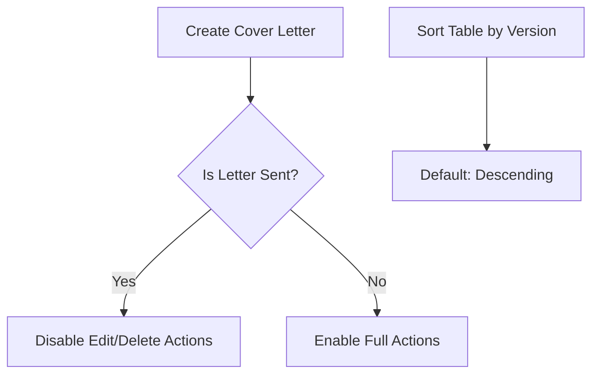
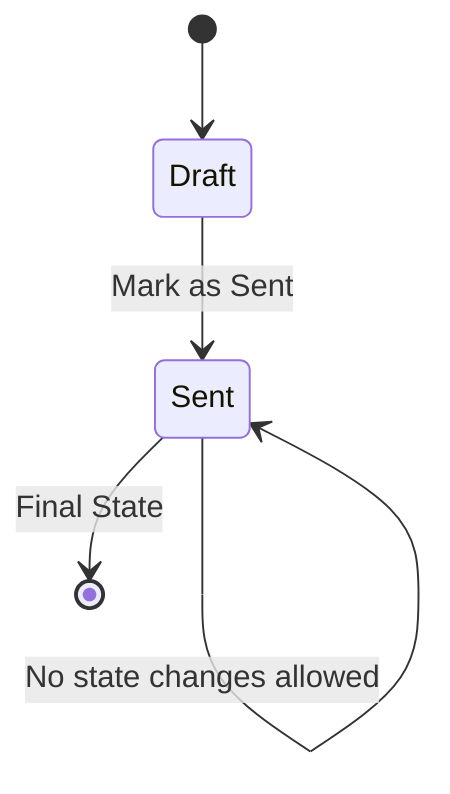

# Versioning

<cite>
**Referenced Files in This Document**   
- [CoverLetter.php](file://app/Models/CoverLetter.php)
- [CoverLettersRelationManager.php](file://app/Filament/Resources/JobApplications/RelationManagers/CoverLettersRelationManager.php)
- [CoverLetterService.php](file://app/Services/CoverLetterService.php)
- [CoverLetterVersioningIntegrationTest.php](file://tests/Feature/CoverLetterVersioningIntegrationTest.php)
- [JobApplication.php](file://app/Models/JobApplication.php)
</cite>

## Table of Contents
1. [Introduction](#introduction)
2. [Version Field and A/B Testing](#version-field-and-ab-testing)
3. [Auto-Increment Behavior](#auto-increment-behavior)
4. [UI Implementation in Filament](#ui-implementation-in-filament)
5. [Business Rules for Sent Letters](#business-rules-for-sent-letters)
6. [State Transition: Draft to Sent](#state-transition-draft-to-sent)
7. [User Guidance for Versioning](#user-guidance-for-versioning)
8. [Contract Test Verification](#contract-test-verification)

## Introduction
The cover letter versioning system enables users to create multiple variations of a cover letter for the same job application, facilitating A/B testing of different tones and content strategies. Each version is tracked numerically, with strict immutability rules applied once a letter is marked as sent. This document details the implementation, behavior, and user experience of the versioning system.

**Section sources**
- [CoverLetter.php](file://app/Models/CoverLetter.php#L1-L52)
- [JobApplication.php](file://app/Models/JobApplication.php#L1-L123)

## Version Field and A/B Testing
The `version` field in the `CoverLetter` model is an integer that starts at 1 and increments automatically for each new letter associated with a job application. This allows users to create multiple versions - such as Version 1 with a formal tone and Version 2 with an enthusiastic tone - to test which performs better. The version number provides a clear sequence and enables easy comparison between iterations.

Example:
- **Version 1**: Formal tone – "Dear Hiring Manager, I am writing to express my professional interest..."
- **Version 2**: Enthusiastic tone – "Hi team! I'm thrilled to apply for this exciting opportunity..."

These variations support strategic experimentation while maintaining a clean, auditable history.

**Section sources**
- [CoverLetter.php](file://app/Models/CoverLetter.php#L15-L16)
- [CoverLetterVersioningIntegrationTest.php](file://tests/Feature/CoverLetterVersioningIntegrationTest.php#L5-L21)

## Auto-Increment Behavior
The version number auto-increments per job application using a model observer in the `CoverLetter` class. When a new cover letter is created, the system queries the maximum existing version for that `job_application_id` and assigns the next integer. If no prior versions exist, it defaults to 1.

This logic is implemented in the `boot()` method of the `CoverLetter` model using a `creating` event hook, ensuring atomic consistency and preventing version conflicts.

**Section sources**
- [CoverLetter.php](file://app/Models/CoverLetter.php#L25-L32)

## UI Implementation in Filament
In the Filament admin panel, the `CoverLettersRelationManager` displays cover letters within the context of a job application. The table includes a **Version** column that is sortable, allowing users to view letters in ascending or descending order. By default, the table sorts by version in descending order to show the most recent version first.

Additional columns include:
- **Tone**: Displayed as a colored badge indicating the selected tone
- **Sent**: Boolean icon indicating whether the letter has been sent
- **Created At**: Timestamp of creation

The UI also disables edit and delete actions for any record where `is_sent` is true, visually reinforcing immutability.

**Diagram sources**
- [CoverLettersRelationManager.php](file://app/Filament/Resources/JobApplications/RelationManagers/CoverLettersRelationManager.php#L50-L76)

**Section sources**
- [CoverLettersRelationManager.php](file://app/Filament/Resources/JobApplications/RelationManagers/CoverLettersRelationManager.php#L50-L76)

## Business Rules for Sent Letters
Two key business rules govern the lifecycle of cover letters:
1. **Only one cover letter per application can be marked as sent.** While multiple drafts may exist, only a single version can transition to the sent state.
2. **Sent letters are immutable.** Once `is_sent` is set to `true`, the record cannot be edited or deleted. This ensures integrity of communication records.

These rules are enforced both in the UI and at the model level to prevent accidental or malicious modifications.

**Section sources**
- [CoverLettersRelationManager.php](file://app/Filament/Resources/JobApplications/RelationManagers/CoverLettersRelationManager.php#L70-L75)
- [CoverLetter.php](file://app/Models/CoverLetter.php#L34-L39)

## State Transition: Draft to Sent
The state transition from draft (`is_sent = false`) to sent (`is_sent = true`) is irreversible. When a user marks a letter as sent:
- The `is_sent` flag is set to `true`
- The `sent_at` timestamp is automatically set to the current time

This transition is enforced in the model’s `updating` event observer, which throws an exception if an attempt is made to modify a sent letter. The immutability ensures that once a letter is dispatched, its content remains unchanged for audit and compliance purposes.

**Diagram sources**
- [CoverLetter.php](file://app/Models/CoverLetter.php#L34-L39)

**Section sources**
- [CoverLetter.php](file://app/Models/CoverLetter.php#L34-L39)

## User Guidance for Versioning
Users are encouraged to:
- Create multiple versions to test different tones (e.g., formal vs. enthusiastic)
- Use the version history to compare performance and refine messaging
- Reuse templates across applications via the `template` field with variable interpolation (e.g., `{{company_name}}`)
- Finalize and send only the best-performing version

Once sent, the letter becomes part of the immutable application record, preserving authenticity and enabling reliable tracking.

**Section sources**
- [CoverLetterService.php](file://app/Services/CoverLetterService.php#L10-L24)
- [CoverLettersRelationManager.php](file://app/Filament/Resources/JobApplications/RelationManagers/CoverLettersRelationManager.php#L20-L25)

## Contract Test Verification
Integration tests validate the core versioning and immutability behaviors:
- `CoverLetterVersioningIntegrationTest.php` confirms that version numbers auto-increment correctly per job application
- It verifies that updating a sent letter throws an exception
- It ensures that multiple versions can coexist in different states (draft and sent)

These contract tests provide confidence that the business rules are consistently enforced across the application lifecycle.

**Section sources**
- [CoverLetterVersioningIntegrationTest.php](file://tests/Feature/CoverLetterVersioningIntegrationTest.php#L5-L67)
