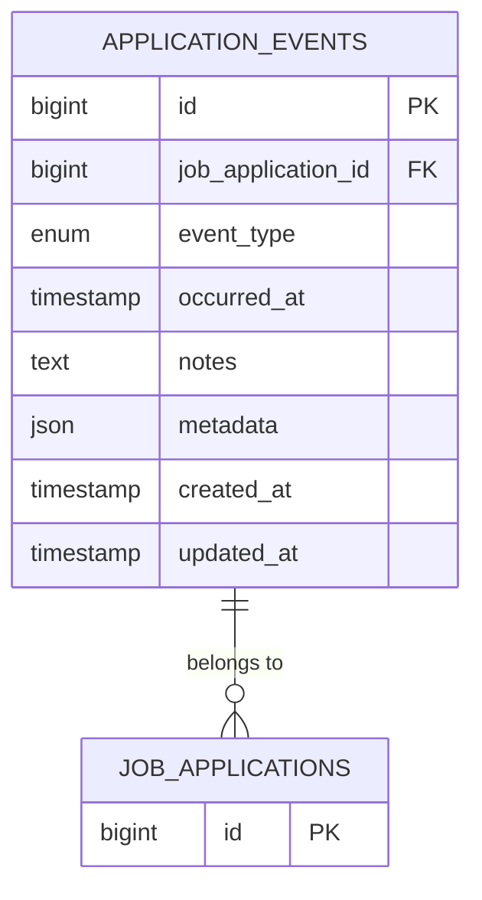
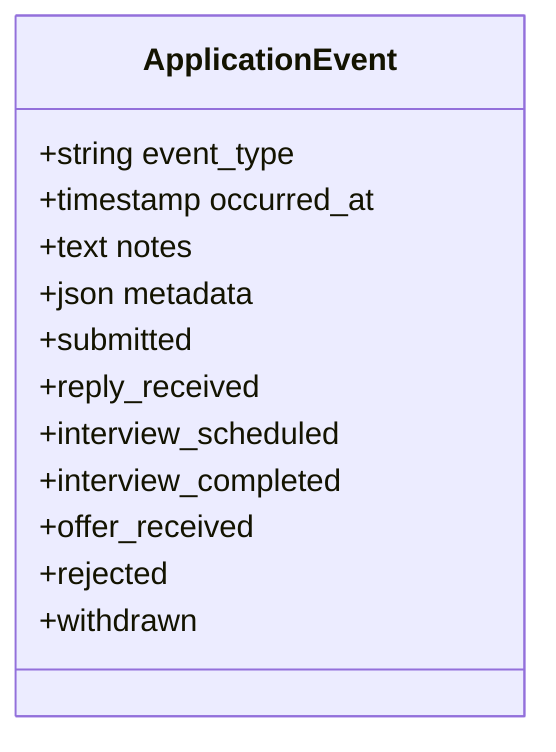
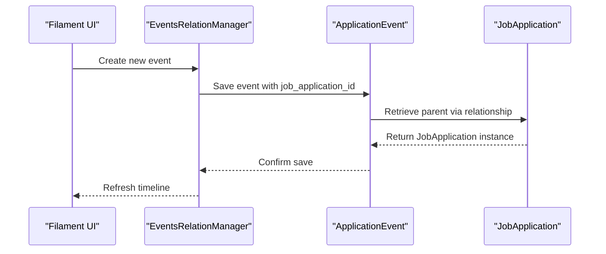
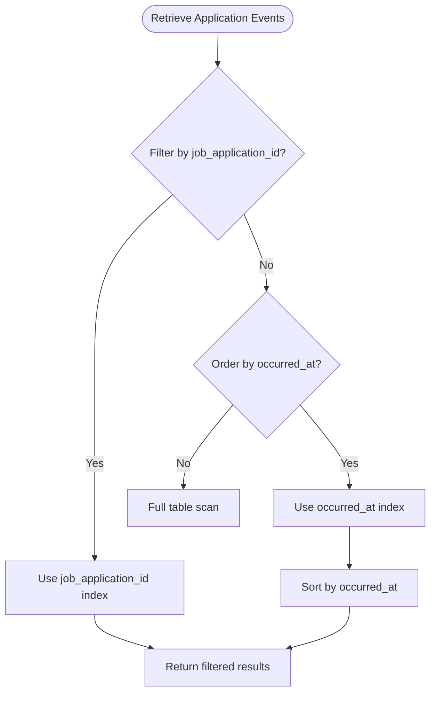
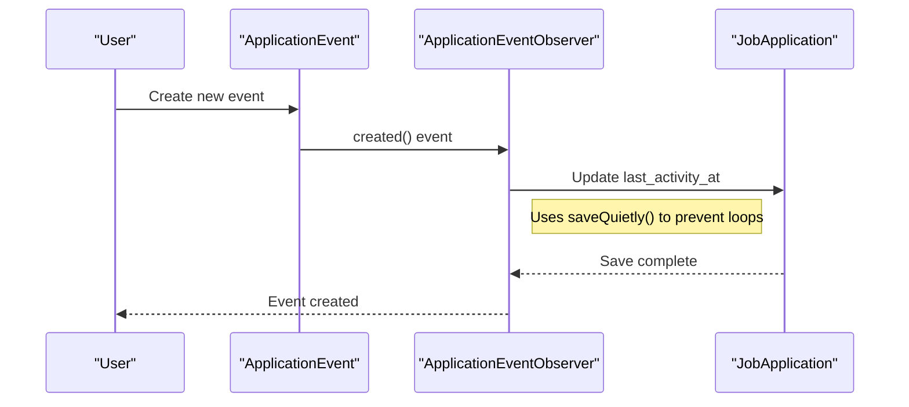

# Application Event Timeline

<cite>
**Referenced Files in This Document**   
- [ApplicationEvent.php](file://app/Models/ApplicationEvent.php)
- [ApplicationEventObserver.php](file://app/Observers/ApplicationEventObserver.php)
- [create_application_events_table.php](file://database/migrations/2025_10_04_100002_create_application_events_table.php)
- [add_occurred_at_index_to_application_events_table.php](file://database/migrations/2025_10_07_073911_add_occurred_at_index_to_application_events_table.php)
- [EventsRelationManager.php](file://app/Filament/Resources/JobApplications/RelationManagers/EventsRelationManager.php)
- [JobApplication.php](file://app/Models/JobApplication.php)
- [ApplicationEventTest.php](file://tests/Feature/ApplicationEventTest.php)
</cite>

## Table of Contents
1. [Introduction](#introduction)
2. [Data Model](#data-model)
3. [Field Definitions](#field-definitions)
4. [Event Type Enum](#event-type-enum)
5. [Relationships](#relationships)
6. [Data Validation](#data-validation)
7. [Chronological Ordering and Indexing](#chronological-ordering-and-indexing)
8. [Observer Behavior and Side Effects](#observer-behavior-and-side-effects)
9. [Performance Considerations](#performance-considerations)
10. [Query Examples](#query-examples)

## Introduction
The ApplicationEvent entity provides a comprehensive timeline of job application lifecycle events within the CV Builder application. This data model enables users to track significant interactions such as interviews, offers, and rejections, creating a detailed audit trail of their job search activities. The entity is designed to support both real-time updates and historical analysis, with features that ensure data integrity, proper ordering, and performance optimization for timeline rendering.

## Data Model
The ApplicationEvent data model captures discrete occurrences in the job application lifecycle, providing a chronological record of interactions between the applicant and potential employers. Each event includes metadata about the occurrence, allowing for rich contextual information beyond simple timestamps.



**Diagram sources**
- [create_application_events_table.php](file://database/migrations/2025_10_04_100002_create_application_events_table.php)
- [JobApplication.php](file://app/Models/JobApplication.php)

**Section sources**
- [ApplicationEvent.php](file://app/Models/ApplicationEvent.php)
- [create_application_events_table.php](file://database/migrations/2025_10_04_100002_create_application_events_table.php)

## Field Definitions
The ApplicationEvent entity contains several key fields that capture essential information about each lifecycle event:

| Field | Type | Constraints | Description |
|-------|------|-------------|-------------|
| `job_application_id` | bigint | Foreign key, required, cascade delete | References the parent JobApplication |
| `event_type` | enum | Required, constrained to predefined values | Categorizes the type of event |
| `occurred_at` | timestamp | Required | Records when the event actually happened |
| `notes` | text | Nullable, max length enforced | Free-form description of the event |
| `metadata` | json | Nullable | Structured, event-specific data |

**Section sources**
- [ApplicationEvent.php](file://app/Models/ApplicationEvent.php)
- [create_application_events_table.php](file://database/migrations/2025_10_04_100002_create_application_events_table.php)

## Event Type Enum
The `event_type` field uses an enum-like constraint to ensure data consistency and support UI rendering with appropriate visual indicators. The allowed values represent key milestones in the job application process:

- `submitted`: Application has been sent to the employer
- `reply_received`: Employer has responded to the application
- `interview_scheduled`: Interview has been scheduled with the employer
- `interview_completed`: Interview has taken place
- `offer_received`: Job offer has been extended by the employer
- `rejected`: Application has been declined by the employer
- `withdrawn`: Candidate has withdrawn from the application process

The enum constraint is enforced at both the database and application levels, preventing invalid values from being stored.



**Diagram sources**
- [create_application_events_table.php](file://database/migrations/2025_10_04_100002_create_application_events_table.php)
- [EventsRelationManager.php](file://app/Filament/Resources/JobApplications/RelationManagers/EventsRelationManager.php)

**Section sources**
- [create_application_events_table.php](file://database/migrations/2025_10_04_100002_create_application_events_table.php)
- [EventsRelationManager.php](file://app/Filament/Resources/JobApplications/RelationManagers/EventsRelationManager.php)

## Relationships
The ApplicationEvent entity maintains a one-to-many relationship with the JobApplication entity, where each job application can have multiple timeline events.

### Database Relationship
The relationship is implemented through a foreign key constraint:
- `job_application_id` in ApplicationEvent references `id` in JobApplication
- `ON DELETE CASCADE` ensures events are automatically removed when their parent application is deleted

### Eloquent Relationship
The Laravel Eloquent relationship is defined in the ApplicationEvent model:

```php
public function jobApplication(): BelongsTo
{
    return $this->belongsTo(JobApplication::class);
}
```

This relationship enables eager loading and direct access to the parent job application from any event instance.



**Diagram sources**
- [ApplicationEvent.php](file://app/Models/ApplicationEvent.php)
- [JobApplication.php](file://app/Models/JobApplication.php)

**Section sources**
- [ApplicationEvent.php](file://app/Models/ApplicationEvent.php)
- [JobApplication.php](file://app/Models/JobApplication.php)

## Data Validation
The ApplicationEvent entity enforces strict validation rules to ensure data integrity and consistency across the application.

### Required Fields
The following fields are required and validated:
- `job_application_id`: Must reference an existing JobApplication
- `event_type`: Must be one of the predefined enum values
- `occurred_at`: Must be a valid datetime

### Validation Implementation
Validation occurs at multiple levels:
1. **Database level**: Schema constraints prevent invalid data at the storage layer
2. **Model level**: Fillable attributes and casts ensure proper data handling
3. **Application level**: Form validation in Filament components

The validation rules are comprehensive and prevent common data entry errors, ensuring that only valid events are recorded in the timeline.

**Section sources**
- [ApplicationEvent.php](file://app/Models/ApplicationEvent.php)
- [create_application_events_table.php](file://database/migrations/2025_10_04_100002_create_application_events_table.php)
- [EventsRelationManager.php](file://app/Filament/Resources/JobApplications/RelationManagers/EventsRelationManager.php)

## Chronological Ordering and Indexing
The ApplicationEvent entity is optimized for chronological ordering and timeline rendering, with specific indexing strategies to support efficient queries.

### Default Ordering
Events are ordered by `occurred_at DESC` by default, showing the most recent events first in the timeline. This ordering is implemented in the JobApplication model relationship:

```php
public function events(): HasMany
{
    return $this->hasMany(ApplicationEvent::class)->orderBy('occurred_at', 'desc');
}
```

### Database Indexes
Multiple indexes support efficient querying and sorting:
- `(job_application_id)` - For filtering events by application
- `(event_type)` - For filtering by event category
- `(occurred_at)` - For chronological sorting
- `(job_application_id, event_type)` - For compound filtering

The `occurred_at` index was added in a separate migration to optimize timeline rendering performance.



**Diagram sources**
- [add_occurred_at_index_to_application_events_table.php](file://database/migrations/2025_10_07_073911_add_occurred_at_index_to_application_events_table.php)
- [create_application_events_table.php](file://database/migrations/2025_10_04_100002_create_application_events_table.php)

**Section sources**
- [add_occurred_at_index_to_application_events_table.php](file://database/migrations/2025_10_07_073911_add_occurred_at_index_to_application_events_table.php)
- [JobApplication.php](file://app/Models/JobApplication.php)

## Observer Behavior and Side Effects
The ApplicationEvent entity triggers automatic updates to the parent JobApplication through an observer pattern, ensuring that the application's activity timestamp remains current.

### ApplicationEventObserver
The observer listens for the `created` event and updates the parent JobApplication's `last_activity_at` field:

```php
public function created(ApplicationEvent $event): void
{
    $jobApp = $event->jobApplication;
    $jobApp->last_activity_at = $event->occurred_at ?? now();
    $jobApp->saveQuietly();
}
```

### Key Implementation Details
- **saveQuietly()**: Prevents infinite observer loops by not firing additional model events
- **occurred_at precedence**: Uses the event's occurred_at time rather than the current time for historical accuracy
- **Cascade prevention**: The quiet save avoids triggering other observers that might be listening for JobApplication updates

This observer ensures that the JobApplication's last_activity_at field always reflects the most recent significant interaction, which is crucial for sorting, filtering, and displaying applications in the user interface.



**Diagram sources**
- [ApplicationEventObserver.php](file://app/Observers/ApplicationEventObserver.php)
- [ApplicationEvent.php](file://app/Models/ApplicationEvent.php)

**Section sources**
- [ApplicationEventObserver.php](file://app/Observers/ApplicationEventObserver.php)
- [ApplicationEvent.php](file://app/Models/ApplicationEvent.php)

## Performance Considerations
The ApplicationEvent data model includes several performance optimizations to ensure efficient timeline rendering and querying, especially as the number of events grows.

### Indexing Strategy
The indexing strategy is designed to support the most common query patterns:
- Single-column indexes on frequently filtered fields
- Composite indexes for common filter combinations
- Specific index on occurred_at for chronological ordering

### Timeline Rendering
For timeline rendering, the system uses:
- Eager loading to prevent N+1 query problems
- Pagination to limit the number of events loaded at once
- Descending order by default to show recent activity first

### Query Optimization
The combination of proper indexing and optimized Eloquent relationships ensures that retrieving all events for an application is efficient, even with large datasets. The foreign key index on job_application_id allows for fast lookups, while the occurred_at index supports quick sorting.

**Section sources**
- [add_occurred_at_index_to_application_events_table.php](file://database/migrations/2025_10_07_073911_add_occurred_at_index_to_application_events_table.php)
- [JobApplication.php](file://app/Models/JobApplication.php)

## Query Examples
The following examples demonstrate common queries for retrieving and analyzing ApplicationEvent data.

### Retrieve All Events for an Application
```php
$application = JobApplication::find($id);
$events = $application->events; // Ordered by occurred_at DESC
```

This query leverages the pre-defined relationship in the JobApplication model, automatically ordering events by occurred_at in descending order.

### Aggregate Event Statistics by Type
```php
$stats = ApplicationEvent::where('job_application_id', $applicationId)
    ->selectRaw('event_type, count(*) as count')
    ->groupBy('event_type')
    ->get();
```

This query returns a count of events grouped by type, useful for generating analytics about application progress.

### Find Events Within a Date Range
```php
$events = ApplicationEvent::where('job_application_id', $applicationId)
    ->whereBetween('occurred_at', [$startDate, $endDate])
    ->orderBy('occurred_at', 'asc')
    ->get();
```

This query retrieves events within a specific date range, ordered chronologically for timeline display.

### Get Most Recent Event
```php
$latestEvent = ApplicationEvent::where('job_application_id', $applicationId)
    ->latest('occurred_at')
    ->first();
```

This query efficiently retrieves the most recent event using the occurred_at index.

**Section sources**
- [ApplicationEvent.php](file://app/Models/ApplicationEvent.php)
- [JobApplication.php](file://app/Models/JobApplication.php)
- [ApplicationEventTest.php](file://tests/Feature/ApplicationEventTest.php)