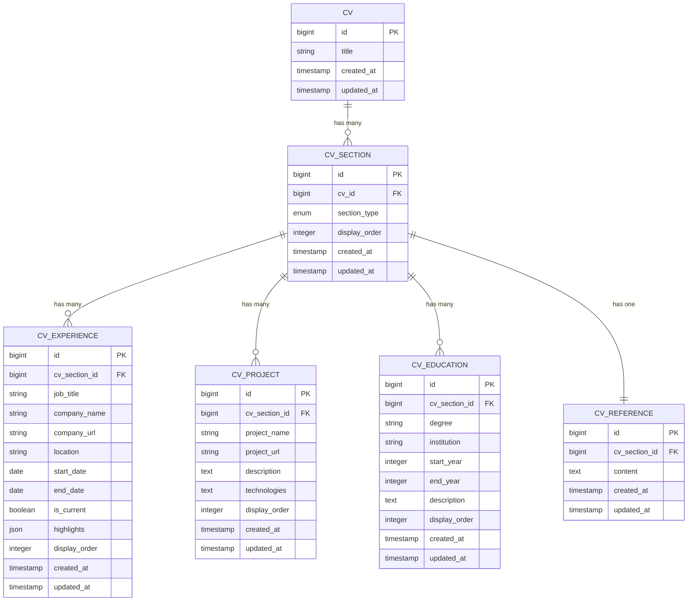

# CV Content Types

<cite>
**Referenced Files in This Document**   
- [CvExperience.php](file://app/Models/CvExperience.php)
- [CvProject.php](file://app/Models/CvProject.php)
- [CvEducation.php](file://app/Models/CvEducation.php)
- [CvReference.php](file://app/Models/CvReference.php)
- [CvSection.php](file://app/Models/CvSection.php)
- [Cv.php](file://app/Models/Cv.php)
- [add_url_to_cv_projects_table.php](file://database/migrations/2025_10_03_214838_add_url_to_cv_projects_table.php)
- [add_company_url_to_cv_experiences_table.php](file://database/migrations/2025_10_03_220056_add_company_url_to_cv_experiences_table.php)
- [pdf.blade.php](file://resources/views/cv/pdf.blade.php)
</cite>

## Table of Contents
1. [Introduction](#introduction)
2. [Core Data Models](#core-data-models)
3. [Model Relationships](#model-relationships)
4. [Data Validation and Formatting](#data-validation-and-formatting)
5. [Access Patterns](#access-patterns)
6. [Data Transformation for PDF Generation](#data-transformation-for-pdf-generation)

## Introduction
This document provides comprehensive documentation for the CV content types in the CV Builder application. It details the structure, relationships, validation rules, and usage patterns for the core data models that represent CV content: work experience, projects, education, and references. The documentation explains how these models relate to each other through the CvSection and Cv entities, and covers additional fields added through migrations, access patterns, and data transformation during PDF generation.

## Core Data Models

### CvExperience
The CvExperience model represents a work experience entry in a CV. It contains details about a specific job position, including role, company, dates, and achievements.

**Fields**:
- `id`: Primary key
- `cv_section_id`: Foreign key to CvSection
- `job_title`: Job title/role (string, required)
- `company_name`: Company name (string, required)
- `company_url`: Company website URL (string, nullable, added via migration)
- `location`: Job location (string, nullable)
- `start_date`: Employment start date (date, required)
- `end_date`: Employment end date (date, nullable)
- `is_current`: Boolean indicating if currently employed
- `highlights`: JSON array of achievement bullet points
- `display_order`: Integer for ordering multiple experiences
- `created_at`, `updated_at`: Timestamps

**Section sources**
- [CvExperience.php](file://app/Models/CvExperience.php#L7-L33)
- [add_company_url_to_cv_experiences_table.php](file://database/migrations/2025_10_03_220056_add_company_url_to_cv_experiences_table.php#L1-L27)

### CvProject
The CvProject model represents a side project or portfolio item in a CV. It contains information about personal or professional projects outside of formal employment.

**Fields**:
- `id`: Primary key
- `cv_section_id`: Foreign key to CvSection
- `project_name`: Project title (string, required)
- `project_url`: Project URL (string, nullable, added via migration)
- `description`: Project description (text, required)
- `technologies`: Technologies used (text, nullable)
- `display_order`: Integer for ordering multiple projects
- `created_at`, `updated_at`: Timestamps

**Section sources**
- [CvProject.php](file://app/Models/CvProject.php#L7-L22)
- [add_url_to_cv_projects_table.php](file://database/migrations/2025_10_03_214838_add_url_to_cv_projects_table.php#L1-L27)

### CvEducation
The CvEducation model represents an academic qualification in a CV. It contains details about educational institutions and degrees obtained.

**Fields**:
- `id`: Primary key
- `cv_section_id`: Foreign key to CvSection
- `degree`: Academic degree (string, required)
- `institution`: Educational institution (string, required)
- `start_year`: Start year (integer, required)
- `end_year`: End year (integer, nullable)
- `description`: Additional details (text, nullable)
- `display_order`: Integer for ordering multiple education entries
- `created_at`, `updated_at`: Timestamps

**Section sources**
- [CvEducation.php](file://app/Models/CvEducation.php#L7-L23)

### CvReference
The CvReference model represents reference information in a CV. It typically contains a simple text field indicating that references are available upon request.

**Fields**:
- `id`: Primary key
- `cv_section_id`: Foreign key to CvSection (unique constraint)
- `content`: Reference text (text, required)
- `created_at`, `updated_at`: Timestamps

**Section sources**
- [CvReference.php](file://app/Models/CvReference.php#L7-L18)

## Model Relationships

### Relationship Architecture
The CV content models are connected through a polymorphic relationship pattern using the CvSection model as a typed pivot. This architecture allows for flexible section types while maintaining a consistent ordering mechanism.



**Diagram sources**
- [Cv.php](file://app/Models/Cv.php#L10-L221)
- [CvSection.php](file://app/Models/CvSection.php#L10-L60)

### Relationship Details
The relationship between CV content models and the parent CV is established through the CvSection model, which acts as a polymorphic pivot:

- **Cv → CvSection**: One-to-many relationship where a CV has multiple sections
- **CvSection → Content Models**: One-to-many relationship where a section has multiple content items of a specific type
- **Content Models → CvSection**: Many-to-one relationship where content items belong to a section

The CvSection model's `section_type` field determines which content model is associated with it (experience, projects, education, references). This design allows for easy addition of new section types without changing the core CV structure.

**Section sources**
- [CvSection.php](file://app/Models/CvSection.php#L10-L60)
- [Cv.php](file://app/Models/Cv.php#L10-L221)

## Data Validation and Formatting

### Field Validation Rules
Each CV content model has specific validation rules to ensure data integrity:

**CvExperience Validation**:
- `cv_section_id`: Required, must exist in cv_sections table
- `job_title`: Required, maximum 255 characters
- `company_name`: Required, maximum 255 characters
- `start_date`: Required, must be a valid date
- `end_date`: Optional, must be a valid date, must be after start_date if provided
- `is_current`: Boolean value
- `highlights`: Required, must be an array with at least one item
- `display_order`: Required, integer minimum 0

**CvProject Validation**:
- `cv_section_id`: Required, must exist in cv_sections table
- `project_name`: Required, maximum 255 characters
- `description`: Required
- `display_order`: Required, integer minimum 0

**CvEducation Validation**:
- `cv_section_id`: Required, must exist in cv_sections table
- `degree`: Required, maximum 255 characters
- `institution`: Required, maximum 255 characters
- `start_year`: Required, integer between 1900 and current year + 10
- `end_year`: Optional, integer between start_year and current year + 10
- `display_order`: Required, integer minimum 0

**CvReference Validation**:
- `cv_section_id`: Required, must exist in cv_sections table, unique constraint
- `content`: Required

### Date Formatting Requirements
Date fields follow specific formatting and display rules:

- **CvExperience**: Uses full date format (YYYY-MM-DD) for both start_date and end_date
- **CvEducation**: Uses year-only format (YYYY) for start_year and end_year
- **Current Status**: When `is_current` is true in CvExperience, the end_date is displayed as "Present" in the UI
- **Date Ranges**: Displayed as "start_date - end_date" or "start_date - Present" for current positions

**Section sources**
- [CvExperience.php](file://app/Models/CvExperience.php#L7-L33)
- [CvProject.php](file://app/Models/CvProject.php#L7-L22)
- [CvEducation.php](file://app/Models/CvEducation.php#L7-L23)
- [CvReference.php](file://app/Models/CvReference.php#L7-L18)

## Access Patterns

### Common Query Patterns
The application implements several common access patterns for retrieving CV content:

**Retrieve All Experiences for a CV**:
```php
$cv->load('sections.experiences');
```
This eager loads all experience entries for a CV by loading the sections relationship and filtering for experience-type sections.

**Filter Projects by URL Availability**:
```php
$cv->projects()->whereNotNull('project_url')->get();
```
This retrieves all projects that have a URL specified, useful for creating a portfolio section.

**Get Education Entries in Order**:
```php
$cv->education()->orderBy('start_year', 'desc')->get();
```
This retrieves education entries sorted by start year in descending order, showing most recent education first.

**Find Current Work Experience**:
```php
$cv->experiences()->where('is_current', true)->get();
```
This retrieves all currently held positions across all experience sections.

### Performance Considerations
The data model includes several indexes to optimize common query patterns:

- **Composite Index**: `(cv_section_id, display_order)` on all content tables for efficient ordering
- **Date Index**: `start_date` on CvExperience for date-based sorting
- **Year Index**: `start_year` on CvEducation for chronological ordering
- **Foreign Key Index**: `cv_section_id` on all content tables for relationship queries

These indexes ensure that common operations like retrieving and ordering content are performed efficiently.

**Section sources**
- [Cv.php](file://app/Models/Cv.php#L10-L221)
- [CvSection.php](file://app/Models/CvSection.php#L10-L60)

## Data Transformation for PDF Generation

### PDF Generation Process
The application transforms CV data into PDF format using a dedicated controller and Blade template. The process involves:

1. **Data Preparation**: The CvPdfController loads the CV with all related sections and content
2. **Template Rendering**: The pdf.blade.php template renders the CV data into HTML
3. **PDF Conversion**: The Spatie Laravel-PDF package converts the HTML to PDF format
4. **File Delivery**: The generated PDF is returned as a downloadable response

### Data Transformation in Templates
The Blade template transforms the raw model data into a formatted presentation:

**Experience Entry Transformation**:
- Job title and company name are displayed together as a heading
- Date range is formatted as "YYYY-MM-DD - YYYY-MM-DD" or "YYYY-MM-DD - Present"
- Highlights array is rendered as an unordered list
- Company URL is not directly displayed but could be included in future enhancements

**Project Entry Transformation**:
- Project name is displayed as a heading
- Description is rendered as a paragraph
- Technologies field is split and displayed as comma-separated values
- Project URL is not directly displayed but could be included as a hyperlink

**Education Entry Transformation**:
- Degree and institution are displayed together as a heading
- Year range is formatted as "YYYY - YYYY" or "YYYY - Present"
- Description is rendered as a paragraph

### Example Transformation
When transforming a CvExperience model to PDF output:
- Input: `{job_title: "Developer", company_name: "Acme Corp", start_date: "2020-01-01", end_date: null, is_current: true, highlights: ["Built APIs", "Fixed bugs"]}`
- Output: 
  ```
  Developer - Acme Corp
  2020-01-01 - Present
  • Built APIs
  • Fixed bugs
  ```

**Section sources**
- [CvPdfController.php](file://app/Http/Controllers/CvPdfController.php#L1-L33)
- [pdf.blade.php](file://resources/views/cv/pdf.blade.php#L1-L135)