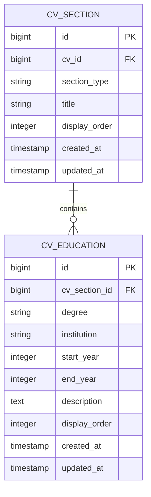
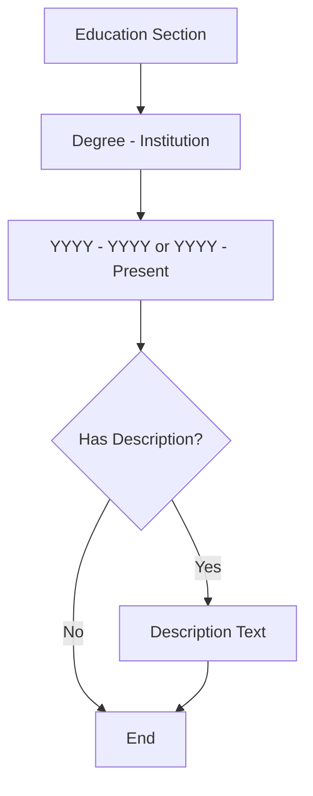

# CV Education

<cite>
**Referenced Files in This Document**   
- [CvEducation.php](file://app/Models/CvEducation.php)
- [create_cv_education_table.php](file://database/migrations/2025_10_03_201722_create_cv_education_table.php)
- [EducationRelationManager.php](file://app/Filament/Resources/Cvs/RelationManagers/EducationRelationManager.php)
- [pdf.blade.php](file://resources/views/cv/pdf.blade.php)
- [data-model.md](file://specs/001-cv-builder-application/data-model.md)
</cite>

## Table of Contents
1. [Introduction](#introduction)
2. [Database Schema](#database-schema)
3. [Relationships](#relationships)
4. [Data Validation Rules](#data-validation-rules)
5. [Access Patterns](#access-patterns)
6. [PDF Output Formatting](#pdf-output-formatting)
7. [Common Issues and Edge Cases](#common-issues-and-edge-cases)
8. [Data Migration and Localization](#data-migration-and-localization)

## Introduction
The CvEducation model represents academic qualifications within a CV builder application. It captures essential educational details such as institution, degree, and time periods, and integrates them into the broader CV structure through a standardized section system. This documentation provides a comprehensive overview of the model's schema, relationships, validation rules, and presentation logic.

**Section sources**
- [data-model.md](file://specs/001-cv-builder-application/data-model.md#L276-L310)

## Database Schema
The CvEducation table stores academic qualification data with the following fields:

| Field | Type | Constraints | Description |
|-------|------|-------------|-------------|
| id | bigint | primary key | Unique identifier |
| cv_section_id | bigint | foreign key to cv_sections | Links to parent section |
| degree | string(255) | required | Academic degree earned |
| institution | string(255) | required | Educational institution name |
| start_year | integer | unsigned, required | Year studies began |
| end_year | integer | unsigned, nullable | Year studies completed or expected |
| description | text | nullable | Additional details about the education |
| display_order | integer | unsigned | Ordering within the section |
| created_at | timestamp | | Record creation timestamp |
| updated_at | timestamp | | Last modification timestamp |

**Section sources**
- [create_cv_education_table.php](file://database/migrations/2025_10_03_201722_create_cv_education_table.php#L0-L36)
- [CvEducation.php](file://app/Models/CvEducation.php#L7-L23)

## Relationships
The CvEducation model has a many-to-one relationship with CvSection, where multiple education entries belong to a single education section within a CV.

**Diagram sources**
- [CvEducation.php](file://app/Models/CvEducation.php#L7-L23)
- [CvSection.php](file://app/Models/CvSection.php#L7-L61)

**Section sources**
- [CvEducation.php](file://app/Models/CvEducation.php#L7-L23)
- [CvSection.php](file://app/Models/CvSection.php#L7-L61)

## Data Validation Rules
The system enforces several validation rules to ensure data integrity:

- **cv_section_id**: Required and must reference an existing cv_sections record
- **degree**: Required, maximum 255 characters
- **institution**: Required, maximum 255 characters
- **start_year**: Required integer between 1900 and 2100
- **end_year**: Optional integer between 1900 and 2100, must be ≥ start_year if provided
- **description**: Optional text field
- **display_order**: Required unsigned integer

These rules are enforced both at the database level (via migrations) and application level (via form validation).

**Section sources**
- [EducationRelationManager.php](file://app/Filament/Resources/Cvs/RelationManagers/EducationRelationManager.php#L0-L121)
- [data-model.md](file://specs/001-cv-builder-application/data-model.md#L276-L310)

## Access Patterns
The system supports common access patterns for education data:

- **Chronological ordering**: Records are sorted by start_year for historical presentation
- **Display ordering**: Within sections, entries are ordered by display_order for custom arrangement
- **Active status filtering**: Records with null end_year are considered ongoing
- **Section-based retrieval**: All education entries are accessed through their parent CvSection

The database includes indexes on (cv_section_id, display_order) and start_year to optimize these access patterns.

**Section sources**
- [create_cv_education_table.php](file://database/migrations/2025_10_03_201722_create_cv_education_table.php#L0-L36)
- [CvSection.php](file://app/Models/CvSection.php#L7-L61)

## PDF Output Formatting
Education data is formatted in PDF output with the following presentation rules:

- Degree and institution are displayed together as the primary heading
- Date range is shown in "YYYY - YYYY" format, with "Present" for ongoing studies
- Descriptions are included as additional content when available
- Entries are grouped under an "Education" section header

**Diagram sources**
- [pdf.blade.php](file://resources/views/cv/pdf.blade.php#L0-L135)

**Section sources**
- [pdf.blade.php](file://resources/views/cv/pdf.blade.php#L0-L135)

## Common Issues and Edge Cases
The system addresses several common scenarios:

- **Incomplete degrees**: Represented by setting end_year to null
- **International qualifications**: Handled through free-text institution and degree fields
- **Multiple degrees from same institution**: Differentiated by degree field and ordering
- **Ongoing education**: Indicated by null end_year, displayed as "Present" in output
- **Date precision**: Year-only precision is used, avoiding month/day specificity

**Section sources**
- [CvEducation.php](file://app/Models/CvEducation.php#L7-L23)
- [pdf.blade.php](file://resources/views/cv/pdf.blade.php#L0-L135)

## Data Migration and Localization
When migrating legacy records, consider:

- Converting date fields to year-only integers
- Ensuring all required fields (degree, institution, start_year) are populated
- Setting appropriate display_order values for sorting
- Handling null end_year values for ongoing education

For localization:
- Institution and degree fields support UTF-8 for international characters
- Date presentation follows locale conventions in the PDF template
- Validation messages should be localized in the application interface

**Section sources**
- [create_cv_education_table.php](file://database/migrations/2025_10_03_201722_create_cv_education_table.php#L0-L36)
- [pdf.blade.php](file://resources/views/cv/pdf.blade.php#L0-L135)