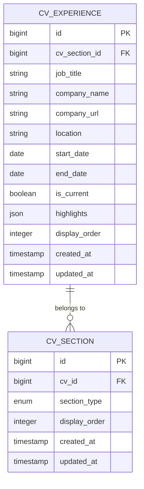
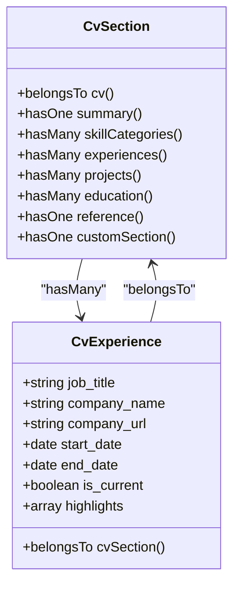
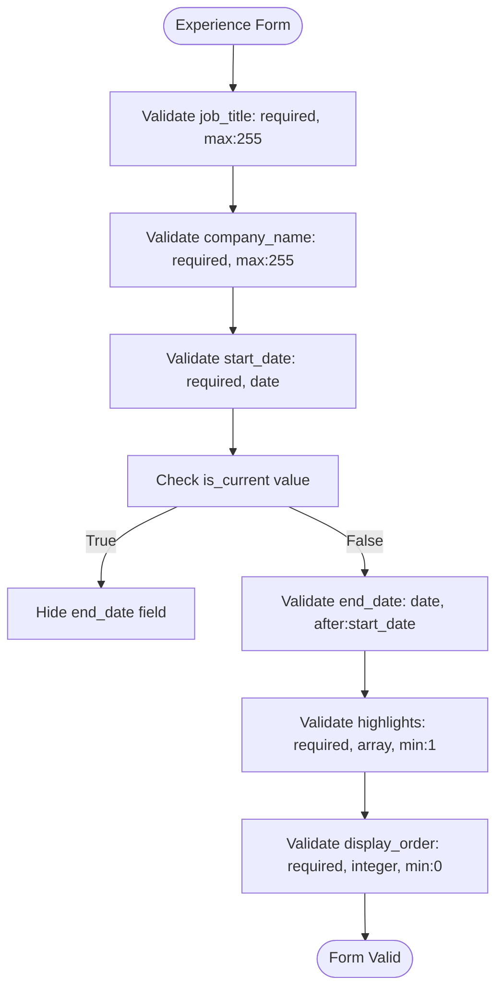
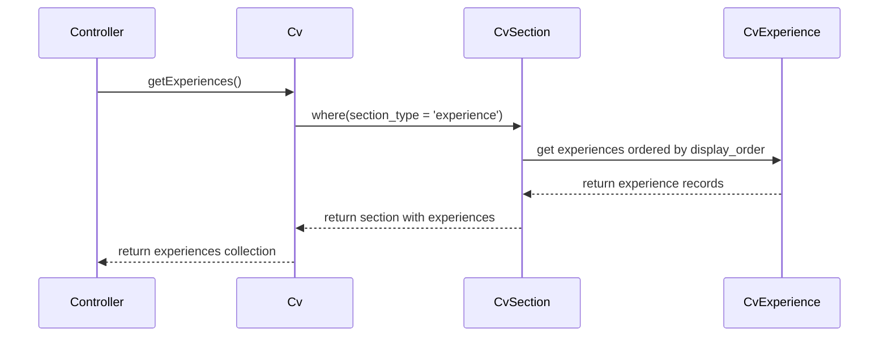
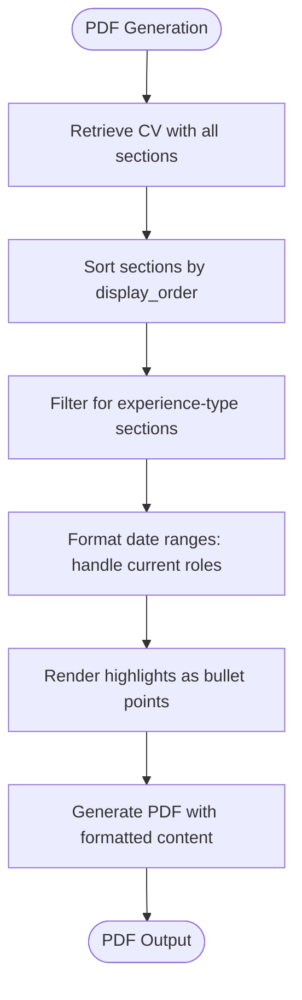

# CV Experience

<cite>
**Referenced Files in This Document**   
- [CvExperience.php](file://app/Models/CvExperience.php)
- [2025_10_03_201713_create_cv_experiences_table.php](file://database/migrations/2025_10_03_201713_create_cv_experiences_table.php)
- [2025_10_03_220056_add_company_url_to_cv_experiences_table.php](file://database/migrations/2025_10_03_220056_add_company_url_to_cv_experiences_table.php)
- [pdf.blade.php](file://resources/views/cv/pdf.blade.php)
- [ExperienceRelationManager.php](file://app/Filament/Resources/Cvs/RelationManagers/ExperienceRelationManager.php)
- [cv_builder_spec.md](file://cv_builder_spec.md)
- [data-model.md](file://specs/001-cv-builder-application/data-model.md)
</cite>

## Table of Contents
1. [Introduction](#introduction)
2. [Database Schema](#database-schema)
3. [Relationship with CvSection](#relationship-with-cvsection)
4. [Data Validation Rules](#data-validation-rules)
5. [Access Patterns](#access-patterns)
6. [Blade Template Formatting](#blade-template-formatting)
7. [Common Issues and Migration Strategies](#common-issues-and-migration-strategies)
8. [Conclusion](#conclusion)

## Introduction
The CvExperience model represents work experience entries within a CV builder application. It captures professional roles, companies, dates, and achievements, forming a critical component of the CV's experience section. This document provides comprehensive documentation of the CvExperience model, including its database schema, relationships, validation rules, access patterns, and integration with the PDF generation system.

**Section sources**
- [cv_builder_spec.md](file://cv_builder_spec.md#L57-L66)
- [data-model.md](file://specs/001-cv-builder-application/data-model.md#L200-L245)

## Database Schema
The CvExperience model corresponds to the `cv_experiences` database table with the following fields:

| Field | Type | Constraints | Description |
|-------|------|-------------|-------------|
| id | bigint | primary key | Unique identifier for the experience entry |
| cv_section_id | bigint | foreign key to cv_sections, cascade on delete | References the parent CvSection |
| job_title | string(255) | required | Professional role or position |
| company_name | string(255) | required | Organization name |
| company_url | string(255) | nullable | Official website URL of the company |
| location | string(255) | nullable | Geographic location of the position |
| start_date | date | required | Employment start date |
| end_date | date | nullable | Employment end date |
| is_current | boolean | default false | Indicates if this is a current position |
| highlights | json | required, min:1 | Array of achievement bullet points |
| display_order | integer | unsigned, required, min:0 | Ordering within the experience section |
| created_at | timestamp | - | Record creation timestamp |
| updated_at | timestamp | - | Record last update timestamp |

The table includes indexes on `(cv_section_id, display_order)` for efficient ordering queries and on `start_date` for chronological sorting.



**Diagram sources**
- [2025_10_03_201713_create_cv_experiences_table.php](file://database/migrations/2025_10_03_201713_create_cv_experiences_table.php#L10-L30)
- [2025_10_03_220056_add_company_url_to_cv_experiences_table.php](file://database/migrations/2025_10_03_220056_add_company_url_to_cv_experiences_table.php#L7-L12)

**Section sources**
- [CvExperience.php](file://app/Models/CvExperience.php#L7-L33)
- [cv_builder_spec.md](file://cv_builder_spec.md#L57-L66)

## Relationship with CvSection
The CvExperience model has a many-to-one relationship with the CvSection model, where multiple experience entries belong to a single experience-type section. The CvSection acts as a polymorphic pivot that organizes different section types within a CV.

The relationship is implemented through the `cv_section_id` foreign key, with cascade deletion ensuring that when a CvSection is removed, all associated CvExperience records are automatically deleted. The CvSection model provides a convenience relationship method `experiences()` that returns all CvExperience records ordered by `display_order`.

This polymorphic pattern through CvSection provides several benefits:
- Single source of truth for section ordering
- Easy addition of new section types without changing CV structure
- Consistent ordering mechanism across all section types



**Diagram sources**
- [CvSection.php](file://app/Models/CvSection.php#L10-L60)
- [CvExperience.php](file://app/Models/CvExperience.php#L7-L33)

**Section sources**
- [CvSection.php](file://app/Models/CvSection.php#L10-L60)
- [data-model.md](file://specs/001-cv-builder-application/data-model.md#L76-L109)

## Data Validation Rules
The CvExperience model enforces several validation rules to ensure data integrity:

### Field-Level Validation
- **cv_section_id**: Required and must exist in the cv_sections table
- **job_title**: Required with maximum length of 255 characters
- **company_name**: Required with maximum length of 255 characters
- **location**: Optional with maximum length of 255 characters
- **start_date**: Required and must be a valid date
- **end_date**: Optional, must be a valid date, and if provided must be after start_date
- **is_current**: Boolean value
- **highlights**: Required JSON array with minimum of one item; each highlight must be a non-empty string
- **display_order**: Required unsigned integer with minimum value of 0

### Special Validation Logic
The form implementation includes conditional validation:
- The `end_date` field is hidden when `is_current` is true
- The `is_current` checkbox is reactive, meaning it dynamically affects the visibility of the end_date field
- Highlights are implemented as a repeater field requiring at least one item



**Diagram sources**
- [ExperienceRelationManager.php](file://app/Filament/Resources/Cvs/RelationManagers/ExperienceRelationManager.php#L57-L71)
- [data-model.md](file://specs/001-cv-builder-application/data-model.md#L200-L245)

**Section sources**
- [ExperienceRelationManager.php](file://app/Filament/Resources/Cvs/RelationManagers/ExperienceRelationManager.php#L57-L129)
- [data-model.md](file://specs/001-cv-builder-application/data-model.md#L200-L245)

## Access Patterns
The CvExperience model supports several common access patterns for retrieving and displaying work history data.

### Chronological Work History
The primary access pattern retrieves experience entries in reverse chronological order (most recent first) for display in CVs. This is achieved through the relationship defined in the Cv model:

```php
public function experiences(): HasManyThrough
{
    return $this->hasManyThrough(
        CvExperience::class,
        CvSection::class,
        'cv_id',
        'cv_section_id',
        'id',
        'id'
    )->where('cv_sections.section_type', 'experience')->orderBy('display_order');
}
```

### Filtering by Current Employment
The `is_current` boolean field enables filtering for currently held positions. This is particularly useful for generating summaries or statistics about active employment.

### Section-Based Retrieval
Since experiences are organized within a CvSection of type 'experience', retrieval typically occurs through the section relationship, ensuring proper scoping within the CV structure.



**Diagram sources**
- [Cv.php](file://app/Models/Cv.php#L48-L55)
- [CvSection.php](file://app/Models/CvSection.php#L10-L60)

**Section sources**
- [Cv.php](file://app/Models/Cv.php#L48-L55)
- [CvSection.php](file://app/Models/CvSection.php#L10-L60)

## Blade Template Formatting
The CvExperience data is formatted in Blade templates for both web display and PDF generation, with specific attention to date ranges and URL rendering.

### Date Range Formatting
In the PDF template, date ranges are formatted with special handling for current positions:

```blade
<p class="date-range">{{ $experience->start_date }} - {{ $experience->end_date ?? 'Present' }}</p>
```

The start date is displayed in "M Y" format (e.g., "Aug 2015"), while the end date shows "Present" for current roles or the formatted end date otherwise.

### URL Rendering
The company_url field is rendered as a hyperlink when available, though the current implementation in the PDF template does not yet include URL rendering. The field is available for future enhancement.

### Highlights Display
Experience highlights are rendered as an unordered list, with each highlight as a list item:

```blade
<ul>
    @foreach($experience->highlights as $highlight)
        <li>{{ $highlight }}</li>
    @endforeach
</ul>
```



**Diagram sources**
- [pdf.blade.php](file://resources/views/cv/pdf.blade.php#L78-L85)
- [ExperienceRelationManager.php](file://app/Filament/Resources/Cvs/RelationManagers/ExperienceRelationManager.php#L78-L79)

**Section sources**
- [pdf.blade.php](file://resources/views/cv/pdf.blade.php#L78-L85)
- [ExperienceRelationManager.php](file://app/Filament/Resources/Cvs/RelationManagers/ExperienceRelationManager.php#L78-L79)

## Common Issues and Migration Strategies
This section addresses common issues encountered with the CvExperience model and provides strategies for data migration and normalization.

### Handling Ongoing Roles
The `is_current` field combined with a nullable `end_date` provides a clean solution for representing ongoing employment. When `is_current` is true, the `end_date` is typically null, and the UI displays "Present" instead of an end date.

### Data Migration for Date Normalization
The database schema evolved to include the `company_url` field, requiring a migration:

```php
Schema::table('cv_experiences', function (Blueprint $table) {
    $table->string('company_url', 255)->nullable()->after('company_name');
});
```

For date field normalization, ensure all date inputs are properly formatted as 'YYYY-MM-DD' and leverage Laravel's date casting:

```php
protected $casts = [
    'start_date' => 'date',
    'end_date' => 'date',
    'is_current' => 'boolean',
    'highlights' => 'array',
];
```

### Data Integrity Considerations
When migrating or importing experience data, ensure:
- All required fields (job_title, company_name, start_date) are populated
- Start dates precede end dates for completed positions
- The highlights array contains at least one item
- Display order values are non-negative integers
- cv_section_id references a valid CvSection of type 'experience'

**Section sources**
- [2025_10_03_220056_add_company_url_to_cv_experiences_table.php](file://database/migrations/2025_10_03_220056_add_company_url_to_cv_experiences_table.php#L7-L12)
- [CvExperience.php](file://app/Models/CvExperience.php#L15-L22)

## Conclusion
The CvExperience model provides a robust foundation for capturing professional work history within the CV builder application. Its well-defined schema, clear relationships, and comprehensive validation ensure data integrity while supporting flexible display options. The integration with the polymorphic CvSection model allows for consistent organization across different CV sections, while the Blade template formatting ensures professional presentation in both web and PDF formats. By following the documented patterns for data entry, retrieval, and migration, developers can effectively manage experience data throughout the CV lifecycle.