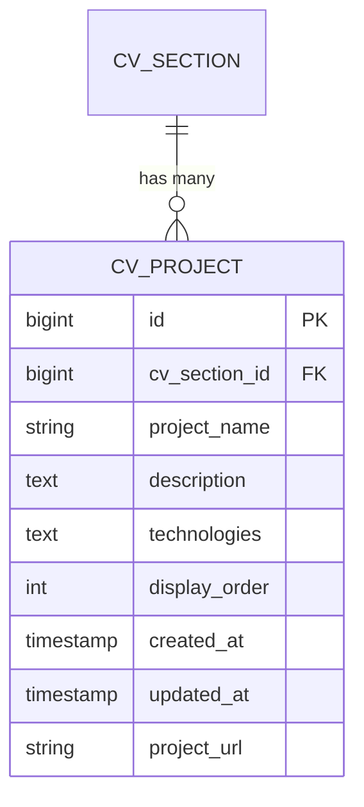
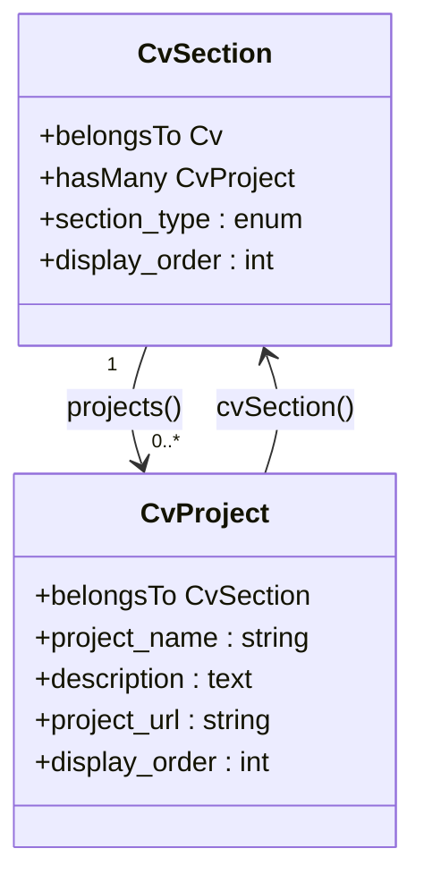
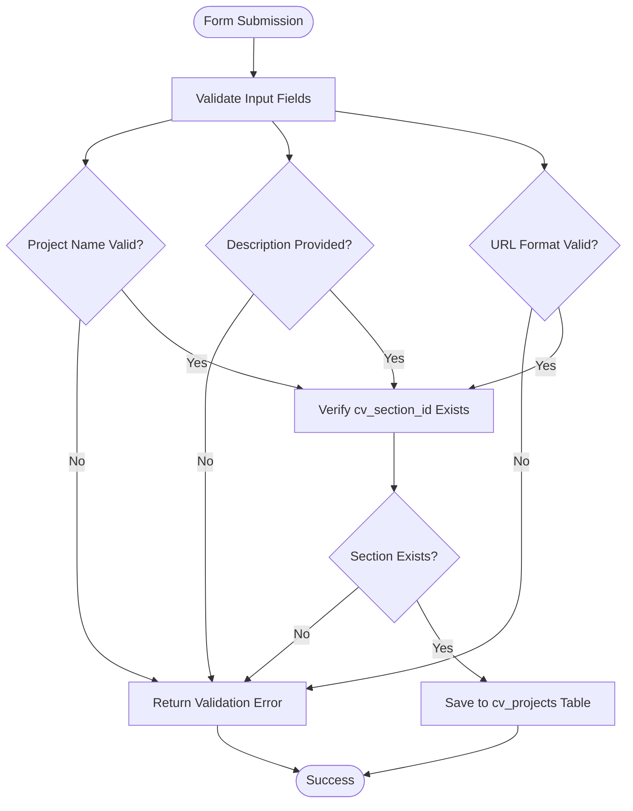
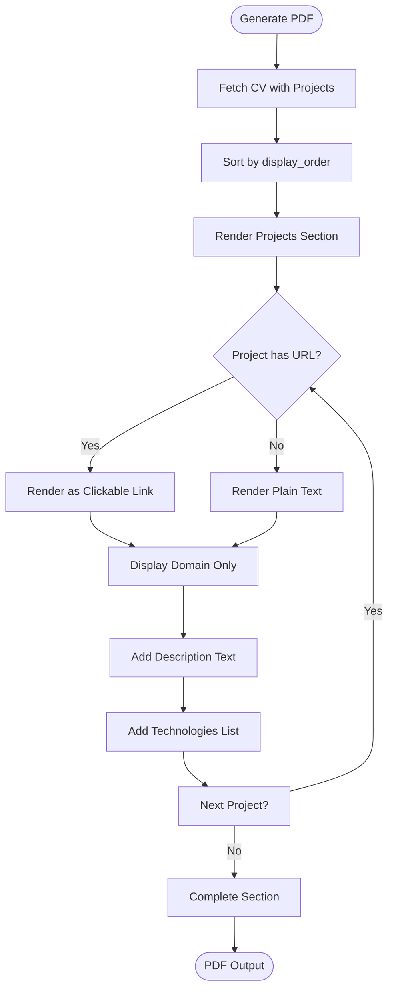

# CV Project

<cite>
**Referenced Files in This Document**   
- [CvProject.php](file://app/Models/CvProject.php)
- [2025_10_03_201718_create_cv_projects_table.php](file://database/migrations/2025_10_03_201718_create_cv_projects_table.php)
- [2025_10_03_214838_add_url_to_cv_projects_table.php](file://database/migrations/2025_10_03_214838_add_url_to_cv_projects_table.php)
- [ProjectsRelationManager.php](file://app/Filament/Resources/Cvs/RelationManagers/ProjectsRelationManager.php)
- [pdf.blade.php](file://resources/views/cv/pdf.blade.php)
- [cv_builder_spec.md](file://cv_builder_spec.md)
- [data-model.md](file://specs/001-cv-builder-application/data-model.md)
- [CvSection.php](file://app/Models/CvSection.php)
</cite>

## Table of Contents
1. [Introduction](#introduction)
2. [Database Schema](#database-schema)
3. [Relationship with CvSection](#relationship-with-cvsection)
4. [Data Validation Rules](#data-validation-rules)
5. [Access Patterns](#access-patterns)
6. [PDF Rendering and Layout](#pdf-rendering-and-layout)
7. [Common Issues and Migration Strategies](#common-issues-and-migration-strategies)
8. [Performance Considerations](#performance-considerations)

## Introduction
The `CvProject` model represents individual side projects or portfolio items within a CV's projects section. It is part of a polymorphic section system where `CvSection` acts as a typed pivot, enabling flexible and extensible CV structures. This documentation details the data model, relationships, validation, rendering, and performance aspects of the `CvProject` entity.

## Database Schema
The `cv_projects` table stores project details with the following fields:

| Field | Type | Constraints | Description |
|------|------|------------|-------------|
| id | bigint | primary key | Unique identifier |
| cv_section_id | bigint | foreign key to cv_sections, cascade delete | Links to the parent section |
| project_name | string(255) | required | Title of the project |
| description | text | required | Detailed description of the project |
| technologies | text | nullable | Technologies used in the project |
| display_order | unsigned integer | required, min:0 | Ordering within the section |
| created_at | timestamp | - | Creation timestamp |
| updated_at | timestamp | - | Last update timestamp |
| project_url | string(255) | nullable | External URL for the project |

An index exists on `(cv_section_id, display_order)` to optimize ordered queries.

**Diagram sources**
- [2025_10_03_201718_create_cv_projects_table.php](file://database/migrations/2025_10_03_201718_create_cv_projects_table.php#L10-L25)
- [2025_10_03_214838_add_url_to_cv_projects_table.php](file://database/migrations/2025_10_03_214838_add_url_to_cv_projects_table.php#L10-L15)

**Section sources**
- [CvProject.php](file://app/Models/CvProject.php#L7-L22)
- [cv_builder_spec.md](file://cv_builder_spec.md#L67-L75)

## Relationship with CvSection
The `CvProject` model has a many-to-one relationship with `CvSection`, where a section of type "projects" can contain multiple projects. This relationship is implemented through the `cv_section_id` foreign key.

The `CvSection` model provides a polymorphic relationship pattern, acting as a typed pivot that allows different section types (skills, experience, projects, etc.) to be managed uniformly while maintaining type-specific content models.

**Diagram sources**
- [CvSection.php](file://app/Models/CvSection.php#L10-L60)
- [CvProject.php](file://app/Models/CvProject.php#L7-L22)

**Section sources**
- [CvSection.php](file://app/Models/CvSection.php#L10-L60)
- [data-model.md](file://specs/001-cv-builder-application/data-model.md#L76-L109)

## Data Validation Rules
The `CvProject` model enforces the following validation rules through both database constraints and application-level validation:

- **cv_section_id**: Required, must reference an existing `cv_sections.id`
- **project_name**: Required, maximum 255 characters
- **description**: Required field
- **technologies**: Optional text field
- **display_order**: Required, non-negative integer
- **project_url**: Optional, must be a valid URL format when provided

These rules are enforced in the Filament admin interface and through database schema constraints.

**Diagram sources**
- [ProjectsRelationManager.php](file://app/Filament/Resources/Cvs/RelationManagers/ProjectsRelationManager.php#L68-L110)

**Section sources**
- [ProjectsRelationManager.php](file://app/Filament/Resources/Cvs/RelationManagers/ProjectsRelationManager.php#L68-L110)
- [data-model.md](file://specs/001-cv-builder-application/data-model.md#L246-L275)

## Access Patterns
The system supports several access patterns for retrieving project data:

- **Retrieve all projects for a CV**: Query through the `projects` relationship on `Cv` model
- **Get featured projects**: Filter by presence of `project_url` to identify externally linkable projects
- **Order by display priority**: Use `display_order` field for custom ordering
- **Filter by technology stack**: Search within `technologies` text field

The `Cv` model provides a `projects()` relationship that uses `hasManyThrough` to directly access projects without exposing the intermediate `CvSection`.

**Section sources**
- [Cv.php](file://app/Models/Cv.php#L48-L53)

## PDF Rendering and Layout
Project data is rendered in the PDF template with responsive layout considerations and hyperlink embedding:

- Project names are displayed as headings
- Descriptions are shown as paragraph text
- URLs are rendered as clickable hyperlinks with domain-only display
- Technologies are listed as comma-separated values
- Projects are ordered by `display_order`

The PDF template uses Tailwind CSS for styling, ensuring consistent rendering across different environments.

**Diagram sources**
- [pdf.blade.php](file://resources/views/cv/pdf.blade.php#L100-L120)

**Section sources**
- [pdf.blade.php](file://resources/views/cv/pdf.blade.php#L100-L120)

## Common Issues and Migration Strategies
### Handling Private Projects
Projects without URLs are rendered without hyperlinks, maintaining clean presentation while indicating the absence of external links.

### Legacy Data Migration
When importing legacy data:
- Ensure `cv_section_id` is properly mapped or created
- Validate and sanitize project URLs
- Convert plain text descriptions to HTML if necessary
- Map technology stacks to consistent formatting

The migration from initial schema to include `project_url` was handled via a separate migration file, demonstrating an evolutionary schema approach.

**Section sources**
- [2025_10_03_214838_add_url_to_cv_projects_table.php](file://database/migrations/2025_10_03_214838_add_url_to_cv_projects_table.php#L10-L15)
- [BaseCVSeeder.php](file://database/seeders/BaseCVSeeder.php#L268-L305)

## Performance Considerations
For large project collections:

- The index on `(cv_section_id, display_order)` ensures efficient ordered queries
- Use of `hasManyThrough` relationship minimizes query complexity
- Consider caching rendered project sections for frequently accessed CVs
- Implement pagination for admin interfaces with many projects

The polymorphic pattern through `CvSection` provides a balance between flexibility and performance, avoiding the need for separate tables per section type while maintaining query efficiency.

**Section sources**
- [CvSection.php](file://app/Models/CvSection.php#L10-L60)
- [CvProject.php](file://app/Models/CvProject.php#L7-L22)
