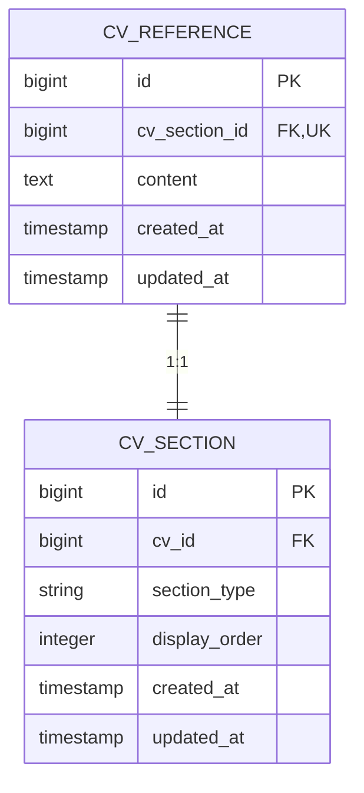
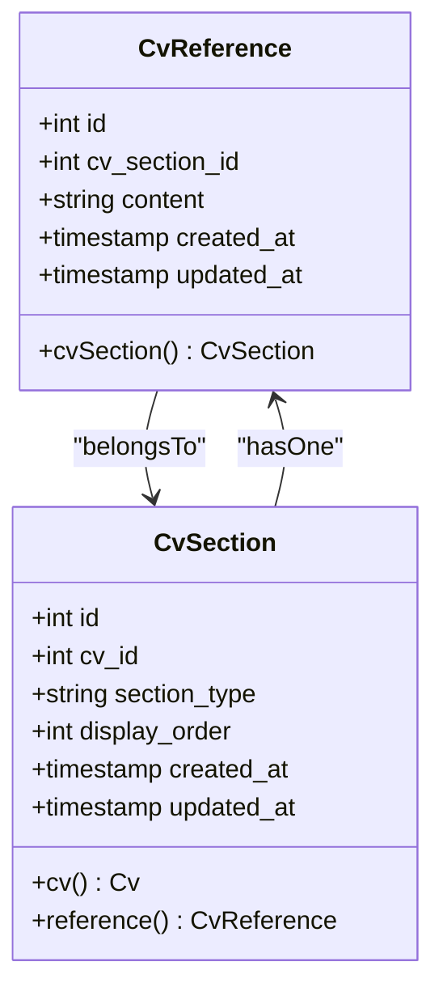
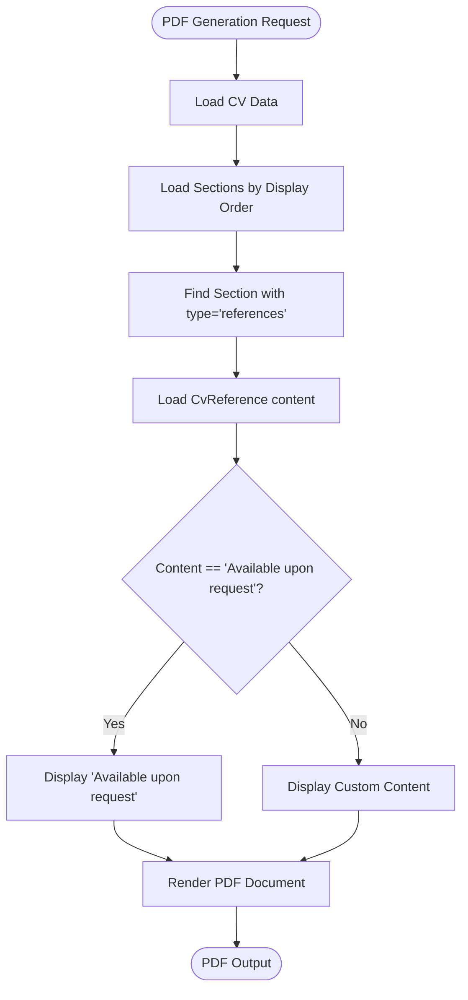

# CV Reference

<cite>
**Referenced Files in This Document**   
- [CvReference.php](file://app/Models/CvReference.php)
- [CvSection.php](file://app/Models/CvSection.php)
- [2025_10_03_201727_create_cv_references_table.php](file://database/migrations/2025_10_03_201727_create_cv_references_table.php)
- [pdf.blade.php](file://resources/views/cv/pdf.blade.php)
- [ReferencesRelationManager.php](file://app/Filament/Resources/Cvs/RelationManagers/ReferencesRelationManager.php)
</cite>

## Table of Contents
1. [Introduction](#introduction)
2. [Database Schema](#database-schema)
3. [Relationships](#relationships)
4. [Data Validation Rules](#data-validation-rules)
5. [Access Patterns](#access-patterns)
6. [PDF Template Presentation](#pdf-template-presentation)
7. [Common Issues and GDPR Compliance](#common-issues-and-gdpr-compliance)
8. [Security Considerations](#security-considerations)

## Introduction
The CvReference model represents the professional references section within a CV builder application. It stores reference information associated with a specific CV section and is designed to handle both direct contact details and privacy-conscious alternatives like "Available upon request". The model follows a polymorphic pattern through the CvSection table, allowing flexible section management within CVs.

**Section sources**
- [CvReference.php](file://app/Models/CvReference.php#L7-L18)
- [CvSection.php](file://app/Models/CvSection.php#L10-L60)

## Database Schema
The CvReference model corresponds to the `cv_references` database table with the following structure:

| Field | Type | Constraints | Description |
|-------|------|-------------|-------------|
| id | bigint | Primary Key | Unique identifier for the reference record |
| cv_section_id | bigint | Foreign Key, Unique | References the associated CvSection record |
| content | text | Required | The reference information content |
| created_at | timestamp | - | Record creation timestamp |
| updated_at | timestamp | - | Record last modification timestamp |

The schema enforces data integrity through a unique constraint on `cv_section_id`, ensuring that each CV section can have at most one reference record. The foreign key constraint with cascade delete ensures referential integrity when a CvSection is removed.

**Diagram sources**
- [2025_10_03_201727_create_cv_references_table.php](file://database/migrations/2025_10_03_201727_create_cv_references_table.php#L10-L15)
- [CvReference.php](file://app/Models/CvReference.php#L7-L18)

## Relationships
The CvReference model maintains a one-to-one relationship with the CvSection model, where each reference belongs to exactly one section of type 'references'. This relationship is implemented through the `cv_section_id` foreign key field.

The polymorphic pattern via CvSection allows for flexible section management, where the CvSection table acts as a typed pivot between the CV and its various content sections. This design provides a single source of truth for section ordering and enables easy addition of new section types without altering the core CV structure.

**Diagram sources**
- [CvReference.php](file://app/Models/CvReference.php#L15-L18)
- [CvSection.php](file://app/Models/CvSection.php#L50-L53)

## Data Validation Rules
The CvReference model implements validation rules to ensure data quality and consistency:

- **Content field**: Required and must contain text content
- **cv_section_id**: Required, must reference an existing CvSection record, and must be unique across all CvReference records
- **Field protection**: Only `cv_section_id` and `content` fields are mass-assignable through the `$fillable` property

The validation is enforced at both the application and database levels. The database schema includes NOT NULL constraints on required fields, while the application layer (via Filament forms) enforces these rules during user input.

**Section sources**
- [CvReference.php](file://app/Models/CvReference.php#L9-L13)
- [ReferencesRelationManager.php](file://app/Filament/Resources/Cvs/RelationManagers/ReferencesRelationManager.php#L39-L42)

## Access Patterns
The primary access pattern for CvReference data involves retrieving references through their associated CvSection. The model is typically accessed via the CvSection relationship, allowing for efficient eager loading of reference data when displaying CV content.

Common query patterns include:
- Retrieving all references for a specific CV by joining through CvSection
- Filtering references by CV or section criteria
- Loading reference content for PDF generation

The data access is optimized through proper indexing on the foreign key and primary key fields, ensuring efficient lookups and joins.

**Section sources**
- [CvReference.php](file://app/Models/CvReference.php#L15-L18)
- [CvSection.php](file://app/Models/CvSection.php#L50-L53)

## PDF Template Presentation
In the PDF template, reference information is presented as part of the overall CV layout. The system implements privacy considerations by allowing users to control what information is displayed. The default content "Available upon request" supports privacy-conscious users who prefer not to disclose direct contact information.

The presentation follows a clean, professional format consistent with other CV sections, ensuring visual coherence in the final document. The content is rendered directly from the database field without additional formatting, preserving the user's intended presentation.

**Diagram sources**
- [pdf.blade.php](file://resources/views/cv/pdf.blade.php#L88-L98)
- [CvReference.php](file://app/Models/CvReference.php#L7-L18)

## Common Issues and GDPR Compliance
The CvReference model addresses common issues related to confidential references and GDPR compliance through several mechanisms:

- **Data minimization**: The system encourages the use of "Available upon request" as the default, minimizing the storage of personal contact information
- **User control**: Users have full control over what reference information is stored and displayed
- **Data retention**: Reference data follows the same lifecycle as the associated CV, including soft deletion capabilities
- **Export restrictions**: When CVs are cloned or exported, reference information is included but can be modified independently

For GDPR compliance, the system ensures that personal data in references is stored only when explicitly provided by the user, with clear visibility into what information is being retained. The application supports data subject rights through standard Laravel Eloquent model operations.

**Section sources**
- [ReferencesRelationManager.php](file://app/Filament/Resources/Cvs/RelationManagers/ReferencesRelationManager.php#L39-L42)
- [CvReference.php](file://app/Models/CvReference.php#L9-L13)

## Security Considerations
The CvReference model implements several security measures to protect sensitive reference data:

- **Access controls**: Data access is restricted through the Filament admin interface, with all operations requiring appropriate permissions
- **Input validation**: All user input is validated before storage to prevent injection attacks
- **Data protection**: The model follows Laravel's mass assignment protection through the `$fillable` array
- **Referential integrity**: Foreign key constraints with cascade delete ensure data consistency
- **Export security**: When PDF snapshots are created, the reference information is included but follows the same privacy rules as the web interface

The system architecture ensures that reference data is treated with the same security standards as other personal information within the CV, with appropriate safeguards against unauthorized access or disclosure.

**Section sources**
- [CvReference.php](file://app/Models/CvReference.php#L9-L13)
- [ReferencesRelationManager.php](file://app/Filament/Resources/Cvs/RelationManagers/ReferencesRelationManager.php#L39-L42)