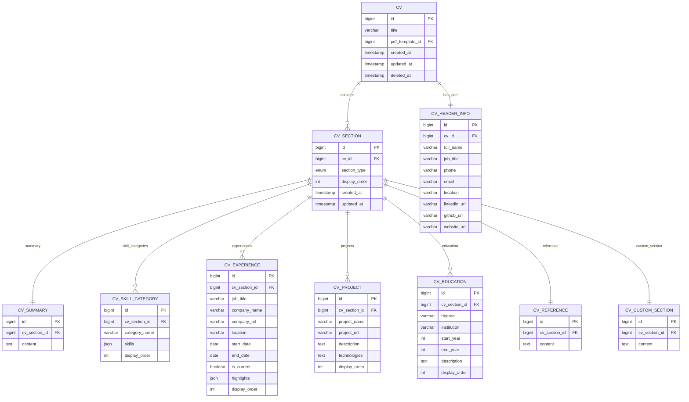
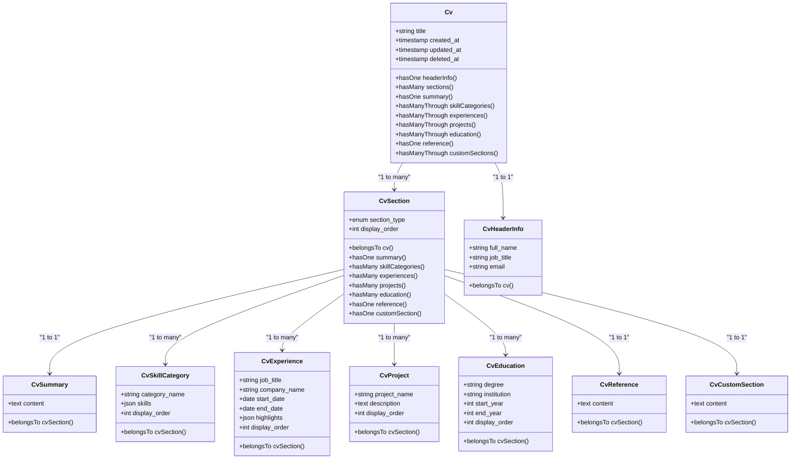

# CV Data Model

<cite>
**Referenced Files in This Document**   
- [Cv.php](file://app/Models/Cv.php)
- [CvSection.php](file://app/Models/CvSection.php)
- [CvHeaderInfo.php](file://app/Models/CvHeaderInfo.php)
- [CvSummary.php](file://app/Models/CvSummary.php)
- [CvSkillCategory.php](file://app/Models/CvSkillCategory.php)
- [CvExperience.php](file://app/Models/CvExperience.php)
- [CvProject.php](file://app/Models/CvProject.php)
- [CvEducation.php](file://app/Models/CvEducation.php)
- [CvReference.php](file://app/Models/CvReference.php)
- [CvCustomSection.php](file://app/Models/CvCustomSection.php)
- [2025_10_03_201646_create_cvs_table.php](file://database/migrations/2025_10_03_201646_create_cvs_table.php)
- [2025_10_03_201651_create_cv_sections_table.php](file://database/migrations/2025_10_03_201651_create_cv_sections_table.php)
- [2025_10_03_201656_create_cv_header_info_table.php](file://database/migrations/2025_10_03_201656_create_cv_header_info_table.php)
- [2025_10_03_201701_create_cv_summaries_table.php](file://database/migrations/2025_10_03_201701_create_cv_summaries_table.php)
- [2025_10_03_201706_create_cv_skill_categories_table.php](file://database/migrations/2025_10_03_201706_create_cv_skill_categories_table.php)
- [2025_10_03_201713_create_cv_experiences_table.php](file://database/migrations/2025_10_03_201713_create_cv_experiences_table.php)
- [2025_10_03_201718_create_cv_projects_table.php](file://database/migrations/2025_10_03_201718_create_cv_projects_table.php)
- [2025_10_03_201722_create_cv_education_table.php](file://database/migrations/2025_10_03_201722_create_cv_education_table.php)
- [2025_10_03_201727_create_cv_references_table.php](file://database/migrations/2025_10_03_201727_create_cv_references_table.php)
- [2025_10_03_225951_create_cv_custom_sections_table.php](file://database/migrations/2025_10_03_225951_create_cv_custom_sections_table.php)
- [2025_10_04_002505_add_soft_deletes_to_cvs.php](file://database/migrations/2025_10_04_002505_add_soft_deletes_to_cvs.php)
- [2025_10_04_205802_add_pdf_template_id_to_cvs.php](file://database/migrations/2025_10_04_205802_add_pdf_template_id_to_cvs.php)
</cite>

## Table of Contents
1. [Introduction](#introduction)
2. [CV Entity Structure](#cv-entity-structure)
3. [Core Data Model](#core-data-model)
4. [Section Ordering and Relationships](#section-ordering-and-relationships)
5. [Polymorphic Section Architecture](#polymorphic-section-architecture)
6. [Data Validation and Completeness](#data-validation-and-completeness)
7. [Data Access Patterns](#data-access-patterns)
8. [Performance Considerations](#performance-considerations)
9. [Query Examples](#query-examples)
10. [Conclusion](#conclusion)

## Introduction
The CV data model forms the core of the CV Builder application, enabling users to create, manage, and version multiple CVs with structured content. This documentation details the entity relationships, field definitions, and architectural patterns that support CV creation, section management, and PDF generation. The model supports both standard and custom sections, maintains ordering through explicit display_order fields, and enables non-destructive tailoring through section focus profiles.

## CV Entity Structure

The Cv model serves as the root entity for all CV-related data, containing metadata about the CV itself and establishing relationships with its constituent sections. The model implements soft deletes to preserve historical versions while allowing users to remove CVs from active view.

**Section sources**
- [Cv.php](file://app/Models/Cv.php#L1-L355)
- [2025_10_03_201646_create_cvs_table.php](file://database/migrations/2025_10_03_201646_create_cvs_table.php#L1-L31)
- [2025_10_04_002505_add_soft_deletes_to_cvs.php](file://database/migrations/2025_10_04_002505_add_soft_deletes_to_cvs.php#L1-L20)
- [2025_10_04_205802_add_pdf_template_id_to_cvs.php](file://database/migrations/2025_10_04_205802_add_pdf_template_id_to_cvs.php#L1-L20)

## Core Data Model

The CV system employs a normalized data structure with a central Cv entity connected to multiple section types through a polymorphic relationship pattern. Each CV consists of a header and multiple sections, with each section containing specific content types.

### CV Table Schema
The `cvs` table stores metadata about each CV, serving as the parent entity for all CV content.

| Field | Type | Constraints | Description |
|-------|------|-------------|-------------|
| id | BIGINT UNSIGNED | PRIMARY KEY, AUTO_INCREMENT | Unique identifier |
| title | VARCHAR(255) | NOT NULL | User-defined CV title |
| pdf_template_id | BIGINT UNSIGNED | FOREIGN KEY (nullable) | Reference to preferred PDF template |
| created_at | TIMESTAMP | NOT NULL | Creation timestamp |
| updated_at | TIMESTAMP | NOT NULL | Last modification timestamp |
| deleted_at | TIMESTAMP | SOFT DELETE | Deletion timestamp (nullable) |

**Section sources**
- [2025_10_03_201646_create_cvs_table.php](file://database/migrations/2025_10_03_201646_create_cvs_table.php#L1-L31)
- [2025_10_04_002505_add_soft_deletes_to_cvs.php](file://database/migrations/2025_10_04_002505_add_soft_deletes_to_cvs.php#L1-L20)
- [2025_10_04_205802_add_pdf_template_id_to_cvs.php](file://database/migrations/2025_10_04_205802_add_pdf_template_id_to_cvs.php#L1-L20)

### CV Section Types
The system supports multiple section types, each with specific content models. The `cv_sections` table acts as a polymorphic container that references the appropriate content table based on section_type.



**Diagram sources**
- [2025_10_03_201646_create_cvs_table.php](file://database/migrations/2025_10_03_201646_create_cvs_table.php#L1-L31)
- [2025_10_03_201651_create_cv_sections_table.php](file://database/migrations/2025_10_03_201651_create_cv_sections_table.php#L1-L34)
- [2025_10_03_201656_create_cv_header_info_table.php](file://database/migrations/2025_10_03_201656_create_cv_header_info_table.php#L1-L37)
- [2025_10_03_201701_create_cv_summaries_table.php](file://database/migrations/2025_10_03_201701_create_cv_summaries_table.php#L1-L30)
- [2025_10_03_201706_create_cv_skill_categories_table.php](file://database/migrations/2025_10_03_201706_create_cv_skill_categories_table.php#L1-L30)
- [2025_10_03_201713_create_cv_experiences_table.php](file://database/migrations/2025_10_03_201713_create_cv_experiences_table.php#L1-L30)
- [2025_10_03_201718_create_cv_projects_table.php](file://database/migrations/2025_10_03_201718_create_cv_projects_table.php#L1-L30)
- [2025_10_03_201722_create_cv_education_table.php](file://database/migrations/2025_10_03_201722_create_cv_education_table.php#L1-L30)
- [2025_10_03_201727_create_cv_references_table.php](file://database/migrations/2025_10_03_201727_create_cv_references_table.php#L1-L30)
- [2025_10_03_225951_create_cv_custom_sections_table.php](file://database/migrations/2025_10_03_225951_create_cv_custom_sections_table.php#L1-L30)

## Section Ordering and Relationships

Section ordering is maintained through explicit ordering fields at multiple levels of the data hierarchy. The system uses display_order columns in both the cv_sections and child content tables to enable independent sorting of sections and their items.

### Section Order Management
The CvSection model includes a display_order field that determines the sequence in which sections appear within a CV. This field is indexed for efficient ordering queries and is constrained to ensure uniqueness within each CV.

| Field | Type | Constraints | Description |
|-------|------|-------------|-------------|
| id | BIGINT UNSIGNED | PRIMARY KEY, AUTO_INCREMENT | Unique identifier |
| cv_id | BIGINT UNSIGNED | FOREIGN KEY, INDEX | Reference to parent CV |
| section_type | ENUM | NOT NULL | Type of section content |
| display_order | UNSIGNED INTEGER | NOT NULL, INDEX | Position in CV sequence |
| created_at | TIMESTAMP | NOT NULL | Creation timestamp |
| updated_at | TIMESTAMP | NOT NULL | Last modification timestamp |

The section_type ENUM includes values: header, summary, skills, experience, projects, education, references, custom. The unique constraint on (cv_id, section_type) ensures that each CV can have at most one instance of singleton sections like summary and references.

**Section sources**
- [CvSection.php](file://app/Models/CvSection.php#L1-L68)
- [2025_10_03_201651_create_cv_sections_table.php](file://database/migrations/2025_10_03_201651_create_cv_sections_table.php#L1-L34)

### Content Item Ordering
Child entities like CvExperience, CvProject, and CvSkillCategory include their own display_order fields to enable sorting within their respective sections. This allows users to reorder items independently of section positioning.



**Diagram sources**
- [Cv.php](file://app/Models/Cv.php#L1-L355)
- [CvSection.php](file://app/Models/CvSection.php#L1-L68)
- [CvHeaderInfo.php](file://app/Models/CvHeaderInfo.php#L1-L32)
- [CvSummary.php](file://app/Models/CvSummary.php#L1-L20)
- [CvSkillCategory.php](file://app/Models/CvSkillCategory.php#L1-L26)
- [CvExperience.php](file://app/Models/CvExperience.php#L1-L35)
- [CvProject.php](file://app/Models/CvProject.php#L1-L24)
- [CvEducation.php](file://app/Models/CvEducation.php#L1-L25)
- [CvReference.php](file://app/Models/CvReference.php#L1-L20)
- [CvCustomSection.php](file://app/Models/CvCustomSection.php#L1-L20)

## Polymorphic Section Architecture

The CV system implements a polymorphic relationship pattern through the CvSection entity, which serves as a container for different types of content. This architecture enables extensibility while maintaining data integrity and query efficiency.

### Polymorphic Relationships
The CvSection model establishes hasOne relationships with multiple content types, but only one will be populated based on the section_type value. This pattern allows the system to enforce referential integrity while supporting different content structures.

The hasManyThrough relationships in the Cv model (e.g., skillCategories(), experiences()) provide direct access to content items while traversing the CvSection intermediary. These relationships include type constraints to ensure only relevant sections are queried.

**Section sources**
- [Cv.php](file://app/Models/Cv.php#L1-L355)
- [CvSection.php](file://app/Models/CvSection.php#L1-L68)

## Data Validation and Completeness

The system includes validation rules to ensure CV completeness before export or submission. A CV is considered complete when essential sections are present and properly populated.

### Completeness Requirements
A CV must have the following components to be considered complete:
- Header information with full name and email
- At least one experience entry
- At least one skill category with skills
- Summary section with content

The Cv model includes accessor methods that aggregate data for analysis purposes, such as getSkillsAttribute(), getExperiencesAttribute(), and getHighlightsAttribute(). These methods facilitate validation and analysis by providing structured data views.

**Section sources**
- [Cv.php](file://app/Models/Cv.php#L1-L355)

## Data Access Patterns

The CV data model supports several key access patterns for rendering CVs in different contexts and templates.

### Eager Loading Strategy
When rendering a CV for display or PDF generation, the system should eager load all related sections to minimize database queries. The recommended loading pattern includes:

```php
Cv::with([
    'headerInfo',
    'sections.summary',
    'sections.skillCategories',
    'sections.experiences',
    'sections.projects',
    'sections.education',
    'sections.reference',
    'sections.customSection'
])->findOrFail($id);
```

This pattern ensures all necessary data is retrieved in a minimal number of queries while maintaining the section ordering.

**Section sources**
- [Cv.php](file://app/Models/Cv.php#L1-L355)

## Performance Considerations

The data model includes several performance optimizations to ensure efficient querying and rendering, especially for PDF generation.

### Indexing Strategy
The database schema includes indexes on key columns to optimize common query patterns:
- Index on cvs.created_at for chronological sorting
- Composite index on cv_sections(cv_id, display_order) for ordered section retrieval
- Unique constraint on cv_sections(cv_id, section_type) for fast section type lookup

### Query Optimization
For PDF generation, the system should use the getSectionsWithProfile() method when a section focus profile is applied. This method filters and reorders sections according to the profile's specifications, enabling tailored CV variants without modifying the original structure.

The cloneCv() method implements a transactional deep copy of a CV and all its sections, preserving data integrity during duplication operations.

**Section sources**
- [Cv.php](file://app/Models/Cv.php#L1-L355)
- [2025_10_03_201646_create_cvs_table.php](file://database/migrations/2025_10_03_201646_create_cvs_table.php#L1-L31)
- [2025_10_03_201651_create_cv_sections_table.php](file://database/migrations/2025_10_03_201651_create_cv_sections_table.php#L1-L34)

## Query Examples

### Retrieve Complete CV for PDF Generation
```sql
SELECT * FROM cvs 
WHERE id = ? AND deleted_at IS NULL;

SELECT * FROM cv_header_info 
WHERE cv_id = ?;

SELECT cs.*, 
       s.content as summary_content,
       sc.category_name, sc.skills, sc.display_order as category_order,
       e.job_title, e.company_name, e.highlights, e.display_order as experience_order,
       p.project_name, p.description, p.display_order as project_order,
       ed.degree, ed.institution, ed.display_order as education_order,
       r.content as reference_content,
       c.content as custom_content
FROM cv_sections cs
LEFT JOIN cv_summaries s ON s.cv_section_id = cs.id
LEFT JOIN cv_skill_categories sc ON sc.cv_section_id = cs.id
LEFT JOIN cv_experiences e ON e.cv_section_id = cs.id
LEFT JOIN cv_projects p ON p.cv_section_id = cs.id
LEFT JOIN cv_education ed ON ed.cv_section_id = cs.id
LEFT JOIN cv_references r ON r.cv_section_id = cs.id
LEFT JOIN cv_custom_sections c ON c.cv_section_id = cs.id
WHERE cs.cv_id = ?
ORDER BY cs.display_order, 
         sc.display_order, e.display_order, 
         p.display_order, ed.display_order;
```

### Get Skills with Evidence for Analysis
The getSkillsWithEvidence() method aggregates skills with their evidence count and types, supporting analysis of skill demonstration across experiences.

**Section sources**
- [Cv.php](file://app/Models/Cv.php#L1-L355)

## Conclusion
The CV data model provides a flexible and extensible foundation for managing structured CV content. By employing a polymorphic section architecture with explicit ordering, the system supports both standard and custom sections while maintaining data integrity. The inclusion of soft deletes, versioning, and section focus profiles enables sophisticated CV management capabilities. The model is optimized for common access patterns, particularly PDF generation, through strategic indexing and eager loading patterns.