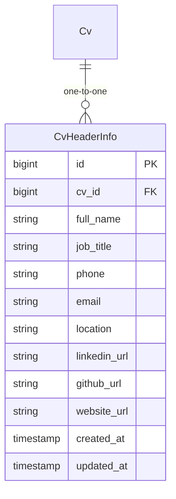
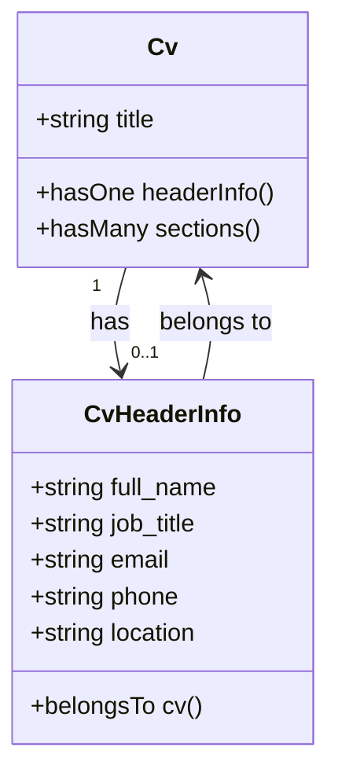
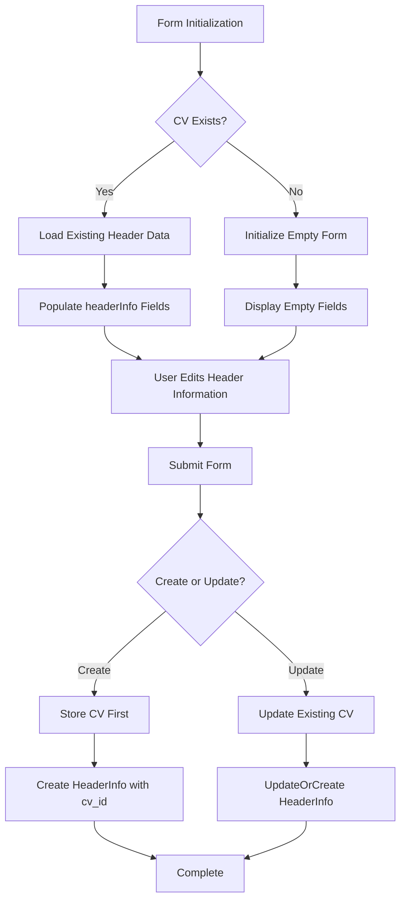
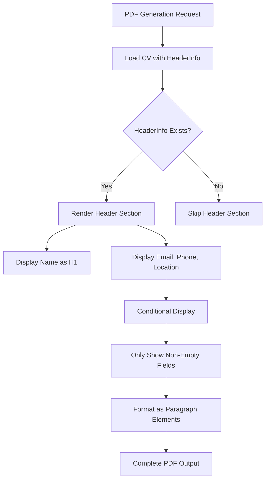

# CV Header Information

<cite>
**Referenced Files in This Document**   
- [CvHeaderInfo.php](file://app/Models/CvHeaderInfo.php)
- [Cv.php](file://app/Models/Cv.php)
- [CvForm.php](file://app/Filament/Resources/Cvs/Schemas/CvForm.php)
- [pdf.blade.php](file://resources/views/cv/pdf.blade.php)
- [create_cv_header_info_table.php](file://database/migrations/2025_10_03_201656_create_cv_header_info_table.php)
- [CreateCv.php](file://app/Filament/Resources/Cvs/Pages/CreateCv.php)
- [EditCv.php](file://app/Filament/Resources/Cvs/Pages/EditCv.php)
- [data-model.md](file://specs/001-cv-builder-application/data-model.md)
</cite>

## Table of Contents
1. [Introduction](#introduction)
2. [Data Model and Database Schema](#data-model-and-database-schema)
3. [Eloquent Relationship with CV Model](#eloquent-relationship-with-cv-model)
4. [Form Implementation and Data Population](#form-implementation-and-data-population)
5. [PDF Template Display](#pdf-template-display)
6. [Validation Rules and Data Constraints](#validation-rules-and-data-constraints)
7. [Internationalization Considerations](#internationalization-considerations)
8. [Extending the Model with Additional Fields](#extending-the-model-with-additional-fields)
9. [Conclusion](#conclusion)

## Introduction

The `CvHeaderInfo` data model serves as the central repository for personal identification and contact details within the CV Builder application. It stores essential professional information that appears at the top of a CV, including the individual's full name, job title, email address, phone number, and location. This model is designed to maintain a clean separation between header information and other CV content sections while ensuring data integrity through proper validation and database constraints.

The header information plays a critical role in professional documentation, serving as the first point of contact for recruiters and hiring managers. By centralizing this information in a dedicated model, the application enables consistent presentation across different CV formats and outputs while maintaining flexibility for future enhancements.

**Section sources**
- [CvHeaderInfo.php](file://app/Models/CvHeaderInfo.php#L8-L30)
- [data-model.md](file://specs/001-cv-builder-application/data-model.md#L110-L144)

## Data Model and Database Schema

The `CvHeaderInfo` model corresponds to the `cv_header_info` database table and contains fields for storing personal and professional contact information. The schema is designed with appropriate data types and constraints to ensure data quality and consistency.



**Diagram sources**
- [create_cv_header_info_table.php](file://database/migrations/2025_10_03_201656_create_cv_header_info_table.php#L10-L24)
- [CvHeaderInfo.php](file://app/Models/CvHeaderInfo.php#L8-L30)

The database schema includes the following fields with their respective data types and constraints:

| Field | Data Type | Constraints | Description |
|-------|---------|-----------|-------------|
| `id` | bigint | Primary Key | Auto-incrementing primary key |
| `cv_id` | bigint | Foreign Key, Unique | References the parent CV, ensures one header per CV |
| `full_name` | string(255) | Required | Full name of the individual |
| `job_title` | string(255) | Required | Current professional title |
| `phone` | string(50) | Nullable | Contact phone number |
| `email` | string(255) | Required | Professional email address |
| `location` | string(255) | Nullable | Geographic location (city, country) |
| `linkedin_url` | string(500) | Nullable | LinkedIn profile URL |
| `github_url` | string(500) | Nullable | GitHub profile URL |
| `website_url` | string(500) | Nullable | Personal or professional website |
| `created_at` | timestamp | - | Record creation timestamp |
| `updated_at` | timestamp | - | Record last update timestamp |

The schema enforces a one-to-one relationship between a CV and its header information through the unique constraint on the `cv_id` foreign key. This ensures that each CV can have exactly one header record, maintaining data integrity across the application.

**Section sources**
- [create_cv_header_info_table.php](file://database/migrations/2025_10_03_201656_create_cv_header_info_table.php#L10-L24)
- [data-model.md](file://specs/001-cv-builder-application/data-model.md#L110-L144)

## Eloquent Relationship with CV Model

The `CvHeaderInfo` model establishes a bidirectional relationship with the `Cv` model through Eloquent, enabling seamless access to header information from the parent CV and vice versa. This relationship follows the one-to-one pattern, where each CV has exactly one header information record.



**Diagram sources**
- [CvHeaderInfo.php](file://app/Models/CvHeaderInfo.php#L28-L30)
- [Cv.php](file://app/Models/Cv.php#L27-L29)

In the `CvHeaderInfo` model, the relationship is defined using the `belongsTo` method, indicating that each header information record belongs to a single CV:

```php
public function cv(): BelongsTo
{
    return $this->belongsTo(Cv::class);
}
```

Conversely, the `Cv` model defines the inverse relationship using the `hasOne` method, establishing that each CV has one header information record:

```php
public function headerInfo(): HasOne
{
    return $this->hasOne(CvHeaderInfo::class);
}
```

This bidirectional relationship allows for intuitive data access patterns throughout the application. For example, when displaying a CV, the application can access header information using `$cv->headerInfo->full_name`, while when working with header data, it can access the parent CV using `$headerInfo->cv->title`. The relationship is automatically handled by Laravel's Eloquent ORM, including proper eager loading to prevent N+1 query issues.

**Section sources**
- [CvHeaderInfo.php](file://app/Models/CvHeaderInfo.php#L28-L30)
- [Cv.php](file://app/Models/Cv.php#L27-L29)

## Form Implementation and Data Population

The header information is populated through the Filament form system, specifically via the `CvForm` class which configures the input fields for CV creation and editing. The form implementation uses nested field notation to handle the relationship between the CV and its header information.



**Diagram sources**
- [CvForm.php](file://app/Filament/Resources/Cvs/Schemas/CvForm.php#L7-L64)
- [CreateCv.php](file://app/Filament/Resources/Cvs/Pages/CreateCv.php#L15-L33)
- [EditCv.php](file://app/Filament/Resources/Cvs/Pages/EditCv.php#L50-L78)

The form configuration in `CvForm.php` defines the input components for header information using dot notation to reference the related model:

```php
TextInput::make('headerInfo.full_name')
    ->label('Full Name')
    ->required()
    ->maxLength(255),

TextInput::make('headerInfo.job_title')
    ->label('Job Title')
    ->required()
    ->maxLength(255),

TextInput::make('headerInfo.email')
    ->label('Email')
    ->email()
    ->required()
    ->maxLength(255),
```

When creating a new CV, the `CreateCv` page handles the header information in two phases. First, it extracts the header data from the form submission and temporarily stores it, then creates the CV record, and finally creates the `CvHeaderInfo` record with the proper `cv_id`:

```php
protected function mutateFormDataBeforeCreate(array $data): array
{
    if (isset($data['headerInfo'])) {
        $this->headerInfoData = $data['headerInfo'];
        unset($data['headerInfo']);
    }
    return $data;
}

protected function afterCreate(): void
{
    if (isset($this->headerInfoData)) {
        CvHeaderInfo::create([
            'cv_id' => $this->record->id,
            ...$this->headerInfoData,
        ]);
    }
}
```

For editing existing CVs, the `EditCv` page uses `updateOrCreate` to handle both creation and updating of the header information record, ensuring data consistency regardless of whether a header record already exists:

```php
protected function mutateFormDataBeforeSave(array $data): array
{
    if (isset($data['headerInfo'])) {
        $headerInfoData = $data['headerInfo'];
        CvHeaderInfo::updateOrCreate(
            ['cv_id' => $this->record->id],
            $headerInfoData
        );
        unset($data['headerInfo']);
    }
    return $data;
}
```

The form also handles data population when editing existing records by loading the header information into the form data structure:

```php
protected function mutateFormDataBeforeFill(array $data): array
{
    if ($this->record->headerInfo) {
        $data['headerInfo'] = [
            'full_name' => $this->record->headerInfo->full_name,
            'job_title' => $this->record->headerInfo->job_title,
            'email' => $this->record->headerInfo->email,
            // ... other fields
        ];
    }
    return $data;
}
```

**Section sources**
- [CvForm.php](file://app/Filament/Resources/Cvs/Schemas/CvForm.php#L7-L64)
- [CreateCv.php](file://app/Filament/Resources/Cvs/Pages/CreateCv.php#L15-L33)
- [EditCv.php](file://app/Filament/Resources/Cvs/Pages/EditCv.php#50-L78)

## PDF Template Display

The header information is displayed in the PDF output through the `pdf.blade.php` template, which renders the CV in HTML format for PDF generation. The template accesses the header information through the Eloquent relationship and presents it in a clean, professional format at the beginning of the document.



**Diagram sources**
- [pdf.blade.php](file://resources/views/cv/pdf.blade.php#L28-L48)

The template implementation uses conditional statements to ensure that only non-empty fields are displayed, maintaining a clean appearance:

```blade
@if($cv->headerInfo)
    <div class="section">
        <p><strong>{{ $cv->headerInfo->full_name }}</strong></p>
        @if($cv->headerInfo->email)
            <p>Email: {{ $cv->headerInfo->email }}</p>
        @endif
        @if($cv->headerInfo->phone)
            <p>Phone: {{ $cv->headerInfo->phone }}</p>
        @endif
        @if($cv->headerInfo->location)
            <p>Location: {{ $cv->headerInfo->location }}</p>
        @endif
    </div>
@endif
```

The header section is styled with CSS to ensure proper visual hierarchy, with the full name displayed in bold as the primary identifier, followed by contact details in standard paragraph format. The conditional rendering prevents empty fields from creating unnecessary whitespace in the final PDF document.

**Section sources**
- [pdf.blade.php](file://resources/views/cv/pdf.blade.php#L28-L48)

## Validation Rules and Data Constraints

The `CvHeaderInfo` model enforces data integrity through a combination of database constraints and application-level validation rules. These rules ensure that critical information is present and properly formatted while allowing flexibility for optional fields.

The validation rules are implemented at multiple levels:

1. **Database level**: Schema constraints defined in the migration
2. **Model level**: Fillable attributes and Eloquent casting
3. **Form level**: Filament form validation rules

The database schema enforces the following constraints:
- `cv_id`: Foreign key with cascade delete and unique constraint
- `full_name`: String with 255 character limit, not nullable
- `job_title`: String with 255 character limit, not nullable
- `email`: String with 255 character limit, not nullable
- `phone`: String with 50 character limit, nullable
- `location`: String with 255 character limit, nullable
- URL fields: Strings with 500 character limit, nullable

The Filament form implementation adds additional validation rules:
- `full_name`: Required, maximum 255 characters
- `job_title`: Required, maximum 255 characters
- `email`: Required, must be valid email format, maximum 255 characters
- `phone`: Maximum 50 characters, tel input type
- `location`: Maximum 255 characters
- URL fields: Must be valid URLs, maximum 500 characters

The form also uses appropriate input types to enhance user experience and data quality:
- Email field uses `->email()` for proper input validation
- Phone field uses `->tel()` for telephone input optimization
- URL fields use `->url()` for URL format validation

These layered validation approaches ensure data consistency and quality throughout the application lifecycle, from data entry to storage and retrieval.

**Section sources**
- [create_cv_header_info_table.php](file://database/migrations/2025_10_03_201656_create_cv_header_info_table.php#L10-L24)
- [CvForm.php](file://app/Filament/Resources/Cvs/Schemas/CvForm.php#L7-L64)
- [data-model.md](file://specs/001-cv-builder-application/data-model.md#L110-L144)

## Internationalization Considerations

The `CvHeaderInfo` model supports internationalization through several design choices that accommodate global users and diverse contact information formats:

1. **Flexible phone number storage**: The phone field uses a string type with a 50-character limit, allowing for international phone number formats with country codes, spaces, and special characters (e.g., "+44 20 7946 0958" or "+1-212-555-0123").

2. **Email standardization**: While email addresses follow RFC standards, the model accommodates internationalized domain names and email addresses through the standard email validation.

3. **Location flexibility**: The location field supports free-form text entry, allowing users to specify their location in their preferred format (e.g., "London, UK", "Berlin, Germany", or "Tokyo, Japan").

4. **URL support for international profiles**: The social media and website URL fields accommodate international domains and non-ASCII characters through proper URL encoding.

5. **Character encoding**: The database uses UTF-8 encoding, supporting names and locations with non-Latin characters (e.g., Chinese, Arabic, or Cyrillic scripts).

When implementing internationalization features, consider the following best practices:
- Provide clear examples or placeholders for phone numbers in international format
- Consider adding a country selector to complement the location field
- Support multiple phone numbers (e.g., mobile, home, work) if needed
- Ensure proper text direction for right-to-left languages
- Validate email addresses according to international standards

The current implementation provides a solid foundation for international users while maintaining simplicity for the majority of use cases.

**Section sources**
- [CvHeaderInfo.php](file://app/Models/CvHeaderInfo.php#L8-L30)
- [CvForm.php](file://app/Filament/Resources/Cvs/Schemas/CvForm.php#L7-L64)

## Extending the Model with Additional Fields

The `CvHeaderInfo` model can be extended to support additional professional contact fields as needed. The current implementation already includes common professional links (LinkedIn, GitHub, website), but may require additional fields for specific use cases.

To add new fields, follow these steps:

1. **Create a migration** to add the new column to the database table:
```bash
php artisan make:migration add_fieldname_to_cv_header_info_table --table=cv_header_info
```

2. **Update the migration** to include the new field:
```php
public function up(): void
{
    Schema::table('cv_header_info', function (Blueprint $table) {
        $table->string('new_field', 500)->nullable();
    });
}
```

3. **Add the field to the fillable array** in the `CvHeaderInfo` model:
```php
protected $fillable = [
    // existing fields
    'new_field',
];
```

4. **Add the field to the form configuration** in `CvForm.php`:
```php
TextInput::make('headerInfo.new_field')
    ->label('Field Label')
    ->url() // or appropriate validation
    ->maxLength(500)
    ->columnSpan(2),
```

Potential fields for extension include:
- **Twitter/X handle**: For social media presence
- **Portfolio URL**: Additional portfolio links
- **ORCID ID**: For academic professionals
- **Professional licenses**: Certification numbers
- **Multiple phone numbers**: Separate fields for mobile, work, etc.
- **Time zone**: For remote work considerations
- **Preferred contact method**: To indicate email, phone, or message preference

When adding new fields, consider the following:
- Use appropriate data types and constraints
- Maintain consistent naming conventions
- Add proper validation rules
- Consider privacy implications of additional personal data
- Ensure responsive design for the form layout
- Update any data export or import functionality

The model's design supports easy extension while maintaining data integrity and application performance.

**Section sources**
- [CvHeaderInfo.php](file://app/Models/CvHeaderInfo.php#L8-L30)
- [CvForm.php](file://app/Filament/Resources/Cvs/Schemas/CvForm.php#L7-L64)
- [create_cv_header_info_table.php](file://database/migrations/2025_10_03_201656_create_cv_header_info_table.php#L10-L24)

## Conclusion

The `CvHeaderInfo` data model provides a robust and flexible solution for storing personal identification and contact details within the CV Builder application. Through its well-designed database schema, clear Eloquent relationships, and integrated form handling, the model ensures data consistency and ease of use throughout the application.

Key strengths of the implementation include:
- Proper one-to-one relationship with the CV model
- Comprehensive validation at multiple levels
- Clean separation of concerns between header information and other CV content
- Support for professional links and social profiles
- Flexible design that accommodates international users
- Easy extensibility for future requirements

The model effectively balances data integrity with user flexibility, providing a solid foundation for professional CV creation while allowing for customization and extension as needed. Its integration with the Filament admin panel and PDF generation system ensures consistent presentation across different output formats.