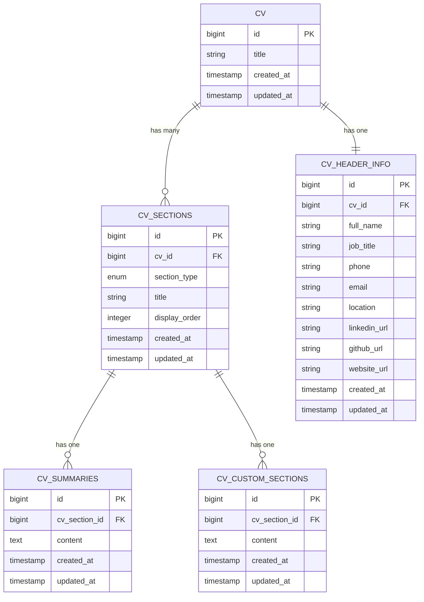
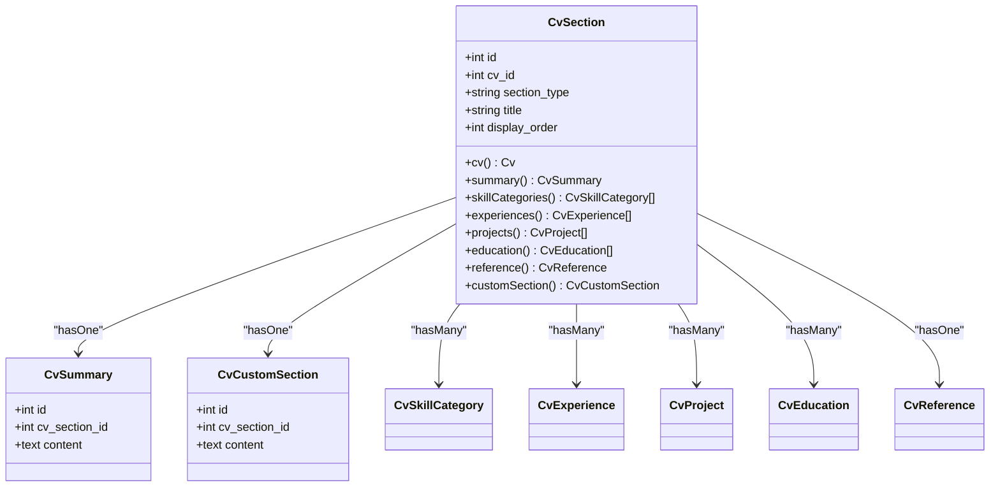
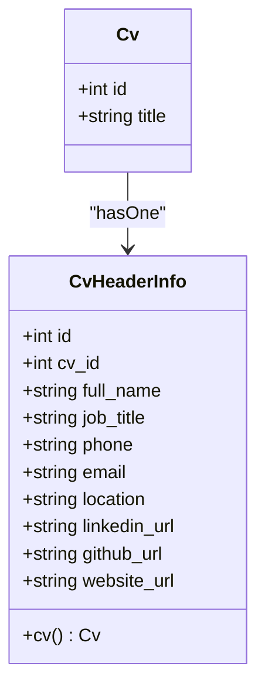
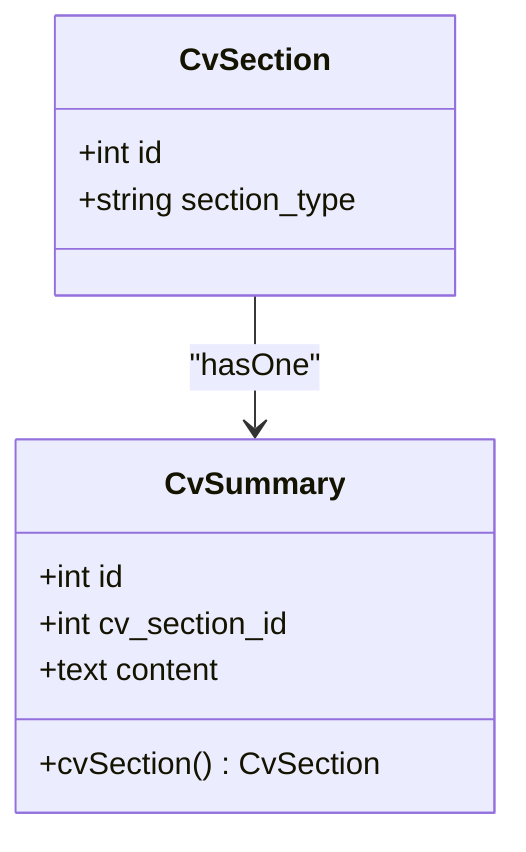
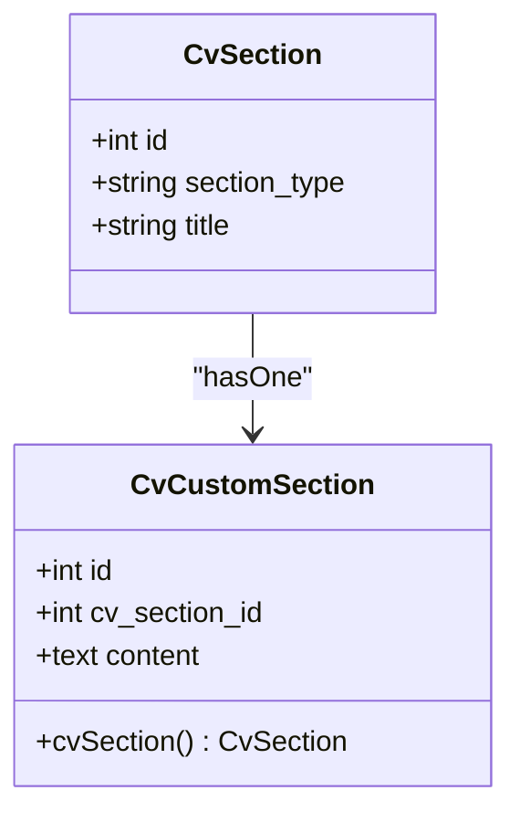
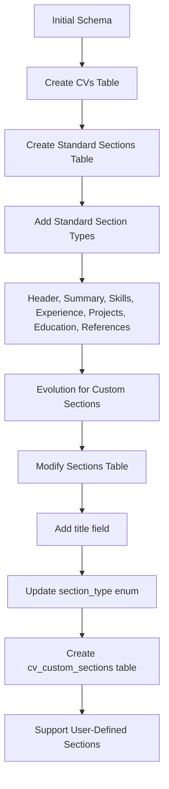
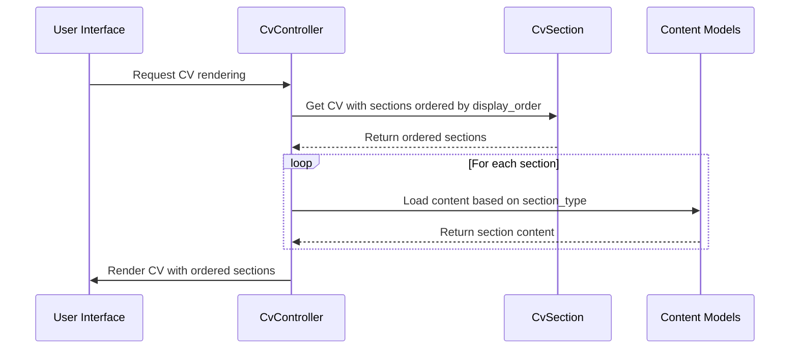

# CV Structure Components

<cite>
**Referenced Files in This Document**   
- [CvSection.php](file://app/Models/CvSection.php)
- [CvHeaderInfo.php](file://app/Models/CvHeaderInfo.php)
- [CvSummary.php](file://app/Models/CvSummary.php)
- [CvCustomSection.php](file://app/Models/CvCustomSection.php)
- [data-model.md](file://specs/001-cv-builder-application/data-model.md)
- [cv_builder_spec.md](file://cv_builder_spec.md)
- [2025_10_03_201651_create_cv_sections_table.php](file://database/migrations/2025_10_03_201651_create_cv_sections_table.php)
- [2025_10_03_225856_modify_cv_sections_table_for_custom_sections.php](file://database/migrations/2025_10_03_225856_modify_cv_sections_table_for_custom_sections.php)
- [2025_10_03_225951_create_cv_custom_sections_table.php](file://database/migrations/2025_10_03_225951_create_cv_custom_sections_table.php)
</cite>

## Table of Contents
1. [Introduction](#introduction)
2. [Core Data Models](#core-data-models)
3. [CvSection: Polymorphic Section Container](#cvsection-polymorphic-section-container)
4. [CvHeaderInfo: Personal Information Model](#cvheaderinfo-personal-information-model)
5. [CvSummary: Professional Summary Model](#cvsummary-professional-summary-model)
6. [CvCustomSection: User-Defined Sections](#cvcustomsection-user-defined-sections)
7. [Migration Sequence and Evolution](#migration-sequence-and-evolution)
8. [Section Ordering and Rendering](#section-ordering-and-rendering)
9. [Data Consistency and Constraints](#data-consistency-and-constraints)

## Introduction
The CV Builder application implements a flexible data model for constructing professional CVs with customizable and reorderable sections. The architecture centers around the `CvSection` model as a polymorphic container that manages both standard and custom content blocks. This design enables users to create tailored CVs with sections such as Experience, Education, Skills, and user-defined content, all while maintaining consistent ordering and structural integrity. The model relationships ensure data consistency while allowing extensibility for future section types.

## Core Data Models

**Diagram sources**
- [data-model.md](file://specs/001-cv-builder-application/data-model.md#L76-L109)
- [cv_builder_spec.md](file://cv_builder_spec.md#L27-L33)

**Section sources**
- [data-model.md](file://specs/001-cv-builder-application/data-model.md#L0-L385)

## CvSection: Polymorphic Section Container

The `CvSection` model serves as a polymorphic pivot that defines the structure and ordering of content blocks within a CV. Each section is associated with a specific CV and contains metadata that determines its type, display order, and title.

### Model Structure
The `cv_sections` table contains the following fields:
- `id`: Primary key identifier
- `cv_id`: Foreign key referencing the parent CV
- `section_type`: Enum field discriminating between section types (header, summary, skills, experience, projects, education, references, custom)
- `title`: Optional string field for custom section titles
- `display_order`: Unsigned integer for ordering sections
- `created_at`, `updated_at`: Timestamps

### Polymorphic Relationships
The `CvSection` model implements conditional relationships based on the `section_type` field:
- 'summary' → `hasOne`: CvSummary
- 'skills' → `hasMany`: CvSkillCategory (ordered)
- 'experience' → `hasMany`: CvExperience (ordered)
- 'projects' → `hasMany`: CvProject (ordered)
- 'education' → `hasMany`: CvEducation (ordered)
- 'references' → `hasOne`: CvReference
- 'custom' → `hasOne`: CvCustomSection

This polymorphic pattern provides a single source of truth for section ordering while enabling type-specific content storage.

**Diagram sources**
- [CvSection.php](file://app/Models/CvSection.php#L10-L60)
- [data-model.md](file://specs/001-cv-builder-application/data-model.md#L76-L109)

**Section sources**
- [CvSection.php](file://app/Models/CvSection.php#L10-L60)
- [data-model.md](file://specs/001-cv-builder-application/data-model.md#L76-L109)

## CvHeaderInfo: Personal Information Model

The `CvHeaderInfo` model stores personal details and contact information for a CV. This model maintains a one-to-one relationship with the CV entity and contains essential identifying information.

### Field Definitions
- `id`: Primary key identifier
- `cv_id`: Foreign key to CVs with unique constraint
- `full_name`: Required string (255 characters)
- `job_title`: Required string (255 characters)
- `phone`: Optional string (50 characters)
- `email`: Required email string (255 characters)
- `location`: Optional string (255 characters)
- `linkedin_url`: Optional URL string (500 characters)
- `github_url`: Optional URL string (500 characters)
- `website_url`: Optional URL string (500 characters)

The model enforces data integrity through validation rules requiring `cv_id`, `full_name`, `job_title`, and `email` fields, while other contact information remains optional.

**Diagram sources**
- [CvHeaderInfo.php](file://app/Models/CvHeaderInfo.php#L8-L30)
- [data-model.md](file://specs/001-cv-builder-application/data-model.md#L110-L144)

**Section sources**
- [CvHeaderInfo.php](file://app/Models/CvHeaderInfo.php#L8-L30)
- [data-model.md](file://specs/001-cv-builder-application/data-model.md#L110-L144)

## CvSummary: Professional Summary Model

The `CvSummary` model stores the professional summary content for a CV. This model maintains a one-to-one relationship with a `CvSection` of type 'summary'.

### Field Definitions
- `id`: Primary key identifier
- `cv_section_id`: Foreign key to `cv_sections` with unique constraint
- `content`: Required text field containing the summary content

The model ensures that each CV section of type 'summary' has exactly one corresponding summary record, maintaining data consistency.

**Diagram sources**
- [CvSummary.php](file://app/Models/CvSummary.php#L7-L18)
- [data-model.md](file://specs/001-cv-builder-application/data-model.md#L145-L167)

**Section sources**
- [CvSummary.php](file://app/Models/CvSummary.php#L7-L18)
- [data-model.md](file://specs/001-cv-builder-application/data-model.md#L145-L167)

## CvCustomSection: User-Defined Sections

The `CvCustomSection` model enables users to create personalized content sections beyond the standard types. This model maintains a one-to-one relationship with a `CvSection` of type 'custom'.

### Field Definitions
- `id`: Primary key identifier
- `cv_section_id`: Foreign key to `cv_sections`
- `content`: Required text field containing the custom section content

Custom sections leverage the `title` field in the `CvSection` model to store user-defined section titles, providing flexibility for unique content organization.

**Diagram sources**
- [CvCustomSection.php](file://app/Models/CvCustomSection.php#L7-L18)
- [data-model.md](file://specs/001-cv-builder-application/data-model.md#L168-L189)

**Section sources**
- [CvCustomSection.php](file://app/Models/CvCustomSection.php#L7-L18)
- [data-model.md](file://specs/001-cv-builder-application/data-model.md#L168-L189)

## Migration Sequence and Evolution

The database schema evolved through a sequence of migrations that first established standard sections and later extended support for custom sections.

### Initial Migration Sequence
1. `2025_10_03_201646_create_cvs_table.php` - Created the base CV table
2. `2025_10_03_201651_create_cv_sections_table.php` - Created sections table with standard types
3. `2025_10_03_201656_create_cv_header_info_table.php` - Added personal information
4. `2025_10_03_201701_create_cv_summaries_table.php` - Added summary section
5. Additional migrations for skills, experience, projects, education, and references

### Custom Section Extension
The schema was later extended to support custom sections through two key migrations:

1. `2025_10_03_225856_modify_cv_sections_table_for_custom_sections.php` - Modified the sections table by:
   - Dropping the unique constraint on `(cv_id, section_type)` to allow multiple custom sections
   - Adding a `title` field to store custom section titles
   - Updating the `section_type` enum to include 'custom'

2. `2025_10_03_225951_create_cv_custom_sections_table.php` - Created the `cv_custom_sections` table to store content for custom sections.

This evolutionary approach maintained backward compatibility while adding new functionality.

**Diagram sources**
- [2025_10_03_201651_create_cv_sections_table.php](file://database/migrations/2025_10_03_201651_create_cv_sections_table.php#L0-L33)
- [2025_10_03_225856_modify_cv_sections_table_for_custom_sections.php](file://database/migrations/2025_10_03_225856_modify_cv_sections_table_for_custom_sections.php#L0-L37)
- [2025_10_03_225951_create_cv_custom_sections_table.php](file://database/migrations/2025_10_03_225951_create_cv_custom_sections_table.php#L0-L31)

**Section sources**
- [2025_10_03_201651_create_cv_sections_table.php](file://database/migrations/2025_10_03_201651_create_cv_sections_table.php#L0-L33)
- [2025_10_03_225856_modify_cv_sections_table_for_custom_sections.php](file://database/migrations/2025_10_03_225856_modify_cv_sections_table_for_custom_sections.php#L0-L37)
- [2025_10_03_225951_create_cv_custom_sections_table.php](file://database/migrations/2025_10_03_225951_create_cv_custom_sections_table.php#L0-L31)

## Section Ordering and Rendering

Sections are ordered and rendered based on the `display_order` field in the `cv_sections` table.

### Ordering Mechanism
- Sections are retrieved from the database ordered by `display_order` ascending
- The `display_order` field is an unsigned integer starting from 0
- Users can reorder sections through the UI, which updates the `display_order` values
- The index on `(cv_id, display_order)` ensures efficient ordering queries

### Rendering Process
When rendering a CV:
1. Retrieve the CV with its header information
2. Retrieve all sections ordered by `display_order`
3. For each section, load the corresponding content based on `section_type`
4. Render sections in the specified order with appropriate formatting

The polymorphic pattern ensures that section ordering is managed in a single table while allowing type-specific content retrieval.

**Diagram sources**
- [CvSection.php](file://app/Models/CvSection.php#L10-L60)
- [cv_builder_spec.md](file://cv_builder_spec.md#L27-L33)

**Section sources**
- [CvSection.php](file://app/Models/CvSection.php#L10-L60)
- [cv_builder_spec.md](file://cv_builder_spec.md#L27-L33)

## Data Consistency and Constraints

The CV structure components implement several constraints to ensure data consistency.

### Structural Constraints
- **Unique Section Types**: The unique constraint on `(cv_id, section_type)` prevents duplicate standard sections (except for custom sections)
- **Required Fields**: Essential fields like `cv_id`, `section_type`, `display_order`, and content fields are required
- **Foreign Key Integrity**: All relationships maintain referential integrity through database constraints
- **Type Safety**: The `section_type` enum restricts values to predefined types

### Content Constraints
- **Length Limits**: String fields have appropriate length limits (e.g., 255 for names, 500 for URLs)
- **Validation Rules**: Email fields are validated as proper email addresses, URL fields as valid URLs
- **Data Types**: Date fields are properly typed, boolean fields are cast correctly
- **JSON Fields**: Array-based content (skills, highlights) uses JSON columns with proper casting

### Reordering Considerations
When reordering sections:
- The system updates `display_order` values for all affected sections
- Transactions ensure atomic updates to prevent inconsistent ordering
- The UI provides visual feedback during reordering operations
- Validation ensures no duplicate `display_order` values exist for sections within the same CV

These constraints maintain data integrity while providing the flexibility needed for a dynamic CV building application.

**Section sources**
- [data-model.md](file://specs/001-cv-builder-application/data-model.md#L76-L385)
- [cv_builder_spec.md](file://cv_builder_spec.md#L27-L192)