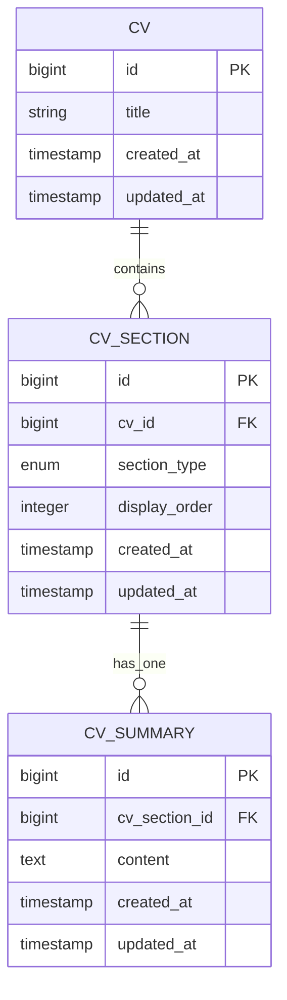
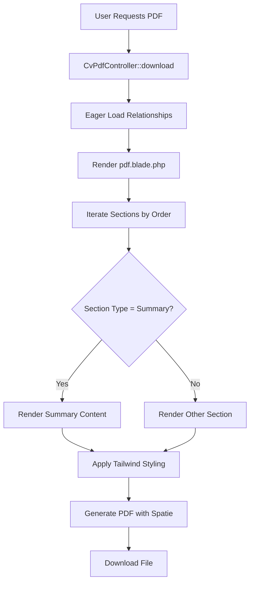

# CV Summary Section

<cite>
**Referenced Files in This Document**   
- [CvSummary.php](file://app/Models/CvSummary.php)
- [SummaryRelationManager.php](file://app/Filament/Resources/Cvs/RelationManagers/SummaryRelationManager.php)
- [cv_builder_spec.md](file://cv_builder_spec.md)
- [data-model.md](file://specs/001-cv-builder-application/data-model.md)
- [pdf.blade.php](file://resources/views/cv/pdf.blade.php)
- [Cv.php](file://app/Models/Cv.php)
</cite>

## Table of Contents
1. [Introduction](#introduction)
2. [Data Model Schema](#data-model-schema)
3. [Relationship with CV Model](#relationship-with-cv-model)
4. [Admin Interface Configuration](#admin-interface-configuration)
5. [PDF Rendering Process](#pdf-rendering-process)
6. [Rich Text and Data Sanitization](#rich-text-and-data-sanitization)
7. [CV Cloning and Versioning](#cv-cloning-and-versioning)

## Introduction
The CvSummary data model serves as a dedicated storage mechanism for the professional summary or career objective statement that appears at the top of a CV. This component is essential for providing a concise overview of a candidate's qualifications, experience, and career goals. The CvSummary is implemented as a separate model to maintain data normalization and support flexible content management within the CV structure. It is tightly integrated with the Filament admin interface for easy editing and is rendered in both the administrative dashboard and the final PDF output. The design supports cloning operations and versioning to preserve historical states when CVs are duplicated.

## Data Model Schema
The CvSummary model defines a simple yet effective schema focused on storing textual content for professional summaries. It contains a `content` field of type text, which holds the actual summary text and is marked as required in validation rules. There are no explicit character limits enforced at the database level, allowing flexibility in content length while relying on application-level constraints. The model uses standard Laravel timestamps (`created_at`, `updated_at`) for tracking modification history. The primary key is an auto-incrementing `id`, and the model includes a foreign key `cv_section_id` that establishes its relationship with the CvSection model. This design follows the polymorphic pivot pattern through the cv_sections table, enabling consistent ordering and management of different CV sections.

**Section sources**
- [CvSummary.php](file://app/Models/CvSummary.php#L7-L18)
- [data-model.md](file://specs/001-cv-builder-application/data-model.md#L145-L167)
- [cv_builder_spec.md](file://cv_builder_spec.md#L116-L119)

## Relationship with CV Model
The CvSummary maintains a one-to-one relationship with the Cv model through an intermediate CvSection entity. This relationship is established via the `cv_section_id` foreign key in the CvSummary table, which references the id in the cv_sections table. The CvSection acts as a typed pivot that connects the CV to various section types, including the summary. In the Cv model, this relationship is accessed through the `summary()` method, which uses a `hasOne` relationship with additional constraints to ensure it only retrieves sections where the `section_type` is 'summary'. This architectural pattern provides a single source of truth for section ordering through the `display_order` field in CvSection, allows easy addition of new section types without altering the CV structure, and ensures data integrity through unique constraints on the combination of `cv_id` and `section_type`.

**Diagram sources **
- [CvSection.php](file://app/Models/CvSection.php#L10-L60)
- [CvSummary.php](file://app/Models/CvSummary.php#L7-L18)
- [data-model.md](file://specs/001-cv-builder-application/data-model.md#L76-L109)

**Section sources**
- [Cv.php](file://app/Models/Cv.php#L40-L48)
- [CvSection.php](file://app/Models/CvSection.php#L25-L27)

## Admin Interface Configuration
The CvSummary is managed through the SummaryRelationManager in the Filament admin interface, which provides a dedicated section within the CV resource for editing the professional summary. The relation manager is configured to display and edit the summary content through a textarea field with 10 rows, marked as required in the form validation. It appears as a single-record display in the table view, showing the first 100 characters of the content. The form schema is minimal, focusing solely on the content field with a helper text indicating it's for the professional summary or career objective. The relation manager uses custom create and edit actions that handle the underlying CvSection creation or update logic transparently, ensuring that when a summary is created, the corresponding CvSection with `section_type` set to 'summary' is properly established.

**Section sources**
- [SummaryRelationManager.php](file://app/Filament/Resources/Cvs/RelationManagers/SummaryRelationManager.php#L16-L74)
- [cv_builder_spec.md](file://cv_builder_spec.md#L148-L152)

## PDF Rendering Process
The CvSummary content is rendered in the final PDF output through the pdf.blade.php template, which processes the CV data and generates a styled HTML document converted to PDF. During the rendering process, the controller (CvPdfController) eagerly loads all necessary relationships, including the summary through the sections relationship. In the blade template, the system iterates through all sections sorted by `display_order`, and when it encounters a section with `section_type` equal to 'summary', it renders the content within a paragraph tag. The styling applies standard paragraph formatting with appropriate line height and color. The PDF generation is handled by the Spatie Laravel-PDF package, which preserves the Tailwind CSS styling in the output, ensuring a professional appearance. The filename follows the pattern `cv-{slug}-{date}.pdf`, incorporating the CV title and current date.

**Diagram sources **
- [CvPdfController.php](file://app/Http/Controllers/CvPdfController.php#L8-L33)
- [pdf.blade.php](file://resources/views/cv/pdf.blade.php#L0-L135)

**Section sources**
- [CvPdfController.php](file://app/Http/Controllers/CvPdfController.php#L8-L33)
- [pdf.blade.php](file://resources/views/cv/pdf.blade.php#L0-L135)

## Rich Text and Data Sanitization
The CvSummary implementation does not support rich text formatting in its current configuration, storing content as plain text in the database. The Filament form uses a standard Textarea component without rich text editing capabilities, meaning users can only input plain text for the professional summary. Regarding data sanitization, the system relies on Laravel's built-in protection mechanisms to prevent XSS attacks. When the summary content is rendered in the blade template, it is automatically escaped using Blade's double curly brace syntax (`{{ }}`), which converts special characters to HTML entities. This default escaping behavior ensures that any potentially malicious scripts are displayed as plain text rather than being executed. No additional sanitization libraries or custom filtering are implemented for the summary content, as the plain text nature and automatic Blade escaping provide sufficient protection against XSS vulnerabilities.

**Section sources**
- [SummaryRelationManager.php](file://app/Filament/Resources/Cvs/RelationManagers/SummaryRelationManager.php#L16-L74)
- [pdf.blade.php](file://resources/views/cv/pdf.blade.php#L0-L135)

## CV Cloning and Versioning
When a CV is cloned, the CvSummary content is duplicated as part of a comprehensive deep copy operation that preserves all sections, skills, and formatting. The cloning process is initiated through the CV model's `cloneCv()` method, which executes within a database transaction to ensure data consistency. Before creating the new CV, the system first creates a version snapshot of the original CV by serializing its entire structure (including the summary) into JSON format and storing it in the cv_versions table with a reason such as "cloned from CV #{id}". The actual cloning involves replicating the CV record, header information, and all sections. For the summary section, the process creates a new CvSection with `section_type` 'summary' and then replicates the corresponding CvSummary record, assigning it to the new section's ID. This ensures that the cloned CV has an independent copy of the summary content, allowing for subsequent modifications without affecting the original CV. The versioning system provides historical context and enables comparison between different iterations of a CV.

**Section sources**
- [Cv.php](file://app/Models/Cv.php#L120-L221)
- [ROADMAP.md](file://ROADMAP.md#L0-L190)
- [quickstart.md](file://specs/002-roadmap-md/quickstart.md#L0-L398)