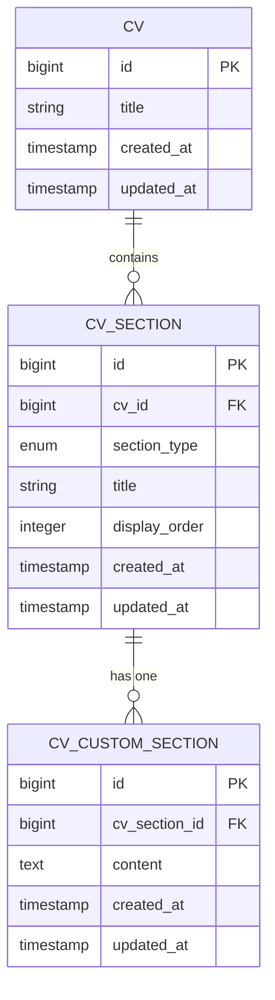
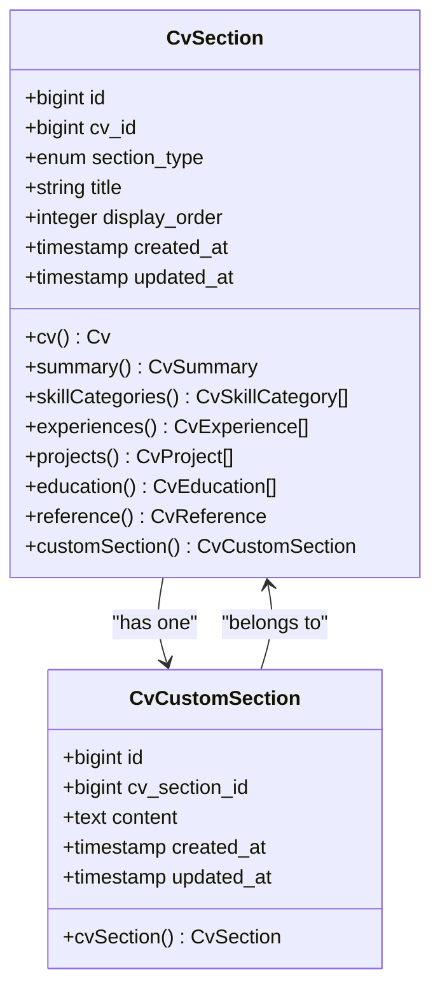
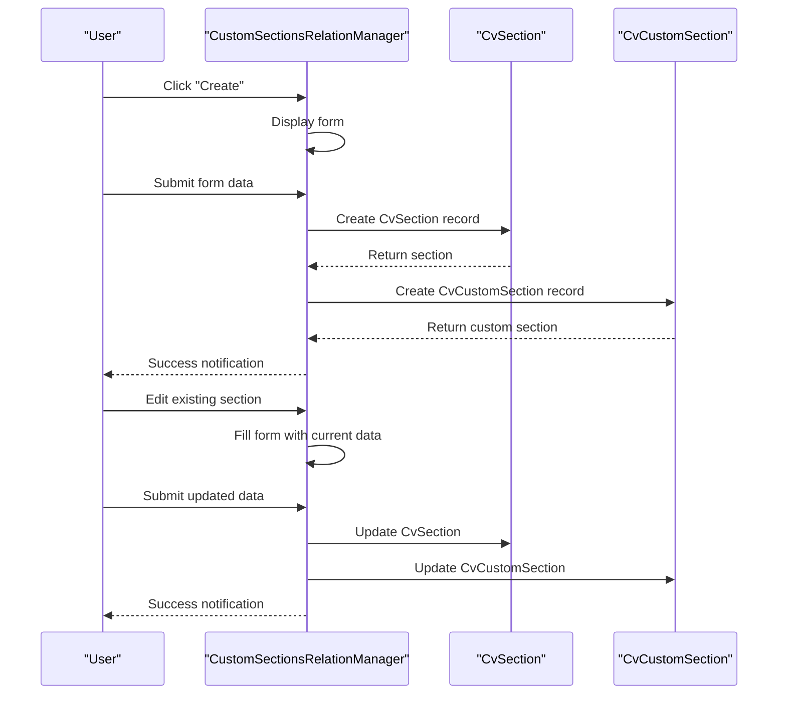

# Custom CV Sections

<cite>
**Referenced Files in This Document**   
- [CvCustomSection.php](file://app/Models/CvCustomSection.php)
- [CvSection.php](file://app/Models/CvSection.php)
- [CustomSectionsRelationManager.php](file://app/Filament/Resources/Cvs/RelationManagers/CustomSectionsRelationManager.php)
- [2025_10_03_225856_modify_cv_sections_table_for_custom_sections.php](file://database/migrations/2025_10_03_225856_modify_cv_sections_table_for_custom_sections.php)
- [2025_10_03_225951_create_cv_custom_sections_table.php](file://database/migrations/2025_10_03_225951_create_cv_custom_sections_table.php)
- [pdf.blade.php](file://resources/views/cv/pdf.blade.php)
- [show.blade.php](file://resources/views/cv/show.blade.php)
- [BaseCVSeeder.php](file://database/seeders/BaseCVSeeder.php)
</cite>

## Table of Contents
1. [Introduction](#introduction)
2. [Migration Sequence and Schema Evolution](#migration-sequence-and-schema-evolution)
3. [Data Model Architecture](#data-model-architecture)
4. [Relationship Between CvSection and CvCustomSection](#relationship-between-cvsection-and-cvcustomsection)
5. [CustomSectionsRelationManager Implementation](#customsectionsrelationmanager-implementation)
6. [Content Storage, Retrieval, and Rendering](#content-storage-retrieval-and-rendering)
7. [Use Cases and Limitations](#use-cases-and-limitations)
8. [Styling Considerations for PDF Output](#styling-considerations-for-pdf-output)

## Introduction
The Custom CV Sections feature extends the CV builder application's functionality by allowing users to create personalized sections beyond the predefined types. This document details the implementation of the `CvCustomSection` data model, its integration with the existing `CvSection` system, and the mechanisms enabling CRUD operations through the Filament interface. The solution supports flexible content creation while maintaining consistent rendering in both web and PDF formats.

## Migration Sequence and Schema Evolution
The implementation of custom sections followed a two-step migration process that evolved the existing schema. Initially, the system supported only standard section types through the `cv_sections` table. The migration sequence began by modifying the existing table to accommodate custom sections, followed by creating a dedicated table for custom section content.

The first migration removed the unique constraint on the combination of `cv_id` and `section_type`, allowing multiple sections of the same type. It also introduced a nullable `title` field to support custom section titles. The second migration created the `cv_custom_sections` table with a foreign key relationship to `cv_sections`, establishing a dedicated storage mechanism for custom content.

**Section sources**
- [2025_10_03_225856_modify_cv_sections_table_for_custom_sections.php](file://database/migrations/2025_10_03_225856_modify_cv_sections_table_for_custom_sections.php#L1-L38)
- [2025_10_03_225951_create_cv_custom_sections_table.php](file://database/migrations/2025_10_03_225951_create_cv_custom_sections_table.php#L1-L32)

## Data Model Architecture
The data model architecture employs a polymorphic pattern through the `cv_sections` table, which acts as a typed pivot for all section types. Standard sections use direct relationships from `CvSection` to their respective content models (e.g., `CvSummary`, `CvSkillCategory`), while custom sections utilize the `CvCustomSection` model for content storage.

The `CvSection` model includes a `section_type` field that supports both standard types ('header', 'summary', 'skills', etc.) and the 'custom' type. When `section_type` is 'custom', the system uses the `customSection` relationship to access the associated `CvCustomSection` record. This design maintains a single source of truth for section ordering and relationships while enabling extensibility.

**Diagram sources**
- [CvSection.php](file://app/Models/CvSection.php#L10-L60)
- [CvCustomSection.php](file://app/Models/CvCustomSection.php#L7-L18)

**Section sources**
- [CvSection.php](file://app/Models/CvSection.php#L10-L60)
- [CvCustomSection.php](file://app/Models/CvCustomSection.php#L7-L18)

## Relationship Between CvSection and CvCustomSection
The relationship between `CvSection` and `CvCustomSection` follows a one-to-one association pattern with foreign key constraints ensuring data integrity. The `CvCustomSection` model contains a `cv_section_id` field that references the primary key of `CvSection`, establishing the parent-child relationship.

The foreign key constraint is defined with cascade deletion, ensuring that when a `CvSection` record is deleted, its associated `CvCustomSection` record is automatically removed. This prevents orphaned records and maintains referential integrity. The relationship is implemented through Eloquent's `hasOne` and `belongsTo` methods, providing bidirectional access between the models.

The morph pattern is implemented through the `section_type` field in `CvSection`, which determines the appropriate content model to associate with each section. For standard sections, this is handled through conditional relationships based on the section type. For custom sections, the relationship is explicitly defined through the `customSection` method.

**Diagram sources**
- [CvSection.php](file://app/Models/CvSection.php#L10-L60)
- [CvCustomSection.php](file://app/Models/CvCustomSection.php#L7-L18)

**Section sources**
- [CvSection.php](file://app/Models/CvSection.php#L10-L60)
- [CvCustomSection.php](file://app/Models/CvCustomSection.php#L7-L18)

## CustomSectionsRelationManager Implementation
The `CustomSectionsRelationManager` enables CRUD operations for custom sections through the Filament interface. It extends the base `RelationManager` class and defines the relationship as 'sections', connecting to the `CvSection` model. The manager filters the query to include only sections with `section_type` set to 'custom' and eager loads the associated `customSection` content.

The table configuration includes columns for the section title, custom content (with truncation), and display order. The manager supports reordering through the `reorderable` method, maintaining consistency with other section types. Header actions include a custom `CreateAction` that handles the creation of both `CvSection` and `CvCustomSection` records in a single operation.

The creation form includes fields for title, content, and display order, with the display order defaulting to one more than the current maximum order value. The `using` callback creates the `CvSection` record first, then creates the associated `CvCustomSection` record with the provided content. The edit action similarly updates both records atomically, ensuring data consistency.

**Diagram sources**
- [CustomSectionsRelationManager.php](file://app/Filament/Resources/Cvs/RelationManagers/CustomSectionsRelationManager.php#L18-L115)

**Section sources**
- [CustomSectionsRelationManager.php](file://app/Filament/Resources/Cvs/RelationManagers/CustomSectionsRelationManager.php#L18-L115)

## Content Storage, Retrieval, and Rendering
Custom section content is stored in the `cv_custom_sections` table with the `content` field using the text data type to accommodate lengthy descriptions. The content is retrieved through the `customSection` relationship on `CvSection`, which is eager loaded in the relation manager to optimize performance.

In the rendering pipeline, custom sections are processed alongside standard sections during CV display. The blade templates iterate through all sections sorted by `display_order`, and when encountering a section with `section_type` of 'custom', they render the content from the associated `CvCustomSection` record. The `whitespace-pre-line` CSS class preserves line breaks in the rendered content.

The PDF generation process uses the same rendering logic, ensuring consistency between web and PDF outputs. The `pdf.blade.php` template includes specific styling for custom sections, applying the same typographic hierarchy as other content sections. During CV cloning operations, custom sections are deep copied by replicating both the `CvSection` and `CvCustomSection` records, maintaining the relationship in the cloned CV.

**Section sources**
- [show.blade.php](file://resources/views/cv/show.blade.php#L140-L143)
- [pdf.blade.php](file://resources/views/cv/pdf.blade.php#L100-L107)
- [BaseCVSeeder.php](file://database/seeders/BaseCVSeeder.php#L56-L60)

## Use Cases and Limitations
Custom sections serve several valuable use cases, including highlighting key achievements, presenting publications, listing certifications, or showcasing volunteer work. They provide flexibility for users to emphasize aspects of their professional profile that don't fit within standard categories.

The implementation has several limitations to consider. Content is stored as plain text with limited formatting options, restricting rich text capabilities. The system does not support nested content structures or media attachments within custom sections. Validation is limited to required fields, with no content-specific validation rules.

The design prioritizes simplicity and consistency over advanced features, ensuring that custom sections integrate seamlessly with the existing architecture. Users cannot create multiple custom sections with the same title within a single CV, as this could lead to confusion in the interface. The content length is constrained by database limits, though this is typically sufficient for typical CV content.

**Section sources**
- [CvCustomSection.php](file://app/Models/CvCustomSection.php#L7-L18)
- [CustomSectionsRelationManager.php](file://app/Filament/Resources/Cvs/RelationManagers/CustomSectionsRelationManager.php#L18-L115)

## Styling Considerations for PDF Output
Maintaining consistent styling in PDF output requires careful consideration of CSS compatibility and layout constraints. The application uses Tailwind CSS with specific print media queries to ensure proper rendering in the generated PDFs. The `print-color-adjust: exact` property preserves color fidelity, while the `@page` rule defines A4 dimensions with minimal margins.

Custom sections inherit the same styling as other content sections, with a consistent typographic hierarchy. The section header includes a decorative bottom border in the accent color, creating visual continuity with standard sections. Text content uses the same font family, size, and line height as other sections, ensuring uniform readability.

The rendering process handles whitespace preservation through the `whitespace-pre-line` class, which maintains line breaks from the source content while collapsing unnecessary whitespace. This allows users to format their content with paragraph breaks without introducing excessive spacing in the final output. The PDF generation service processes these styles through Laravel's PDF rendering engine, producing professional-looking documents that maintain the application's visual identity.

**Section sources**
- [show.blade.php](file://resources/views/cv/show.blade.php#L140-L143)
- [pdf.blade.php](file://resources/views/cv/pdf.blade.php#L100-L107)
