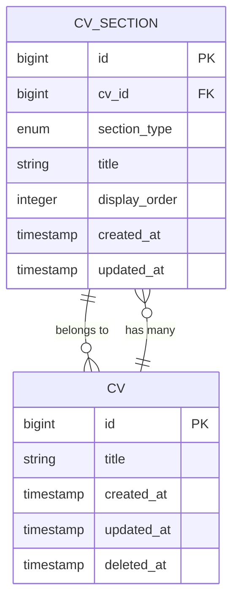
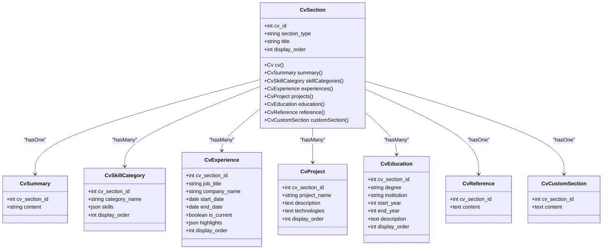
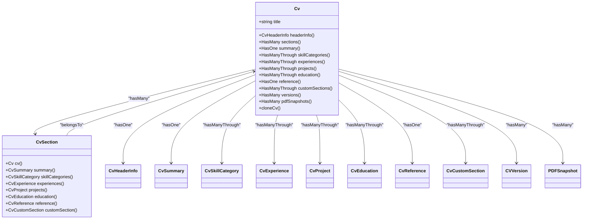
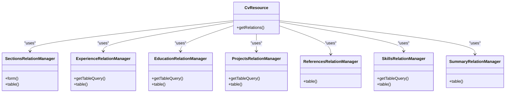
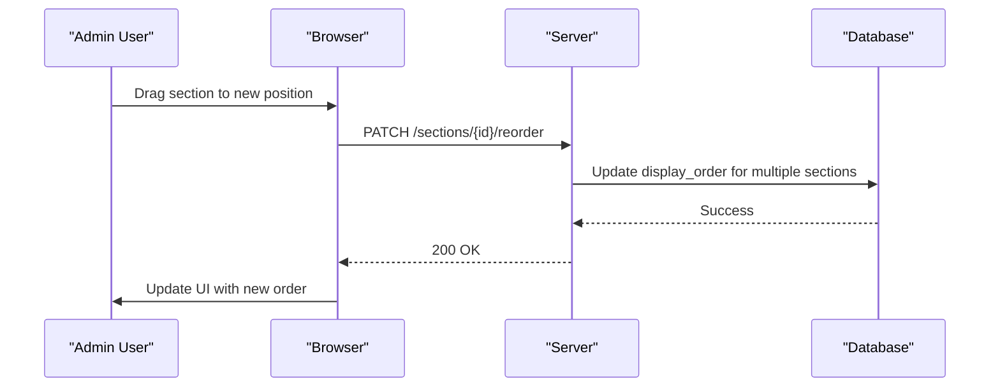
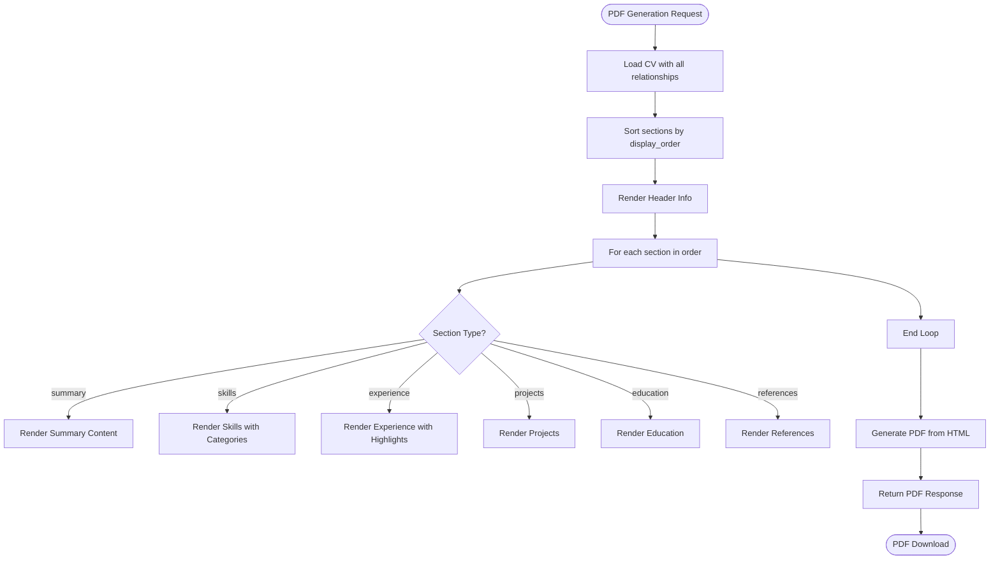

# Standard CV Sections

<cite>
**Referenced Files in This Document**   
- [CvSection.php](file://app/Models/CvSection.php)
- [cv_sections_table.php](file://database/migrations/2025_10_03_201651_create_cv_sections_table.php)
- [Cv.php](file://app/Models/Cv.php)
- [pdf.blade.php](file://resources/views/cv/pdf.blade.php)
- [CvPdfController.php](file://app/Http/Controllers/CvPdfController.php)
- [CvResource.php](file://app/Filament/Resources/Cvs/CvResource.php)
- [SectionsRelationManager.php](file://app/Filament/Resources/Cvs/RelationManagers/SectionsRelationManager.php)
- [ExperienceRelationManager.php](file://app/Filament/Resources/Cvs/RelationManagers/ExperienceRelationManager.php)
- [EducationRelationManager.php](file://app/Filament/Resources/Cvs/RelationManagers/EducationRelationManager.php)
- [ProjectsRelationManager.php](file://app/Filament/Resources/Cvs/RelationManagers/ProjectsRelationManager.php)
- [ReferencesRelationManager.php](file://app/Filament/Resources/Cvs/RelationManagers/ReferencesRelationManager.php)
- [SkillsRelationManager.php](file://app/Filament/Resources/Cvs/RelationManagers/SkillsRelationManager.php)
- [SummaryRelationManager.php](file://app/Filament/Resources/Cvs/RelationManagers/SummaryRelationManager.php)
</cite>

## Table of Contents
1. [Introduction](#introduction)
2. [CvSection Data Model](#cvsection-data-model)
3. [Standard Section Types](#standard-section-types)
4. [Eloquent Relationships](#eloquent-relationships)
5. [Filament Relation Managers](#filament-relation-managers)
6. [Section Ordering and Reordering](#section-ordering-and-reordering)
7. [PDF Rendering](#pdf-rendering)
8. [Data Integrity](#data-integrity)
9. [Conclusion](#conclusion)

## Introduction

The CV Builder application implements a flexible, polymorphic data model centered around the `CvSection` entity, which acts as a container for ordered content blocks within a CV. This design enables the system to support multiple standard section types—Experience, Education, Skills, Projects, and References—while maintaining a consistent interface for ordering and management. The architecture leverages Laravel's Eloquent ORM and Filament's admin panel to provide a seamless user experience for creating, editing, and reordering sections through a drag-and-drop interface. This document details the schema, relationships, and implementation of the `CvSection` model and its associated components, explaining how sections are structured, managed, and rendered in both the admin panel and PDF output.

## CvSection Data Model

The `CvSection` model serves as the core polymorphic pivot that defines section types and their ordering within a CV. It acts as a typed container that links a CV to its various content sections while enforcing data integrity through database constraints.

**Diagram sources**  
- [CvSection.php](file://app/Models/CvSection.php#L10-L60)
- [cv_sections_table.php](file://database/migrations/2025_10_03_201651_create_cv_sections_table.php#L15-L25)

The `cv_sections` table contains the following key fields:
- `id`: Primary key
- `cv_id`: Foreign key to the `cvs` table, with cascade-on-delete
- `section_type`: Enum field defining the section type (header, summary, skills, experience, projects, education, references, custom)
- `title`: Display title for the section
- `display_order`: Unsigned integer used for ordering sections
- `created_at`, `updated_at`: Timestamps

The table includes critical database constraints:
- A composite index on `(cv_id, display_order)` for efficient ordering queries
- A unique constraint on `(cv_id, section_type)` ensuring only one section of each type per CV
- A foreign key constraint on `cv_id` with cascade deletion

**Section sources**  
- [CvSection.php](file://app/Models/CvSection.php#L10-L60)
- [cv_sections_table.php](file://database/migrations/2025_10_03_201651_create_cv_sections_table.php#L15-L25)

## Standard Section Types

The system supports several standard section types, each with specific content models and relationships. The `CvSection` model uses polymorphic relationships to connect to these specialized content models based on the `section_type` field.

**Diagram sources**  
- [CvSection.php](file://app/Models/CvSection.php#L10-L60)
- [CvSummary.php](file://app/Models/CvSummary.php#L7-L18)
- [CvSkillCategory.php](file://app/Models/CvSkillCategory.php#L7-L24)
- [CvExperience.php](file://app/Models/CvExperience.php#L7-L33)
- [CvProject.php](file://app/Models/CvProject.php#L7-L22)
- [CvEducation.php](file://app/Models/CvEducation.php#L7-L23)
- [CvReference.php](file://app/Models/CvReference.php#L7-L18)
- [CvCustomSection.php](file://app/Models/CvCustomSection.php#L7-L18)

The standard section types include:
- **Summary**: Contains a single text field for a professional summary
- **Skills**: Organized into categories with JSON arrays of skills
- **Experience**: Multiple job experiences with dates and highlight bullet points (JSON array)
- **Projects**: Side projects with descriptions and technologies used
- **Education**: Academic history with degrees and institutions
- **References**: Text field for reference information
- **Custom**: User-defined sections with free-form content

Each section type has its own model that stores the specific content, while the `CvSection` provides the container and ordering mechanism.

**Section sources**  
- [CvSection.php](file://app/Models/CvSection.php#L10-L60)
- [cv_builder_spec.md](file://cv_builder_spec.md#L57-L92)

## Eloquent Relationships

The Eloquent relationships between `Cv` and its sections are designed to provide both direct access to section content and efficient querying through the `CvSection` pivot.

**Diagram sources**  
- [Cv.php](file://app/Models/Cv.php#L25-L221)
- [CvSection.php](file://app/Models/CvSection.php#L10-L60)

The `Cv` model defines several relationship methods:
- `sections()`: Returns all `CvSection` instances ordered by `display_order`
- `summary()`: Returns the summary content through the section relationship
- `skillCategories()`: Uses `hasManyThrough` to access skill categories via the section
- `experiences()`: Similarly accesses experiences through the section
- `projects()`: Accesses projects through the section
- `education()`: Accesses education records through the section
- `reference()`: Returns the reference content through the section
- `customSections()`: Accesses custom sections through the section

The `cloneCv()` method implements a transactional deep copy of a CV, creating a version snapshot and replicating all sections and their associated content. This ensures data integrity during cloning operations.

**Section sources**  
- [Cv.php](file://app/Models/Cv.php#L25-L221)

## Filament Relation Managers

The Filament admin panel uses Relation Managers to provide a user-friendly interface for managing each section type. These managers handle the creation, editing, and reordering of sections through the `CvSection` model.

**Diagram sources**  
- [CvResource.php](file://app/Filament/Resources/Cvs/CvResource.php#L16-L53)
- [SectionsRelationManager.php](file://app/Filament/Resources/Cvs/RelationManagers/SectionsRelationManager.php#L14-L65)
- [ExperienceRelationManager.php](file://app/Filament/Resources/Cvs/RelationManagers/ExperienceRelationManager.php#L21-L144)
- [EducationRelationManager.php](file://app/Filament/Resources/Cvs/RelationManagers/EducationRelationManager.php#L18-L120)
- [ProjectsRelationManager.php](file://app/Filament/Resources/Cvs/RelationManagers/ProjectsRelationManager.php#L18-L110)
- [ReferencesRelationManager.php](file://app/Filament/Resources/Cvs/RelationManagers/ReferencesRelationManager.php#L16-L75)
- [SkillsRelationManager.php](file://app/Filament/Resources/Cvs/RelationManagers/SkillsRelationManager.php#L18-L108)
- [SummaryRelationManager.php](file://app/Filament/Resources/Cvs/RelationManagers/SummaryRelationManager.php#L16-L74)

The `CvResource` defines the main interface for managing CVs and includes all section Relation Managers in its `getRelations()` method. Each Relation Manager:
- Uses `CvSection` as the relationship source
- Implements `getTableQuery()` to ensure the correct section type exists
- Provides a table interface with reorderable rows
- Handles creation and editing of section content
- Manages the relationship between `CvSection` and the specific content model

For example, the `ExperienceRelationManager` ensures a section of type 'experience' exists before querying `CvExperience` records, creating it with a default display order if necessary.

**Section sources**  
- [CvResource.php](file://app/Filament/Resources/Cvs/CvResource.php#L16-L53)
- [ExperienceRelationManager.php](file://app/Filament/Resources/Cvs/RelationManagers/ExperienceRelationManager.php#L21-L144)
- [EducationRelationManager.php](file://app/Filament/Resources/Cvs/RelationManagers/EducationRelationManager.php#L18-L120)
- [ProjectsRelationManager.php](file://app/Filament/Resources/Cvs/RelationManagers/ProjectsRelationManager.php#L18-L110)
- [ReferencesRelationManager.php](file://app/Filament/Resources/Cvs/RelationManagers/ReferencesRelationManager.php#L16-L75)
- [SkillsRelationManager.php](file://app/Filament/Resources/Cvs/RelationManagers/SkillsRelationManager.php#L18-L108)
- [SummaryRelationManager.php](file://app/Filament/Resources/Cvs/RelationManagers/SummaryRelationManager.php#L16-L74)

## Section Ordering and Reordering

Section ordering is preserved and managed through the `display_order` field in the `CvSection` model. The system supports drag-and-drop reordering in the admin panel through Filament's built-in reorderable table functionality.

**Diagram sources**  
- [SectionsRelationManager.php](file://app/Filament/Resources/Cvs/RelationManagers/SectionsRelationManager.php#L14-L65)
- [CvSection.php](file://app/Models/CvSection.php#L10-L60)

The `SectionsRelationManager` enables reordering through the `reorderable('display_order')` method in the table configuration. When a user drags a section to a new position, Filament sends a request to update the `display_order` values for the affected sections. The database index on `(cv_id, display_order)` ensures efficient queries when retrieving sections in order.

The `Cv` model's `sections()` relationship includes `->orderBy('display_order')` to ensure sections are always retrieved in the correct order. This ordering is preserved when the CV is rendered in the PDF output.

**Section sources**  
- [SectionsRelationManager.php](file://app/Filament/Resources/Cvs/RelationManagers/SectionsRelationManager.php#L14-L65)
- [Cv.php](file://app/Models/Cv.php#L30-L33)

## PDF Rendering

The PDF output renders all CV sections sequentially based on their `display_order` value. The rendering process uses Laravel's PDF generation capabilities to convert the Blade template into a styled PDF document.

**Diagram sources**  
- [CvPdfController.php](file://app/Http/Controllers/CvPdfController.php#L10-L34)
- [pdf.blade.php](file://resources/views/cv/pdf.blade.php#L1-L135)

The `CvPdfController` handles PDF generation by:
1. Eager loading all necessary relationships to avoid N+1 queries
2. Passing the fully loaded CV to the Blade view
3. Using Spatie Laravel-PDF to generate the PDF from the HTML

The `pdf.blade.php` template iterates through the sections in `display_order` and renders each section according to its type. The template uses Tailwind CSS for styling, which is preserved in the PDF output.

**Section sources**  
- [CvPdfController.php](file://app/Http/Controllers/CvPdfController.php#L10-L34)
- [pdf.blade.php](file://resources/views/cv/pdf.blade.php#L1-L135)

## Data Integrity

The system maintains data integrity through several mechanisms, including database constraints, transactional operations, and proper relationship management.

The unique constraint on `(cv_id, section_type)` ensures that each CV can have only one section of each type, preventing duplicate sections. The foreign key constraint with cascade deletion ensures that when a CV is deleted, all its sections are also removed.

The `cloneCv()` method in the `Cv` model uses a database transaction to ensure that either all operations succeed or none do. This prevents partial cloning that could lead to inconsistent data. The method creates a version snapshot before cloning, preserving the original state.

When reordering sections, the system updates multiple `display_order` values in a single operation, maintaining consistency. The use of unsigned integers for `display_order` prevents negative values that could disrupt sorting.

**Section sources**  
- [Cv.php](file://app/Models/Cv.php#L150-L221)
- [cv_sections_table.php](file://database/migrations/2025_10_03_201651_create_cv_sections_table.php#L15-L25)

## Conclusion

The `CvSection` data model provides a flexible and robust foundation for managing ordered content blocks within CVs. By acting as a polymorphic container, it enables the system to support multiple standard section types while maintaining a consistent interface for ordering and management. The integration with Filament's Relation Managers provides an intuitive admin interface with drag-and-drop reordering, while the Eloquent relationships ensure efficient data access and integrity. The PDF rendering process faithfully preserves the section order and content structure, producing professional output that reflects the user's organization. This architecture balances flexibility with data integrity, allowing for easy extension with new section types while maintaining a clean and consistent user experience.