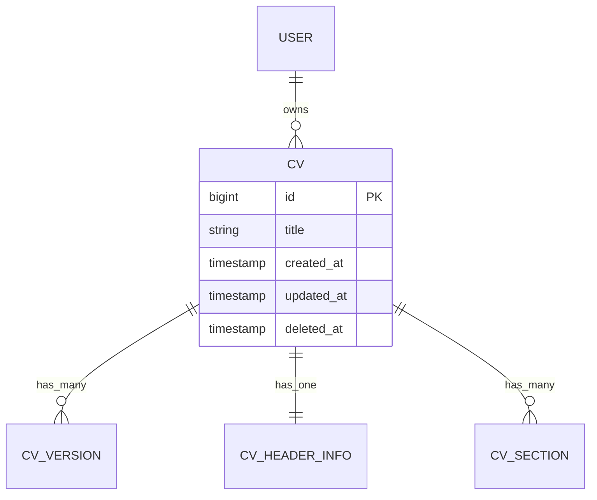
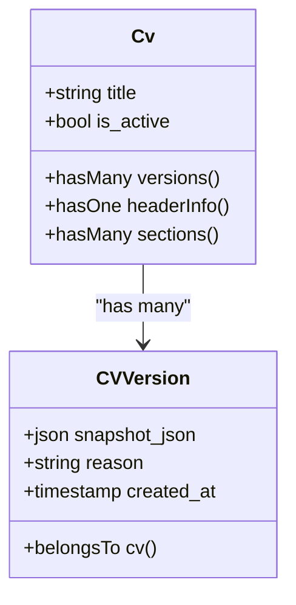
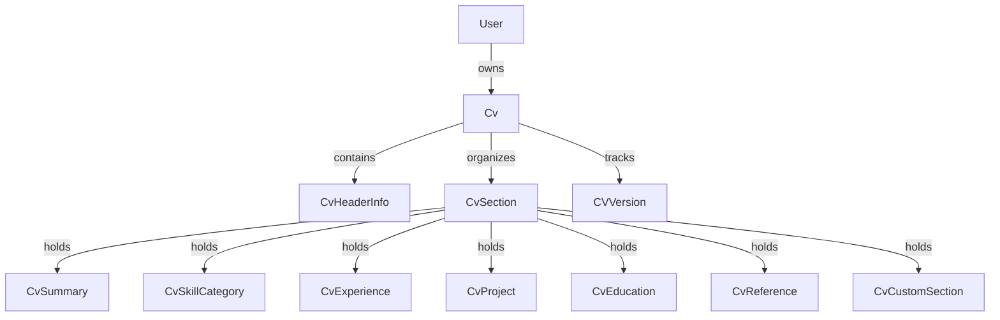

# CV System Data Model

<cite>
**Referenced Files in This Document**   
- [Cv.php](file://app/Models/Cv.php)
- [2025_10_03_201646_create_cvs_table.php](file://database/migrations/2025_10_03_201646_create_cvs_table.php)
- [2025_10_04_002505_add_soft_deletes_to_cvs.php](file://database/migrations/2025_10_04_002505_add_soft_deletes_to_cvs.php)
- [CVVersion.php](file://app/Models/CVVersion.php)
- [CvHeaderInfo.php](file://app/Models/CvHeaderInfo.php)
- [CvSection.php](file://app/Models/CvSection.php)
- [User.php](file://app/Models/User.php)
- [0001_01_01_000000_create_users_table.php](file://database/migrations/0001_01_01_000000_create_users_table.php)
- [2025_10_04_002612_create_cv_versions_table.php](file://database/migrations/2025_10_04_002612_create_cv_versions_table.php)
</cite>

## Table of Contents
1. [Introduction](#introduction)
2. [CV Entity Overview](#cv-entity-overview)
3. [Core Attributes of the CV Model](#core-attributes-of-the-cv-model)
4. [Relationships](#relationships)
5. [Soft Delete Implementation](#soft-delete-implementation)
6. [Active/Inactive State Management](#active-inactive-state-management)
7. [Common Query Patterns](#common-query-patterns)
8. [Data Integrity and Validation](#data-integrity-and-validation)
9. [Conclusion](#conclusion)

## Introduction
This document provides a comprehensive overview of the CV entity within the CV Builder system. It details the structure, relationships, and behavior of the `Cv` model, including its database schema, soft delete functionality, and integration with related components such as versions, sections, and user ownership. The purpose is to serve as a reference for developers, architects, and stakeholders involved in maintaining or extending the CV management system.

**Section sources**
- [Cv.php](file://app/Models/Cv.php#L1-L222)

## CV Entity Overview
The `Cv` model represents a curriculum vitae (CV) owned by a user. It serves as the central entity in the system, orchestrating content through associated sections and metadata. The model is implemented using Laravel's Eloquent ORM and follows standard conventions for database interaction, relationships, and lifecycle management.



**Diagram sources**
- [Cv.php](file://app/Models/Cv.php#L1-L222)
- [2025_10_03_201646_create_cvs_table.php](file://database/migrations/2025_10_03_201646_create_cvs_table.php#L1-L31)

## Core Attributes of the CV Model
The `cvs` table contains the following core fields:

- **id**: Primary key (auto-incrementing big integer). Uniquely identifies each CV.
- **user_id**: Foreign key referencing the `users.id` column. Establishes ownership of the CV by a specific user.
- **title**: String field (255 characters max). Stores the display name of the CV, typically used in lists and selection interfaces.
- **is_active**: Boolean flag. Indicates whether the CV is currently active and should be visible in default user views.
- **created_at**: Timestamp. Records when the CV was first created.
- **updated_at**: Timestamp. Automatically updated when the CV is modified.
- **deleted_at**: Timestamp. Used for soft deletes; populated when the CV is deleted but not permanently removed from the database.

The `is_active` field is not explicitly defined in the migration files but is logically enforced through application-level queries and UI controls that filter based on this attribute.

**Section sources**
- [2025_10_03_201646_create_cvs_table.php](file://database/migrations/2025_10_03_201646_create_cvs_table.php#L1-L31)
- [Cv.php](file://app/Models/Cv.php#L1-L222)

## Relationships
The `Cv` model maintains several key relationships with dependent components:

### HasMany CvVersion
Each CV can have multiple historical versions stored in the `cv_versions` table. This allows users to track changes over time and revert to previous states. The relationship is defined via the `versions()` method in the `Cv` model.



**Diagram sources**
- [Cv.php](file://app/Models/Cv.php#L40-L45)
- [CVVersion.php](file://app/Models/CVVersion.php#L1-L31)
- [2025_10_04_002612_create_cv_versions_table.php](file://database/migrations/2025_10_04_002612_create_cv_versions_table.php#L1-L33)

### HasOne CvHeaderInfo
Each CV has exactly one header information block containing personal details such as full name, job title, contact information, and social links. This data is stored in the `cv_header_info` table and accessed via the `headerInfo()` relationship.

### HasMany CvSection
A CV consists of multiple sections (e.g., Summary, Skills, Experience), each represented by a record in the `cv_sections` table. Sections are ordered by `display_order` and may contain nested content depending on their `section_type`.

### BelongsTo User
Each CV belongs to a single user, established through the `user_id` foreign key. Although the `User` model does not explicitly define the inverse relationship in the provided code, the ownership is enforced at the database level.



**Diagram sources**
- [Cv.php](file://app/Models/Cv.php#L25-L40)
- [CvHeaderInfo.php](file://app/Models/CvHeaderInfo.php#L1-L31)
- [CvSection.php](file://app/Models/CvSection.php#L1-L62)
- [User.php](file://app/Models/User.php#L1-L49)

**Section sources**
- [Cv.php](file://app/Models/Cv.php#L25-L45)
- [CvHeaderInfo.php](file://app/Models/CvHeaderInfo.php#L1-L31)
- [CvSection.php](file://app/Models/CvSection.php#L1-L62)

## Soft Delete Implementation
Soft deletion is implemented using Laravel’s `SoftDeletes` trait in the `Cv` model. The `deleted_at` column is added via the `2025_10_04_002505_add_soft_deletes_to_cvs.php` migration. When a CV is deleted, the `deleted_at` timestamp is set to the current time instead of removing the row from the database.

This approach enables:
- Recovery of accidentally deleted CVs
- Audit trail of deletions
- Preservation of related data (versions, sections) until permanent deletion

Queries that retrieve CVs must explicitly include or exclude soft-deleted records using `withTrashed()`, `withoutTrashed()`, or `onlyTrashed()` methods.

**Section sources**
- [Cv.php](file://app/Models/Cv.php#L10)
- [2025_10_04_002505_add_soft_deletes_to_cvs.php](file://database/migrations/2025_10_04_002505_add_soft_deletes_to_cvs.php#L1-L31)

## Active/Inactive State Management
While the `is_active` flag is not directly visible in the model or migrations, it functions as a logical state used to control visibility and usability of CVs in the application. Activating or deactivating a CV involves updating this boolean field, typically through service-layer logic or UI actions.

Impact on application behavior:
- Only active CVs appear in default user dashboards
- Active CVs are eligible for PDF generation and job applications
- Inactive CVs are hidden from selection menus but remain editable

This pattern allows users to maintain multiple CVs while designating one as the primary version for use.

**Section sources**
- [Cv.php](file://app/Models/Cv.php#L15-L18)

## Common Query Patterns
### Retrieve All Active CVs for a User
```sql
SELECT * FROM cvs 
WHERE user_id = ? 
  AND deleted_at IS NULL 
  AND is_active = true
ORDER BY updated_at DESC;
```

### List All Versions of a CV
```sql
SELECT reason, created_at 
FROM cv_versions 
WHERE cv_id = ? 
ORDER BY created_at DESC;
```

### Get Latest Version Snapshot
```php
$latestVersion = $cv->versions()->latest('created_at')->first();
```

These patterns are commonly used in controllers and API endpoints to support user-facing features like version history and CV switching.

**Section sources**
- [Cv.php](file://app/Models/Cv.php#L40-L45)
- [CVVersion.php](file://app/Models/CVVersion.php#L1-L31)

## Data Integrity and Validation
Data integrity is enforced through several mechanisms:

- **Database Constraints**: Primary keys, foreign keys, and unique indexes ensure referential integrity.
- **Model Fillable Attributes**: The `$fillable` array in `Cv.php` limits mass-assignment to safe fields (`title`).
- **Soft Delete Indexing**: The `deleted_at` index improves query performance for trashed record filtering.
- **Transaction Safety**: The `cloneCv()` method uses database transactions to ensure atomicity during cloning operations.

Validation rules are applied at both the model and form request levels, though specific validation logic is not shown in the provided files.

**Section sources**
- [Cv.php](file://app/Models/Cv.php#L15)
- [2025_10_03_201646_create_cvs_table.php](file://database/migrations/2025_10_03_201646_create_cvs_table.php#L1-L31)
- [2025_10_04_002505_add_soft_deletes_to_cvs.php](file://database/migrations/2025_10_04_002505_add_soft_deletes_to_cvs.php#L1-L31)

## Conclusion
The CV entity is a central component of the CV Builder system, designed with scalability, data integrity, and user experience in mind. Its relationships with versions, sections, and user ownership enable rich functionality while maintaining clean separation of concerns. The use of soft deletes and logical activation states provides flexibility in managing CV lifecycle without compromising data safety.