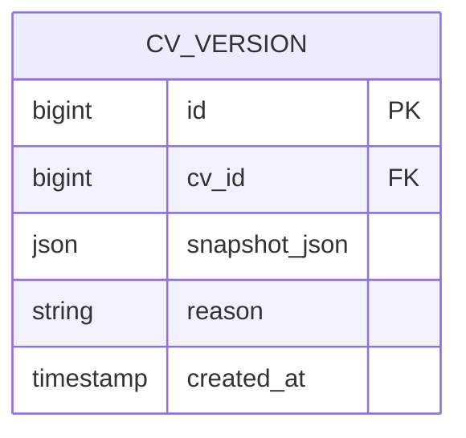
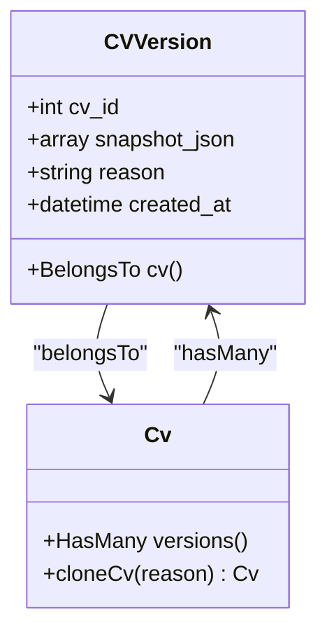
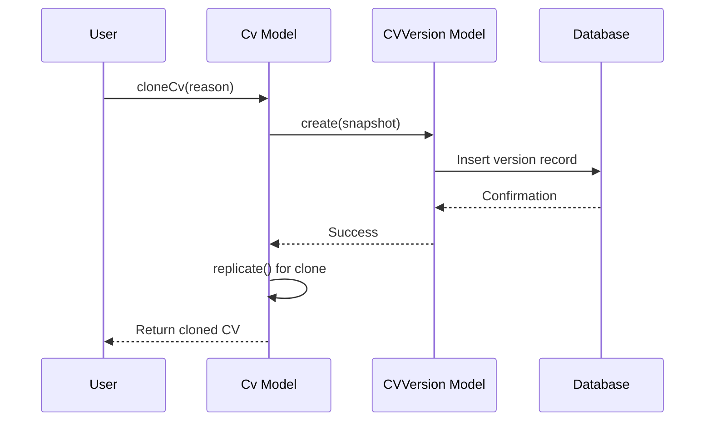

# CV Versioning Data Model

<cite>
**Referenced Files in This Document**   
- [CVVersion.php](file://app/Models/CVVersion.php)
- [Cv.php](file://app/Models/Cv.php)
- [create_cv_versions_table.php](file://database/migrations/2025_10_04_002612_create_cv_versions_table.php)
- [CVVersionResource.php](file://app/Filament/Resources/CVVersions/CVVersionResource.php)
- [CVVersionForm.php](file://app/Filament/Resources/CVVersions/Schemas/CVVersionForm.php)
- [CVVersionInfolist.php](file://app/Filament/Resources/CVVersions/Schemas/CVVersionInfolist.php)
- [CvCloningTest.php](file://tests/Feature/CvCloningTest.php)
</cite>

## Table of Contents
1. [Introduction](#introduction)
2. [Core Fields and Data Structure](#core-fields-and-data-structure)
3. [Relationships and Constraints](#relationships-and-constraints)
4. [Business Rules and Immutability](#business-rules-and-immutability)
5. [JSON Serialization and Storage](#json-serialization-and-storage)
6. [Indexing and Query Performance](#indexing-and-query-performance)
7. [Version Comparison and Restoration](#version-comparison-and-restoration)
8. [Usage Examples](#usage-examples)

## Introduction
The CVVersion model provides a comprehensive versioning system for tracking historical changes to CVs within the application. It captures immutable snapshots of CV states at specific points in time, enabling users to maintain a complete audit trail of modifications, support rollback scenarios, and preserve data integrity during critical operations such as cloning. The model stores complete CV state as JSON payloads with metadata about creation context and timestamps.

**Section sources**
- [CVVersion.php](file://app/Models/CVVersion.php#L1-L38)
- [create_cv_versions_table.php](file://database/migrations/2025_10_04_002612_create_cv_versions_table.php#L1-L31)

## Core Fields and Data Structure
The CVVersion model contains essential fields that capture both the state of the CV and contextual metadata about the version creation.

| Field | Type | Description |
|-------|------|-------------|
| cv_id | bigint | Foreign key referencing the parent CV |
| data (snapshot_json) | json | Complete serialized state of the CV |
| created_by | N/A | Not directly stored; derived from context |
| created_at | timestamp | When the version was created |
| reason | string | Purpose for creating the version snapshot |

The `data` field, implemented as `snapshot_json` in the database, stores the complete state of the CV as a JSON blob. This approach enables capturing the entire structure, content, and relationships of the CV at the moment of snapshot creation. The field is cast to an array in the Eloquent model, allowing Laravel to automatically handle JSON serialization and deserialization.



**Diagram sources**
- [create_cv_versions_table.php](file://database/migrations/2025_10_04_002612_create_cv_versions_table.php#L1-L31)

**Section sources**
- [CVVersion.php](file://app/Models/CVVersion.php#L15-L18)
- [create_cv_versions_table.php](file://database/migrations/2025_10_04_002612_create_cv_versions_table.php#L1-L31)

## Relationships and Constraints
The CVVersion model establishes a one-to-many relationship with the CV model, where each CV can have multiple version snapshots. This relationship is enforced through database constraints and Eloquent model definitions.



**Diagram sources**
- [CVVersion.php](file://app/Models/CVVersion.php#L7-L38)
- [Cv.php](file://app/Models/Cv.php#L250-L342)

**Section sources**
- [CVVersion.php](file://app/Models/CVVersion.php#L30-L38)
- [Cv.php](file://app/Models/Cv.php#L250-L258)

The database schema enforces referential integrity through a foreign key constraint on the `cv_id` field with cascade deletion. When a CV is deleted, all associated versions are automatically removed from the system. This ensures data consistency and prevents orphaned version records. The relationship is bidirectional, allowing navigation from a CV to its versions and from a version back to its parent CV.

## Business Rules and Immutability
The CV versioning system enforces strict immutability rules to ensure the integrity of historical snapshots. Once a version is created, it cannot be modified through standard application workflows. This immutability is enforced through several mechanisms:

1. **Application Logic**: The system is designed to create versions as append-only records
2. **UI Restrictions**: The Filament admin interface limits operations on existing versions
3. **Database Constraints**: No update triggers or procedures modify existing version data

The primary mechanism for version creation is through the `cloneCv` method in the Cv model, which automatically creates a snapshot before cloning. This process occurs within a database transaction, ensuring atomicity of the version creation and cloning operations.



**Diagram sources**
- [Cv.php](file://app/Models/Cv.php#L300-L340)
- [CVVersion.php](file://app/Models/CVVersion.php#L20-L25)

**Section sources**
- [Cv.php](file://app/Models/Cv.php#L300-L340)

## JSON Serialization and Storage
The `snapshot_json` field uses JSON serialization to store the complete state of a CV at the time of snapshot creation. This approach provides several advantages:

- **Schema Flexibility**: Changes to the CV structure don't require version table schema changes
- **Complete State Capture**: All related data is included in a single atomic payload
- **Performance**: Reduces the need for complex joins when retrieving historical states

The serialization process uses Laravel's `toArray()` method on the CV model, which recursively converts the model and its loaded relationships to array format. This includes all sections, skills, experiences, education, and other content components.

Storage considerations include:
- **Payload Size**: Large CVs with extensive content can result in significant storage requirements
- **Compression**: JSON data is stored in raw format without compression
- **Retrieval Performance**: Complete snapshots are loaded into memory when accessed

**Section sources**
- [CVVersion.php](file://app/Models/CVVersion.php#L20-L24)
- [Cv.php](file://app/Models/Cv.php#L300-L340)

## Indexing and Query Performance
The cv_versions table is optimized for efficient chronological retrieval through strategic indexing. The primary index is created on the `cv_id` column, enabling fast lookups of version history for a specific CV.

```sql
CREATE INDEX cv_versions_cv_id_index ON cv_versions (cv_id);
```

This index supports common query patterns such as:
- Retrieving all versions for a specific CV
- Counting the number of versions for a CV
- Finding the most recent version of a CV

The `created_at` field is used for sorting versions chronologically, with the most recent versions appearing first. While there is no dedicated index on `created_at`, the combination of filtering by `cv_id` and sorting by `created_at` provides efficient performance for version history queries.

**Section sources**
- [create_cv_versions_table.php](file://database/migrations/2025_10_04_002612_create_cv_versions_table.php#L16-L18)
- [CVVersionsTable.php](file://app/Filament/Resources/CVVersions/Tables/CVVersionsTable.php#L11-L39)

## Version Comparison and Restoration
The versioning system supports comparison of different CV states by examining the `snapshot_json` field. Users can identify changes between versions by analyzing differences in the JSON structure and content.

For restoration scenarios, the system allows users to:
1. Navigate to the CV versions list
2. Select a historical version
3. Examine the snapshot data
4. Create a new CV based on the historical state

While direct restoration functionality is not implemented, the complete snapshot data enables manual recreation of previous states. The version reason field provides context for why a particular snapshot was created, aiding in the selection of appropriate restoration points.

**Section sources**
- [CVVersionInfolist.php](file://app/Filament/Resources/CVVersions/Schemas/CVVersionInfolist.php#L7-L86)
- [CVVersionForm.php](file://app/Filament/Resources/CVVersions/Schemas/CVVersionForm.php#L10-L62)

## Usage Examples
The following examples demonstrate common queries for working with the CV versioning system:

**List version history for a CV:**
```php
$cv = Cv::find($cvId);
$versions = $cv->versions()->orderBy('created_at', 'desc')->get();
```

**Retrieve a specific version:**
```php
$version = CVVersion::where('cv_id', $cvId)
    ->where('created_at', $timestamp)
    ->first();
```

**Restore from a specific version:**
```php
$version = CVVersion::find($versionId);
$snapshotData = $version->snapshot_json;

// Create new CV with snapshot data
$newCv = Cv::create([
    'title' => $snapshotData['title'] . ' (Restored)',
    // Additional restoration logic
]);
```

**Find versions by reason:**
```php
$versions = CVVersion::where('cv_id', $cvId)
    ->where('reason', 'like', '%cloned%')
    ->orderBy('created_at')
    ->get();
```

**Section sources**
- [Cv.php](file://app/Models/Cv.php#L250-L342)
- [CVVersion.php](file://app/Models/CVVersion.php#L7-L38)
- [CvCloningTest.php](file://tests/Feature/CvCloningTest.php#L36-L67)