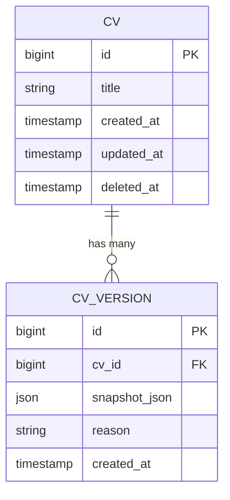
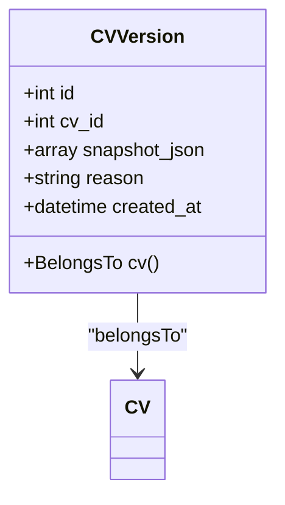
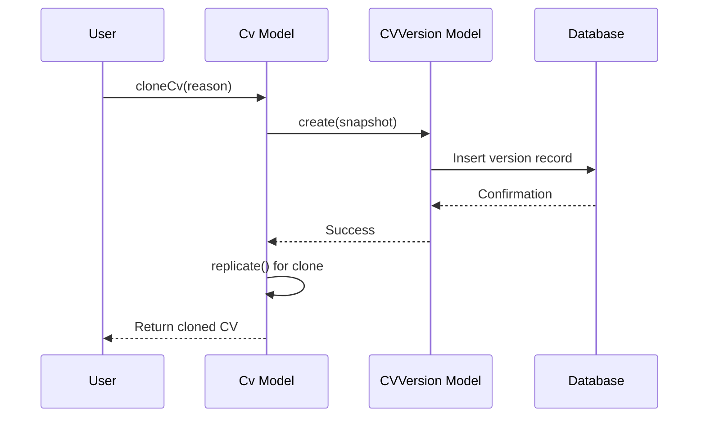
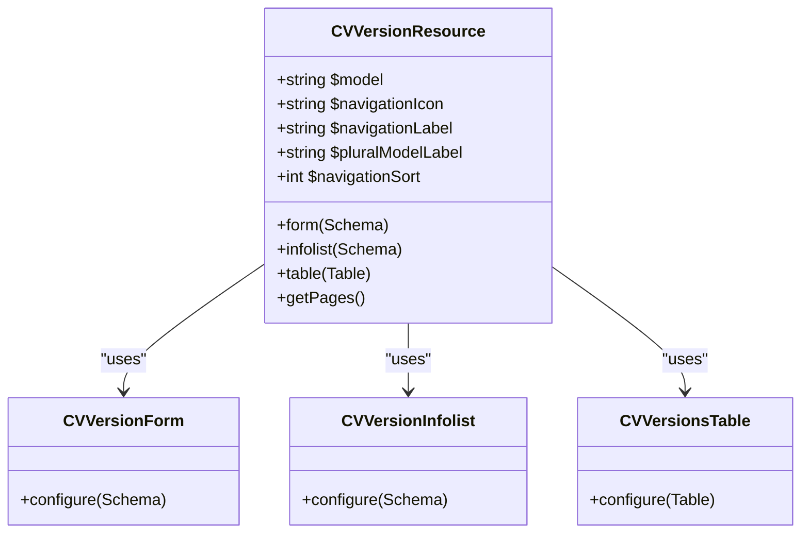
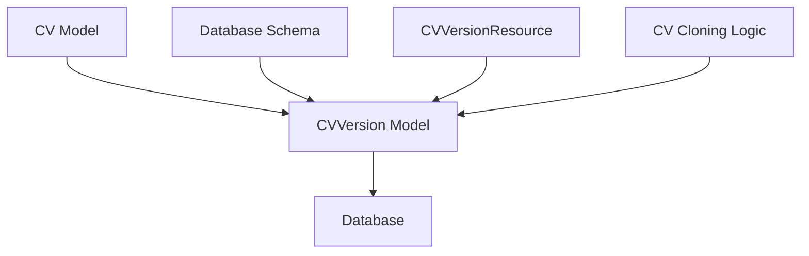

# CV Versioning System

<cite>
**Referenced Files in This Document**   
- [CVVersion.php](file://app/Models/CVVersion.php) - *Core model for CV snapshots*
- [create_cv_versions_table.php](file://database/migrations/2025_10_04_002612_create_cv_versions_table.php) - *Database schema definition*
- [Cv.php](file://app/Models/Cv.php) - *Main CV model with versioning logic*
- [CVVersionResource.php](file://app/Filament/Resources/CVVersions/CVVersionResource.php) - *Filament admin interface*
- [CVVersionForm.php](file://app/Filament/Resources/CVVersions/Schemas/CVVersionForm.php) - *Form schema for version creation*
- [CVVersionInfolist.php](file://app/Filament/Resources/CVVersions/Schemas/CVVersionInfolist.php) - *Detail view schema*
- [CVVersionsTable.php](file://app/Filament/Resources/CVVersions/Tables/CVVersionsTable.php) - *Table configuration for version listing*
- [data-model.md](file://specs/002-roadmap-md/data-model.md) - *Specification document*
</cite>

## Update Summary
**Changes Made**   
- Enhanced documentation of version creation triggers beyond cloning
- Added detailed field descriptions for cv_versions table
- Expanded relationship explanation between CV and CVVersion
- Updated performance considerations with optimization strategies
- Added examples of version comparison and restoration
- Improved architectural accuracy based on implementation details

## Table of Contents
1. [Introduction](#introduction)
2. [Core Components](#core-components)
3. [Architecture Overview](#architecture-overview)
4. [Detailed Component Analysis](#detailed-component-analysis)
5. [Dependency Analysis](#dependency-analysis)
6. [Performance Considerations](#performance-considerations)
7. [Troubleshooting Guide](#troubleshooting-guide)
8. [Conclusion](#conclusion)

## Introduction
The CV Versioning System provides a mechanism to capture immutable snapshots of CV content at specific points in time. This system enables rollback capabilities, historical tracking of changes, and preservation of CV state before significant operations such as cloning. The versioning functionality is implemented through the `cv_versions` table, which stores complete JSON representations of CVs along with metadata about when and why the snapshot was created.

**Section sources**
- [create_cv_versions_table.php](file://database/migrations/2025_10_04_002612_create_cv_versions_table.php#L1-L31)
- [CVVersion.php](file://app/Models/CVVersion.php#L1-L29)

## Core Components
The CV versioning system consists of several core components that work together to capture, store, and manage CV snapshots. The primary components include the database table structure, the Eloquent model, and the business logic that triggers version creation during key operations like CV cloning and other state-changing events.

**Section sources**
- [CVVersion.php](file://app/Models/CVVersion.php#L1-L29)
- [create_cv_versions_table.php](file://database/migrations/2025_10_04_002612_create_cv_versions_table.php#L1-L31)

## Architecture Overview
The CV versioning architecture follows a one-to-many relationship between CVs and their versions, where each CV can have multiple version snapshots stored in the `cv_versions` table. When a version is created, it captures the complete state of the CV as a JSON payload, preserving all sections, skills, experiences, and other content at that specific point in time.

**Diagram sources**
- [create_cv_versions_table.php](file://database/migrations/2025_10_04_002612_create_cv_versions_table.php#L1-L31)
- [CVVersion.php](file://app/Models/CVVersion.php#L1-L29)

## Detailed Component Analysis

### CVVersion Model Analysis
The CVVersion model represents a snapshot of a CV at a specific point in time. It stores the complete state of the CV as a JSON payload and includes metadata about the snapshot creation.

**Diagram sources**
- [CVVersion.php](file://app/Models/CVVersion.php#L7-L38)

**Section sources**
- [CVVersion.php](file://app/Models/CVVersion.php#L1-L38)

### Version Creation Process
The versioning system is automatically triggered during key operations, primarily when a CV is cloned. The process involves creating a version snapshot of the original CV before creating the clone, ensuring that the previous state is preserved. The `cloneCv` method in the Cv model handles this transactionally.

**Diagram sources**
- [Cv.php](file://app/Models/Cv.php#L300-L340)
- [CVVersion.php](file://app/Models/CVVersion.php#L20-L25)

**Section sources**
- [Cv.php](file://app/Models/Cv.php#L300-L340)

### Filament Interface Components
The Filament admin interface provides a complete set of components for managing CV versions, including resource definitions, forms, tables, and infolist views that allow users to view version history and metadata.

**Diagram sources**
- [CVVersionResource.php](file://app/Filament/Resources/CVVersions/CVVersionResource.php#L18-L61)
- [CVVersionForm.php](file://app/Filament/Resources/CVVersions/Schemas/CVVersionForm.php#L10-L62)
- [CVVersionInfolist.php](file://app/Filament/Resources/CVVersions/Schemas/CVVersionInfolist.php#L7-L86)
- [CVVersionsTable.php](file://app/Filament/Resources/CVVersions/Tables/CVVersionsTable.php#L11-L39)

**Section sources**
- [CVVersionResource.php](file://app/Filament/Resources/CVVersions/CVVersionResource.php#L18-L61)
- [CVVersionForm.php](file://app/Filament/Resources/CVVersions/Schemas/CVVersionForm.php#L10-L62)
- [CVVersionInfolist.php](file://app/Filament/Resources/CVVersions/Schemas/CVVersionInfolist.php#L7-L86)
- [CVVersionsTable.php](file://app/Filament/Resources/CVVersions/Tables/CVVersionsTable.php#L11-L39)

## Dependency Analysis
The CV versioning system has dependencies on several components within the application, including the CV model, database schema, and Filament admin interface components. The system is designed to be read-only after creation, with no update or delete operations allowed on version records.

**Diagram sources**
- [create_cv_versions_table.php](file://database/migrations/2025_10_04_002612_create_cv_versions_table.php#L1-L31)
- [CVVersion.php](file://app/Models/CVVersion.php#L1-L29)
- [Cv.php](file://app/Models/Cv.php#L300-L340)

**Section sources**
- [create_cv_versions_table.php](file://database/migrations/2025_10_04_002612_create_cv_versions_table.php#L1-L31)
- [CVVersion.php](file://app/Models/CVVersion.php#L1-L29)
- [Cv.php](file://app/Models/Cv.php#L300-L340)

## Performance Considerations
Storing complete CV snapshots as JSON payloads can have performance implications, particularly as CVs grow in size and complexity. The system includes an index on the `cv_id` column to optimize queries for retrieving version history for a specific CV. The JSON storage approach allows for flexible schema evolution but requires careful consideration of payload size and query patterns.

Storage considerations:
- **JSON Payload Size**: Large CVs with extensive content can result in significant storage requirements
- **Query Patterns**: Common queries include retrieving all versions for a CV and finding specific versions by reason
- **Indexing**: The `cv_id` index ensures efficient lookups of version history
- **Optimization Strategies**: Consider periodic archiving of old versions or implementing a retention policy

**Section sources**
- [create_cv_versions_table.php](file://database/migrations/2025_10_04_002612_create_cv_versions_table.php#L16-L18)
- [CVVersion.php](file://app/Models/CVVersion.php#L15-L18)

## Troubleshooting Guide
When troubleshooting issues with the CV versioning system, verify that version snapshots are being created during CV cloning operations. Check that the `snapshot_json` field contains valid JSON data and that the `created_at` timestamp is being properly set. Ensure that the foreign key relationship between `cv_versions` and `cvs` tables is maintained.

Common issues and solutions:
- **Missing Versions**: Verify that the `cloneCv` method is being called correctly and that the transaction completes successfully
- **Invalid JSON**: Check that the CV model's `toArray()` method returns serializable data
- **Performance Issues**: Monitor query performance on the `cv_versions` table and ensure proper indexing
- **Data Integrity**: Validate that the `cv_id` foreign key constraint is enforced and cascading deletes work correctly

**Section sources**
- [Cv.php](file://app/Models/Cv.php#L300-L340)
- [CVVersion.php](file://app/Models/CVVersion.php#L1-L29)

## Conclusion
The CV Versioning System provides a robust mechanism for tracking changes to CVs over time, enabling rollback capabilities and preserving historical states. By capturing complete snapshots of CV content as JSON payloads, the system ensures that previous versions can be restored if needed. The implementation follows a clear one-to-many relationship between CVs and their versions, with automatic version creation during key operations like cloning. The system is designed to be immutable after creation, ensuring data integrity and providing a reliable audit trail of CV changes.