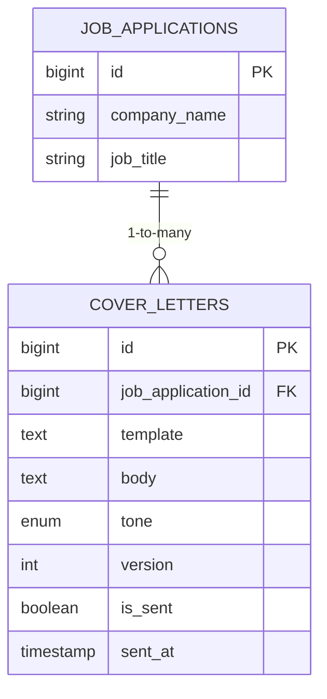
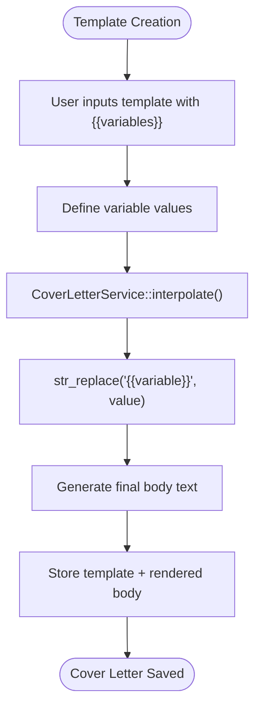
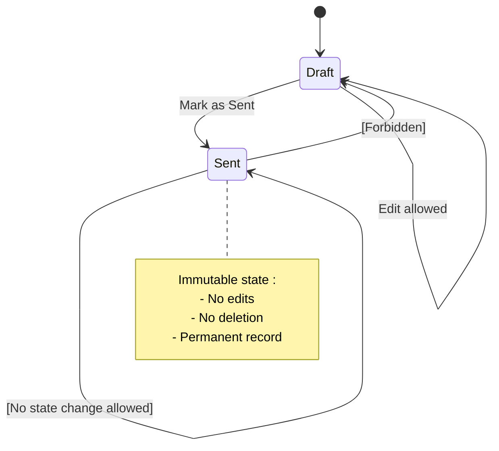
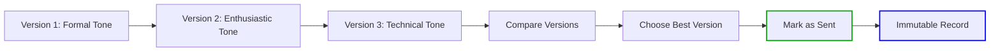
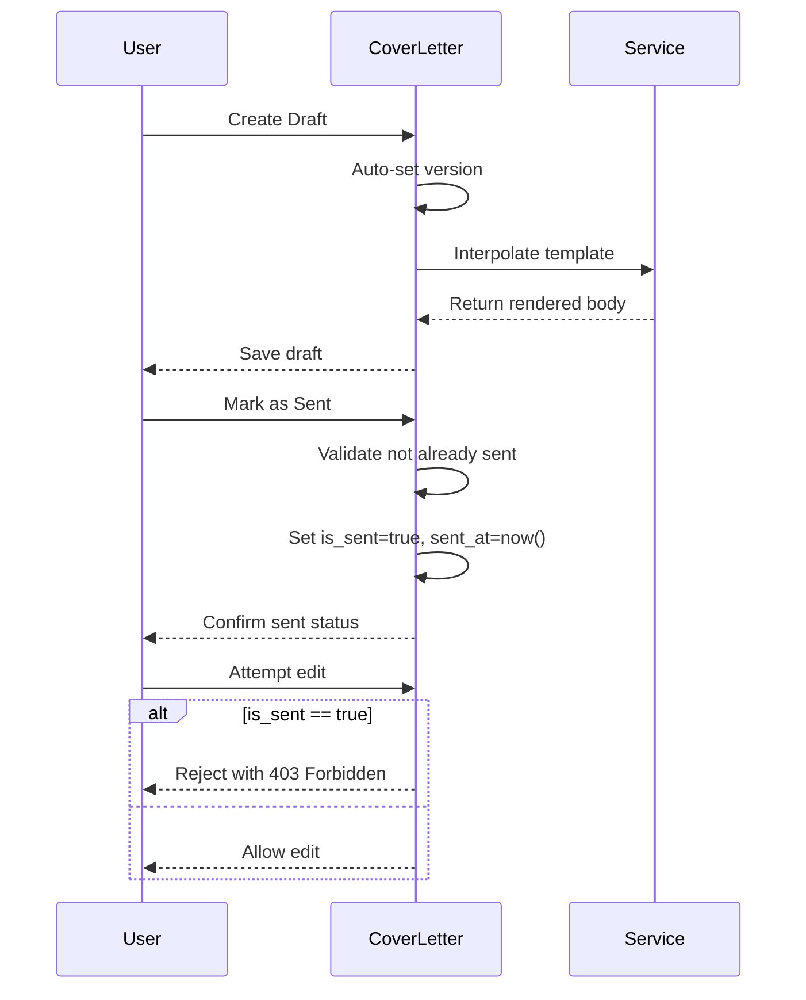

# Cover Letter Data Model

<cite>
**Referenced Files in This Document**   
- [CoverLetter.php](file://app/Models/CoverLetter.php)
- [JobApplication.php](file://app/Models/JobApplication.php)
- [CoverLetterService.php](file://app/Services/CoverLetterService.php)
- [create_cover_letters_table.php](file://database/migrations/2025_10_04_101841_create_cover_letters_table.php)
- [CoverLetterTest.php](file://tests/Feature/CoverLetterTest.php)
- [cover-letters.md](file://specs/002-roadmap-md/contracts-phase3/cover-letters.md)
- [data-model-phase3.md](file://specs/002-roadmap-md/data-model-phase3.md)
- [USER-GUIDE-PHASE3.md](file://specs/002-roadmap-md/USER-GUIDE-PHASE3.md)
</cite>

## Table of Contents
1. [Introduction](#introduction)
2. [Core Fields and Structure](#core-fields-and-structure)
3. [Relationship with JobApplication](#relationship-with-jobapplication)
4. [Template System and Variable Interpolation](#template-system-and-variable-interpolation)
5. [Data Validation Rules](#data-validation-rules)
6. [Versioning Strategy](#versioning-strategy)
7. [Query Examples](#query-examples)
8. [State Management and Business Rules](#state-management-and-business-rules)

## Introduction
The CoverLetter model provides a structured system for generating personalized cover letters using templates with variable interpolation. It supports A/B testing through versioning, tone categorization, and immutable record-keeping of sent communications. The model is tightly integrated with the JobApplication entity, enabling users to create, manage, and track multiple cover letter variants per job application while maintaining historical accuracy of what was submitted.

## Core Fields and Structure
The CoverLetter model contains essential fields for managing templated cover letters with dynamic content generation and state tracking.

| Field | Type | Constraints | Description |
|-------|------|-------------|-------------|
| `id` | bigint | Primary Key, Auto-increment | Unique identifier |
| `job_application_id` | bigint | Foreign Key → job_applications.id, NOT NULL, cascadeOnDelete | Associated job application |
| `template` | text | Nullable | Original template with `{{variables}}` placeholders |
| `body` | text | NOT NULL | Rendered final text after interpolation |
| `tone` | enum | NOT NULL | One of: formal, casual, enthusiastic, technical, leadership |
| `version` | int | NOT NULL, default 1 | Version number for A/B testing |
| `is_sent` | boolean | NOT NULL, default false | Whether this version was sent |
| `sent_at` | timestamp | Nullable | Timestamp when marked as sent |
| `created_at` | timestamp | | Creation timestamp |
| `updated_at` | timestamp | | Last modification timestamp |

**Section sources**
- [CoverLetter.php](file://app/Models/CoverLetter.php#L15-L26)
- [create_cover_letters_table.php](file://database/migrations/2025_10_04_101841_create_cover_letters_table.php#L10-L21)

## Relationship with JobApplication
The CoverLetter model has a one-to-many relationship with JobApplication, where each job application can have multiple cover letter versions. This relationship enforces referential integrity through foreign key constraints with cascade deletion.



**Diagram sources**
- [CoverLetter.php](file://app/Models/CoverLetter.php#L35-L39)
- [JobApplication.php](file://app/Models/JobApplication.php#L115-L122)

**Section sources**
- [CoverLetter.php](file://app/Models/CoverLetter.php#L35-L39)
- [JobApplication.php](file://app/Models/JobApplication.php#L115-L122)

## Template System and Variable Interpolation
The template system uses simple mustache-style `{{variable}}` syntax for dynamic content insertion. The CoverLetterService handles interpolation by replacing placeholders with actual values from the JobApplication and user-provided variables.

### Supported Variables
| Variable | Source | Example Value |
|----------|--------|---------------|
| `{{company_name}}` | JobApplication.company_name | "Acme Corp" |
| `{{role_title}}` | JobApplication.job_title | "Senior Developer" |
| `{{value_prop}}` | User input per letter | "5 years React experience" |
| `{{recent_win}}` | User input per letter | "40% performance improvement" |

### Interpolation Process


**Diagram sources**
- [CoverLetterService.php](file://app/Services/CoverLetterService.php#L10-L20)
- [cover-letters.md](file://specs/002-roadmap-md/contracts-phase3/cover-letters.md#L30-L50)

**Section sources**
- [CoverLetterService.php](file://app/Services/CoverLetterService.php#L10-L20)
- [USER-GUIDE-PHASE3.md](file://specs/002-roadmap-md/USER-GUIDE-PHASE3.md#L200-L250)

## Data Validation Rules
The model enforces several validation rules to ensure data integrity and proper usage patterns.

### Field-Level Validation
- `body`: Required, minimum 50 characters to ensure meaningful content
- `tone`: Must be one of predefined enum values (formal, casual, enthusiastic, technical, leadership)
- `template`: Optional (users can write directly in body field)
- `version`: Auto-incremented per job_application_id, cannot be manually set

### Business Logic Validation
- Prevents updates to sent cover letters via model observer
- Ensures only one cover letter per application can be marked as sent
- Automatically sets `sent_at` timestamp when `is_sent` transitions to true



**Diagram sources**
- [CoverLetter.php](file://app/Models/CoverLetter.php#L28-L45)
- [data-model-phase3.md](file://specs/002-roadmap-md/data-model-phase3.md#L100-L110)

**Section sources**
- [CoverLetter.php](file://app/Models/CoverLetter.php#L28-L45)
- [CoverLetterTest.php](file://tests/Feature/CoverLetterTest.php#L70-L80)

## Versioning Strategy
The versioning system enables A/B testing of different cover letter approaches while maintaining a clear history of iterations.

### Version Auto-Increment Logic
```php
static::creating(function ($coverLetter) {
    $maxVersion = static::where('job_application_id', $coverLetter->job_application_id)
        ->max('version');
    $coverLetter->version = ($maxVersion ?? 0) + 1;
});
```

### Version Management Workflow


**Diagram sources**
- [CoverLetter.php](file://app/Models/CoverLetter.php#L28-L32)
- [USER-GUIDE-PHASE3.md](file://specs/002-roadmap-md/USER-GUIDE-PHASE3.md#L300-L330)

**Section sources**
- [CoverLetter.php](file://app/Models/CoverLetter.php#L28-L32)
- [CoverLetterTest.php](file://tests/Feature/CoverLetterTest.php#L50-L60)

## Query Examples
Common queries for retrieving cover letter data based on version status and application context.

### Retrieve Latest Version
```php
// Get the latest cover letter version for a job application
$latestLetter = $jobApplication->coverLetters()->first();

// In JobApplication model
public function getLatestCoverLetter(): ?CoverLetter
{
    return $this->coverLetters()->first();
}
```

### Generate Letter Using Stored Variables
```php
// Interpolate template with current job application data
$variables = [
    'company_name' => $jobApplication->company_name,
    'role_title' => $jobApplication->job_title,
    'value_prop' => $coverLetter->value_prop, // if stored separately
    'recent_win' => $coverLetter->recent_win, // if stored separately
];

$renderedBody = app(CoverLetterService::class)->interpolate(
    $coverLetter->template, 
    $variables
);
```

### Find All Unsent Drafts
```php
$draftLetters = CoverLetter::where('is_sent', false)
    ->whereHas('jobApplication', function ($query) {
        $query->where('application_status', 'pending');
    })
    ->get();
```

**Section sources**
- [JobApplication.php](file://app/Models/JobApplication.php#L115-L122)
- [CoverLetterService.php](file://app/Services/CoverLetterService.php#L10-L20)

## State Management and Business Rules
The model enforces strict state management to prevent accidental modification of sent communications.

### State Transitions
```
draft (is_sent=false) → sent (is_sent=true, sent_at=now())
[final state: sent cannot revert to draft]
```

### Key Business Rules
- **Immutable Sent Letters**: Once marked as sent, cover letters cannot be edited or deleted
- **Single Sent Version**: Only one cover letter per application can be in "sent" state
- **Version Isolation**: Each version maintains independent template, tone, and content
- **Cascade Deletion**: Deleting a JobApplication automatically removes all associated cover letters



**Diagram sources**
- [CoverLetter.php](file://app/Models/CoverLetter.php#L40-L45)
- [cover-letters.md](file://specs/002-roadmap-md/contracts-phase3/cover-letters.md#L150-L180)

**Section sources**
- [CoverLetter.php](file://app/Models/CoverLetter.php#L40-L45)
- [CoverLetterTest.php](file://tests/Feature/CoverLetterTest.php#L70-L80)