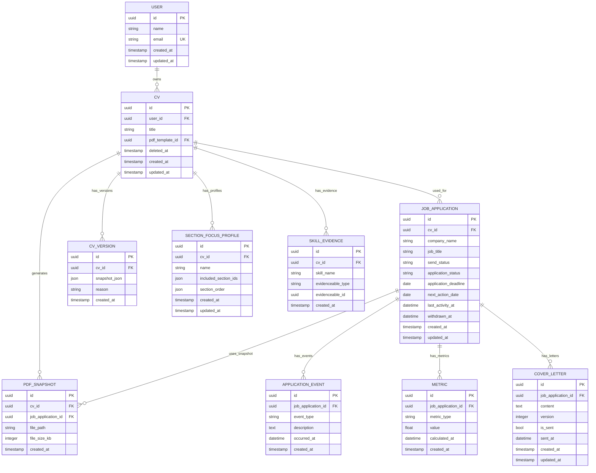

# Data Model

<cite>
**Referenced Files in This Document**   
- [User.php](file://app/Models/User.php)
- [Cv.php](file://app/Models/Cv.php)
- [JobApplication.php](file://app/Models/JobApplication.php)
- [PDFSnapshot.php](file://app/Models/PDFSnapshot.php)
- [CVVersion.php](file://app/Models/CVVersion.php)
- [ApplicationEvent.php](file://app/Models/ApplicationEvent.php)
- [Metric.php](file://app/Models/Metric.php)
- [SectionFocusProfile.php](file://app/Models/SectionFocusProfile.php)
- [CoverLetter.php](file://app/Models/CoverLetter.php)
- [SkillEvidence.php](file://app/Models/SkillEvidence.php)
- [create_users_table.php](file://database/migrations/0001_01_01_000000_create_users_table.php)
- [create_cvs_table.php](file://database/migrations/2025_10_03_201646_create_cvs_table.php)
- [create_job_applications_table.php](file://database/migrations/2025_10_03_224900_create_job_applications_table.php)
- [create_pdf_snapshots_table.php](file://database/migrations/2025_10_04_002642_create_pdf_snapshots_table.php)
- [create_cv_versions_table.php](file://database/migrations/2025_10_04_002612_create_cv_versions_table.php)
- [create_application_events_table.php](file://database/migrations/2025_10_04_100002_create_application_events_table.php)
- [create_metrics_table.php](file://database/migrations/2025_10_04_100003_create_metrics_table.php)
- [create_section_focus_profiles_table.php](file://database/migrations/2025_10_04_101831_create_section_focus_profiles_table.php)
- [create_cover_letters_table.php](file://database/migrations/2025_10_04_101841_create_cover_letters_table.php)
- [create_skill_evidence_table.php](file://database/migrations/2025_10_04_101842_create_skill_evidence_table.php)
</cite>

## Table of Contents
1. [Introduction](#introduction)
2. [Entity Overview](#entity-overview)
3. [Core Entities](#core-entities)
4. [Entity Relationships](#entity-relationships)
5. [Database Schema Diagram](#database-schema-diagram)
6. [Data Validation and Business Logic](#data-validation-and-business-logic)
7. [Data Access Patterns and Performance](#data-access-patterns-and-performance)
8. [Data Lifecycle Management](#data-lifecycle-management)
9. [Data Security](#data-security)
10. [Conclusion](#conclusion)

## Introduction
This document provides a comprehensive overview of the data model for the CV Builder application. It details all core entities, their attributes, relationships, constraints, and business logic. The system supports CV creation, job application tracking, AI-powered review, and document versioning. The model is designed to support flexible CV structuring, multi-version tracking, and integration with application workflows.

## Entity Overview
The application data model consists of the following key entities:
- **User**: System users who create and manage CVs
- **Cv**: Core resume document with modular sections
- **CVVersion**: Historical snapshots of CV content
- **PDFSnapshot**: Generated PDF versions of CVs
- **JobApplication**: Tracking of job applications linked to CVs
- **ApplicationEvent**: Timeline of events related to job applications
- **CoverLetter**: Custom cover letters for applications
- **SectionFocusProfile**: Templates for CV section filtering and ordering
- **SkillEvidence**: Links between skills and experiences/projects
- **Metric**: Application performance tracking data

Each entity is implemented as an Eloquent model with corresponding database tables and defined relationships.

## Core Entities

### User
Represents a registered user of the system.

**Fields:**
- `id`: UUID, Primary Key
- `name`: string, required
- `email`: string, required, unique
- `password`: string, hashed
- `email_verified_at`: timestamp
- `remember_token`: string
- `created_at`: timestamp
- `updated_at`: timestamp

**Constraints:**
- Email must be unique
- Password is hidden from serialization
- Email verification timestamp tracks verification status

**Section sources**
- [User.php](file://app/Models/User.php#L1-L48)
- [create_users_table.php](file://database/migrations/0001_01_01_000000_create_users_table.php#L1-L25)

### Cv
Represents a curriculum vitae with modular, reorderable sections.

**Fields:**
- `id`: UUID, Primary Key
- `user_id`: UUID, Foreign Key to users.id
- `title`: string, required
- `pdf_template_id`: UUID, Foreign Key to pdf_templates.id
- `deleted_at`: timestamp, Soft delete marker
- `created_at`: timestamp
- `updated_at`: timestamp

**Indexes:**
- Index on `user_id` for user-based queries
- Index on `deleted_at` for soft delete filtering
- Index on `pdf_template_id` for template-based queries

**Section sources**
- [Cv.php](file://app/Models/Cv.php#L1-L355)
- [create_cvs_table.php](file://database/migrations/2025_10_03_201646_create_cvs_table.php#L1-L25)
- [add_soft_deletes_to_cvs.php](file://database/migrations/2025_10_04_002505_add_soft_deletes_to_cvs.php#L1-L15)

### JobApplication
Tracks job applications associated with specific CVs.

**Fields:**
- `id`: UUID, Primary Key
- `cv_id`: UUID, Foreign Key to cvs.id
- `company_name`: string
- `company_website`: string
- `company_notes`: text
- `point_of_contact_name`: string
- `point_of_contact_email`: string
- `send_status`: enum ['draft', 'sent', 'failed']
- `application_status`: enum ['pending', 'interviewing', 'offered', 'rejected', 'withdrawn']
- `interview_dates`: JSON array of dates
- `interview_notes`: text
- `notes`: text
- `job_title`: string
- `source`: string
- `application_deadline`: date
- `next_action_date`: date
- `job_description`: text
- `last_activity_at`: datetime
- `withdrawn_at`: datetime
- `ai_review_data`: JSON
- `ai_review_requested_at`: datetime
- `ai_review_completed_at`: datetime
- `ai_review_cost_cents`: integer
- `created_at`: timestamp
- `updated_at`: timestamp

**Constraints:**
- `cv_id` references `cvs.id` with cascade delete
- `send_status` and `application_status` have defined enum values
- `ai_review_data` stored as JSON for flexible schema

**Indexes:**
- Index on `cv_id` for CV-based queries
- Index on `application_status` and `next_action_date` for filtering
- Index on `last_activity_at` for activity-based sorting

**Section sources**
- [JobApplication.php](file://app/Models/JobApplication.php#L1-L122)
- [create_job_applications_table.php](file://database/migrations/2025_10_03_224900_create_job_applications_table.php#L1-L35)
- [extend_job_applications_table.php](file://database/migrations/2025_10_04_002540_extend_job_applications_table.php#L1-L25)
- [add_ai_review_fields_to_job_applications.php](file://database/migrations/2025_10_04_152747_add_ai_review_fields_to_job_applications.php#L1-L20)

### PDFSnapshot
Stores generated PDF versions of CVs at specific points in time.

**Fields:**
- `id`: UUID, Primary Key
- `cv_id`: UUID, Foreign Key to cvs.id
- `job_application_id`: UUID, Foreign Key to job_applications.id (nullable)
- `file_path`: string, required
- `file_size_kb`: integer
- `generation_metadata`: JSON
- `created_at`: timestamp

**Constraints:**
- `cv_id` references `cvs.id` with cascade delete
- `job_application_id` references `job_applications.id` with cascade delete
- Either `cv_id` or `job_application_id` must be present

**Indexes:**
- Index on `cv_id` for CV-based queries
- Index on `job_application_id` for application-based queries
- Index on `created_at` for chronological ordering

**Section sources**
- [PDFSnapshot.php](file://app/Models/PDFSnapshot.php)
- [create_pdf_snapshots_table.php](file://database/migrations/2025_10_04_002642_create_pdf_snapshots_table.php)

### CVVersion
Captures historical snapshots of CV content for version tracking.

**Fields:**
- `id`: UUID, Primary Key
- `cv_id`: UUID, Foreign Key to cvs.id
- `snapshot_json`: JSON, complete CV state
- `reason`: string, describes versioning event
- `created_at`: timestamp

**Constraints:**
- `cv_id` references `cvs.id` with cascade delete
- `snapshot_json` contains full serialized CV state

**Indexes:**
- Index on `cv_id` for version history queries
- Index on `created_at` for chronological ordering

**Section sources**
- [CVVersion.php](file://app/Models/CVVersion.php)
- [create_cv_versions_table.php](file://database/migrations/2025_10_04_002612_create_cv_versions_table.php)

### ApplicationEvent
Tracks timeline events for job applications.

**Fields:**
- `id`: UUID, Primary Key
- `job_application_id`: UUID, Foreign Key to job_applications.id
- `event_type`: string, category of event
- `description`: text, details of event
- `occurred_at`: datetime, when event happened
- `metadata`: JSON, additional context
- `created_at`: timestamp

**Constraints:**
- `job_application_id` references `job_applications.id` with cascade delete
- `event_type` categorizes events (e.g., 'application_submitted', 'interview_scheduled')

**Indexes:**
- Index on `job_application_id` for application timeline queries
- Index on `occurred_at` for chronological ordering
- Composite index on `job_application_id` and `occurred_at` for efficient timeline retrieval

**Section sources**
- [ApplicationEvent.php](file://app/Models/ApplicationEvent.php)
- [create_application_events_table.php](file://database/migrations/2025_10_04_100002_create_application_events_table.php)

### Metric
Stores performance metrics for job applications.

**Fields:**
- `id`: UUID, Primary Key
- `job_application_id`: UUID, Foreign Key to job_applications.id
- `metric_type`: string, category of metric
- `value`: float, numeric value
- `calculated_at`: datetime
- `metadata`: JSON, calculation context
- `created_at`: timestamp

**Constraints:**
- `job_application_id` references `job_applications.id` with cascade delete
- `metric_type` defines metric category (e.g., 'response_rate', 'interview_conversion')

**Indexes:**
- Index on `job_application_id` for application metrics
- Index on `metric_type` for metric category queries
- Composite index on `job_application_id` and `metric_type` for efficient metric retrieval

**Section sources**
- [Metric.php](file://app/Models/Metric.php)
- [create_metrics_table.php](file://database/migrations/2025_10_04_100003_create_metrics_table.php)

### SectionFocusProfile
Defines templates for CV section filtering and ordering.

**Fields:**
- `id`: UUID, Primary Key
- `cv_id`: UUID, Foreign Key to cvs.id
- `name`: string, profile identifier
- `included_section_ids`: JSON array, sections to include
- `section_order`: JSON array, display order
- `created_at`: timestamp
- `updated_at`: timestamp

**Constraints:**
- `cv_id` references `cvs.id` with cascade delete
- `included_section_ids` and `section_order` stored as JSON arrays

**Indexes:**
- Index on `cv_id` for CV-based profile queries

**Section sources**
- [SectionFocusProfile.php](file://app/Models/SectionFocusProfile.php)
- [create_section_focus_profiles_table.php](file://database/migrations/2025_10_04_101831_create_section_focus_profiles_table.php)

### CoverLetter
Stores cover letters associated with job applications.

**Fields:**
- `id`: UUID, Primary Key
- `job_application_id`: UUID, Foreign Key to job_applications.id
- `content`: text, letter body
- `version`: integer, version number
- `is_sent`: boolean, tracking status
- `sent_at`: datetime
- `created_at`: timestamp
- `updated_at`: timestamp

**Constraints:**
- `job_application_id` references `job_applications.id` with cascade delete
- Versioning supports multiple drafts per application

**Indexes:**
- Index on `job_application_id` for application-based queries
- Index on `version` for version ordering
- Composite index on `job_application_id` and `version` for efficient version retrieval

**Section sources**
- [CoverLetter.php](file://app/Models/CoverLetter.php)
- [create_cover_letters_table.php](file://database/migrations/2025_10_04_101841_create_cover_letters_table.php)

### SkillEvidence
Links skills to specific experiences, projects, or other content.

**Fields:**
- `id`: UUID, Primary Key
- `cv_id`: UUID, Foreign Key to cvs.id
- `skill_name`: string, skill identifier
- `evidenceable_type`: string, type of related model
- `evidenceable_id`: UUID, ID of related record
- `created_at`: timestamp

**Constraints:**
- `cv_id` references `cvs.id` with cascade delete
- Polymorphic relationship via `evidenceable_type` and `evidenceable_id`
- Unique constraint on combination of `cv_id`, `skill_name`, `evidenceable_type`, `evidenceable_id`

**Indexes:**
- Index on `cv_id` for CV-based queries
- Index on `skill_name` for skill-based queries
- Polymorphic index on `evidenceable_type` and `evidenceable_id`
- Composite index on all fields for uniqueness enforcement

**Section sources**
- [SkillEvidence.php](file://app/Models/SkillEvidence.php)
- [create_skill_evidence_table.php](file://database/migrations/2025_10_04_101842_create_skill_evidence_table.php)

## Entity Relationships



**Diagram sources**
- [User.php](file://app/Models/User.php)
- [Cv.php](file://app/Models/Cv.php)
- [JobApplication.php](file://app/Models/JobApplication.php)
- [PDFSnapshot.php](file://app/Models/PDFSnapshot.php)
- [CVVersion.php](file://app/Models/CVVersion.php)
- [ApplicationEvent.php](file://app/Models/ApplicationEvent.php)
- [Metric.php](file://app/Models/Metric.php)
- [SectionFocusProfile.php](file://app/Models/SectionFocusProfile.php)
- [CoverLetter.php](file://app/Models/CoverLetter.php)
- [SkillEvidence.php](file://app/Models/SkillEvidence.php)

## Database Schema Diagram

```mermaid
erDiagram
USER ||--o{ CV
CV ||--o{ CV_VERSION
CV ||--o{ PDF_SNAPSHOT
CV ||--o{ SECTION_FOCUS_PROFILE
CV ||--o{ SKILL_EVIDENCE
CV ||--o{ JOB_APPLICATION
JOB_APPLICATION ||--o{ PDF_SNAPSHOT
JOB_APPLICATION ||--o{ APPLICATION_EVENT
JOB_APPLICATION ||--o{ METRIC
JOB_APPLICATION ||--o{ COVER_LETTER
```

**Diagram sources**
- [create_users_table.php](file://database/migrations/0001_01_01_000000_create_users_table.php)
- [create_cvs_table.php](file://database/migrations/2025_10_03_201646_create_cvs_table.php)
- [create_cv_versions_table.php](file://database/migrations/2025_10_04_002612_create_cv_versions_table.php)
- [create_pdf_snapshots_table.php](file://database/migrations/2025_10_04_002642_create_pdf_snapshots_table.php)
- [create_section_focus_profiles_table.php](file://database/migrations/2025_10_04_101831_create_section_focus_profiles_table.php)
- [create_skill_evidence_table.php](file://database/migrations/2025_10_04_101842_create_skill_evidence_table.php)
- [create_job_applications_table.php](file://database/migrations/2025_10_03_224900_create_job_applications_table.php)
- [create_application_events_table.php](file://database/migrations/2025_10_04_100002_create_application_events_table.php)
- [create_metrics_table.php](file://database/migrations/2025_10_04_100003_create_metrics_table.php)
- [create_cover_letters_table.php](file://database/migrations/2025_10_04_101841_create_cover_letters_table.php)

## Data Validation and Business Logic

### Model-Level Validation
- **User**: Email uniqueness enforced at database level
- **Cv**: Title is required; soft delete implemented via `deleted_at`
- **JobApplication**: Status fields constrained to defined enums
- **PDFSnapshot**: File path is required; size tracking for optimization
- **SkillEvidence**: Unique constraint prevents duplicate evidence entries

### Business Logic in Models
- **Cv::cloneCv()**: Transactional method that creates a version snapshot and deep copies all CV content
- **Cv::getSectionsWithProfile()**: Filters and reorders sections based on a SectionFocusProfile
- **Cv::getSkillsWithEvidence()**: Aggregates skill evidence counts and types
- **JobApplication::isReviewStale()**: Determines if AI review is outdated based on CV modification time
- **JobApplication::scopeNeedsAttention()**: Query scope identifying applications requiring user action

### Referential Integrity
- All foreign keys have cascade delete behavior
- Soft deletes on CVs preserve related application data
- Polymorphic relationships in SkillEvidence maintain referential integrity through application logic

**Section sources**
- [Cv.php](file://app/Models/Cv.php#L100-L350)
- [JobApplication.php](file://app/Models/JobApplication.php#L50-L120)

## Data Access Patterns and Performance

### Common Query Patterns
- User dashboard: Retrieve user's CVs with version counts and recent applications
- Application timeline: Fetch job application with events ordered by date
- CV editor: Load CV with all sections and content in display order
- Review status: Check if AI review is stale by comparing timestamps

### Indexing Strategy
- Foreign keys are indexed for join performance
- Frequently filtered fields (status, dates) have dedicated indexes
- Composite indexes support common query patterns
- JSON fields are indexed where appropriate for partial searches

### Performance Considerations
- Eager loading recommended for section relationships to avoid N+1 queries
- Version snapshots stored as JSON for efficient retrieval
- PDF snapshots reference file paths rather than storing binary data
- Aggregated skill evidence data can be cached to reduce computation

**Section sources**
- [Cv.php](file://app/Models/Cv.php)
- [JobApplication.php](file://app/Models/JobApplication.php)

## Data Lifecycle Management

### Soft Deletes
- CVs support soft deletion via `deleted_at` timestamp
- Deleted CVs remain in database but are filtered from normal queries
- Related entities (versions, snapshots) are cascade deleted
- Recovery mechanism allows restoration of deleted CVs

### Retention Policies
- CV versions are retained indefinitely for audit and recovery
- PDF snapshots are retained as long as associated CV or application exists
- Application events are retained with their parent application
- Old cover letter versions may be archived based on retention rules

### Data Archiving
- Completed applications (rejected/withdrawn) may be archived after 1 year
- Inactive user accounts may have data archived after 2 years of inactivity
- Archiving process preserves referential integrity while moving data to cold storage

**Section sources**
- [Cv.php](file://app/Models/Cv.php#L10-L15)
- [add_soft_deletes_to_cvs.php](file://database/migrations/2025_10_04_002505_add_soft_deletes_to_cvs.php)

## Data Security

### Sensitive Data Handling
- User passwords are hashed using Laravel's built-in hashing
- Authentication tokens are securely stored and rotated
- No sensitive personal data is stored beyond what is necessary for CV creation

### Encryption
- Database connections use TLS encryption
- Sensitive fields (if introduced) would be encrypted at application level
- File storage for PDF snapshots uses secure access controls
- Backup data is encrypted at rest

### Access Control
- Row-level security ensures users can only access their own data
- Authorization checks are performed at both controller and model levels
- API endpoints require authentication and scope validation
- Administrative access is logged and audited

**Section sources**
- [User.php](file://app/Models/User.php#L30-L40)
- [Cv.php](file://app/Models/Cv.php)

## Conclusion
The CV Builder data model provides a robust foundation for managing resumes, job applications, and supporting artifacts. The schema supports versioning, templating, and AI-powered review workflows while maintaining data integrity and performance. Key strengths include flexible CV structuring, comprehensive application tracking, and extensible evidence-based skill validation. The model is designed for scalability, with appropriate indexing and access patterns to support growing user bases and data volumes.