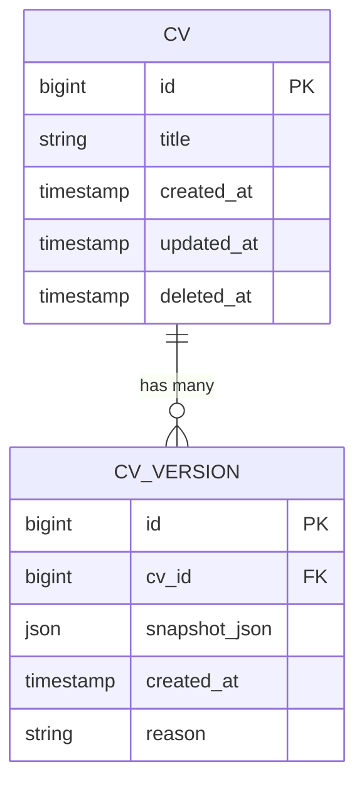
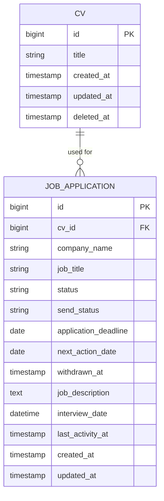
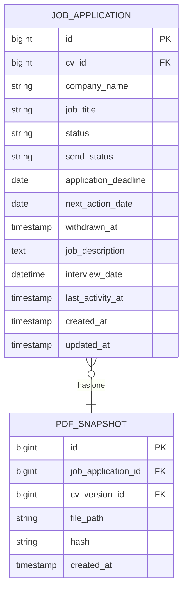
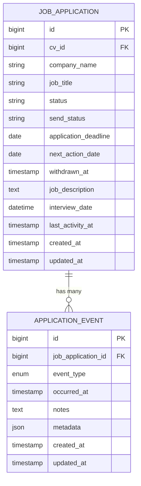

# Data Model

<cite>
**Referenced Files in This Document**   
- [cvs.php](file://database/migrations/2025_10_03_201646_create_cvs_table.php)
- [cv_versions.php](file://database/migrations/2025_10_04_002612_create_cv_versions_table.php)
- [pdf_snapshots.php](file://database/migrations/2025_10_04_002642_create_pdf_snapshots_table.php)
- [Cv.php](file://app/Models/Cv.php)
- [CVVersion.php](file://app/Models/CVVersion.php)
- [PDFSnapshot.php](file://app/Models/PDFSnapshot.php)
- [JobApplication.php](file://app/Models/JobApplication.php)
- [add_withdrawn_at_to_job_applications_table.php](file://database/migrations/2025_10_04_090625_add_withdrawn_at_to_job_applications_table.php)
- [application_events.php](file://database/migrations/2025_10_04_100002_create_application_events_table.php)
- [ApplicationEvent.php](file://app/Models/ApplicationEvent.php)
- [ApplicationEventObserver.php](file://app/Observers/ApplicationEventObserver.php)
- [BaseCVSeeder.php](file://database/seeders/BaseCVSeeder.php)
- [CvFactory.php](file://database/factories/CvFactory.php)
- [ApplicationEventFactory.php](file://database/factories/ApplicationEventFactory.php)
</cite>

## Update Summary
**Changes Made**   
- Added documentation for new `application_events` and `pdf_snapshots` tables and models
- Updated `job_applications` table documentation to include `withdrawn_at` field
- Added new entity relationships: JobApplication → ApplicationEvent and JobApplication → PDFSnapshot
- Updated JobApplication model documentation to include events relationship and scope
- Added new section sources for newly added files
- Updated diagram sources to include new migration and model files

## Table of Contents
1. [Introduction](#introduction)
2. [Core Database Tables and Eloquent Models](#core-database-tables-and-eloquent-models)
3. [Entity Relationships](#entity-relationships)
4. [Schema Evolution and Migrations](#schema-evolution-and-migrations)
5. [Data Seeding and Factories](#data-seeding-and-factories)
6. [Data Integrity and Validation](#data-integrity-and-validation)
7. [Query Optimization and Access Patterns](#query-optimization-and-access-patterns)
8. [Conclusion](#conclusion)

## Introduction

This document provides comprehensive documentation of the application's data model, detailing the database schema, Eloquent model relationships, and data flow patterns. The system is designed as a CV builder and job application tracker, enabling users to create multiple tailored CVs, manage job applications, and track application outcomes. The data model supports complex relationships between CVs and their components, versioning through snapshots, and integration with job applications via PDF exports. This documentation covers all database tables, their fields, constraints, indexes, and the Eloquent models that interact with them, along with information on schema evolution, data seeding, and query optimization strategies.

## Core Database Tables and Eloquent Models

The application's data model consists of several core tables that represent CVs, their structural components, job applications, and supporting entities for versioning and tracking. Each table corresponds to an Eloquent model in the Laravel application, enabling object-oriented interaction with the database.

### CVs Table and Model

The `cvs` table serves as the root entity for all CVs in the system. Each record represents a distinct CV that can be customized and exported.

**Fields:**
- `id`: Primary key (unsigned big integer, auto-incrementing)
- `title`: CV title (string, 255 characters)
- `created_at`: Creation timestamp
- `updated_at`: Last update timestamp
- `deleted_at`: Soft delete timestamp (added in migration 2025_10_04_002505)

**Constraints and Indexes:**
- Primary key on `id`
- Index on `created_at` for chronological queries
- Soft deletes are implemented, allowing CVs to be archived rather than permanently removed

**Eloquent Model:** `Cv.php`  
The `Cv` model uses Laravel's `HasFactory` trait for test data generation and includes soft delete functionality through the `SoftDeletes` trait. It serves as the parent entity for all CV sections and related data.

**Section sources**
- [cvs.php](file://database/migrations/2025_10_03_201646_create_cvs_table.php#L1-L30)
- [Cv.php](file://app/Models/Cv.php#L7-L28)

### CV Versions Table and Model

The `cv_versions` table stores historical snapshots of CVs.

**Fields:**
- `id`: Primary key
- `cv_id`: Foreign key referencing `cvs.id`
- `snapshot_json`: JSON field containing a complete serialized copy of the CV's data
- `created_at`: Timestamp of version creation
- `reason`: String field (255 characters) explaining why the version was created

**Constraints and Indexes:**
- Foreign key constraint on `cv_id` with cascade deletion
- Index on `cv_id` and `created_at` for retrieving version history

**Eloquent Model:** `CVVersion.php`  
The `CVVersion` model represents a historical snapshot of a CV at a specific point in time. It enables version tracking and rollback capabilities.

**Section sources**
- [cv_versions.php](file://database/migrations/2025_10_04_002612_create_cv_versions_table.php#L1-L27)
- [CVVersion.php](file://app/Models/CVVersion.php#L7-L29)

### PDF Snapshots Table and Model

The `pdf_snapshots` table stores references to exported PDF versions of CVs.

**Fields:**
- `id`: Primary key
- `job_application_id`: Foreign key referencing `job_applications.id` (nullable)
- `cv_version_id`: Foreign key referencing `cv_versions.id` (nullable)
- `file_path`: String field (500 characters) storing the filesystem path to the PDF
- `hash`: String field (64 characters) storing a SHA-256 hash of the PDF content for integrity verification
- `created_at`: Timestamp of snapshot creation

**Constraints and Indexes:**
- Foreign key constraints on `job_application_id` and `cv_version_id` with cascade deletion
- Unique constraint on `hash` to prevent duplicate storage of identical PDFs
- Index on `job_application_id` for retrieving snapshots associated with applications

**Eloquent Model:** `PDFSnapshot.php`  
The `PDFSnapshot` model represents a frozen, exported version of a CV in PDF format. It serves as proof of what was submitted to an employer and supports content integrity verification.

**Section sources**
- [pdf_snapshots.php](file://database/migrations/2025_10_04_002642_create_pdf_snapshots_table.php#L1-L30)
- [PDFSnapshot.php](file://app/Models/PDFSnapshot.php#L7-L22)

### Job Applications Table and Model

The `job_applications` table tracks job applications submitted by the user.

**Fields:**
- `id`: Primary key
- `cv_id`: Foreign key referencing `cvs.id` (the CV used for the application)
- `company_name`: String field (255 characters)
- `job_title`, `source`: String fields (255 characters)
- `application_deadline`, `next_action_date`: Date fields (nullable)
- `job_description`: Text field for the full job posting
- `status`: String field (255 characters) for application status
- `send_status`: String field (255 characters) for send tracking
- `interview_date`: DateTime field (nullable, legacy field)
- `last_activity_at`: Timestamp for last update
- `withdrawn_at`: Timestamp when application was withdrawn (added in migration 2025_10_04_090625)
- `created_at`, `updated_at`: Timestamps

**Constraints and Indexes:**
- Foreign key constraint on `cv_id` with cascade deletion
- Indexes on `status`, `send_status`, `next_action_date`, and `withdrawn_at` for filtering applications

**Eloquent Model:** `JobApplication.php`  
The `JobApplication` model represents a job application and its lifecycle. It belongs to a `Cv` and can be associated with PDF snapshots of the submitted CV. The model includes a scope `needsAttention` for filtering applications requiring action and a relationship to `ApplicationEvent` records.

**Section sources**
- [job_applications.php](file://database/migrations/2025_10_03_224900_create_job_applications_table.php#L1-L43)
- [job_applications.php](file://database/migrations/2025_10_04_002540_extend_job_applications_table.php#L1-L31)
- [add_withdrawn_at_to_job_applications_table.php](file://database/migrations/2025_10_04_090625_add_withdrawn_at_to_job_applications_table.php#L1-L31)
- [JobApplication.php](file://app/Models/JobApplication.php#L7-L75)

### Application Events Table and Model

The `application_events` table records discrete occurrences in the job application lifecycle.

**Fields:**
- `id`: Primary key
- `job_application_id`: Foreign key referencing `job_applications.id` with cascade delete
- `event_type`: Enum field with values: submitted, reply_received, interview_scheduled, interview_completed, offer_received, rejected, withdrawn
- `occurred_at`: Timestamp when the event occurred (required)
- `notes`: Text field for free-form description (nullable)
- `metadata`: JSON field for structured event-specific data (nullable)
- `created_at`, `updated_at`: Timestamps

**Constraints and Indexes:**
- Foreign key constraint on `job_application_id` with cascade deletion
- Indexes on `job_application_id`, `event_type`, and composite index on `job_application_id` and `event_type` for efficient querying
- Business rule: When an event is created, the parent `JobApplication.last_activity_at` is automatically updated to `occurred_at`

**Eloquent Model:** `ApplicationEvent.php`  
The `ApplicationEvent` model represents a discrete occurrence in a job application's lifecycle. It belongs to a `JobApplication` and can store flexible metadata based on the event type. The model uses an observer to automatically update the parent application's `last_activity_at` timestamp.

**Section sources**
- [application_events.php](file://database/migrations/2025_10_04_100002_create_application_events_table.php#L1-L46)
- [ApplicationEvent.php](file://app/Models/ApplicationEvent.php#L8-L30)
- [ApplicationEventObserver.php](file://app/Observers/ApplicationEventObserver.php#L6-L17)

## Entity Relationships

The data model implements a hierarchical structure for CVs and their components, along with associative relationships to job applications and tracking entities.

### CV to CVVersion Relationship

A `Cv` has many `CVVersion` records, representing its historical states. This one-to-many relationship allows users to track changes to their CV over time and revert to previous versions if needed. The `CVVersion` model stores a complete JSON snapshot of the CV's data at the time of versioning, providing a point-in-time record.

**Diagram sources**
- [cvs.php](file://database/migrations/2025_10_03_201646_create_cvs_table.php#L1-L30)
- [cv_versions.php](file://database/migrations/2025_10_04_002612_create_cv_versions_table.php#L1-L27)

**Section sources**
- [Cv.php](file://app/Models/Cv.php#L7-L28)
- [CVVersion.php](file://app/Models/CVVersion.php#L7-L29)

### CV to JobApplication Relationship

A `Cv` has many `JobApplication` records, indicating that a single CV can be used for multiple job applications. Conversely, each `JobApplication` belongs to one `Cv`, representing the specific CV version used for that application. This relationship enables tracking which CV was submitted for each job.

**Diagram sources**
- [cvs.php](file://database/migrations/2025_10_03_201646_create_cvs_table.php#L1-L30)
- [job_applications.php](file://database/migrations/2025_10_03_224900_create_job_applications_table.php#L1-L43)

**Section sources**
- [Cv.php](file://app/Models/Cv.php#L7-L28)
- [JobApplication.php](file://app/Models/JobApplication.php#L7-L75)

### JobApplication to PDFSnapshot Relationship

A `JobApplication` has one `PDFSnapshot`, representing the exact PDF version of the CV that was submitted to the employer. This one-to-one relationship ensures that there is a verifiable record of what was sent. The `PDFSnapshot` may also reference a `CVVersion` to indicate which historical version of the CV was used.

**Diagram sources**
- [job_applications.php](file://database/migrations/2025_10_03_224900_create_job_applications_table.php#L1-L43)
- [pdf_snapshots.php](file://database/migrations/2025_10_04_002642_create_pdf_snapshots_table.php#L1-L30)

**Section sources**
- [JobApplication.php](file://app/Models/JobApplication.php#L7-L75)
- [PDFSnapshot.php](file://app/Models/PDFSnapshot.php#L7-L22)

### JobApplication to ApplicationEvent Relationship

A `JobApplication` has many `ApplicationEvent` records, representing discrete occurrences in its lifecycle such as submission, interview scheduling, or offer receipt. This one-to-many relationship enables detailed tracking of the application process. Each event has a type and timestamp, allowing for chronological reconstruction of the application timeline. The relationship includes a business rule where creating an event automatically updates the parent application's `last_activity_at` timestamp.

**Diagram sources**
- [job_applications.php](file://database/migrations/2025_10_03_224900_create_job_applications_table.php#L1-L43)
- [application_events.php](file://database/migrations/2025_10_04_100002_create_application_events_table.php#L1-L46)

**Section sources**
- [JobApplication.php](file://app/Models/JobApplication.php#L7-L75)
- [ApplicationEvent.php](file://app/Models/ApplicationEvent.php#L8-L30)
- [ApplicationEventObserver.php](file://app/Observers/ApplicationEventObserver.php#L6-L17)

## Schema Evolution and Migrations

The database schema has evolved incrementally through a series of migrations, each adding specific functionality to support the application's growing feature set.

### Initial Schema Migrations

The initial set of migrations (2025_10_03) established the core CV structure:
- `2025_10_03_201646_create_cvs_table.php`: Created the base `cvs` table with title and timestamps
- `2025_10_03_201651_create_cv_sections_table.php`: Created the `cv_sections` table to define CV structure
- `2025_10_03_201656_create_cv_header_info_table.php`: Added personal information storage
- `2025_10_03_201701_create_cv_summaries_table.php`: Added professional summary capability
- `2025_10_03_201706_create_cv_skill_categories_table.php`: Implemented categorized skills with JSON storage
- `2025_10_03_201713_create_cv_experiences_table.php`: Added work experience tracking
- `2025_10_03_201718_create_cv_projects_table.php`: Added project portfolio support
- `2025_10_03_201722_create_cv_education_table.php`: Added educational background tracking
- `2025_10_03_201727_create_cv_references_table.php`: Added references section

### Enhancement Migrations

Subsequent migrations enhanced the initial schema:
- `2025_10_03_214838_add_url_to_cv_projects_table.php`: Added `project_url` field to support linking to online repositories
- `2025_10_03_220056_add_company_url_to_cv_experiences_table.php`: Added company URL to experience entries (not detailed in initial context)
- `2025_10_03_224900_create_job_applications_table.php`: Introduced job application tracking
- `2025_10_03_225856_modify_cv_sections_table_for_custom_sections.php`: Modified `cv_sections` to support custom section types
- `2025_10_03_225951_create_cv_custom_sections_table.php`: Created support for user-defined sections

### Advanced Feature Migrations

Later migrations added versioning and tracking capabilities:
- `2025_10_04_002505_add_soft_deletes_to_cvs.php`: Implemented soft deletes on `cvs` table to preserve historical data
- `2025_10_04_002540_extend_job_applications_table.php`: Enhanced `job_applications` with deadline, next action date, job description, and activity tracking
- `2025_10_04_002612_create_cv_versions_table.php`: Added CV versioning for historical tracking
- `2025_10_04_002642_create_pdf_snapshots_table.php`: Implemented PDF snapshot storage for application tracking

### Insight and Iteration Migrations

The most recent migrations added application activity tracking and performance metrics:
- `2025_10_04_090625_add_withdrawn_at_to_job_applications_table.php`: Added `withdrawn_at` timestamp to track when applications are withdrawn
- `2025_10_04_100002_create_application_events_table.php`: Created `application_events` table for detailed lifecycle tracking with flexible metadata
- `2025_10_04_100003_create_metrics_table.php`: Created `metrics` table for storing calculated performance metrics

Each migration follows Laravel conventions, with `up()` methods defining schema changes and `down()` methods providing rollback capabilities. Indexes are strategically added to support common query patterns, particularly around ordering and filtering.

**Section sources**
- [cvs.php](file://database/migrations/2025_10_03_201646_create_cvs_table.php#L1-L30)
- [cv_sections.php](file://database/migrations/2025_10_03_201651_create_cv_sections_table.php#L1-L33)
- [cv_header_info.php](file://database/migrations/2025_10_03_201656_create_cv_header_info_table.php#L1-L36)
- [cv_summaries.php](file://database/migrations/2025_10_03_201701_create_cv_summaries_table.php#L1-L29)
- [cv_skill_categories.php](file://database/migrations/2025_10_03_201706_create_cv_skill_categories_table.php#L1-L33)
- [cv_experiences.php](file://database/migrations/2025_10_03_201713_create_cv_experiences_table.php#L1-L39)
- [cv_projects.php](file://database/migrations/2025_10_03_201718_create_cv_projects_table.php#L1-L34)
- [cv_education.php](file://database/migrations/2025_10_03_201722_create_cv_education_table.php#L1-L37)
- [cv_references.php](file://database/migrations/2025_10_03_201727_create_cv_references_table.php#L1-L29)
- [cv_projects.php](file://database/migrations/2025_10_03_214838_add_url_to_cv_projects_table.php#L1-L28)
- [job_applications.php](file://database/migrations/2025_10_03_224900_create_job_applications_table.php#L1-L43)
- [cv_sections.php](file://database/migrations/2025_10_03_225856_modify_cv_sections_table_for_custom_sections.php#L1-L25)
- [cv_custom_sections.php](file://database/migrations/2025_10_03_225951_create_cv_custom_sections_table.php#L1-L25)
- [cvs.php](file://database/migrations/2025_10_04_002505_add_soft_deletes_to_cvs.php#L1-L25)
- [job_applications.php](file://database/migrations/2025_10_04_002540_extend_job_applications_table.php#L1-L31)
- [cv_versions.php](file://database/migrations/2025_10_04_002612_create_cv_versions_table.php#L1-L27)
- [pdf_snapshots.php](file://database/migrations/2025_10_04_002642_create_pdf_snapshots_table.php#L1-L30)
- [add_withdrawn_at_to_job_applications_table.php](file://database/migrations/2025_10_04_090625_add_withdrawn_at_to_job_applications_table.php#L1-L31)
- [application_events.php](file://database/migrations/2025_10_04_100002_create_application_events_table.php#L1-L46)
- [metrics.php](file://database/migrations/2025_10_04_100003_create_metrics_table.php#L1-L44)

## Data Seeding and Factories

The application includes mechanisms for generating test data and populating initial content.

### BaseCVSeeder

The `BaseCVSeeder.php` file contains a seeder that imports a complete CV based on the provided markdown specification. This seeder creates a CV with the title "Senior Developer - StickyPiston" and populates all sections with example data, including:
- Header information with full name, job title, and contact details
- Professional summary
- Skill categories with multiple skills in each category
- Work experience entries with dates and achievement highlights
- Side projects with descriptions and technologies
- Educational background
- References statement

This seeder serves as both an example of data population and a way to provide users with a starting point for their own CVs.

**Section sources**
- [BaseCVSeeder.php](file://database/seeders/BaseCVSeeder.php#L1-L100)

### Model Factories

The application includes factories for generating test data during development and testing:
- `CvFactory.php`: Generates random CV titles
- `CvHeaderInfoFactory.php`: Creates realistic personal information
- `CvSectionFactory.php`: Generates sections with random types and order
- `JobApplicationFactory.php`: Creates job applications with random companies and statuses
- `PDFSnapshotFactory.php`: Generates PDF snapshot records with valid file paths and hashes
- `ApplicationEventFactory.php`: Creates application events with random types and timestamps
- `MetricFactory.php`: Generates metric records with random values and time periods
- `UserFactory.php`: Creates user records (though authentication is not required)

These factories use Laravel's factory pattern to create consistent, realistic test data for feature development and automated testing.

**Section sources**
- [CvFactory.php](file://database/factories/CvFactory.php#L1-L25)
- [CvHeaderInfoFactory.php](file://database/factories/CvHeaderInfoFactory.php#L1-L30)
- [ApplicationEventFactory.php](file://database/factories/ApplicationEventFactory.php#L7-L39)
- [MetricFactory.php](file://database/factories/MetricFactory.php#L7-L33)

## Data Integrity and Validation

The data model incorporates several mechanisms to ensure data integrity and consistency.

### Foreign Key Constraints

All relationships between tables are enforced through foreign key constraints with cascade deletion. When a parent record is deleted, all dependent child records are automatically removed. For example, deleting a CV will cascade to remove all its sections, section content, and related job applications.

### Unique Constraints

Unique constraints prevent invalid data states:
- `cv_sections`: Unique constraint on `cv_id` and `section_type` prevents duplicate section types within a CV
- `cv_header_info`, `cv_summaries`, `cv_references`, `cv_custom_sections`: Unique constraint on `cv_section_id` enforces one-to-one relationships
- `pdf_snapshots`: Unique constraint on `hash` prevents duplicate storage of identical PDFs
- `metrics`: Unique constraint on `metric_type` and `time_period_start` prevents duplicate metrics for the same period

### Soft Deletes

The `cvs` table implements soft deletes through the `deleted_at` timestamp. When a CV is deleted, it is not removed from the database but marked as deleted. This preserves historical data, including PDF snapshots of submitted applications, while removing the CV from regular user views.

### Model Validation

While the database schema enforces structural integrity, the Eloquent models likely include application-level validation rules to ensure data quality. For example:
- Required fields like `email` in `CvHeaderInfo`
- Format validation for URLs and dates
- Content length limits for text fields
- Business rule validation for date ranges (e.g., end date after start date)
- Event-specific validation for `ApplicationEvent.metadata` based on `event_type`

These validations would be implemented in the models or through Laravel's form request validation system.

**Section sources**
- [cvs.php](file://database/migrations/2025_10_04_002505_add_soft_deletes_to_cvs.php#L1-L25)
- [cv_sections.php](file://database/migrations/2025_10_03_201651_create_cv_sections_table.php#L1-L33)
- [cv_header_info.php](file://database/migrations/2025_10_03_201656_create_cv_header_info_table.php#L1-L36)

## Query Optimization and Access Patterns

The schema includes several optimizations to support efficient data retrieval for common access patterns.

### Indexing Strategy

Indexes are strategically placed to support frequent queries:
- `cvs.created_at`: For chronological listing of CVs
- `cv_sections.cv_id` and `cv_sections.display_order`: For retrieving sections in correct order
- `cv_experiences.start_date` and `cv_education.start_year`: For chronological sorting of experiences and education
- `job_applications.status`, `job_applications.send_status`, `job_applications.next_action_date`, and `job_applications.withdrawn_at`: For filtering applications by status and identifying those needing attention
- `application_events.job_application_id` and `application_events.event_type`: For retrieving events by application and type
- `metrics.metric_type` and `metrics.time_period_start`: For retrieving metrics by type and period

### JSON Field Usage

The schema uses JSON fields (`skills`, `highlights`, `metadata`) to store arrays of data without requiring additional database tables. This simplifies the schema and reduces the number of joins needed for common queries. Laravel's JSON column querying capabilities allow for efficient searching within these fields.

### Eager Loading

The Eloquent models are designed to support eager loading of relationships, preventing N+1 query problems. For example, when displaying a CV with all its sections, the application can eager load all related data in a single query rather than making separate queries for each section type.

### Common Query Patterns

The most frequent query patterns include:
- Retrieving a CV with all its sections and content for display or editing
- Listing job applications with filtering by status and deadline
- Finding CVs that have been used for job applications
- Retrieving version history for a CV
- Looking up PDF snapshots associated with job applications
- Getting the timeline of events for a job application
- Calculating and retrieving performance metrics

The schema and indexing strategy are optimized to support these patterns efficiently.

**Section sources**
- [cvs.php](file://database/migrations/2025_10_03_201646_create_cvs_table.php#L1-L30)
- [cv_sections.php](file://database/migrations/2025_10_03_201651_create_cv_sections_table.php#L1-L33)
- [cv_experiences.php](file://database/migrations/2025_10_03_201713_create_cv_experiences_table.php#L1-L39)
- [cv_education.php](file://database/migrations/2025_10_03_201722_create_cv_education_table.php#L1-L37)
- [job_applications.php](file://database/migrations/2025_10_03_224900_create_job_applications_table.php#L1-L43)
- [application_events.php](file://database/migrations/2025_10_04_100002_create_application_events_table.php#L1-L46)
- [metrics.php](file://database/migrations/2025_10_04_100003_create_metrics_table.php#L1-L44)

## Conclusion

The application's data model provides a comprehensive foundation for managing CVs and job applications. It supports a hierarchical structure for CV content with flexible section types, versioning through snapshots, and integration with job application tracking. The schema has evolved incrementally to add features like soft deletes, custom sections, and PDF snapshot storage while maintaining data integrity through foreign key constraints and unique indexes. The use of JSON fields for arrays simplifies the schema while still allowing for efficient querying. Model factories and seeders provide mechanisms for test data generation and initial content population. The indexing strategy and relationship design support efficient querying for common access patterns, ensuring good performance as the data set grows. This well-structured data model enables the application to serve as a powerful tool for job seekers to manage their career development and application process.
