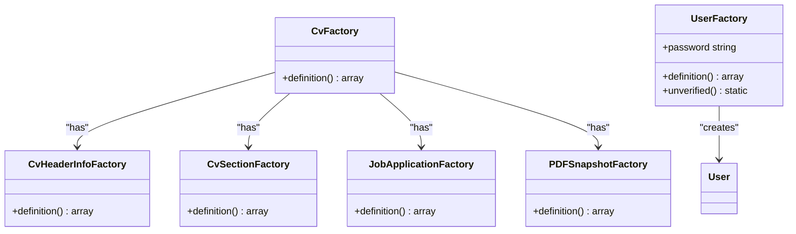
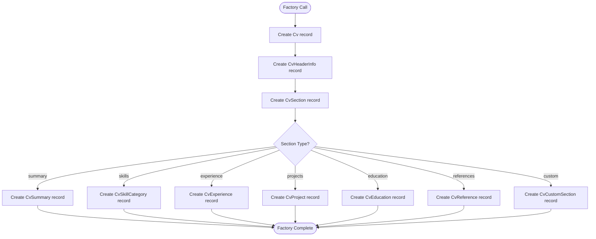

# Data Seeding & Factories

<cite>
**Referenced Files in This Document**   
- [DatabaseSeeder.php](file://database/seeders/DatabaseSeeder.php)
- [BaseCVSeeder.php](file://database/seeders/BaseCVSeeder.php) - *Updated with website_url field*
- [CvFactory.php](file://database/factories/CvFactory.php)
- [CvHeaderInfoFactory.php](file://database/factories/CvHeaderInfoFactory.php) - *Updated with website_url support*
- [CvSectionFactory.php](file://database/factories/CvSectionFactory.php)
- [JobApplicationFactory.php](file://database/factories/JobApplicationFactory.php)
- [PDFSnapshotFactory.php](file://database/factories/PDFSnapshotFactory.php)
- [UserFactory.php](file://database/factories/UserFactory.php)
- [cv_builder_spec.md](file://cv_builder_spec.md)
</cite>

## Update Summary
**Changes Made**   
- Updated BaseCVSeeder documentation to reflect addition of website_url field
- Added documentation for website_url field in CvHeaderInfo model and factory
- Updated section sources to reflect changes in BaseCVSeeder.php and CvHeaderInfoFactory.php
- Enhanced description of header information structure to include website_url
- Updated references to show which files were modified in recent commit

## Table of Contents
1. [Introduction](#introduction)
2. [Data Seeding System](#data-seeding-system)
3. [Model Factories](#model-factories)
4. [BaseCVSeeder Structure](#BaseCVSeeder-structure)
5. [Factory Relationships and Complex Data Generation](#factory-relationships-and-complex-data-generation)
6. [Using Factories in Tests](#using-factories-in-tests)
7. [Best Practices for Maintaining Seeders and Factories](#best-practices-for-maintaining-seeders-and-factories)
8. [Conclusion](#conclusion)

## Introduction
The CV Builder application utilizes Laravel's database seeding and model factory system to populate initial data and generate realistic test data. This documentation explains how the DatabaseSeeder orchestrates data population, particularly through the BaseCVSeeder which creates a complete sample CV with all section types. It also details how model factories generate test data for automated testing, including their relationships and usage patterns.

## Data Seeding System

The data seeding system in the CV Builder application is designed to populate the database with initial data for development and demonstration purposes. The primary orchestrator is the DatabaseSeeder class, which serves as the entry point for the seeding process.

The DatabaseSeeder first creates a test user and then calls the BaseCVSeeder to populate a complete sample CV with all section types. This hierarchical approach allows for organized and modular data population, where specific seeders handle particular data sets.

The BaseCVSeeder demonstrates proper data relationships and ordering by creating a CV and then sequentially creating all associated sections (summary, skills, experience, projects, education, references) with appropriate display orders. This ensures that the data reflects real-world usage patterns and maintains referential integrity throughout the seeding process.

**Section sources**
- [DatabaseSeeder.php](file://database/seeders/DatabaseSeeder.php#L8-L26)
- [BaseCVSeeder.php](file://database/seeders/BaseCVSeeder.php#L17-L352)

## Model Factories

Model factories in the CV Builder application generate realistic test data for automated testing. Each factory corresponds to a specific model and defines the default state for that model's attributes.

The factories use Laravel's Faker library to generate realistic data such as names, emails, phone numbers, and job titles. They also handle relationships between models, ensuring that foreign key constraints are properly maintained when generating test data.

For example, the CvHeaderInfoFactory creates a CvHeaderInfo record with a reference to a Cv model by using `\App\Models\Cv::factory()` as the value for the cv_id attribute. This ensures that when a CvHeaderInfo is created through the factory, it is always associated with a valid Cv record.

**Diagram sources**
- [CvFactory.php](file://database/factories/CvFactory.php#L6-L22)
- [CvHeaderInfoFactory.php](file://database/factories/CvHeaderInfoFactory.php#L6-L30)
- [CvSectionFactory.php](file://database/factories/CvSectionFactory.php#L6-L25)
- [JobApplicationFactory.php](file://database/factories/JobApplicationFactory.php#L6-L60)
- [PDFSnapshotFactory.php](file://database/factories/PDFSnapshotFactory.php#L6-L28)
- [UserFactory.php](file://database/factories/UserFactory.php#L6-L44)

**Section sources**
- [CvFactory.php](file://database/factories/CvFactory.php#L6-L22)
- [CvHeaderInfoFactory.php](file://database/factories/CvHeaderInfoFactory.php#L6-L30)
- [CvSectionFactory.php](file://database/factories/CvSectionFactory.php#L6-L25)
- [JobApplicationFactory.php](file://database/factories/JobApplicationFactory.php#L6-L60)
- [PDFSnapshotFactory.php](file://database/factories/PDFSnapshotFactory.php#L6-L28)
- [UserFactory.php](file://database/factories/UserFactory.php#L6-L44)

## BaseCVSeeder Structure

The BaseCVSeeder is a comprehensive seeder that creates a complete sample CV with all section types, demonstrating proper data relationships and ordering. It follows a structured approach to ensure data integrity and realistic data representation.

The seeder begins by creating a CV record, then creates a CvHeaderInfo record associated with that CV. It then proceeds to create each section type in a specific order, maintaining proper display_order values to ensure the sections appear in the correct sequence when rendered.

For each section type, the seeder creates a CvSection record with the appropriate section_type and display_order, then creates the corresponding section-specific record (e.g., CvSummary for a summary section, CvSkillCategory for a skills section). This pattern ensures that the data structure mirrors the application's actual usage patterns.

The seeder also demonstrates complex data handling, such as creating multiple CvSkillCategory records for the skills section, each with their own set of skills, and creating multiple CvExperience records with detailed highlights. This comprehensive approach provides a realistic sample dataset that can be used for development and demonstration purposes.

A recent update to the BaseCVSeeder added the website_url field to ensure complete header information is seeded, matching the original CV data structure. This addition ensures that the sample CV includes all relevant contact information, including the personal website.

**Section sources**
- [BaseCVSeeder.php](file://database/seeders/BaseCVSeeder.php#L17-L352) - *Updated with website_url field*

## Factory Relationships and Complex Data Generation

The model factories in the CV Builder application handle relationships between models to ensure referential integrity when generating test data. This is particularly important for maintaining valid foreign key constraints and creating realistic data scenarios.

The factories use Laravel's factory relationship methods to automatically create associated records. For example, the CvHeaderInfoFactory uses `\App\Models\Cv::factory()` as the value for the cv_id attribute, which ensures that a Cv record is created before the CvHeaderInfo record, and that the foreign key relationship is properly established.

Some factories also handle more complex relationships and data generation. The JobApplicationFactory, for instance, generates conditional data based on the application status. If the application status indicates that interviews have been scheduled, it creates interview dates with random types and dates within a specified range.

The factories also use Laravel's optional method to make certain fields nullable with a specified probability, creating more realistic test data that reflects real-world scenarios where some information might be missing or not applicable.

The CvHeaderInfoFactory has been updated to include the website_url field, which is generated using Faker's optional URL method, ensuring that some records will have a website URL while others will not, reflecting real-world data variability.

**Diagram sources**
- [CvHeaderInfoFactory.php](file://database/factories/CvHeaderInfoFactory.php#L6-L30)
- [CvSectionFactory.php](file://database/factories/CvSectionFactory.php#L6-L25)
- [JobApplicationFactory.php](file://database/factories/JobApplicationFactory.php#L6-L60)

**Section sources**
- [CvHeaderInfoFactory.php](file://database/factories/CvHeaderInfoFactory.php#L6-L30) - *Updated with website_url support*
- [CvSectionFactory.php](file://database/factories/CvSectionFactory.php#L6-L25)
- [JobApplicationFactory.php](file://database/factories/JobApplicationFactory.php#L6-L60)

## Using Factories in Tests

Model factories are extensively used in automated tests to create complex scenarios and test various application features. They provide a convenient way to generate test data with specific attributes or relationships.

In feature tests, factories can be used to create multiple records with specific attributes to test filtering, sorting, or other business logic. For example, a test might create multiple JobApplication records with different statuses to verify that the application filtering functionality works correctly.

In unit tests, factories can be used to create isolated test data for testing model methods or other business logic. The factories ensure that the test data is consistent and valid, reducing the likelihood of test failures due to data issues.

Factories can also be used to create complex data scenarios by combining multiple factory calls. For example, a test might create a CV with multiple sections, each with their own content, to test the CV cloning functionality or the PDF generation process.

When creating test data, it's important to use the appropriate factory methods to ensure data integrity. For example, when testing functionality that depends on specific relationships between models, it's important to use the factory relationship methods to ensure that the foreign key constraints are properly maintained.

**Section sources**
- [CvFactory.php](file://database/factories/CvFactory.php#L6-L22)
- [CvHeaderInfoFactory.php](file://database/factories/CvHeaderInfoFactory.php#L6-L30)
- [CvSectionFactory.php](file://database/factories/CvSectionFactory.php#L6-L25)

## Best Practices for Maintaining Seeders and Factories

As the application schema evolves, it's important to maintain the seeders and factories to ensure they continue to generate valid and realistic data. This includes updating the factories when new attributes are added to models, or when existing attributes are modified.

When adding new attributes to a model, the corresponding factory should be updated to include a default value for that attribute. This ensures that tests continue to work without modification and that the generated data remains realistic.

When modifying existing attributes, such as changing a field from nullable to required, the factory should be updated to reflect this change. This might involve removing the optional method call or providing a non-null default value.

It's also important to keep the seeders and factories in sync with each other. For example, if a new section type is added to the application, the BaseCVSeeder should be updated to include that section type in the sample CV, and the corresponding factory should be created or updated to generate test data for that section type.

Regularly reviewing and updating the seeders and factories can help ensure that they continue to provide value for development and testing. This might involve adding new data generation patterns, improving the realism of the generated data, or optimizing the performance of the factories.

**Section sources**
- [BaseCVSeeder.php](file://database/seeders/BaseCVSeeder.php#L17-L352)
- [CvFactory.php](file://database/factories/CvFactory.php#L6-L22)
- [CvHeaderInfoFactory.php](file://database/factories/CvHeaderInfoFactory.php#L6-L30)
- [CvSectionFactory.php](file://database/factories/CvSectionFactory.php#L6-L25)

## Conclusion
The data seeding and factory system in the CV Builder application provides a robust foundation for development and testing. The DatabaseSeeder orchestrates the population of initial data, with the BaseCVSeeder creating a comprehensive sample CV that demonstrates proper data relationships and ordering. The model factories generate realistic test data for automated testing, handling relationships between models to ensure referential integrity. By following best practices for maintaining seeders and factories, the application can continue to provide valuable tools for development and testing as the schema evolves.
