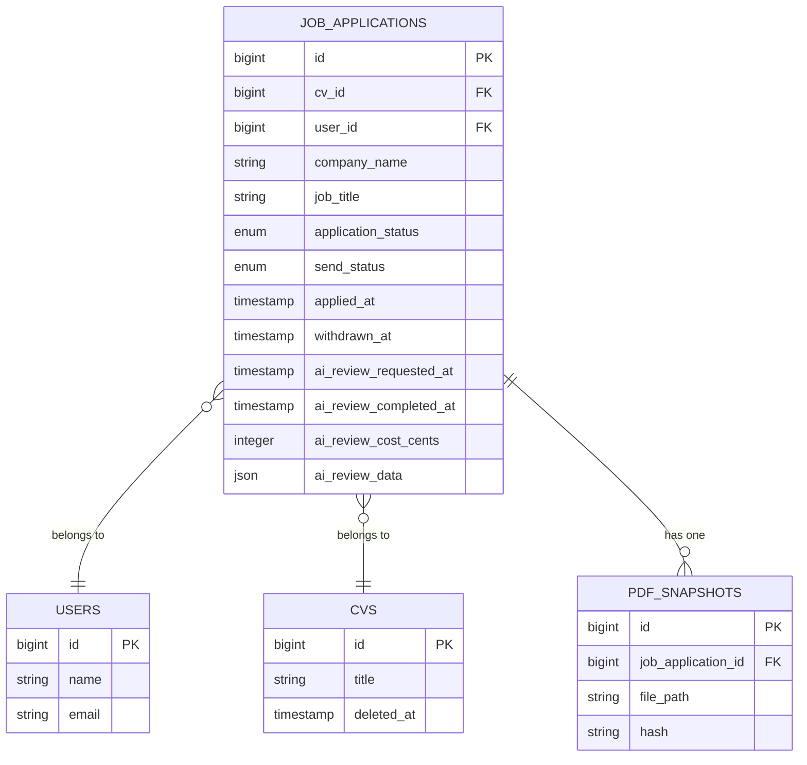

# Job Application Data Model

<cite>
**Referenced Files in This Document**   
- [JobApplication.php](file://app/Models/JobApplication.php)
- [Cv.php](file://app/Models/Cv.php)
- [User.php](file://app/Models/User.php)
- [PDFSnapshot.php](file://app/Models/PDFSnapshot.php)
- [JobApplicationObserver.php](file://app/Observers/JobApplicationObserver.php)
- [create_job_applications_table.php](file://database/migrations/2025_10_03_224900_create_job_applications_table.php)
- [extend_job_applications_table.php](file://database/migrations/2025_10_04_002540_extend_job_applications_table.php)
- [add_ai_review_fields_to_job_applications.php](file://database/migrations/2025_10_04_152747_add_ai_review_fields_to_job_applications.php)
- [add_withdrawn_at_to_job_applications_table.php](file://database/migrations/2025_10_04_090625_add_withdrawn_at_to_job_applications_table.php)
</cite>

## Table of Contents
1. [Introduction](#introduction)
2. [Core Fields and Attributes](#core-fields-and-attributes)
3. [Foreign Key Relationships](#foreign-key-relationships)
4. [Status Transition Constraints](#status-transition-constraints)
5. [AI Review Metadata](#ai-review-metadata)
6. [Needs Attention Computed Attribute](#needs-attention-computed-attribute)
7. [Data Validation Rules](#data-validation-rules)
8. [Soft Delete Capability](#soft-delete-capability)
9. [Indexing Strategies](#indexing-strategies)
10. [Query Examples](#query-examples)

## Introduction
The JobApplication model serves as the central entity for tracking job pursuit activities within the CV Builder application. This document provides comprehensive documentation of the data model, including its fields, relationships, business rules, and performance optimizations. The system is designed to support job seekers in managing their applications with features like deadline tracking, AI-powered review, and automated PDF snapshot generation upon submission.

## Core Fields and Attributes
The JobApplication model contains essential fields that capture comprehensive information about each job opportunity, enabling effective management of the application process.

### Primary Data Fields
| Field | Type | Description |
|-------|------|-------------|
| `job_title` | string | Position being applied for (required) |
| `company_name` | string | Name of the employer (required) |
| `status` | enum | Current stage in the application funnel |
| `applied_at` | timestamp | Date when the application was submitted |
| `created_at` | timestamp | Record creation timestamp |
| `updated_at` | timestamp | Record last modification timestamp |

**Section sources**
- [JobApplication.php](file://app/Models/JobApplication.php#L15-L35)
- [create_job_applications_table.php](file://database/migrations/2025_10_03_224900_create_job_applications_table.php#L15-L20)

## Foreign Key Relationships
The JobApplication model establishes critical relationships with other entities in the system, creating a connected data model that supports comprehensive job application management.



**Diagram sources**
- [JobApplication.php](file://app/Models/JobApplication.php)
- [Cv.php](file://app/Models/Cv.php)
- [User.php](file://app/Models/User.php)
- [PDFSnapshot.php](file://app/Models/PDFSnapshot.php)

**Section sources**
- [JobApplication.php](file://app/Models/JobApplication.php#L37-L55)
- [Cv.php](file://app/Models/Cv.php#L10-L35)
- [User.php](file://app/Models/User.php#L10-L15)

### Relationship Details
1. **User Relationship**: Each job application belongs to a User, establishing ownership and access control. This relationship ensures that applications are scoped to the authenticated user.
2. **CV Relationship**: Each job application is associated with a specific CV through the `cv_id` foreign key, enabling tracking of which tailored CV was used for each application.
3. **PDFSnapshot Relationship**: Each job application can have one PDF snapshot that represents the exact version of the CV that was sent, serving as immutable proof of submission.

## Status Transition Constraints
The job application system implements business rules to ensure valid state transitions and maintain data integrity throughout the application lifecycle.

### Status Workflow
The `application_status` field follows a structured progression representing the candidate's position in the hiring funnel:
```
pending → reviewed → interviewing → offered → accepted/rejected
```

The possible values for `application_status` are: 'pending', 'reviewed', 'interviewing', 'offered', 'rejected', 'accepted', and 'withdrawn'. The system enforces constraints to prevent invalid transitions, such as moving directly from 'pending' to 'accepted' without passing through intermediate states.

### Send Status Workflow
The `send_status` field tracks the submission state with two possible values:
- `draft`: The application has been created but not yet sent
- `sent`: The application has been submitted to the employer

This separation allows users to prepare applications in draft form before officially submitting them, at which point additional business logic is triggered.

**Section sources**
- [JobApplication.php](file://app/Models/JobApplication.php#L25-L28)
- [create_job_applications_table.php](file://database/migrations/2025_10_03_224900_create_job_applications_table.php#L25-L30)

## AI Review Metadata
The system captures comprehensive metadata about AI-powered reviews of job applications, enabling users to understand and track the review process.

### AI Review Fields
| Field | Type | Description |
|-------|------|-------------|
| `ai_review_requested_at` | timestamp | When the user triggered the CV review |
| `ai_review_completed_at` | timestamp | When the review processing finished |
| `ai_review_cost_cents` | integer | OpenAI API cost in cents for this review |
| `ai_review_data` | json | Complete review results as structured JSON |
| `match_score` | float | Calculated match score between 0-100 |
| `review_status` | enum | Current status of AI review process |

The `ai_review_data` field stores comprehensive analysis results including keyword coverage, skill matching, and improvement suggestions. The `match_score` is derived from this data and represents the overall compatibility between the CV and job description.

**Section sources**
- [JobApplication.php](file://app/Models/JobApplication.php#L20-L23)
- [add_ai_review_fields_to_job_applications.php](file://database/migrations/2025_10_04_152747_add_ai_review_fields_to_job_applications.php#L10-L20)

## Needs Attention Computed Attribute
The `needs_attention` computed attribute identifies applications that require immediate user action based on specific business criteria.

### Calculation Logic
The `scopeNeedsAttention` method in the JobApplication model defines the criteria for applications that need attention:

```php
public function scopeNeedsAttention(Builder $query): Builder
{
    return $query->where(function ($q) {
        $q->where(function ($q2) {
            $q2->where('next_action_date', '<=', now())
                ->orWhere('send_status', 'draft')
                ->orWhere(function ($q3) {
                    $q3->whereIn('application_status', ['pending', 'interviewing'])
                        ->whereNull('next_action_date');
                });
        })->whereNotIn('application_status', ['rejected', 'withdrawn']);
    });
}
```

An application needs attention if any of the following conditions are met:
- The `next_action_date` is today or in the past (deadline or follow-up is due)
- The `send_status` is 'draft' (application hasn't been sent)
- The `application_status` is 'pending' or 'interviewing' and no `next_action_date` is set

Applications with `application_status` of 'rejected' or 'withdrawn' are excluded from this calculation, as they no longer require active management.

```mermaid
flowchart TD
Start([Needs Attention Check]) --> Condition1{next_action_date <= today?}
Start --> Condition2{send_status = 'draft'?}
Start --> Condition3{status IN [pending, interviewing] AND next_action_date NULL?}
Condition1 --> |Yes| Include[Include Application]
Condition2 --> |Yes| Include
Condition3 --> |Yes| Include
Include --> Exclusion{status IN [rejected, withdrawn]?}
Exclusion --> |Yes| Exclude[Exclude Application]
Exclusion --> |No| Include
Include --> Output[Needs Attention = True]
Exclude --> Output[Needs Attention = False]
```

**Diagram sources**
- [JobApplication.php](file://app/Models/JobApplication.php#L57-L75)
- [ApplicationsNeedingAction.php](file://app/Filament/Widgets/ApplicationsNeedingAction.php#L15-L25)

**Section sources**
- [JobApplication.php](file://app/Models/JobApplication.php#L57-L75)

## Data Validation Rules
The system enforces data validation rules to ensure required fields are populated before submission and maintain data quality.

### Required Fields
The following fields are required when creating or updating a job application:
- `company_name`: Must be a non-empty string
- `job_title`: Must be a non-empty string
- `cv_id`: Must reference an existing CV record
- `job_description`: Required when AI review is requested

The model's `$fillable` array defines which attributes can be mass-assigned, while validation rules in the corresponding Form classes enforce business requirements before data persistence.

**Section sources**
- [JobApplication.php](file://app/Models/JobApplication.php#L15-L20)
- [JobApplicationForm.php](file://app/Filament/Resources/JobApplications/Schemas/JobApplicationForm.php#L45-L55)

## Soft Delete Capability
The system implements soft delete functionality through the `withdrawn_at` timestamp field, allowing users to withdraw applications while preserving historical data.

### Withdrawal Implementation
The `withdrawn_at` field is implemented as a nullable timestamp that records when an application was withdrawn:

```php
Schema::table('job_applications', function (Blueprint $table) {
    $table->timestamp('withdrawn_at')->nullable()->after('last_activity_at');
    $table->index('withdrawn_at');
});
```

When a user withdraws an application:
1. The `withdrawn_at` field is set to the current timestamp
2. The `application_status` is automatically updated to 'withdrawn'
3. The application is excluded from active workflows and dashboards
4. Historical data and PDF snapshots remain accessible for audit purposes

This approach ensures data integrity while allowing users to manage their application status appropriately.

**Section sources**
- [JobApplication.php](file://app/Models/JobApplication.php#L20)
- [add_withdrawn_at_to_job_applications_table.php](file://database/migrations/2025_10_04_090625_add_withdrawn_at_to_job_applications_table.php#L10-L15)

## Indexing Strategies
The system implements strategic database indexing to optimize query performance for common dashboard operations and filtering scenarios.

### Index Configuration
The following indexes are created on the job_applications table:

```php
// Status-based filtering
$table->index('application_status');
$table->index('send_status');

// Date-based filtering
$table->index('applied_at');
$table->index('next_action_date');
$table->index('withdrawn_at');
$table->index('ai_review_completed_at');

// Composite indexes for common query patterns
$table->index(['send_status', 'ai_review_completed_at']);
$table->index(['application_status', 'next_action_date']);
```

These indexes support efficient filtering in dashboard queries, particularly for:
- Retrieving applications by status (e.g., all 'pending' applications)
- Finding applications with upcoming or overdue action dates
- Identifying applications that need attention
- Filtering recently reviewed applications

**Section sources**
- [create_job_applications_table.php](file://database/migrations/2025_10_03_224900_create_job_applications_table.php#L40-L45)
- [extend_job_applications_table.php](file://database/migrations/2025_10_04_002540_extend_job_applications_table.php#L35-L40)
- [add_ai_review_fields_to_job_applications.php](file://database/migrations/2025_10_04_152747_add_ai_review_fields_to_job_applications.php#L30-L35)

## Query Examples
The following examples demonstrate common queries used to retrieve applications based on specific criteria.

### Applications Needing Attention
Retrieve applications that require immediate user action:

```php
JobApplication::query()->needsAttention()->get();
```

This query leverages the `scopeNeedsAttention` method to find applications with overdue action dates, draft status, or pending follow-ups.

### Recently Reviewed by AI
Find applications that have been recently reviewed by the AI system:

```php
JobApplication::query()
    ->whereNotNull('ai_review_completed_at')
    ->where('ai_review_completed_at', '>=', now()->subDays(7))
    ->orderBy('ai_review_completed_at', 'desc')
    ->get();
```

This query identifies applications reviewed in the past week, ordered by recency.

### Active Applications by Status
Retrieve all active applications grouped by their current status:

```php
JobApplication::query()
    ->whereNotIn('application_status', ['rejected', 'withdrawn'])
    ->whereIn('application_status', ['pending', 'reviewed', 'interviewing', 'offered'])
    ->orderBy('application_status')
    ->orderBy('next_action_date')
    ->get();
```

This query excludes closed applications and orders results by status and next action date.

**Section sources**
- [JobApplication.php](file://app/Models/JobApplication.php#L57-L75)
- [ApplicationsNeedingAction.php](file://app/Filament/Widgets/ApplicationsNeedingAction.php#L15-L25)