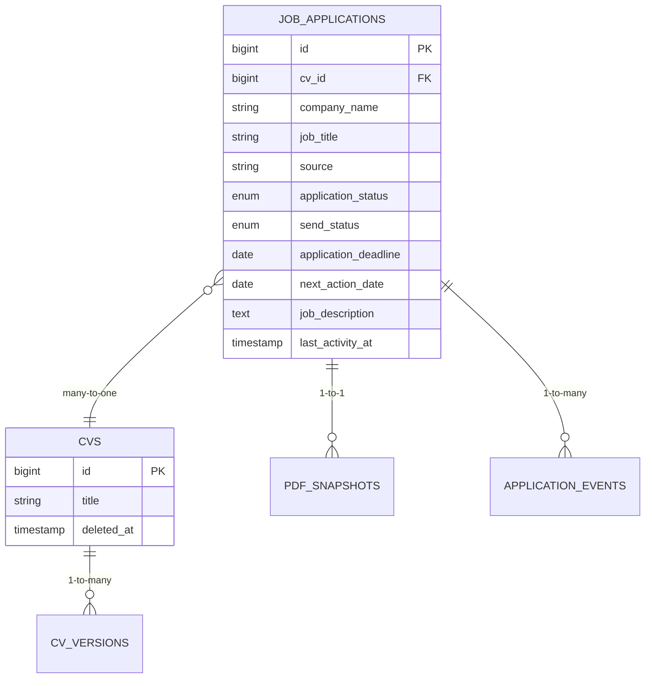
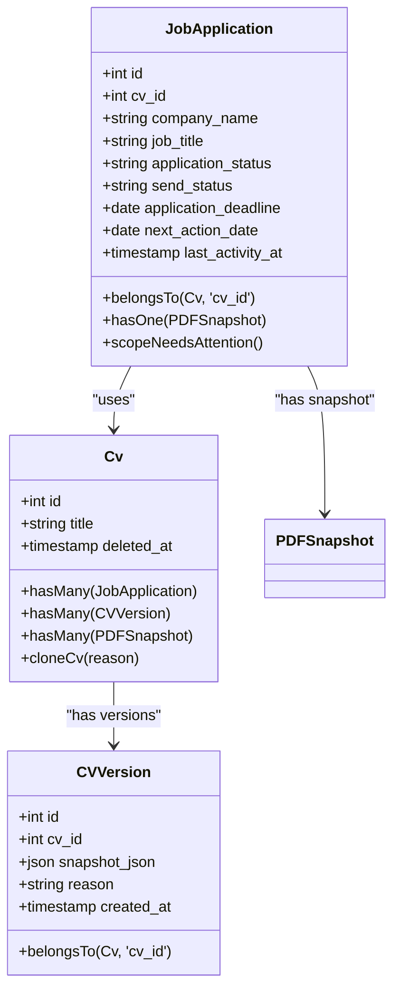
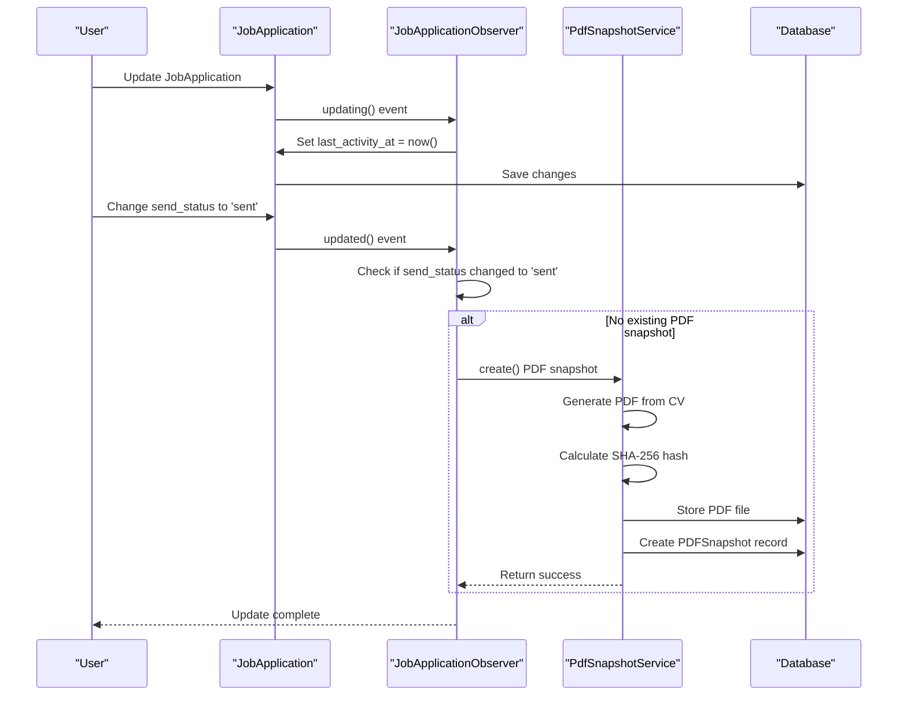
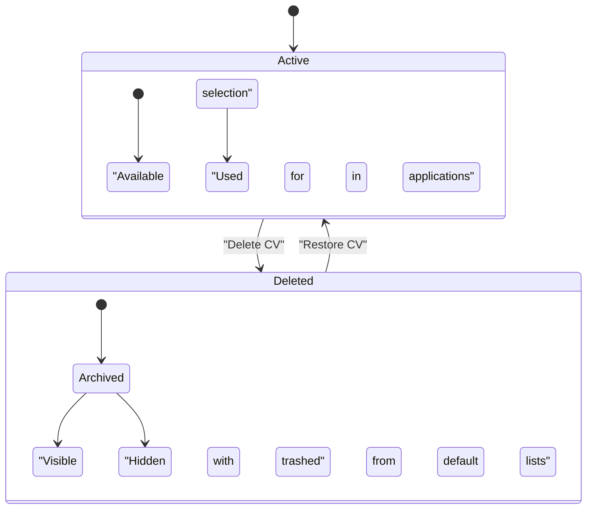

# Job Application Tracking

<cite>
**Referenced Files in This Document**   
- [JobApplication.php](file://app/Models/JobApplication.php)
- [Cv.php](file://app/Models/Cv.php)
- [JobApplicationObserver.php](file://app/Observers/JobApplicationObserver.php)
- [JobApplicationForm.php](file://app/Filament/Resources/JobApplications/Schemas/JobApplicationForm.php)
- [JobApplicationsTable.php](file://app/Filament/Resources/JobApplications/Tables/JobApplicationsTable.php)
- [ApplicationsNeedingAction.php](file://app/Filament/Widgets/ApplicationsNeedingAction.php)
- [PdfSnapshotService.php](file://app/Services/PdfSnapshotService.php)
- [create_job_applications_table.php](file://database/migrations/2025_10_03_224900_create_job_applications_table.php)
- [extend_job_applications_table.php](file://database/migrations/2025_10_04_002540_extend_job_applications_table.php)
- [create_pdf_snapshots_table.php](file://database/migrations/2025_10_04_002642_create_pdf_snapshots_table.php)
- [create_cv_versions_table.php](file://database/migrations/2025_10_04_002612_create_cv_versions_table.php)
</cite>

## Table of Contents
1. [Introduction](#introduction)
2. [Job Applications Data Model](#job-applications-data-model)
3. [Status Values and Dashboard Widgets](#status-values-and-dashboard-widgets)
4. [CV Relationship and Versioning](#cv-relationship-and-versioning)
5. [Job Application Observer and Analytics](#job-application-observer-and-analytics)
6. [Soft Deletes and Data Retention](#soft-deletes-and-data-retention)
7. [Common Queries](#common-queries)
8. [Data Privacy Considerations](#data-privacy-considerations)

## Introduction
This document provides comprehensive documentation for the job application tracking system within the CV Builder application. It details the data model, status workflows, relationships with CVs, observer logic for analytics, soft delete behavior, and data privacy practices. The system is designed to help users manage their job search process with features like deadline tracking, keyword coverage analysis, and automated PDF snapshot generation upon submission.

## Job Applications Data Model

The `job_applications` table serves as the central entity for tracking job applications. It contains fields that capture essential details about each application, enabling users to manage their job search effectively.



**Diagram sources**
- [JobApplication.php](file://app/Models/JobApplication.php)
- [Cv.php](file://app/Models/Cv.php)
- [PDFSnapshot.php](file://app/Models/PDFSnapshot.php)
- [CVVersion.php](file://app/Models/CVVersion.php)

**Section sources**
- [JobApplication.php](file://app/Models/JobApplication.php)
- [create_job_applications_table.php](file://database/migrations/2025_10_03_224900_create_job_applications_table.php)
- [extend_job_applications_table.php](file://database/migrations/2025_10_04_002540_extend_job_applications_table.php)

### Field Definitions
| Field | Type | Description |
|-------|------|-------------|
| `cv_id` | bigint | Foreign key linking to the CV used for this application |
| `company_name` | string | Name of the company where the job is applied |
| `job_title` | string | Position being applied for |
| `source` | string | Origin of the job posting (e.g., LinkedIn, referral) |
| `application_status` | enum | Current stage in the application funnel |
| `send_status` | enum | Whether the application has been submitted |
| `application_deadline` | date | Final date by which the application must be submitted |
| `next_action_date` | date | Date for follow-up or next required action |
| `job_description` | text | Full job description for keyword analysis |
| `last_activity_at` | timestamp | Timestamp of the most recent modification or event |

## Status Values and Dashboard Widgets

The application uses two status fields to track different aspects of the job application process: `application_status` for the hiring pipeline stage, and `send_status` for submission state.

### Application Status Values
The `application_status` field uses the following enum values:
- **pending**: Application submitted, awaiting response
- **reviewed**: Application has been reviewed by the employer
- **interviewing**: Candidate is in the interview process
- **offered**: Job offer has been extended
- **accepted**: Candidate has accepted the offer
- **rejected**: Application was not successful
- **withdrawn**: Candidate withdrew from the process

### Send Status Values
The `send_status` field uses the following enum values:
- **draft**: Application is being prepared but not yet sent
- **sent**: Application has been submitted to the employer

### Applications Needing Action Widget
The "Applications Needing Attention" dashboard widget surfaces applications that require user action based on specific criteria. This widget helps users prioritize their job search activities.

```mermaid
flowchart TD
Start([Applications Needing Attention]) --> Condition1{next_action_date <= today?}
Start --> Condition2{send_status = 'draft'?}
Start --> Condition3{status IN [pending, interviewing]?}
Condition1 --> |Yes| Include[Include Application]
Condition2 --> |Yes| Include
Condition3 --> |Yes| Include
Include --> Exclusion{status IN [rejected, withdrawn]?}
Exclusion --> |Yes| Exclude[Exclude Application]
Exclusion --> |No| Include
Include --> Output[Display in Widget]
Exclude --> Output
```

**Diagram sources**
- [ApplicationsNeedingAction.php](file://app/Filament/Widgets/ApplicationsNeedingAction.php)
- [JobApplication.php](file://app/Models/JobApplication.php)

**Section sources**
- [ApplicationsNeedingAction.php](file://app/Filament/Widgets/ApplicationsNeedingAction.php)
- [JobApplicationsTable.php](file://app/Filament/Resources/JobApplications/Tables/JobApplicationsTable.php)

## CV Relationship and Versioning

The system implements a flexible relationship between job applications and CVs, allowing multiple applications to use different versions of CVs.

### JobApplication-CV Relationship
Each `JobApplication` belongs to one `Cv` through the `cv_id` foreign key. This relationship enables:
- Tracking which CV version was used for each application
- Maintaining historical accuracy of what was submitted
- Supporting the cloning of CVs for different applications



**Diagram sources**
- [JobApplication.php](file://app/Models/JobApplication.php)
- [Cv.php](file://app/Models/Cv.php)
- [CVVersion.php](file://app/Models/CVVersion.php)

**Section sources**
- [Cv.php](file://app/Models/Cv.php)
- [create_cv_versions_table.php](file://database/migrations/2025_10_04_002612_create_cv_versions_table.php)

### CV Versioning
When a CV is cloned, the system automatically creates a `CVVersion` record that captures the complete state of the CV at that moment. This provides:
- Historical snapshots of CV content
- Audit trail for CV modifications
- Ability to recreate exactly what was submitted for any application

The `cloneCv()` method in the `Cv` model handles this process transactionally, ensuring data consistency between the version snapshot and the cloned CV.

## Job Application Observer and Analytics

The `JobApplicationObserver` listens for model events to automate key functionality and update analytics.



**Diagram sources**
- [JobApplicationObserver.php](file://app/Observers/JobApplicationObserver.php)
- [PdfSnapshotService.php](file://app/Services/PdfSnapshotService.php)

**Section sources**
- [JobApplicationObserver.php](file://app/Observers/JobApplicationObserver.php)
- [PdfSnapshotService.php](file://app/Services/PdfSnapshotService.php)

### Observer Responsibilities
1. **Auto-update last_activity_at**: On any update to a job application, the `updating` method sets the `last_activity_at` timestamp to the current time.
2. **Trigger PDF snapshot creation**: When the `send_status` changes to 'sent' and no PDF snapshot exists, the `updated` method triggers the `PdfSnapshotService` to create a snapshot.
3. **Error resilience**: If PDF creation fails, the observer logs the error but allows the application update to complete successfully.

## Soft Deletes and Data Retention

The system implements soft deletes to preserve data integrity while allowing users to archive records.

### CV Soft Delete Implementation
The `Cv` model uses Laravel's `SoftDeletes` trait, which adds a `deleted_at` timestamp column. When a CV is deleted:
- The `deleted_at` field is set to the current timestamp
- The record remains in the database but is excluded from default queries
- Related job applications continue to reference the CV
- PDF snapshots remain accessible

This approach ensures that:
- Historical job applications retain their context
- Submitted applications can still be verified
- Data integrity is maintained across relationships



**Diagram sources**
- [Cv.php](file://app/Models/Cv.php)
- [JobApplication.php](file://app/Models/JobApplication.php)

**Section sources**
- [Cv.php](file://app/Models/Cv.php)
- [JobApplication.php](file://app/Models/JobApplication.php)

## Common Queries

The following are examples of common database queries used in the application:

### Find Overdue Applications
```sql
SELECT * FROM job_applications 
WHERE next_action_date <= CURRENT_DATE 
AND application_status NOT IN ('rejected', 'withdrawn')
ORDER BY next_action_date ASC;
```

### Count Applications by Status
```sql
SELECT application_status, COUNT(*) as count 
FROM job_applications 
GROUP BY application_status 
ORDER BY count DESC;
```

### Find Applications Needing Attention
```php
JobApplication::query()->needsAttention()->get();
```

### Get Applications with CV Information
```sql
SELECT ja.*, c.title as cv_title 
FROM job_applications ja 
LEFT JOIN cvs c ON ja.cv_id = c.id 
WHERE ja.send_status = 'sent';
```

**Section sources**
- [JobApplication.php](file://app/Models/JobApplication.php)
- [ApplicationsNeedingAction.php](file://app/Filament/Widgets/ApplicationsNeedingAction.php)

## Data Privacy Considerations

The system handles personal and professional data with privacy in mind:

### Data Minimization
- Only essential information is collected for job applications
- Sensitive personal information beyond what's needed for job applications is not stored
- CV content is limited to professional information relevant to employment

### Data Retention
- Soft-deleted CVs are retained indefinitely to preserve application history
- PDF snapshots are kept permanently as proof of submission
- Users can restore soft-deleted CVs if needed

### Access Control
- Job application data is scoped to the authenticated user
- No sharing or public exposure of application details
- All data stored in secure, access-controlled database

### Security Measures
- PDF snapshots are stored with unique SHA-256 hashes for integrity verification
- File paths are not predictable, preventing unauthorized access
- Application logic prevents deletion of CVs that are referenced by job applications

**Section sources**
- [Cv.php](file://app/Models/Cv.php)
- [PDFSnapshot.php](file://app/Models/PDFSnapshot.php)
- [PdfSnapshotService.php](file://app/Services/PdfSnapshotService.php)