# Metrics Data Model

<cite>
**Referenced Files in This Document**   
- [Metric.php](file://app/Models/Metric.php)
- [create_metrics_table.php](file://database/migrations/2025_10_04_100003_create_metrics_table.php)
- [MetricsCalculationService.php](file://app/Services/MetricsCalculationService.php)
- [MetricsOverview.php](file://app/Filament/Widgets/MetricsOverview.php)
- [metrics-dashboard.md](file://specs/002-roadmap-md/contracts/metrics-dashboard.md)
- [MetricsCalculationTest.php](file://tests/Feature/MetricsCalculationTest.php)
</cite>

## Table of Contents
1. [Introduction](#introduction)
2. [Core Data Structure](#core-data-structure)
3. [Time-Series Data and Partitioning](#time-series-data-and-partitioning)
4. [Supported Metric Types and Calculations](#supported-metric-types-and-calculations)
5. [Indexing Strategy for Reporting Queries](#indexing-strategy-for-reporting-queries)
6. [Data Retention and Aggregation](#data-retention-and-aggregation)
7. [Query Examples for Analytics](#query-examples-for-analytics)
8. [Multi-Tenant Isolation](#multi-tenant-isolation)
9. [Architecture Overview](#architecture-overview)

## Introduction
The Metrics data model provides a time-series analytics system for tracking job application performance in the CV Builder application. This model captures key performance indicators such as application submission rates, response rates, interview conversion, and offer rates. The system is designed to provide actionable insights through a dashboard interface while maintaining efficient data storage and retrieval. Metrics are calculated and persisted rather than computed on-demand, ensuring fast dashboard load times and consistent reporting. The model supports rolling time periods (7-day, 30-day, 90-day) and automatically refreshes daily via scheduled jobs.

**Section sources**
- [metrics-dashboard.md](file://specs/002-roadmap-md/contracts/metrics-dashboard.md#L1-L50)

## Core Data Structure

The Metric model captures performance analytics for job applications with a focus on time-based measurement and efficient retrieval. The data structure is optimized for dashboard display and historical trend analysis.

### Field Definitions
| Field | Type | Description |
|-------|------|-------------|
| `metric_type` | enum | Type of metric being measured (e.g., 'applications_per_week', 'response_rate') |
| `value` | decimal(10,2) | Calculated metric value with two decimal places precision |
| `time_period_start` | date | Start date of the calculation period (used for time-series partitioning) |
| `time_period_end` | date | End date of the calculation period |
| `last_refreshed_at` | timestamp | When the metric was last calculated and stored |
| `created_at` | timestamp | Record creation timestamp |
| `updated_at` | timestamp | Record modification timestamp |

The model uses appropriate type casting to ensure data integrity:
- `time_period_start` and `time_period_end` are cast as dates
- `last_refreshed_at` is cast as datetime
- `value` is cast as float for consistent numeric operations

**Section sources**
- [Metric.php](file://app/Models/Metric.php#L1-L27)
- [create_metrics_table.php](file://database/migrations/2025_10_04_100003_create_metrics_table.php#L1-L44)

## Time-Series Data and Partitioning

The metrics system implements a time-series data model with rolling window partitioning based on the `time_period_start` field. This approach enables efficient historical analysis and trend tracking while maintaining data organization.

### Time Period Strategy
The system uses three standard time periods for metric calculation:
- **7-day**: Short-term performance tracking
- **30-day**: Medium-term trend analysis (default)
- **90-day**: Long-term performance evaluation

Each metric record represents a complete calculation for a specific time period, with `time_period_start` and `time_period_end` defining the boundaries of the calculation window. The system uses a rolling window approach where the end date is typically "now" and the start date is calculated by subtracting the period duration.

### Partitioning Implementation
The `time_period_start` field serves as the primary partitioning key, enabling efficient querying by time period. This design supports:
- Fast retrieval of metrics for specific time ranges
- Historical trend analysis by querying multiple records
- Efficient data retention policies based on age

The unique constraint on `(metric_type, time_period_start)` ensures that only one record exists per metric type per time period, preventing duplicate calculations and maintaining data consistency.


**Diagram sources**
- [create_metrics_table.php](file://database/migrations/2025_10_04_100003_create_metrics_table.php#L10-L40)
- [Metric.php](file://app/Models/Metric.php#L1-L27)

**Section sources**
- [create_metrics_table.php](file://database/migrations/2025_10_04_100003_create_metrics_table.php#L10-L25)
- [MetricsCalculationService.php](file://app/Services/MetricsCalculationService.php#L100-L120)

## Supported Metric Types and Calculations

The system supports five key performance metrics that track different stages of the job application funnel. Each metric is calculated by the `MetricsCalculationService` and excludes withdrawn applications from denominators to provide accurate success rates.

### Metric Types
| Metric Type | Description | Calculation Method |
|-----------|-------------|-------------------|
| `applications_per_week` | Average applications submitted per week | Total applications / (period days / 7) |
| `response_rate` | Percentage of applications receiving replies | (Applications with reply events / Active applications) × 100 |
| `interview_conversion_rate` | Percentage of applications leading to interviews | (Applications with interview events / Active applications) × 100 |
| `offer_rate` | Percentage of applications resulting in offers | (Applications with offer events / Active applications) × 100 |
| `median_days_to_first_response` | Median days between submission and first reply | MEDIAN(days from application to first reply_received event) |

### Calculation Logic
All metrics are calculated using the following principles:
- **Exclusion of withdrawn applications**: Withdrawn applications are excluded from denominators to provide accurate success rates for active applications only
- **Event-based tracking**: Metrics rely on `ApplicationEvent` records with specific `event_type` values (reply_received, interview_scheduled, offer_received)
- **Rolling time windows**: Calculations use rolling periods (7d, 30d, 90d) that end at the current date
- **Persistence over on-demand calculation**: Metrics are pre-calculated and stored to ensure fast dashboard load times

The `MetricsCalculationService` implements these calculations with optimized database queries that leverage indexes on `created_at`, `withdrawn_at`, and `event_type` fields.

```mermaid
flowchart TD
Start([Metric Calculation]) --> ParsePeriod["Parse Period (7d/30d/90d)"]
ParsePeriod --> CountApplications["Count Active Applications"]
CountApplications --> CalculateRate["Calculate Success Rate"]
CalculateRate --> StoreMetric["Store in Metrics Table"]
StoreMetric --> UpdateTimestamp["Set last_refreshed_at = now()"]
UpdateTimestamp --> End([Calculation Complete])
subgraph "Response Rate Calculation"
CalculateRate --> FilterActive["Filter: withdrawn_at = NULL"]
FilterActive --> CountReplies["Count Applications with reply_received events"]
CountReplies --> Divide["Divide: replies / active applications"]
Divide --> Multiply["Multiply by 100 for percentage"]
end
subgraph "Median Days Calculation"
CalculateRate --> GetResponseTimes["Get days from application to first reply"]
GetResponseTimes --> Sort["Sort response times"]
Sort --> FindMedian["Find median value"]
end
```



**Diagram sources**
- [MetricsCalculationService.php](file://app/Services/MetricsCalculationService.php#L10-L217)
- [metrics-dashboard.md](file://specs/002-roadmap-md/contracts/metrics-dashboard.md#L100-L200)

**Section sources**
- [MetricsCalculationService.php](file://app/Services/MetricsCalculationService.php#L10-L217)
- [metrics-dashboard.md](file://specs/002-roadmap-md/contracts/metrics-dashboard.md#L100-L200)

## Indexing Strategy for Reporting Queries

The metrics table implements a comprehensive indexing strategy to optimize performance for reporting queries and dashboard display. These indexes ensure fast data retrieval while supporting the application's performance requirements.

### Index Configuration
The following indexes are defined on the `metrics` table:

1. **`metric_type` index**: Single-column index on the `metric_type` enum field
   - Purpose: Accelerates queries filtering by specific metric types
   - Example: `WHERE metric_type = 'response_rate'`

2. **Composite index on `(time_period_start, time_period_end)`**: 
   - Purpose: Optimizes time-range queries and period-based filtering
   - Example: `WHERE time_period_start >= '2025-09-01' AND time_period_end <= '2025-10-01'`

3. **Unique constraint on `(metric_type, time_period_start)`**:
   - Purpose: Ensures data integrity by preventing duplicate metric calculations for the same period
   - Also serves as a performance index for upsert operations

### Performance Impact
This indexing strategy achieves the following performance goals:
- **Dashboard metrics load**: < 500ms (p95) through a single database query to fetch pre-calculated values
- **Metric calculation**: < 100ms for 100 applications during scheduled jobs
- **Time period filtering**: Efficient retrieval of metrics for specific periods (7d, 30d, 90d)

The indexes are particularly effective for the `MetricsOverview` widget, which retrieves the latest metrics for each type using `latest('time_period_start')` queries that can leverage the composite index.


**Diagram sources**
- [create_metrics_table.php](file://database/migrations/2025_10_04_100003_create_metrics_table.php#L30-L40)
- [Metric.php](file://app/Models/Metric.php#L1-L27)

**Section sources**
- [create_metrics_table.php](file://database/migrations/2025_10_04_100003_create_metrics_table.php#L30-L40)
- [MetricsOverview.php](file://app/Filament/Widgets/MetricsOverview.php#L10-L72)

## Data Retention and Aggregation

The metrics system implements a data retention strategy that balances historical analysis needs with storage efficiency. Since metrics are pre-calculated and persisted, the retention policy focuses on maintaining relevant time-series data.

### Retention Policy
The system retains metric records based on their `time_period_start` date:
- **Active retention**: All records within the last 180 days are retained
- **Historical retention**: Records older than 180 days are archived monthly
- **Purge policy**: Records older than 3 years are permanently deleted

This policy ensures that users can analyze performance trends over meaningful periods while preventing unbounded data growth.

### Aggregation Procedures
The system uses a two-tier aggregation approach:

1. **Scheduled Daily Aggregation**:
   - Runs daily at 2:00 AM via Laravel's task scheduler
   - Recalculates all metric types for all configured periods (7d, 30d, 90d)
   - Uses the `refreshAllMetrics` method in `MetricsCalculationService`
   - Ensures dashboard data is always up-to-date

2. **On-Demand Aggregation**:
   - Triggered by user action via the `/admin/metrics/refresh` endpoint
   - Allows immediate recalculation after bulk data import or corrections
   - Updates the `last_refreshed_at` timestamp for transparency

The aggregation process uses `updateOrCreate` operations with the unique constraint on `(metric_type, time_period_start)` to ensure data consistency and prevent duplicates.

**Section sources**
- [MetricsCalculationService.php](file://app/Services/MetricsCalculationService.php#L10-L217)
- [metrics-dashboard.md](file://specs/002-roadmap-md/contracts/metrics-dashboard.md#L300-L350)

## Query Examples for Analytics

The metrics data model supports various analytical queries for generating dashboard charts and calculating rolling averages. These examples demonstrate common reporting patterns.

### Rolling Average Calculation
To calculate a 3-period rolling average for response rate:

```sql
SELECT 
    m1.time_period_start,
    m1.value as current_rate,
    AVG(m2.value) as rolling_average
FROM metrics m1
JOIN metrics m2 ON m2.metric_type = 'response_rate'
    AND m2.time_period_start <= m1.time_period_start
    AND m2.time_period_start >= DATE_SUB(m1.time_period_start, INTERVAL 60 DAY)
WHERE m1.metric_type = 'response_rate'
GROUP BY m1.time_period_start, m1.value
ORDER BY m1.time_period_start;
```

### Dashboard Data Retrieval
To retrieve the latest metrics for dashboard display:

```php
$metrics = [
    'applications_per_week' => Metric::where('metric_type', 'applications_per_week')
        ->latest('time_period_start')->first(),
    'response_rate' => Metric::where('metric_type', 'response_rate')
        ->latest('time_period_start')->first(),
    'interview_conversion_rate' => Metric::where('metric_type', 'interview_conversion_rate')
        ->latest('time_period_start')->first(),
    'offer_rate' => Metric::where('metric_type', 'offer_rate')
        ->latest('time_period_start')->first(),
    'median_days_to_first_response' => Metric::where('metric_type', 'median_days_to_first_response')
        ->latest('time_period_start')->first(),
];
```

### Time Series Trend Analysis
To generate a chart showing response rate trends over time:

```sql
SELECT 
    time_period_start,
    value,
    last_refreshed_at
FROM metrics 
WHERE metric_type = 'response_rate'
    AND time_period_start >= DATE_SUB(CURDATE(), INTERVAL 6 MONTH)
ORDER BY time_period_start;
```

### Withdrawn Applications Analysis
To analyze the impact of withdrawn applications:

```sql
SELECT 
    COUNT(*) as total_applications,
    SUM(CASE WHEN withdrawn_at IS NOT NULL THEN 1 ELSE 0 END) as withdrawn_count,
    AVG(CASE WHEN withdrawn_at IS NOT NULL THEN 1 ELSE 0 END) * 100 as withdrawal_rate
FROM job_applications 
WHERE created_at >= DATE_SUB(CURDATE(), INTERVAL 30 DAY);
```

**Section sources**
- [MetricsOverview.php](file://app/Filament/Widgets/MetricsOverview.php#L10-L72)
- [MetricsCalculationService.php](file://app/Services/MetricsCalculationService.php#L10-L217)

## Multi-Tenant Isolation

The current implementation does not include explicit multi-tenant isolation as the application is designed for single-user use. However, the data model and architecture support future extension to multi-tenant scenarios.

### Current Isolation
- **Single-user scope**: All data is scoped to the authenticated user
- **No shared access**: Job application data and metrics are not exposed to other users
- **Database-level isolation**: All queries are executed within the context of the current user session

### Future Multi-Tenant Considerations
If the application were extended to support multiple users, the following modifications would be required:

1. **Add user_id to Metric model**:
   ```php
   $table->foreignId('user_id')->constrained()->cascadeOnDelete();
   ```
   
2. **Update queries to filter by user_id**:
   ```php
   Metric::where('user_id', auth()->id())
       ->where('metric_type', 'response_rate')
       ->latest('time_period_start')->first();
   ```

3. **Modify unique constraint**:
   ```php
   $table->unique(['user_id', 'metric_type', 'time_period_start']);
   ```

4. **Update service methods** to accept user context:
   ```php
   public function refreshAllMetrics(string $timePeriod, ?User $user = null): void
   ```

The current design's separation of concerns and service layer abstraction makes these extensions straightforward to implement.

**Section sources**
- [Metric.php](file://app/Models/Metric.php#L1-L27)
- [MetricsCalculationService.php](file://app/Services/MetricsCalculationService.php#L10-L217)

## Architecture Overview

The metrics system follows a service-oriented architecture with clear separation between data storage, business logic, and presentation layers. This design ensures maintainability, testability, and performance.


**Diagram sources**
- [MetricsCalculationService.php](file://app/Services/MetricsCalculationService.php#L10-L217)
- [MetricsOverview.php](file://app/Filament/Widgets/MetricsOverview.php#L10-L72)
- [metrics-dashboard.md](file://specs/002-roadmap-md/contracts/metrics-dashboard.md#L1-L50)

**Section sources**
- [MetricsCalculationService.php](file://app/Services/MetricsCalculationService.php#L10-L217)
- [MetricsOverview.php](file://app/Filament/Widgets/MetricsOverview.php#L10-L72)