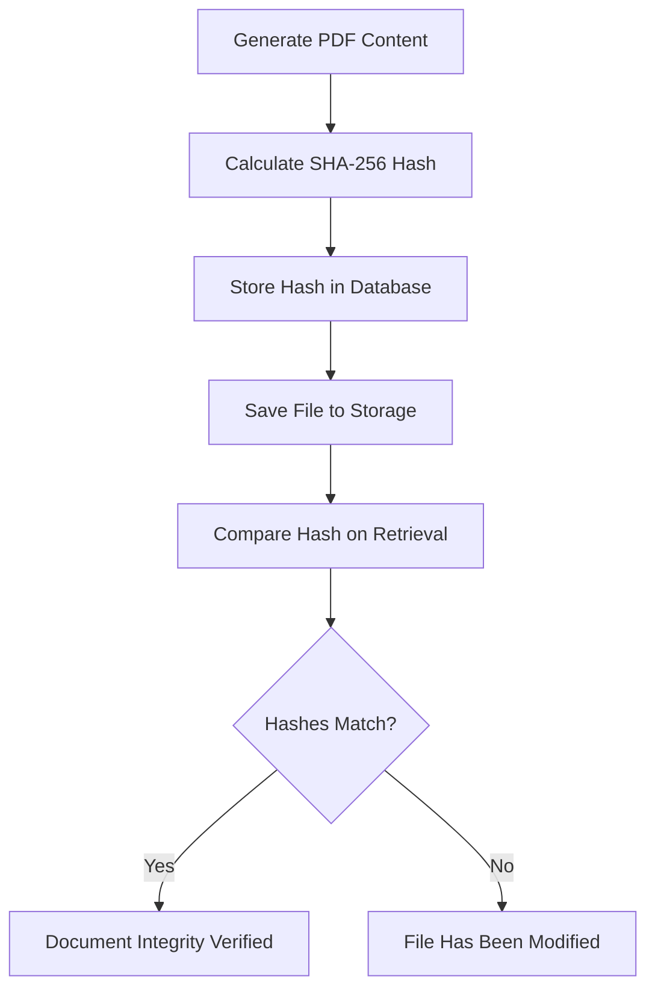
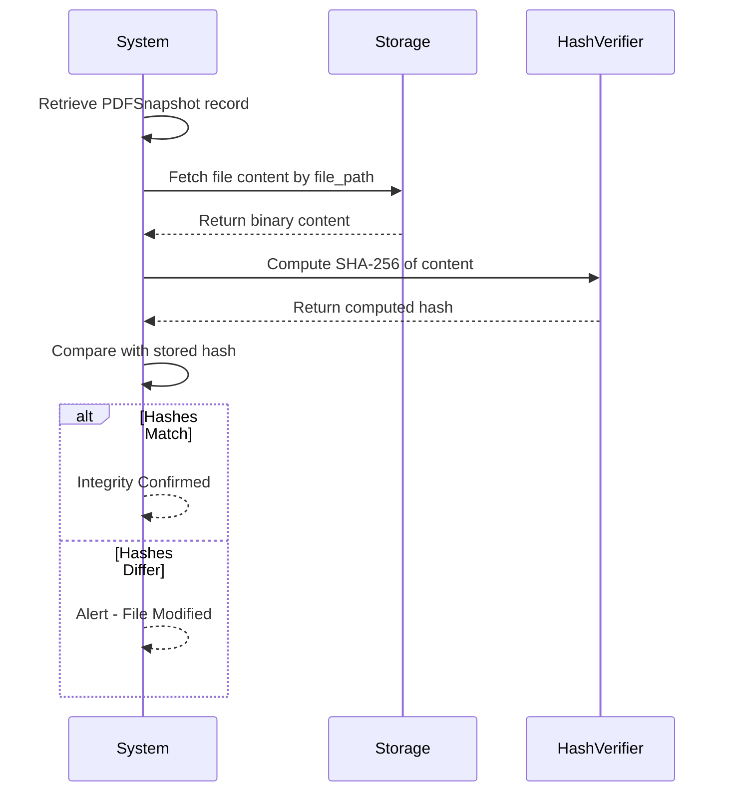

# PDF Snapshot Data Model

<cite>
**Referenced Files in This Document**   
- [PDFSnapshot.php](file://app/Models/PDFSnapshot.php)
- [JobApplication.php](file://app/Models/JobApplication.php)
- [PdfSnapshotService.php](file://app/Services/PdfSnapshotService.php)
- [CvPdfController.php](file://app/Http/Controllers/CvPdfController.php)
- [2025_10_04_002642_create_pdf_snapshots_table.php](file://database/migrations/2025_10_04_002642_create_pdf_snapshots_table.php)
- [PdfSnapshotServiceTest.php](file://tests/Unit/PdfSnapshotServiceTest.php)
</cite>

## Table of Contents
1. [Introduction](#introduction)
2. [Core Fields](#core-fields)
3. [Immutability and Integrity](#immutability-and-integrity)
4. [Relationship with JobApplication](#relationship-with-jobapplication)
5. [Storage and File Naming](#storage-and-file-naming)
6. [Data Validation Rules](#data-validation-rules)
7. [Performance Considerations](#performance-considerations)
8. [Security and Access Control](#security-and-access-control)
9. [Query Examples](#query-examples)
10. [Integrity Verification Workflow](#integrity-verification-workflow)

## Introduction
The PDFSnapshot entity captures a point-in-time version of a CV associated with a job application. It ensures document integrity through cryptographic hashing and provides a reliable mechanism for storing and retrieving application-specific CV versions. This model supports auditability, version consistency, and secure document handling within the job application lifecycle.

**Section sources**
- [PDFSnapshot.php](file://app/Models/PDFSnapshot.php#L1-L45)
- [2025_10_04_002642_create_pdf_snapshots_table.php](file://database/migrations/2025_10_04_002642_create_pdf_snapshots_table.php#L1-L35)

## Core Fields
The PDFSnapshot model contains the following key fields:
- **hash**: SHA-256 hash of the PDF content, used for integrity verification
- **file_path**: Relative storage path where the PDF is persisted
- **job_application_id**: Foreign key linking to the associated JobApplication
- **cv_id**: Reference to the source CV used to generate the snapshot
- **cv_version_id**: Optional reference to a specific CV version
- **created_at**: Timestamp when the snapshot was generated

These fields ensure traceability, integrity, and efficient retrieval of generated PDFs.

**Section sources**
- [PDFSnapshot.php](file://app/Models/PDFSnapshot.php#L10-L20)
- [2025_10_04_002642_create_pdf_snapshots_table.php](file://database/migrations/2025_10_04_002642_create_pdf_snapshots_table.php#L15-L22)

## Immutability and Integrity
PDFSnapshot instances are immutable after creation. The `UPDATED_AT = null` setting enforces this by disabling Laravel's automatic timestamp updates. Each snapshot's integrity is guaranteed via a SHA-256 hash computed from the binary PDF content before storage. This hash allows verification that the file has not been altered since creation.



**Diagram sources**
- [PdfSnapshotService.php](file://app/Services/PdfSnapshotService.php#L30-L40)
- [PdfSnapshotServiceTest.php](file://tests/Unit/PdfSnapshotServiceTest.php#L35-L45)

**Section sources**
- [PDFSnapshot.php](file://app/Models/PDFSnapshot.php#L7)
- [PdfSnapshotService.php](file://app/Services/PdfSnapshotService.php#L30-L40)

## Relationship with JobApplication
The PDFSnapshot has a one-to-one relationship with JobApplication, enforced at the database level via a unique foreign key constraint. This ensures each job application can have at most one PDF snapshot. Deletion of a JobApplication triggers cascade deletion of its associated PDFSnapshot, maintaining referential integrity.

```mermaid
erDiagram
JOB_APPLICATION {
bigint id PK
bigint cv_id FK
string company_name
string job_title
timestamp created_at
}
PDF_SNAPSHOT {
bigint id PK
bigint job_application_id FK UK
bigint cv_id FK
bigint cv_version_id FK
string file_path UK
string hash
timestamp created_at
}
JOB_APPLICATION ||--|| PDF_SNAPSHOT : "has one"
```

**Diagram sources**
- [JobApplication.php](file://app/Models/JobApplication.php#L45-L50)
- [2025_10_04_002642_create_pdf_snapshots_table.php](file://database/migrations/2025_10_04_002642_create_pdf_snapshots_table.php#L15)

**Section sources**
- [JobApplication.php](file://app/Models/JobApplication.php#L45-L50)
- [PDFSnapshot.php](file://app/Models/PDFSnapshot.php#L25-L30)

## Storage and File Naming
PDF files are stored under the `pdf-snapshots/` directory using a deterministic naming convention: `{job_application_id}_{hash}.pdf`. This pattern combines the application ID for easy lookup with the content hash to ensure uniqueness and support integrity checks. The storage path is recorded in the `file_path` field and validated for uniqueness at the database level.

**Section sources**
- [PdfSnapshotService.php](file://app/Services/PdfSnapshotService.php#L50-L55)
- [2025_10_04_002642_create_pdf_snapshots_table.php](file://database/migrations/2025_10_04_002642_create_pdf_snapshots_table.php#L18)

## Data Validation Rules
The system enforces several validation rules:
- **Hash uniqueness**: While not explicitly constrained, the hash is effectively unique due to SHA-256 properties
- **Path uniqueness**: The `file_path` field has a unique constraint to prevent duplication
- **Hash format**: Must be exactly 64 characters (hex-encoded SHA-256)
- **File size limit**: Maximum 10MB enforced during generation
- **Required relationships**: JobApplication must have an associated CV before snapshot creation

These rules ensure data consistency and prevent storage anomalies.

**Section sources**
- [PdfSnapshotService.php](file://app/Services/PdfSnapshotService.php#L35-L45)
- [2025_10_04_002642_create_pdf_snapshots_table.php](file://database/migrations/2025_10_04_002642_create_pdf_snapshots_table.php#L18-L19)

## Performance Considerations
To handle large numbers of PDFs efficiently:
- The `hash` field is indexed to accelerate integrity verification queries
- Files are stored on local disk with predictable paths for fast access
- PDF generation loads all necessary relationships in a single query to minimize database round trips
- Binary content is processed in memory only during generation, then written directly to storage

For high-volume scenarios, consider implementing a queue-based generation system and CDN-backed file serving.

**Section sources**
- [PdfSnapshotService.php](file://app/Services/PdfSnapshotService.php#L10-L25)
- [2025_10_04_002642_create_pdf_snapshots_table.php](file://database/migrations/2025_10_04_002642_create_pdf_snapshots_table.php#L24)

## Security and Access Control
Access to PDF snapshots is controlled through application-level authorization. The file paths are not publicly exposed; downloads are served through authenticated endpoints. The deterministic naming does not compromise security as access requires both knowledge of the application context and proper authentication. Files are stored outside the public web root to prevent direct URL access.

**Section sources**
- [CvPdfController.php](file://app/Http/Controllers/CvPdfController.php#L10-L30)
- [PdfSnapshotService.php](file://app/Services/PdfSnapshotService.php#L10-L25)

## Query Examples
Retrieve a snapshot by hash:
```php
PDFSnapshot::where('hash', $hash)->first();
```

Get snapshot with associated application:
```php
JobApplication::with('pdfSnapshot')->find($id);
```

Find all snapshots for applications with AI reviews:
```php
PDFSnapshot::whereHas('jobApplication', function ($q) {
    $q->whereNotNull('ai_review_completed_at');
})->get();
```

**Section sources**
- [PDFSnapshot.php](file://app/Models/PDFSnapshot.php#L25-L35)
- [JobApplication.php](file://app/Models/JobApplication.php#L45-L50)

## Integrity Verification Workflow
The integrity verification process compares the stored hash with a freshly computed hash of the file content. This ensures that the PDF has not been modified since creation. The workflow is automatically executed during critical operations and can be triggered manually for audit purposes.



**Diagram sources**
- [PdfSnapshotServiceTest.php](file://tests/Unit/PdfSnapshotServiceTest.php#L35-L45)
- [PdfSnapshotService.php](file://app/Services/PdfSnapshotService.php#L30-L40)

**Section sources**
- [PdfSnapshotServiceTest.php](file://tests/Unit/PdfSnapshotServiceTest.php#L35-L45)
- [PdfSnapshotService.php](file://app/Services/PdfSnapshotService.php#L30-L40)