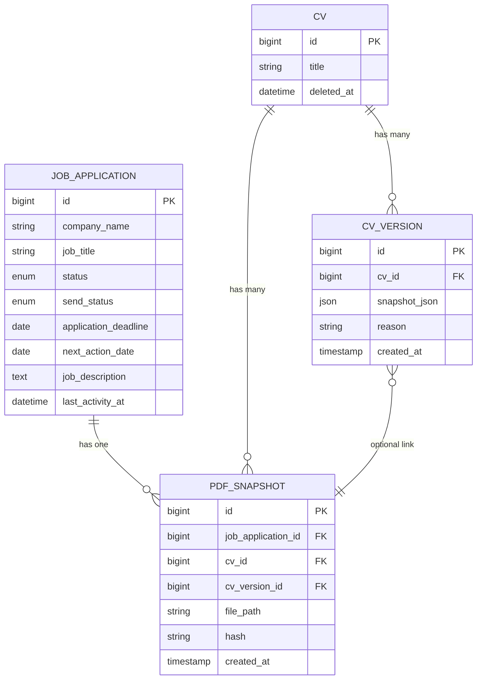
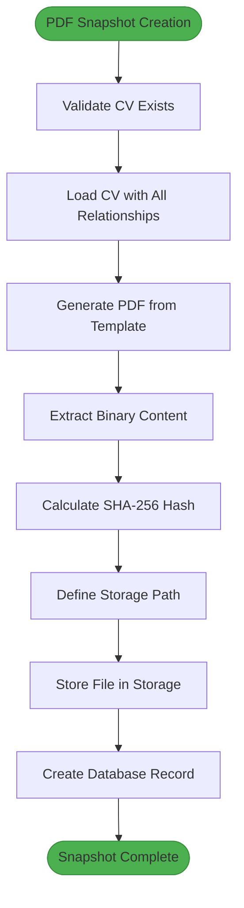

# PDF Snapshot Management

<cite>
**Referenced Files in This Document**   
- [PDFSnapshot.php](file://app/Models/PDFSnapshot.php)
- [PdfSnapshotService.php](file://app/Services/PdfSnapshotService.php)
- [JobApplicationObserver.php](file://app/Observers/JobApplicationObserver.php)
- [JobApplication.php](file://app/Models/JobApplication.php)
- [CVVersion.php](file://app/Models/CVVersion.php)
- [create_pdf_snapshots_table.php](file://database/migrations/2025_10_04_002642_create_pdf_snapshots_table.php)
- [PdfSnapshotServiceTest.php](file://tests/Unit/PdfSnapshotServiceTest.php)
- [PDFSnapshotResource.php](file://app/Filament/Resources/PDFSnapshots/PDFSnapshotResource.php)
- [filesystems.php](file://config/filesystems.php)
</cite>

## Table of Contents
1. [Introduction](#introduction)
2. [Data Model](#data-model)
3. [Core Relationships](#core-relationships)
4. [PDF Generation and Storage](#pdf-generation-and-storage)
5. [Lifecycle and Automation](#lifecycle-and-automation)
6. [Access and Security](#access-and-security)
7. [GDPR and Data Retention](#gdpr-and-data-retention)
8. [Troubleshooting](#troubleshooting)

## Introduction
The PDF Snapshot system provides immutable, verifiable records of CV exports at specific points in time. These snapshots serve as proof of submission for job applications and ensure exact reproducibility of CV content. This documentation details the data model, generation process, storage mechanisms, and operational considerations for managing PDF snapshots within the CV Builder application.

## Data Model
The `pdf_snapshots` table captures essential metadata about each generated PDF, ensuring integrity and traceability.

### Table Structure
| Field | Type | Constraints | Description |
|-------|------|-------------|-------------|
| id | bigint | PK, auto-increment | Unique identifier |
| job_application_id | bigint | FK → job_applications.id, unique | One snapshot per application |
| cv_id | bigint | FK → cvs.id, nullable | Reference to the CV used |
| cv_version_id | bigint | FK → cv_versions.id, nullable | Optional link to versioned CV state |
| file_path | string(500) | required, unique | Relative storage path |
| hash | string(64) | required | SHA-256 hash of PDF content |
| created_at | timestamp | auto | When the snapshot was generated |

### Field Details
- **job_application_id**: Ensures one snapshot per application with unique constraint
- **cv_id**: Nullable to maintain snapshot integrity even if original CV is deleted
- **cv_version_id**: Optional linkage for exact reproducibility of CV state
- **file_path**: Full relative path within storage system
- **hash**: Cryptographic SHA-256 hash for file integrity verification
- **created_at**: Timestamp of snapshot creation

**Section sources**
- [create_pdf_snapshots_table.php](file://database/migrations/2025_10_04_002642_create_pdf_snapshots_table.php#L1-L35)
- [PDFSnapshot.php](file://app/Models/PDFSnapshot.php#L1-L45)

## Core Relationships
PDF snapshots are integrated into the application's data model through well-defined relationships with CVs and job applications.



**Diagram sources**
- [PDFSnapshot.php](file://app/Models/PDFSnapshot.php#L1-L45)
- [JobApplication.php](file://app/Models/JobApplication.php#L1-L67)
- [CVVersion.php](file://app/Models/CVVersion.php#L1-L30)

### Relationship Details
- **JobApplication → PDFSnapshot**: One-to-one relationship ensuring each application has at most one snapshot
- **CV → PDFSnapshot**: One-to-many relationship allowing multiple snapshots across different applications
- **CV → CVVersion**: One-to-many relationship capturing historical states of a CV
- **PDFSnapshot → CVVersion**: Optional one-to-one relationship for exact reproducibility

**Section sources**
- [PDFSnapshot.php](file://app/Models/PDFSnapshot.php#L1-L45)
- [JobApplication.php](file://app/Models/JobApplication.php#L1-L67)
- [CVVersion.php](file://app/Models/CVVersion.php#L1-L30)

## PDF Generation and Storage
The system follows a structured process for generating and storing PDF snapshots with integrity verification.

### File Storage Configuration
Files are stored in the local disk configuration defined in `filesystems.php`:

```php
'local' => [
    'driver' => 'local',
    'root' => storage_path('app/private'),
    'serve' => true,
    'throw' => false,
    'report' => false,
],
```

**Section sources**
- [filesystems.php](file://config/filesystems.php#L1-L81)

### Naming Convention
PDF files follow a deterministic naming pattern:
```
pdf-snapshots/{job_application_id}_{hash}.pdf
```

Where:
- `{job_application_id}`: The ID of the associated job application
- `{hash}`: The SHA-256 hash of the PDF content (64 characters)

This pattern ensures:
- Predictable file location
- Built-in integrity verification via filename
- Prevention of duplicate files
- Easy identification of source application

### Generation Process
The `PdfSnapshotService` handles the complete generation workflow:

1. Validate that the job application has an associated CV
2. Load the CV with all related data (header, sections, experiences, etc.)
3. Generate PDF using the `cv.pdf` Blade template
4. Calculate SHA-256 hash of the binary PDF content
5. Store the file using the naming convention
6. Create database record with metadata



**Diagram sources**
- [PdfSnapshotService.php](file://app/Services/PdfSnapshotService.php#L9-L64)
- [PDFSnapshot.php](file://app/Models/PDFSnapshot.php#L1-L45)

**Section sources**
- [PdfSnapshotService.php](file://app/Services/PdfSnapshotService.php#L9-L64)
- [PdfSnapshotServiceTest.php](file://tests/Unit/PdfSnapshotServiceTest.php#L1-L60)

## Lifecycle and Automation
PDF snapshots are automatically created through event-driven architecture when job applications are sent.

### Creation Trigger
Snapshots are generated when a job application's `send_status` changes from "draft" to "sent":

```php
public function updated(JobApplication $jobApplication): void
{
    if ($jobApplication->wasChanged('send_status') &&
        $jobApplication->send_status === 'sent' &&
        ! $jobApplication->pdfSnapshot) {
        
        $pdfSnapshotService = app(PdfSnapshotService::class);
        $pdfSnapshotService->create($jobApplication);
    }
}
```

### Business Rules
- Snapshots are created only once per application
- The process fails gracefully if the CV is missing
- Errors are logged but do not prevent application updates
- Snapshots are immutable after creation
- No manual creation allowed through UI

### Observer Registration
The `JobApplicationObserver` is automatically registered to handle these events, ensuring the snapshot creation logic is decoupled from the application's core functionality.

**Section sources**
- [JobApplicationObserver.php](file://app/Observers/JobApplicationObserver.php#L1-L43)
- [JobApplication.php](file://app/Models/JobApplication.php#L1-L67)

## Access and Security
The system provides controlled access to PDF snapshots while maintaining security and integrity.

### Access Methods
- **Administrative Interface**: Filament CMS provides view-only access to snapshot metadata
- **Direct Download**: Authenticated users can download PDFs through the application
- **Hash Verification**: Users can verify file integrity by recalculating the hash

### Security Considerations
- Files are stored in `storage/app/private` directory
- Direct file access requires application authentication
- No public URLs are generated by default
- Hash verification protects against file corruption or tampering
- All access is logged through Laravel's logging system

### Download Process
When a user requests a PDF download:
1. Application verifies the user has appropriate permissions
2. File existence is confirmed in storage
3. File is streamed to the user with appropriate MIME type
4. No temporary files are created on the server

**Section sources**
- [PDFSnapshotResource.php](file://app/Filament/Resources/PDFSnapshots/PDFSnapshotResource.php#L1-L57)
- [filesystems.php](file://config/filesystems.php#L1-L81)

## GDPR and Data Retention
The system incorporates privacy considerations for personal data contained in CV snapshots.

### Data Minimization
- Only necessary CV data is included in snapshots
- No additional personal information is added during generation
- Snapshots reflect exactly what was submitted to employers

### Right to Erasure
- When a CV is soft-deleted, associated snapshots remain intact
- This preserves application history while respecting the user's choice to archive their CV
- Users can manually delete snapshots through administrative interface
- Complete data erasure requires manual cleanup of storage files

### Data Retention Policy
- Snapshots are retained as long as the associated job application exists
- No automatic cleanup is implemented
- Users can manually delete snapshots they no longer need
- Backup systems may retain copies according to their retention policies

### Integrity vs. Privacy
The system balances data integrity requirements with privacy considerations:
- Immutable snapshots provide verifiable submission records
- Hash verification ensures content hasn't been altered
- Users maintain control over data retention
- Soft-delete pattern allows archival without permanent loss

**Section sources**
- [PDFSnapshot.php](file://app/Models/PDFSnapshot.php#L1-L45)
- [JobApplication.php](file://app/Models/JobApplication.php#L1-L67)
- [CVVersion.php](file://app/Models/CVVersion.php#L1-L30)

## Troubleshooting
Common issues and their solutions for PDF snapshot management.

### Snapshot Not Created
**Symptoms**: Changing `send_status` to "sent" doesn't create a snapshot.

**Debug Steps**:
1. Verify the observer is registered:
```php
dd(JobApplication::getObservableEvents());
```
2. Check if CV is associated with the application
3. Test service manually:
```php
$app = JobApplication::find(1);
app(PdfSnapshotService::class)->create($app);
```

**Common Causes**:
- Observer not registered in service provider
- CV is null when send_status changes
- Storage disk misconfigured
- Template rendering errors

### File Not Found
**Symptoms**: Snapshot record exists but file cannot be downloaded.

**Causes**:
- Manual file deletion from storage
- Disk synchronization issues
- Incorrect file path configuration

### Hash Verification Failure
**Symptoms**: "Verify Hash" action shows failure.

**Causes**:
- File has been modified after creation
- Storage corruption
- Incomplete file write during creation

**Section sources**
- [PdfSnapshotService.php](file://app/Services/PdfSnapshotService.php#L9-L64)
- [JobApplicationObserver.php](file://app/Observers/JobApplicationObserver.php#L1-L43)
- [PdfSnapshotServiceTest.php](file://tests/Unit/PdfSnapshotServiceTest.php#L1-L60)