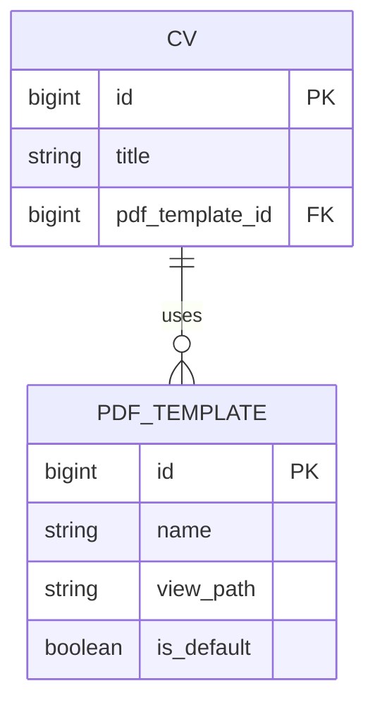
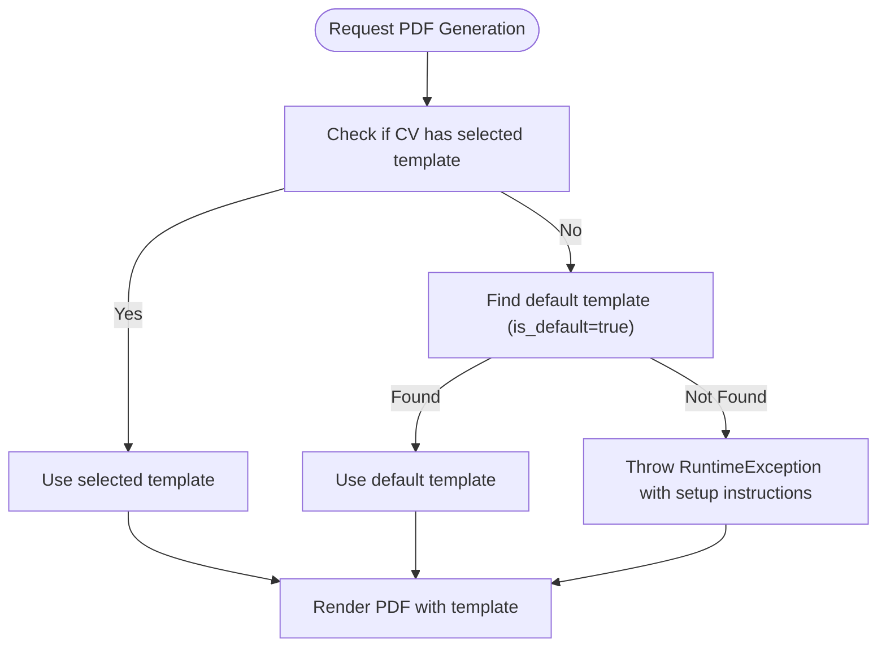
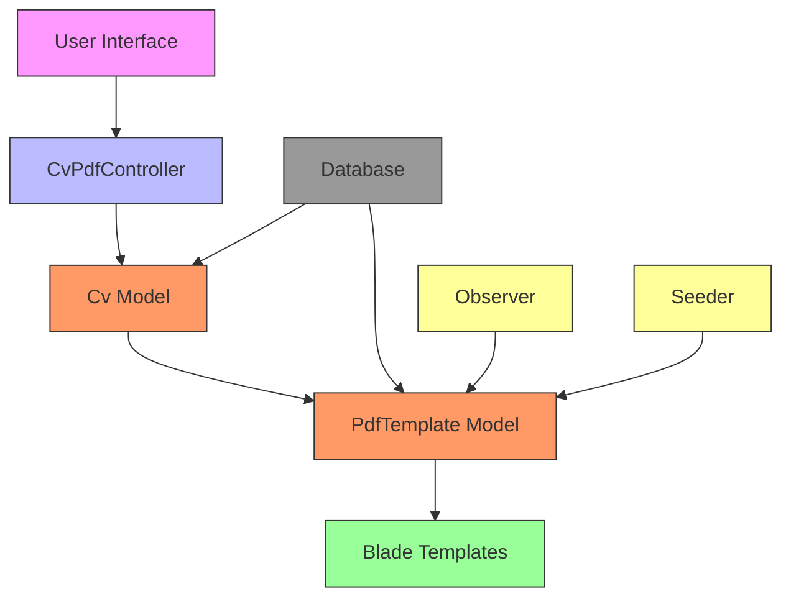

# PDF Template Data Model

<cite>
**Referenced Files in This Document**   
- [PdfTemplate.php](file://app/Models/PdfTemplate.php)
- [Cv.php](file://app/Models/Cv.php)
- [CvPdfController.php](file://app/Http/Controllers/CvPdfController.php)
- [create_pdf_templates_table.php](file://database/migrations/2025_10_04_205753_create_pdf_templates_table.php)
- [add_pdf_template_id_to_cvs.php](file://database/migrations/2025_10_04_205802_add_pdf_template_id_to_cvs.php)
- [PdfTemplateSeeder.php](file://database/seeders/PdfTemplateSeeder.php)
- [PdfTemplateObserver.php](file://app/Observers/PdfTemplateObserver.php)
- [default.blade.php](file://resources/views/cv/templates/default.blade.php)
- [modern.blade.php](file://resources/views/cv/templates/modern.blade.php)
- [classic.blade.php](file://resources/views/cv/templates/classic.blade.php)
</cite>

## Table of Contents
1. [Introduction](#introduction)
2. [Core Fields](#core-fields)
3. [Relationship with CV](#relationship-with-cv)
4. [Default Template Resolution](#default-template-resolution)
5. [Blade View Field](#blade-view-field)
6. [Data Validation and Integrity](#data-validation-and-integrity)
7. [Security Considerations](#security-considerations)
8. [Template Query Examples](#template-query-examples)
9. [Architecture Overview](#architecture-overview)

## Introduction
The PdfTemplate model defines the visual layout and styling for CV rendering in the application. It enables users to select from multiple predefined templates when generating PDF versions of their CVs. Each template is associated with a Blade view file that determines the HTML structure and CSS styling used during PDF generation. The system supports user-specific template selection while ensuring a default template is always available for rendering.

## Core Fields
The PdfTemplate model contains several key fields that define its behavior and metadata:

- **name**: A human-readable name for the template (e.g., "Default", "Modern", "Classic")
- **blade_view**: Stores the Blade template path used for rendering (e.g., "cv.templates.default")
- **is_default**: Boolean flag indicating whether this template is the system default
- **user_id**: Not present in the current implementation - templates are global rather than user-specific

The model also includes metadata fields such as slug, description, and preview_image_path to support administration and user interface presentation.

**Section sources**
- [PdfTemplate.php](file://app/Models/PdfTemplate.php#L1-L44)
- [create_pdf_templates_table.php](file://database/migrations/2025_10_04_205753_create_pdf_templates_table.php#L1-L36)

## Relationship with CV
The PdfTemplate model has a many-to-one relationship with the Cv model. Each CV can be associated with one template, while each template can be used by multiple CVs. This relationship is implemented through a foreign key constraint in the database.

The relationship is defined in the Cv model with a belongsTo relationship to PdfTemplate. When a CV is rendered to PDF, the system uses the selected template if specified, falling back to the default template if no selection exists.



**Diagram sources **
- [Cv.php](file://app/Models/Cv.php#L1-L367)
- [PdfTemplate.php](file://app/Models/PdfTemplate.php#L1-L44)

**Section sources**
- [Cv.php](file://app/Models/Cv.php#L1-L367)
- [add_pdf_template_id_to_cvs.php](file://database/migrations/2025_10_04_205802_add_pdf_template_id_to_cvs.php#L1-L37)

## Default Template Resolution
The system implements a robust default template resolution mechanism to ensure that every CV can be rendered even when no specific template is selected. The resolution logic follows these rules:

1. If a CV has a pdf_template_id set, use that template
2. If no template is selected, resolve to the default template (is_default = true)
3. The system guarantees exactly one default template exists at all times

The resolution occurs through the getTemplateAttribute accessor in the Cv model, which returns the associated template or falls back to the static default() method on the PdfTemplate model. This method queries for the template where is_default is true, throwing a descriptive exception if no default exists.



**Diagram sources **
- [Cv.php](file://app/Models/Cv.php#L1-L367)
- [PdfTemplate.php](file://app/Models/PdfTemplate.php#L1-L44)

**Section sources**
- [Cv.php](file://app/Models/Cv.php#L1-L367)
- [PdfTemplate.php](file://app/Models/PdfTemplate.php#L1-L44)

## Blade View Field
The blade_view field (stored as view_path in the database) contains the path to the Blade template file used for rendering the CV. This field follows Laravel's view naming convention, using dot notation to represent directory structure.

The field stores values such as "cv.templates.default", which corresponds to the file located at resources/views/cv/templates/default.blade.php. During PDF generation, the CvPdfController uses this path to render the appropriate template using the Spatie Laravel-PDF package.

The system validates that the view path exists before rendering, ensuring that template references are valid. The three initial templates (default, modern, classic) each have corresponding Blade files with distinct styling approaches:

- **Default**: Clean design with accent colors and modern typography
- **Modern**: Two-column layout with sidebar for contact information and skills
- **Classic**: Traditional serif font with minimal styling and classic CV formatting

**Section sources**
- [CvPdfController.php](file://app/Http/Controllers/CvPdfController.php#L1-L70)
- [default.blade.php](file://resources/views/cv/templates/default.blade.php#L1-L280)
- [modern.blade.php](file://resources/views/cv/templates/modern.blade.php#L1-L316)
- [classic.blade.php](file://resources/views/cv/templates/classic.blade.php#L1-L227)

## Data Validation and Integrity
The system implements multiple layers of data validation and integrity constraints to maintain template consistency:

1. **Database Constraints**: 
   - Unique constraint on slug field
   - Foreign key constraint with nullOnDelete for pdf_template_id in CVs
   - Index on is_default for performance

2. **Application Logic**:
   - PdfTemplateObserver ensures only one template can be default at a time
   - Prevents deletion of the default template
   - Automatically unsets other default flags when a new default is set

3. **Validation Rules**:
   - Required fields: name, slug, view_path, preview_image_path
   - Boolean casting for is_default
   - Fillable array protection

The PdfTemplateObserver uses Eloquent events to enforce business rules. When a template is updated and marked as default, the observer automatically unsets the default flag on all other templates. This prevents the possibility of having multiple default templates.

**Section sources**
- [PdfTemplateObserver.php](file://app/Observers/PdfTemplateObserver.php#L1-L33)
- [PdfTemplate.php](file://app/Models/PdfTemplate.php#L1-L44)
- [create_pdf_templates_table.php](file://database/migrations/2025_10_04_205753_create_pdf_templates_table.php#L1-L36)

## Security Considerations
The template system incorporates several security measures to prevent common vulnerabilities:

1. **Template Isolation**: Templates are pre-defined and cannot be created or modified by end users. Only administrators can add new templates through code deployment.

2. **Path Validation**: The system uses predefined view paths rather than accepting user input for template selection, preventing directory traversal attacks.

3. **Data Separation**: Template selection is isolated to the current user's CVs through standard authentication and authorization controls in the Filament admin interface.

4. **Error Handling**: The system provides descriptive error messages for missing default templates but does not expose sensitive system information.

5. **Input Sanitization**: All template data is validated through Eloquent model casting and database constraints.

The system follows the principle of least privilege by restricting template management to administrative users only. Template files are stored in the resources/views directory, which is protected from direct web access by Laravel's directory structure.

**Section sources**
- [PdfTemplate.php](file://app/Models/PdfTemplate.php#L1-L44)
- [CvPdfController.php](file://app/Http/Controllers/CvPdfController.php#L1-L70)
- [PdfTemplateObserver.php](file://app/Observers/PdfTemplateObserver.php#L1-L33)

## Template Query Examples
The following examples demonstrate common queries for retrieving templates and resolving the active template for a CV:

**Retrieve all user-accessible templates:**
```php
$templates = PdfTemplate::all();
```

**Find a specific template by slug:**
```php
$template = PdfTemplate::where('slug', 'modern')->first();
```

**Get the default template:**
```php
$defaultTemplate = PdfTemplate::default();
```

**Resolve the active template for a CV:**
```php
$cv = Cv::with('pdfTemplate')->find($id);
$activeTemplate = $cv->template; // Uses accessor logic
```

**Get all CVs using a specific template:**
```php
$cvs = Cv::where('pdf_template_id', $templateId)->get();
```

These queries leverage Eloquent relationships and the custom accessor method to provide a clean API for template management and resolution.

**Section sources**
- [PdfTemplate.php](file://app/Models/PdfTemplate.php#L1-L44)
- [Cv.php](file://app/Models/Cv.php#L1-L367)

## Architecture Overview
The PDF template system follows a clean architectural pattern with separation of concerns between data model, business logic, and presentation layers.



**Diagram sources **
- [CvPdfController.php](file://app/Http/Controllers/CvPdfController.php#L1-L70)
- [Cv.php](file://app/Models/Cv.php#L1-L367)
- [PdfTemplate.php](file://app/Models/PdfTemplate.php#L1-L44)
- [PdfTemplateObserver.php](file://app/Observers/PdfTemplateObserver.php#L1-L33)
- [PdfTemplateSeeder.php](file://database/seeders/PdfTemplateSeeder.php#L1-L50)