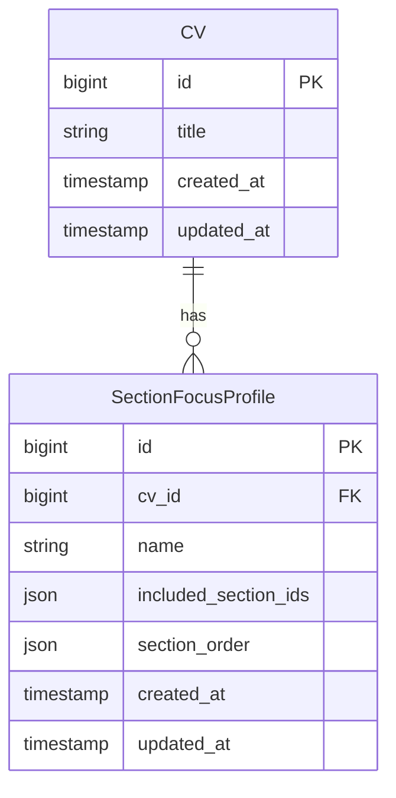
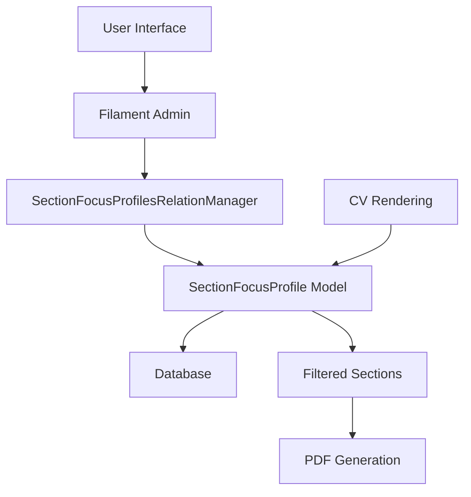

# Section Focus Profile Data Model

<cite>
**Referenced Files in This Document**   
- [SectionFocusProfile.php](file://app/Models/SectionFocusProfile.php)
- [Cv.php](file://app/Models/Cv.php#L148-L175)
- [2025_10_04_101831_create_section_focus_profiles_table.php](file://database/migrations/2025_10_04_101831_create_section_focus_profiles_table.php)
- [SectionFocusProfileFactory.php](file://database/factories/SectionFocusProfileFactory.php)
- [SectionFocusProfileTest.php](file://tests/Feature/SectionFocusProfileTest.php)
- [SectionFocusProfilesRelationManager.php](file://app/Filament/Resources/Cvs/RelationManagers/SectionFocusProfilesRelationManager.php)
</cite>

## Table of Contents
1. [Introduction](#introduction)
2. [Core Fields](#core-fields)
3. [Relationship with CV](#relationship-with-cv)
4. [Data Validation Rules](#data-validation-rules)
5. [Performance Considerations](#performance-considerations)
6. [Query Examples](#query-examples)
7. [Architecture Overview](#architecture-overview)

## Introduction
The SectionFocusProfile entity enables non-destructive tailoring of CVs by allowing users to create named presets for section ordering and visibility. This data model supports the creation of multiple profiles per CV, each defining a custom arrangement of sections without modifying the original CV structure. The system allows instant switching between different views of the same CV, making it ideal for job applications requiring different emphasis (e.g., Frontend Focus, Backend Focus, Management Focus).

## Core Fields
The SectionFocusProfile entity contains the following fields that define its structure and behavior:

| Field | Type | Constraints | Description |
|-------|------|-------------|-------------|
| `id` | bigint | PK, auto-increment | Primary key identifier |
| `cv_id` | bigint | FK → cvs.id, NOT NULL, cascadeOnDelete | Foreign key linking to parent CV |
| `name` | varchar(255) | NOT NULL | Descriptive name for the profile (e.g., "Frontend Focus") |
| `included_section_ids` | json | NOT NULL | JSON array containing IDs of sections to include in the filtered view |
| `section_order` | json | NOT NULL | JSON array defining the display order of included sections |
| `created_at` | timestamp | | Timestamp of profile creation |
| `updated_at` | timestamp | | Timestamp of last modification |

The `included_section_ids` field stores an ordered list of section identifiers that should be visible when the profile is applied. The `section_order` field contains the same section IDs but arranged in the desired display sequence, allowing users to reorder sections without affecting the original CV's structure.

**Section sources**
- [2025_10_04_101831_create_section_focus_profiles_table.php](file://database/migrations/2025_10_04_101831_create_section_focus_profiles_table.php#L10-L18)
- [SectionFocusProfile.php](file://app/Models/SectionFocusProfile.php#L10-L18)

## Relationship with CV
The SectionFocusProfile has a many-to-one relationship with the CV entity, implemented through a foreign key constraint. Each CV can have multiple SectionFocusProfiles, but each profile belongs to exactly one CV. This relationship is defined by the `cv_id` field which references the `id` field in the `cvs` table with cascading delete behavior.

The relationship is implemented in the SectionFocusProfile model with a `belongsTo` relationship method, while the CV model contains a `hasMany` relationship method named `sectionFocusProfiles`. When a profile is applied during CV rendering, the system filters sections based on the `included_section_ids` array and reorders them according to the `section_order` array, returning a collection of sections in the specified custom order.

This design enables non-destructive CV tailoring where the original CV structure remains unchanged regardless of how many profiles are created or applied.



**Diagram sources**
- [SectionFocusProfile.php](file://app/Models/SectionFocusProfile.php#L24)
- [Cv.php](file://app/Models/Cv.php#L148)

**Section sources**
- [SectionFocusProfile.php](file://app/Models/SectionFocusProfile.php#L24)
- [Cv.php](file://app/Models/Cv.php#L148-L150)

## Data Validation Rules
The SectionFocusProfile entity enforces several validation rules to ensure data integrity and consistency:

1. **Name Uniqueness**: Profile names must be unique within the context of a single CV, enforced by a unique database constraint on the combination of `cv_id` and `name`.
2. **Required Fields**: The `name`, `included_section_ids`, and `section_order` fields are all required and cannot be null.
3. **Array Validation**: Both `included_section_ids` and `section_order` must be valid JSON arrays.
4. **Section ID Validation**: All section IDs in both arrays must exist in the parent CV's sections.
5. **Content Validation**: The `included_section_ids` array must contain at least one section ID.
6. **Consistency**: The `section_order` array must contain exactly the same section IDs as `included_section_ids`, though in potentially different order.

These validation rules are enforced at both the application level and database level, with the unique constraint preventing duplicate profile names per CV and the foreign key constraint ensuring referential integrity.

**Section sources**
- [SectionFocusProfileTest.php](file://tests/Feature/SectionFocusProfileTest.php#L20-L38)
- [2025_10_04_101831_create_section_focus_profiles_table.php](file://database/migrations/2025_10_04_101831_create_section_focus_profiles_table.php#L18)

## Performance Considerations
Applying SectionFocusProfiles during CV rendering is designed to be efficient with O(n) complexity where n is the number of sections. The process involves two main operations: filtering and reordering. First, sections are filtered using a database query with `whereIn` clause on the `included_section_ids` array. Then, the filtered sections are reordered in memory according to the `section_order` array.

The implementation in the CV model's `getSectionsWithProfile` method ensures optimal performance by:
- Using a single database query to retrieve filtered sections
- Performing reordering in memory with a simple loop through the `section_order` array
- Leveraging Laravel's collection methods for efficient lookups

Since profile application is a read-only operation that doesn't modify the original CV data, multiple profiles can be applied instantly without performance degradation. The system is also designed to handle empty profiles (with no included sections) gracefully, returning an empty collection without errors.

**Section sources**
- [Cv.php](file://app/Models/Cv.php#L148-L175)

## Query Examples
The following examples demonstrate common queries for retrieving and applying SectionFocusProfile data:

**Retrieve all profiles for a CV:**
```php
$cv->sectionFocusProfiles;
```

**Apply a profile to get filtered and ordered sections:**
```php
$filteredSections = $cv->getSectionsWithProfile($profileId);
```

**Create a new profile:**
```php
$profile = SectionFocusProfile::create([
    'cv_id' => $cv->id,
    'name' => 'Frontend Focus',
    'included_section_ids' => [1, 3, 5],
    'section_order' => [5, 3, 1]
]);
```

**Check if a profile exists with a specific name for a CV:**
```php
$exists = SectionFocusProfile::where('cv_id', $cv->id)
    ->where('name', 'Frontend Focus')
    ->exists();
```

These queries leverage the Eloquent ORM to provide a clean, readable interface for working with SectionFocusProfile data while maintaining optimal database performance.

**Section sources**
- [SectionFocusProfileTest.php](file://tests/Feature/SectionFocusProfileTest.php#L41-L74)
- [Cv.php](file://app/Models/Cv.php#L148-L175)

## Architecture Overview
The SectionFocusProfile system is integrated into the application architecture as a relation manager within the Filament admin interface. This allows users to create, edit, and manage profiles directly from the CV editing screen.

The architecture follows a clean separation of concerns:
- **Database Layer**: Stores profile data with proper constraints and indexes
- **Model Layer**: Implements relationships and business logic
- **Service Layer**: Handles profile application during CV rendering
- **Presentation Layer**: Provides UI for profile management in Filament

The system is designed to be non-destructive, meaning that applying profiles does not modify the original CV data. This enables users to create multiple tailored views of the same CV without risk of data loss or corruption.



**Diagram sources**
- [SectionFocusProfilesRelationManager.php](file://app/Filament/Resources/Cvs/RelationManagers/SectionFocusProfilesRelationManager.php)
- [SectionFocusProfile.php](file://app/Models/SectionFocusProfile.php)

**Section sources**
- [SectionFocusProfilesRelationManager.php](file://app/Filament/Resources/Cvs/RelationManagers/SectionFocusProfilesRelationManager.php)
- [SectionFocusProfile.php](file://app/Models/SectionFocusProfile.php)