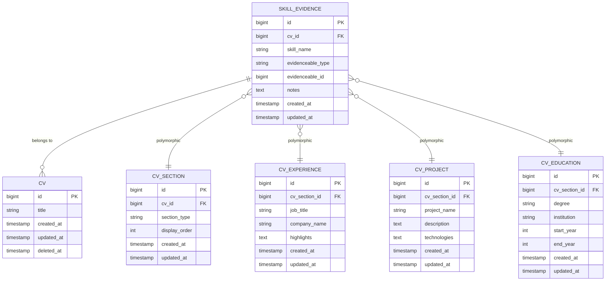
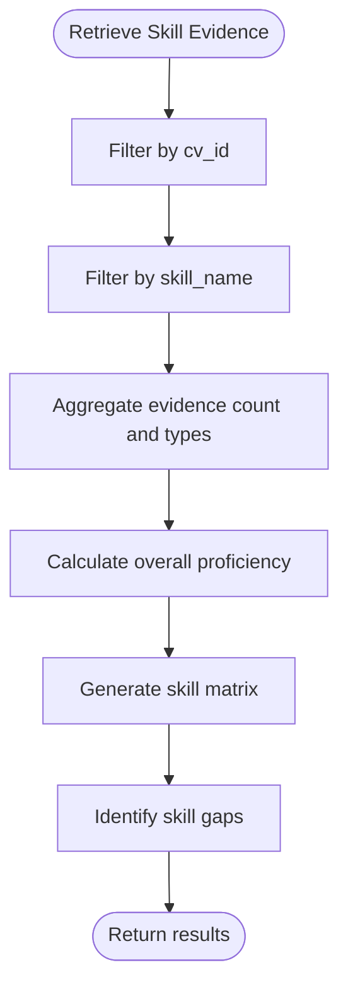

# Skill Evidence Data Model

<cite>
**Referenced Files in This Document**   
- [SkillEvidence.php](file://app/Models/SkillEvidence.php)
- [create_skill_evidence_table.php](file://database/migrations/2025_10_04_101842_create_skill_evidence_table.php)
- [Cv.php](file://app/Models/Cv.php)
- [SkillEvidenceRelationManager.php](file://app/Filament/Resources/Cvs/RelationManagers/SkillEvidenceRelationManager.php)
- [Phase3DemoSeeder.php](file://database/seeders/Phase3DemoSeeder.php)
- [SkillEvidenceTest.php](file://tests/Feature/SkillEvidenceTest.php)
- [skill-evidence.blade.php](file://resources/views/filament/infolists/skill-evidence.blade.php)
</cite>

## Table of Contents
1. [Introduction](#introduction)
2. [Core Fields](#core-fields)
3. [Polymorphic Relationship](#polymorphic-relationship)
4. [Foreign Key Constraints and Indexing](#foreign-key-constraints-and-indexing)
5. [Data Validation Rules](#data-validation-rules)
6. [Query Patterns](#query-patterns)
7. [Use Cases](#use-cases)
8. [Conclusion](#conclusion)

## Introduction
The SkillEvidence entity serves as a critical component in the CV Builder application, enabling users to link specific skills to various experiences, projects, or educational entries within their CVs. This data model supports the creation of a robust skill matrix by allowing evidence of skill proficiency to be tied to concrete examples from a user's professional history. The design emphasizes flexibility through a polymorphic relationship, ensuring that skill evidence can be associated with multiple types of content without requiring separate tables for each type. This documentation provides a comprehensive overview of the SkillEvidence data model, detailing its structure, relationships, constraints, and usage patterns.

**Section sources**
- [SkillEvidence.php](file://app/Models/SkillEvidence.php#L1-L36)
- [create_skill_evidence_table.php](file://database/migrations/2025_10_04_101842_create_skill_evidence_table.php#L1-L36)

## Core Fields
The SkillEvidence entity contains several key fields that define its functionality and relationships within the system. These fields include `cv_id`, `skill_name`, `evidenceable_type`, `evidenceable_id`, and `notes`. The `cv_id` field establishes a direct relationship with the CV to which the skill evidence belongs, ensuring that all evidence is scoped to a specific CV. The `skill_name` field stores the name of the skill being evidenced, such as "React" or "Python," and is used for both display and search purposes. The `evidenceable_type` and `evidenceable_id` fields together form a polymorphic relationship, allowing the skill evidence to reference different types of content, such as experiences, projects, or education entries. Finally, the `notes` field provides an optional space for additional context or explanation regarding how the referenced content demonstrates the skill.

**Section sources**
- [SkillEvidence.php](file://app/Models/SkillEvidence.php#L10-L18)
- [create_skill_evidence_table.php](file://database/migrations/2025_10_04_101842_create_skill_evidence_table.php#L10-L18)

## Polymorphic Relationship
The SkillEvidence entity leverages a polymorphic relationship to link skills to various types of evidence, including experiences, projects, and education entries. This relationship is implemented using the `evidenceable_type` and `evidenceable_id` fields, which together specify the type and ID of the related model. For example, a skill like "Laravel" can be linked to a specific experience (`CvExperience`) or a project (`CvProject`) by setting the `evidenceable_type` to the appropriate class and the `evidenceable_id` to the corresponding record's ID. This design allows for maximum flexibility, enabling users to demonstrate their skills across multiple contexts without requiring separate tables for each type of evidence. The polymorphic relationship is defined in the `evidenceable()` method of the SkillEvidence model, which uses Laravel's `morphTo()` function to establish the dynamic association.

**Diagram sources**
- [SkillEvidence.php](file://app/Models/SkillEvidence.php#L28-L32)
- [create_skill_evidence_table.php](file://database/migrations/2025_10_04_101842_create_skill_evidence_table.php#L14-L17)

**Section sources**
- [SkillEvidence.php](file://app/Models/SkillEvidence.php#L28-L32)
- [create_skill_evidence_table.php](file://database/migrations/2025_10_04_101842_create_skill_evidence_table.php#L14-L17)

## Foreign Key Constraints and Indexing
The SkillEvidence table includes several foreign key constraints and indexes to ensure data integrity and optimize query performance. The `cv_id` field is constrained to reference the `id` column of the `cvs` table, with cascading deletes configured to automatically remove associated skill evidence when a CV is deleted. This ensures that orphaned records do not persist in the database. To facilitate efficient lookups, indexes are created on the `cv_id`, `skill_name`, and a composite index on `evidenceable_type` and `evidenceable_id`. Additionally, a unique constraint is applied to the combination of `cv_id`, `skill_name`, `evidenceable_type`, and `evidenceable_id` to prevent duplicate entries for the same skill and evidence source within a single CV. These constraints and indexes collectively enhance the reliability and performance of the SkillEvidence entity.

**Section sources**
- [create_skill_evidence_table.php](file://database/migrations/2025_10_04_101842_create_skill_evidence_table.php#L10-L25)

## Data Validation Rules
Data validation for the SkillEvidence entity is enforced at both the database and application levels to ensure the integrity and consistency of the stored information. At the database level, the `skill_name` field is defined as a non-nullable string, requiring that every skill evidence record includes a valid skill name. The `evidenceable_type` and `evidenceable_id` fields are also required, ensuring that each record properly references a valid piece of evidence. Application-level validation is implemented through Laravel's Eloquent model, where the `fillable` array specifies which fields can be mass-assigned, preventing unauthorized modifications. Additionally, a custom scope method, `scopeWhereSkillName`, enables case-insensitive searches for skill names, enhancing usability while maintaining data consistency.

**Section sources**
- [SkillEvidence.php](file://app/Models/SkillEvidence.php#L10-L20)
- [create_skill_evidence_table.php](file://database/migrations/2025_10_04_101842_create_skill_evidence_table.php#L10-L18)

## Query Patterns
Common query patterns for the SkillEvidence entity include retrieving all evidence for a specific skill category and calculating overall proficiency levels. To retrieve all evidence for a given skill, queries typically filter by the `cv_id` and `skill_name` fields, leveraging the index on `skill_name` for optimal performance. The `getSkillsWithEvidence` method in the Cv model aggregates skill evidence across all related records, providing a summary of skills with their respective evidence counts and types. This method is particularly useful for generating skill matrices and identifying skill gaps. Proficiency calculations can be derived by analyzing the quantity and quality of evidence for each skill, with more evidence generally indicating higher proficiency. These query patterns support advanced features such as AI-powered CV reviews and personalized skill recommendations.

**Diagram sources**
- [Cv.php](file://app/Models/Cv.php#L147-L194)
- [SkillEvidence.php](file://app/Models/SkillEvidence.php#L34-L36)

**Section sources**
- [Cv.php](file://app/Models/Cv.php#L147-L194)
- [SkillEvidence.php](file://app/Models/SkillEvidence.php#L34-L36)

## Use Cases
The SkillEvidence entity supports several key use cases within the CV Builder application, including generating skill matrices, identifying skill gaps, and facilitating AI-powered CV reviews. By linking skills to specific experiences, projects, or education entries, users can create a comprehensive overview of their competencies, which can be visualized as a skill matrix. This matrix helps users identify areas where they have strong evidence of proficiency and areas where additional evidence may be needed. During AI-powered reviews, the system analyzes the skill evidence to provide actionable suggestions for improving the CV, such as emphasizing certain experiences or adding missing skills. The polymorphic nature of the relationship allows for flexible and dynamic skill tracking, making it easier for users to tailor their CVs to specific job applications.

**Section sources**
- [Phase3DemoSeeder.php](file://database/seeders/Phase3DemoSeeder.php#L375-L439)
- [skill-evidence.blade.php](file://resources/views/filament/infolists/skill-evidence.blade.php#L1-L60)

## Conclusion
The SkillEvidence data model plays a vital role in enhancing the functionality of the CV Builder application by enabling users to link skills to concrete examples from their professional history. Through its flexible polymorphic relationship, robust foreign key constraints, and efficient indexing, the model supports a wide range of use cases, from generating skill matrices to facilitating AI-powered CV reviews. The careful design of core fields, combined with comprehensive data validation rules, ensures the integrity and consistency of the stored information. As the application continues to evolve, the SkillEvidence entity will remain a cornerstone of its ability to help users create tailored, evidence-based CVs that effectively showcase their skills and experiences.