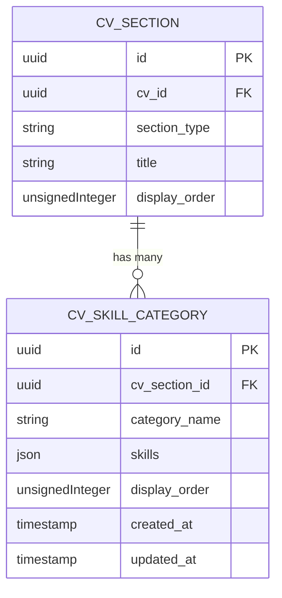
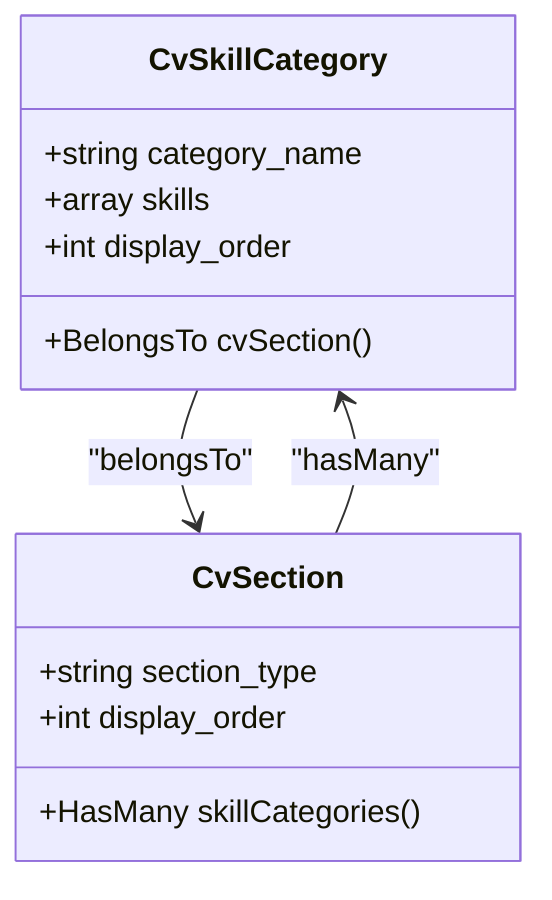
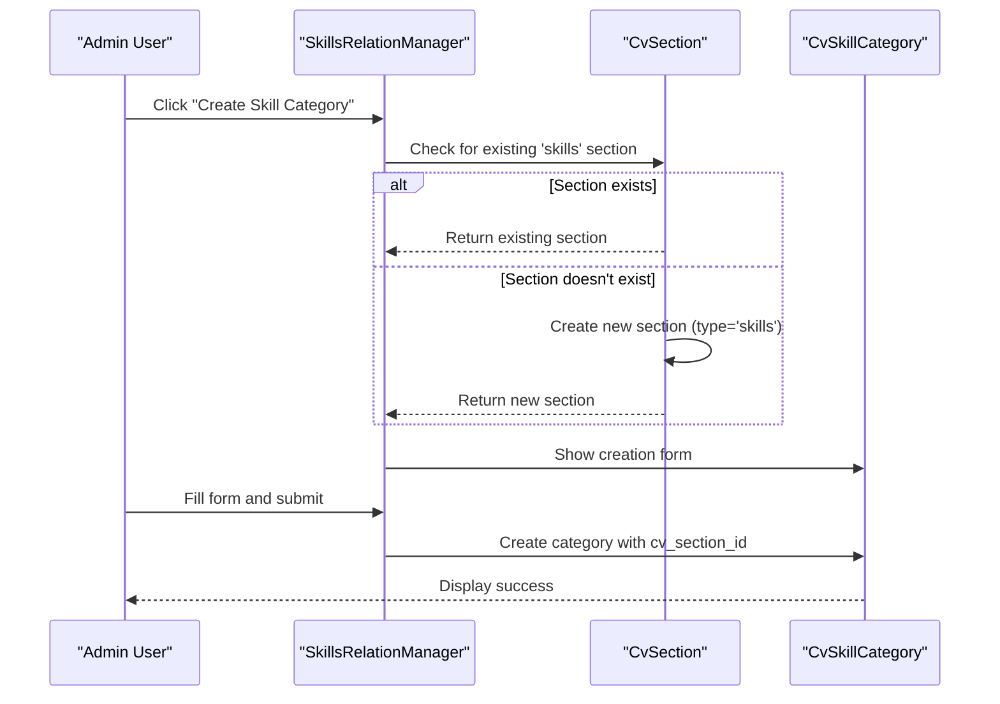
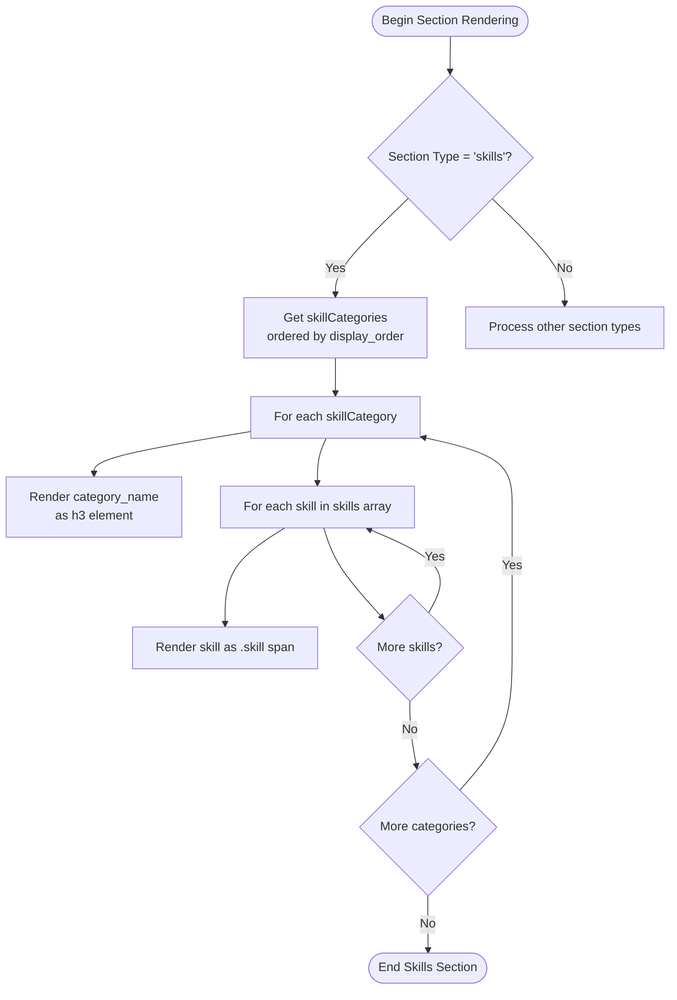

# Skills & Competencies Model

<cite>
**Referenced Files in This Document**   
- [CvSkillCategory.php](file://app/Models/CvSkillCategory.php)
- [SkillCategoriesRelationManager.php](file://app/Filament/Resources/Cvs/RelationManagers/SkillCategoriesRelationManager.php)
- [SkillsRelationManager.php](file://app/Filament/Resources/Cvs/RelationManagers/SkillsRelationManager.php)
- [create_cv_skill_categories_table.php](file://database/migrations/2025_10_03_201706_create_cv_skill_categories_table.php)
- [CvSection.php](file://app/Models/CvSection.php)
- [pdf.blade.php](file://resources/views/cv/pdf.blade.php)
</cite>

## Table of Contents
1. [Introduction](#introduction)
2. [Core Data Model](#core-data-model)
3. [Skill Category Structure](#skill-category-structure)
4. [Admin Interface Integration](#admin-interface-integration)
5. [Ordering and Display Logic](#ordering-and-display-logic)
6. [Data Consistency and Constraints](#data-consistency-and-constraints)
7. [Rendering in CV Output](#rendering-in-cv-output)
8. [Querying Skills by Category](#querying-skills-by-category)
9. [Conclusion](#conclusion)

## Introduction
The Skills & Competencies Model in the CV Builder system provides a structured way to organize and display skills within a CV. It enables users to group related skills into logical categories such as Programming Languages, Frameworks, or Soft Skills, and manage their presentation order. This document details the underlying data model, administrative interface integration, ordering mechanisms, and rendering behavior for skill categories.

**Section sources**
- [CvSkillCategory.php](file://app/Models/CvSkillCategory.php#L1-L25)
- [create_cv_skill_categories_table.php](file://database/migrations/2025_10_03_201706_create_cv_skill_categories_table.php#L1-L33)

## Core Data Model

The skill categorization system is built around the `CvSkillCategory` model, which represents a named group of skills associated with a specific CV section. Each category belongs to a `CvSection` of type "skills" and contains an ordered list of individual skills stored as JSON.



**Diagram sources**
- [CvSection.php](file://app/Models/CvSection.php#L1-L61)
- [CvSkillCategory.php](file://app/Models/CvSkillCategory.php#L1-L25)
- [create_cv_skill_categories_table.php](file://database/migrations/2025_10_03_201706_create_cv_skill_categories_table.php#L1-L33)

**Section sources**
- [CvSkillCategory.php](file://app/Models/CvSkillCategory.php#L1-L25)
- [create_cv_skill_categories_table.php](file://database/migrations/2025_10_03_201706_create_cv_skill_categories_table.php#L1-L33)

## Skill Category Structure

Each `CvSkillCategory` instance contains three primary fields:
- **category_name**: A required string (max 255 characters) representing the name of the skill group (e.g., "Programming Languages").
- **skills**: A JSON array storing individual skill names as strings.
- **display_order**: An unsigned integer used to determine the rendering sequence of categories.

The `skills` field is cast to an array in the model, enabling direct PHP array manipulation while persisting as JSON in the database.



**Diagram sources**
- [CvSkillCategory.php](file://app/Models/CvSkillCategory.php#L1-L25)
- [CvSection.php](file://app/Models/CvSection.php#L1-L61)

**Section sources**
- [CvSkillCategory.php](file://app/Models/CvSkillCategory.php#L1-L25)
- [CvSection.php](file://app/Models/CvSection.php#L1-L61)

## Admin Interface Integration

The Filament admin panel provides two complementary interfaces for managing skill categories:

1. **SkillCategoriesRelationManager**: Accessed via the CV's sections relationship, this interface displays all skill categories within the context of other CV sections and allows creation of new skill categories directly.

2. **SkillsRelationManager**: A dedicated interface focused solely on skill management, which automatically ensures the existence of a "skills" section before allowing category creation.

Both interfaces use a consistent form layout with:
- Text input for **Category Name**
- Repeater field for **Skills** (individual skill entries)
- Numeric input for **Display Order**

When creating a new category, the system automatically associates it with the correct `CvSection` of type "skills", creating the section if it doesn't already exist.



**Diagram sources**
- [SkillsRelationManager.php](file://app/Filament/Resources/Cvs/RelationManagers/SkillsRelationManager.php#L1-L109)
- [SkillCategoriesRelationManager.php](file://app/Filament/Resources/Cvs/RelationManagers/SkillCategoriesRelationManager.php#L1-L87)

**Section sources**
- [SkillsRelationManager.php](file://app/Filament/Resources/Cvs/RelationManagers/SkillsRelationManager.php#L1-L109)
- [SkillCategoriesRelationManager.php](file://app/Filament/Resources/Cvs/RelationManagers/SkillCategoriesRelationManager.php#L1-L87)

## Ordering and Display Logic

Skill categories are ordered by the `display_order` field in ascending order. This ordering is enforced at multiple levels:

1. **Database Level**: The `skillCategories()` relationship in `CvSection` includes `->orderBy('display_order')` to ensure consistent ordering.
2. **Admin Interface**: The table in `SkillsRelationManager` is `reorderable('display_order')`, allowing drag-and-drop reordering in the UI.
3. **Frontend Rendering**: The PDF template uses `@foreach($section->skillCategories as $skillCategory)` which respects the model's defined order.

The default `display_order` value is set to 1 in the admin interface, but actual ordering is determined by the relative values across all categories within a section.

**Section sources**
- [CvSection.php](file://app/Models/CvSection.php#L1-L61)
- [SkillsRelationManager.php](file://app/Filament/Resources/Cvs/RelationManagers/SkillsRelationManager.php#L1-L109)
- [pdf.blade.php](file://resources/views/cv/pdf.blade.php#L1-L135)

## Data Consistency and Constraints

The system maintains data consistency through several mechanisms:

- **Foreign Key Constraint**: The `cv_section_id` field references `cv_sections.id` with cascade delete, ensuring orphaned categories cannot exist.
- **Section Type Enforcement**: All skill categories are associated with a `CvSection` where `section_type = 'skills'`.
- **Required Fields**: Both `category_name` and `skills` are required in the admin interface.
- **Array Casting**: The `skills` attribute is cast to an array, ensuring consistent data structure regardless of storage format.

The migration creates an index on `['cv_section_id', 'display_order']` to optimize queries that retrieve categories in display order.

**Section sources**
- [create_cv_skill_categories_table.php](file://database/migrations/2025_10_03_201706_create_cv_skill_categories_table.php#L1-L33)
- [CvSkillCategory.php](file://app/Models/CvSkillCategory.php#L1-L25)
- [SkillsRelationManager.php](file://app/Filament/Resources/Cvs/RelationManagers/SkillsRelationManager.php#L1-L109)

## Rendering in CV Output

Skill categories are rendered in the final CV output (PDF and web view) through the `pdf.blade.php` template. The rendering process follows this structure:

1. Iterate through all sections sorted by `display_order`
2. For sections where `section_type === 'skills'`:
   - Iterate through associated `skillCategories`
   - Display each category name as an `<h3>` heading
   - Render individual skills as styled `<span>` elements within a flex container

The CSS styling creates a tag-like appearance for individual skills, with consistent spacing and visual separation between categories.



**Diagram sources**
- [pdf.blade.php](file://resources/views/cv/pdf.blade.php#L1-L135)
- [CvSection.php](file://app/Models/CvSection.php#L1-L61)

**Section sources**
- [pdf.blade.php](file://resources/views/cv/pdf.blade.php#L1-L135)

## Querying Skills by Category

To retrieve skills by category programmatically, use the Eloquent relationship chain:

```php
$cv = Cv::with(['sections.skillCategories' => function($query) {
    $query->orderBy('display_order');
}])->find($cvId);

$skillsSection = $cv->sections->where('section_type', 'skills')->first();

foreach ($skillsSection->skillCategories as $category) {
    echo $category->category_name . ": ";
    echo implode(', ', $category->skills);
}
```

Alternatively, query directly by category name:

```php
$categories = CvSkillCategory::whereHas('cvSection.cv', function($query) use ($cvId) {
    $query->where('id', $cvId);
})->where('category_name', 'like', '%Programming%')
  ->orderBy('display_order')
  ->get();
```

**Section sources**
- [CvSkillCategory.php](file://app/Models/CvSkillCategory.php#L1-L25)
- [CvSection.php](file://app/Models/CvSection.php#L1-L61)

## Conclusion

The Skills & Competencies Model provides a flexible and user-friendly system for organizing skills within CVs. By combining a simple JSON-based storage approach with robust admin interface integration and consistent ordering logic, it enables users to effectively showcase their abilities in a structured format. The tight integration between the data model, Filament admin components, and rendering templates ensures a seamless experience from data entry to final output.