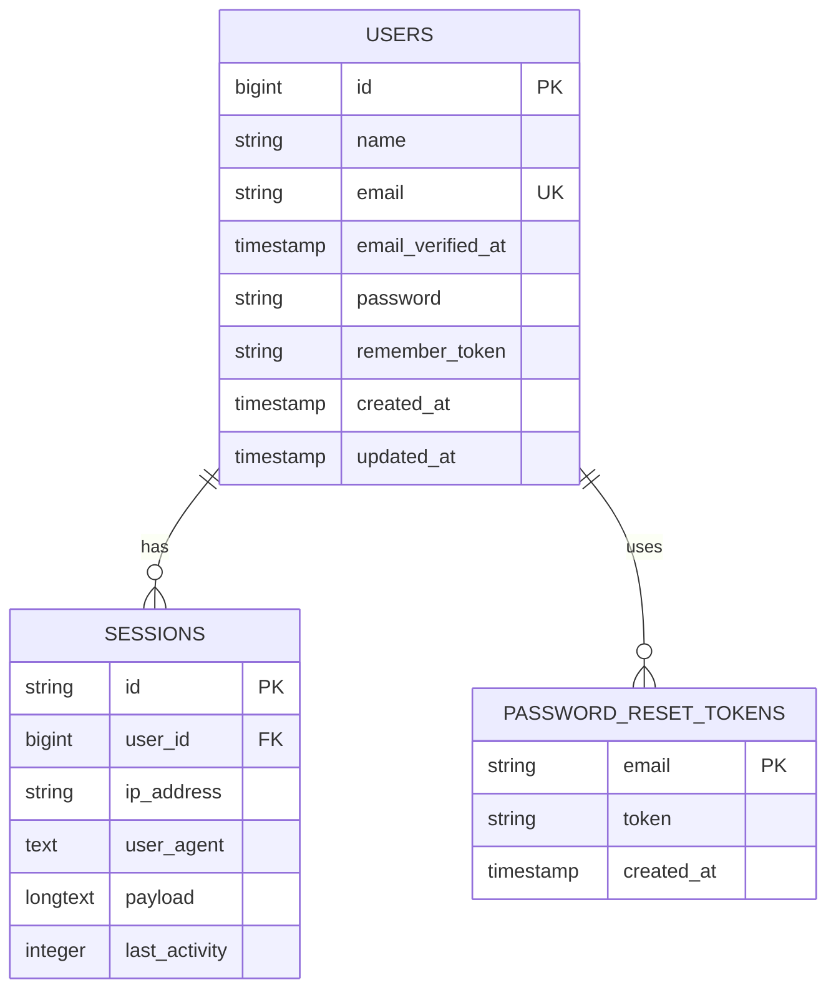
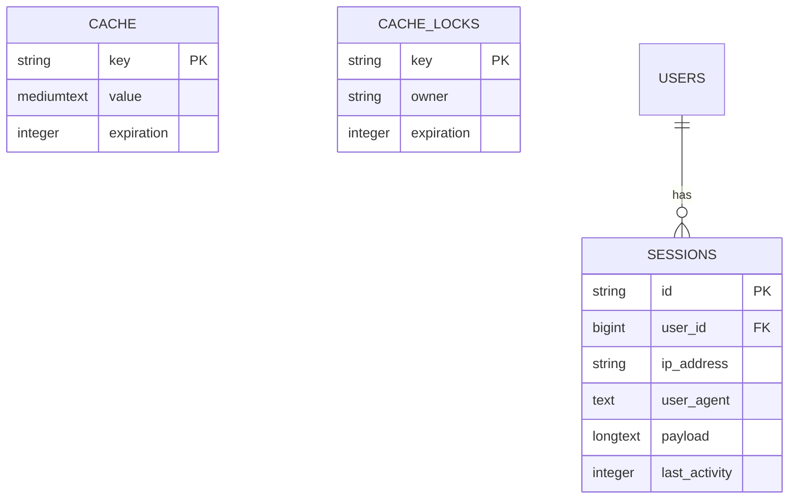
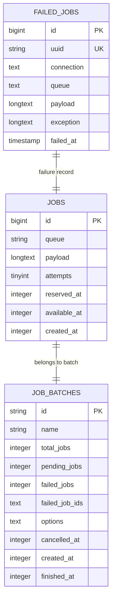
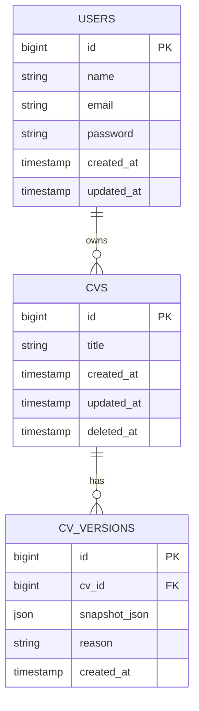

# System Infrastructure Tables

<cite>
**Referenced Files in This Document**   
- [create_users_table.php](file://database/migrations/0001_01_01_000000_create_users_table.php)
- [User.php](file://app/Models/User.php)
- [auth.php](file://config/auth.php)
- [create_cache_table.php](file://database/migrations/0001_01_01_000001_create_cache_table.php)
- [create_jobs_table.php](file://database/migrations/0001_01_01_000002_create_jobs_table.php)
- [Cv.php](file://app/Models/Cv.php)
- [create_cv_versions_table.php](file://database/migrations/2025_10_04_002612_create_cv_versions_table.php)
</cite>

## Table of Contents
1. [Introduction](#introduction)
2. [Users Table Structure and Authentication](#users-table-structure-and-authentication)
3. [Laravel Cache and Session Tables](#laravel-cache-and-session-tables)
4. [Job Queue Management Tables](#job-queue-management-tables)
5. [Relationship Between Users and Application Models](#relationship-between-users-and-application-models)
6. [Laravel Authentication System Integration](#laravel-authentication-system-integration)
7. [Security Considerations](#security-considerations)
8. [Example Queries and Functional Impact](#example-queries-and-functional-impact)
9. [Conclusion](#conclusion)

## Introduction
This document provides a detailed analysis of the core infrastructure tables in the Laravel-based CV Builder application. It focuses on the standard Laravel tables used for authentication, session management, caching, and job queuing, as well as their integration with the application's domain models. The system leverages Laravel's built-in authentication and queue systems with minimal customization, ensuring reliability and adherence to framework best practices.

## Users Table Structure and Authentication

The `users` table serves as the foundation for user authentication and ownership within the application. It stores essential user information and supports Laravel's native authentication mechanisms.

**Diagram sources**
- [create_users_table.php](file://database/migrations/0001_01_01_000000_create_users_table.php#L13-L37)
- [User.php](file://app/Models/User.php#L1-L48)

**Section sources**
- [create_users_table.php](file://database/migrations/0001_01_01_000000_create_users_table.php#L13-L37)
- [User.php](file://app/Models/User.php#L1-L48)

## Laravel Cache and Session Tables

Laravel's default cache and session tables provide mechanisms for temporary data storage and user session persistence. These tables are automatically managed by the framework and require no application-level customization.

The `cache` table stores key-value pairs with expiration timestamps, enabling efficient temporary data retrieval. The `cache_locks` table supports atomic operations on cached items, preventing race conditions in multi-process environments. The `sessions` table maintains user session data, linking each session to a user via the `user_id` foreign key when authenticated.

**Diagram sources**
- [create_users_table.php](file://database/migrations/0001_01_01_000000_create_users_table.php#L31-L37)
- [create_cache_table.php](file://database/migrations/0001_01_01_000001_create_cache_table.php#L13-L26)

**Section sources**
- [create_cache_table.php](file://database/migrations/0001_01_01_000001_create_cache_table.php#L13-L26)

## Job Queue Management Tables

The application utilizes Laravel's queue system for background job processing, with the `jobs`, `job_batches`, and `failed_jobs` tables providing robust task management capabilities.

The `jobs` table stores queued jobs with their payload, queue name, and execution metadata including attempts and availability time. The `job_batches` table enables tracking of batched jobs, allowing the application to monitor progress and handle completion logic. The `failed_jobs` table captures any jobs that encountered exceptions during processing, including the full exception trace for debugging purposes.

These tables support asynchronous processing of tasks such as PDF generation and data exports, improving application responsiveness and reliability.

**Diagram sources**
- [create_jobs_table.php](file://database/migrations/0001_01_01_000002_create_jobs_table.php#L13-L50)

**Section sources**
- [create_jobs_table.php](file://database/migrations/0001_01_01_000002_create_jobs_table.php#L13-L50)

## Relationship Between Users and Application Models

While the core `users` table does not directly contain a `user_id` foreign key in other tables in this specific implementation, the ownership pattern is established through Laravel's authentication system and application logic. The `cvs` table (and related models) are owned by users through the authentication context, with access control enforced at the application level.

The `cv_versions` table demonstrates this relationship pattern, where version snapshots are tied to CVs, which in turn belong to authenticated users. This indirect ownership model allows for flexible data organization while maintaining security through authentication middleware and policy enforcement.

**Diagram sources**
- [create_users_table.php](file://database/migrations/0001_01_01_000000_create_users_table.php#L13-L20)
- [create_cvs_table.php](file://database/migrations/2025_10_03_201646_create_cvs_table.php#L13-L20)
- [create_cv_versions_table.php](file://database/migrations/2025_10_04_002612_create_cv_versions_table.php#L13-L20)
- [Cv.php](file://app/Models/Cv.php#L1-L134)

**Section sources**
- [Cv.php](file://app/Models/Cv.php#L1-L134)
- [CVVersion.php](file://app/Models/CVVersion.php#L1-L29)

## Laravel Authentication System Integration

The application integrates Laravel's built-in authentication system through the `auth.php` configuration file, which defines the default web guard using session-based authentication with the Eloquent user provider. The `User` model extends Laravel's `Authenticatable` class, implementing the necessary interfaces for authentication, authorization, and notification.

Authentication is configured to use the `users` table with email-based login, password hashing, and optional email verification. Password reset functionality is supported through the `password_reset_tokens` table, with configurable expiration and throttling to prevent abuse. Session management is handled through the database session driver, storing session data in the `sessions` table with the user ID linked when authenticated.

This standard Laravel authentication setup provides a secure foundation for user management without requiring custom implementation.

**Section sources**
- [auth.php](file://config/auth.php#L1-L115)
- [User.php](file://app/Models/User.php#L1-L48)

## Security Considerations

The application follows Laravel's security best practices for password storage and session management. Passwords are automatically hashed using Laravel's bcrypt-based hashing mechanism, as indicated by the `password` => 'hashed' cast in the `User` model. The `password` field is also hidden from model serialization to prevent accidental exposure in API responses.

Session data is stored securely in the database with the user ID properly indexed for performance. The remember token mechanism allows for persistent login while maintaining security. The application benefits from Laravel's built-in protections against common vulnerabilities such as CSRF, XSS, and SQL injection through Eloquent ORM usage.

Authentication guards and password brokers are properly configured in the `auth.php` file, with sensible defaults for password reset expiration (60 minutes) and throttling (60 seconds between attempts).

**Section sources**
- [User.php](file://app/Models/User.php#L35-L45)
- [auth.php](file://config/auth.php#L80-L100)
- [create_users_table.php](file://database/migrations/0001_01_01_000000_create_users_table.php#L13-L37)

## Example Queries and Functional Impact

User-related queries form the foundation of application functionality, impacting authentication, authorization, and data ownership. Common queries include user retrieval by email during login, session validation on each request, and password reset token validation.

The authentication system performs queries against the `users` table to verify credentials, with the email field indexed for performance. Session queries retrieve the session record by ID and validate the user association when present. Password reset flows query the `password_reset_tokens` table to validate tokens before allowing password changes.

These queries directly impact user experience, with efficient indexing and caching ensuring responsive authentication flows. The integration with Laravel's built-in systems ensures that these critical operations are optimized and secure by default.

**Section sources**
- [User.php](file://app/Models/User.php#L1-L48)
- [auth.php](file://config/auth.php#L1-L115)
- [create_users_table.php](file://database/migrations/0001_01_01_000000_create_users_table.php#L13-L37)

## Conclusion
The system infrastructure tables in the CV Builder application follow Laravel's standard conventions for authentication, caching, and job management. The `users` table serves as the central entity for authentication and ownership, integrated with Laravel's built-in authentication system through proper configuration and model implementation. The cache and job tables provide essential functionality for performance optimization and background processing without requiring customization. Security is maintained through Laravel's default protections, including password hashing, session management, and configurable authentication policies. This standardized approach ensures reliability, security, and maintainability while allowing the application to focus on its core functionality.