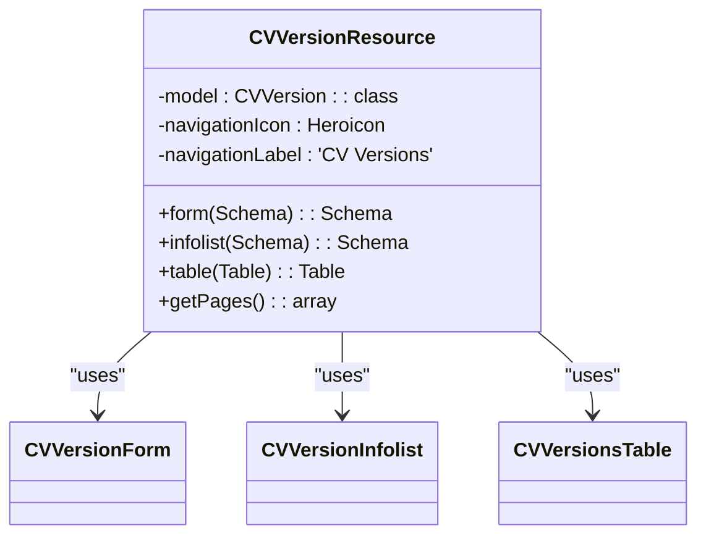
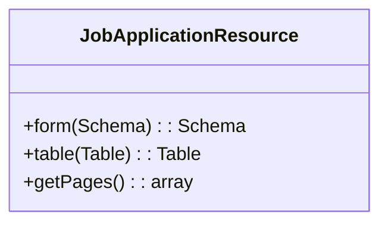
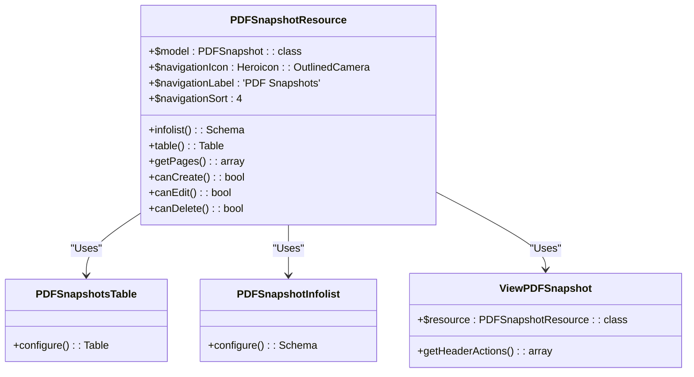

# Adding Custom Features

<cite>
**Referenced Files in This Document**   
- [CVVersionResource.php](file://app/Filament/Resources/CVVersions/CVVersionResource.php)
- [CVVersionForm.php](file://app/Filament/Resources/CVVersions/Schemas/CVVersionForm.php)
- [CVVersionInfolist.php](file://app/Filament/Resources/CVVersions/Schemas/CVVersionInfolist.php)
- [CVVersionsTable.php](file://app/Filament/Resources/CVVersions/Tables/CVVersionsTable.php)
- [PDFSnapshotResource.php](file://app/Filament/Resources/PDFSnapshots/PDFSnapshotResource.php)
- [PDFSnapshotInfolist.php](file://app/Filament/Resources/PDFSnapshots/Schemas/PDFSnapshotInfolist.php)
- [PDFSnapshotsTable.php](file://app/Filament/Resources/PDFSnapshots/Tables/PDFSnapshotsTable.php)
- [ViewPDFSnapshot.php](file://app/Filament/Resources/PDFSnapshots/Pages/ViewPDFSnapshot.php)
- [JobApplicationResource.php](file://app/Filament/Resources/JobApplications/JobApplicationResource.php)
- [CvResource.php](file://app/Filament/Resources/Cvs/CvResource.php)
- [ApplicationEventResource.php](file://app/Filament/Resources/JobApplications/ApplicationEventResource.php)
- [CoverLettersRelationManager.php](file://app/Filament/Resources/JobApplications/RelationManagers/CoverLettersRelationManager.php)
- [Cv.php](file://app/Models/Cv.php)
- [JobApplication.php](file://app/Models/JobApplication.php)
- [ApplicationEvent.php](file://app/Models/ApplicationEvent.php)
- [CoverLetter.php](file://app/Models/CoverLetter.php)
- [CvReviewService.php](file://app/Services/CvReviewService.php)
- [MetricsCalculationService.php](file://app/Services/MetricsCalculationService.php)
- [CvPdfController.php](file://app/Http/Controllers/CvPdfController.php)
- [web.php](file://routes/web.php)
- [ApplicationStatsOverview.php](file://app/Filament/Widgets/ApplicationStatsOverview.php)
- [MetricsOverview.php](file://app/Filament/Widgets/MetricsOverview.php)
- [ApplicationsNeedingAction.php](file://app/Filament/Widgets/ApplicationsNeedingAction.php)
- [ROADMAP.md](file://specs/ROADMAP.md)
- [filament-resources.md](file://specs/002-roadmap-md/contracts/filament-resources.md)
- [cover-letters.md](file://specs/002-roadmap-md/contracts-phase3/cover-letters.md)
- [cv_builder_spec.md](file://specs/cv_builder_spec.md)
</cite>

## Table of Contents
1. [Introduction](#introduction)
2. [Creating New Filament Resources](#creating-new-filament-resources)
3. [Extending the Data Model with Eloquent Models and Migrations](#extending-the-data-model-with-eloquent-models-and-migrations)
4. [Integrating New Services Using the Service Pattern](#integrating-new-services-using-the-service-pattern)
5. [Registering Custom Routes and Controllers](#registering-custom-routes-and-controllers)
6. [Adding Dashboard Widgets](#adding-dashboard-widgets)
7. [Roadmap and Future Features](#roadmap-and-future-features)
8. [Troubleshooting Common Issues](#troubleshooting-common-issues)
9. [Testing New Features with PestPHP](#testing-new-features-with-pestphp)
10. [Conclusion](#conclusion)

## Introduction
This document provides comprehensive guidance on extending the cv-builder application with custom features. It covers the creation of new Filament resources, extension of the data model, integration of services, routing, dashboard widgets, and testing. The application follows Laravel best practices and leverages Filament for admin interface generation. Developers should refer to the specs directory for upcoming roadmap items and implementation contracts.

**Section sources**
- [ROADMAP.md](file://specs/ROADMAP.md#L0-L229)
- [cv_builder_spec.md](file://specs/cv_builder_spec.md#L111-L115)

## Creating New Filament Resources
To add new entities to the admin interface, create Filament resources that define forms, tables, pages, and relation managers. Each resource corresponds to an Eloquent model and provides CRUD operations through a structured configuration.

For example, the `CVVersionResource` defines a read-only interface for version snapshots. It uses `CVVersionForm` for form schema, `CVVersionInfolist` for detail views, and `CVVersionsTable` for listing records. The resource disables creation and editing actions to preserve immutability.

Similarly, `PDFSnapshotResource` provides a view-only interface with download and hash verification capabilities. It includes relationship displays to job applications and CVs, and implements custom actions like file download and integrity checks.

When creating a new resource:
1. Generate using `php artisan make:filament-resource ResourceName`
2. Configure model, navigation, and page routing
3. Define form schema using schema builders
4. Configure table columns and filters
5. Implement relation managers if needed
6. Set access controls and policies

**Diagram sources**
- [CVVersionResource.php](file://app/Filament/Resources/CVVersions/CVVersionResource.php#L18-L61)
- [CVVersionForm.php](file://app/Filament/Resources/CVVersions/Schemas/CVVersionForm.php#L10-L62)
- [CVVersionInfolist.php](file://app/Filament/Resources/CVVersions/Schemas/CVVersionInfolist.php#L7-L86)
- [CVVersionsTable.php](file://app/Filament/Resources/CVVersions/Tables/CVVersionsTable.php#L11-L39)

**Section sources**
- [CVVersionResource.php](file://app/Filament/Resources/CVVersions/CVVersionResource.php#L1-L62)

## Extending the Data Model with Eloquent Models and Migrations
New features require corresponding database schema changes. The application uses Laravel migrations to manage schema evolution. Each migration should be atomic and include both up and down methods.

For example, Phase 1 introduced `cv_versions` and `pdf_snapshots` tables. The `cv_versions` table stores JSON snapshots of CVs at specific points in time, enabling version history and rollback. The `pdf_snapshots` table stores file paths and hashes of generated PDFs, ensuring document integrity.

When adding a new model:
1. Create migration using `php artisan make:migration create_entity_table`
2. Define schema with appropriate indexes and constraints
3. Create Eloquent model in `app/Models`
4. Register factories and seeders if needed
5. Update related models with relationships

The `ApplicationEvent` model demonstrates event sourcing for job applications. It captures timeline events like interviews and responses, with metadata stored as JSON. This enables rich historical tracking without altering the main application table.

**Diagram sources**
- [JobApplicationResource.php](file://app/Filament/Resources/JobApplications/JobApplicationResource.php)

**Section sources**
- [ApplicationEvent.php](file://app/Models/ApplicationEvent.php)
- [2025_10_04_100002_create_application_events_table.php](file://database/migrations/2025_10_04_100002_create_application_events_table.php)

## Integrating New Services Using the Service Pattern
The application uses a service layer to encapsulate business logic. Services like `CvReviewService` and `MetricsCalculationService` follow the single responsibility principle and are injected via Laravel's service container.

To create a new service:
1. Place in `app/Services`
2. Define clear public interface
3. Inject dependencies via constructor
4. Use return types and type hints
5. Keep methods focused and testable

The `CvReviewService` handles AI-powered CV analysis, while `MetricsCalculationService` computes application funnel metrics. These services are called from controllers or jobs, keeping business logic separate from HTTP concerns.

Services should not contain database queries directly; instead, they should work with Eloquent models or repositories. This allows for easier testing and decoupling.

**Section sources**
- [CvReviewService.php](file://app/Services/CvReviewService.php)
- [MetricsCalculationService.php](file://app/Services/MetricsCalculationService.php)

## Registering Custom Routes and Controllers
Custom routes should be added to `routes/web.php` and integrated with the existing authentication and authorization system. The application uses Laravel's middleware for access control.

For example, the `CvPdfController` handles PDF generation requests. It is protected by authentication middleware and checks user ownership of the CV before generating output.

When adding new routes:
1. Register in `routes/web.php` using appropriate HTTP methods
2. Apply auth and authorization middleware
3. Use route model binding for Eloquent models
4. Validate input using FormRequest objects
5. Return appropriate responses

The application follows RESTful conventions where possible, with resource routes for CRUD operations and explicit named routes for actions.

**Section sources**
- [CvPdfController.php](file://app/Http/Controllers/CvPdfController.php)
- [web.php](file://routes/web.php)

## Adding Dashboard Widgets
Dashboard widgets extend Filament's widget system to display metrics and actionable insights. Widgets like `MetricsOverview` and `ApplicationsNeedingAction` provide at-a-glance information.

To create a new widget:
1. Generate using `php artisan make:filament-widget WidgetName`
2. Define widget configuration (polling, columns, etc.)
3. Implement `getColumns()` and `getLayout()`
4. Override `getData()` to provide view data
5. Create corresponding Blade view if needed

The `ApplicationsNeedingAction` widget implements the "Needs Attention" filter logic, showing applications with overdue next steps or draft status. It uses database queries with date comparisons and status checks to identify actionable items.

Widgets can be added to the dashboard layout in `AdminPanelProvider`.

**Diagram sources**
- [PDFSnapshotResource.php](file://app/Filament/Resources/PDFSnapshots/PDFSnapshotResource.php#L15-L71)
- [PDFSnapshotsTable.php](file://app/Filament/Resources/PDFSnapshots/Tables/PDFSnapshotsTable.php)
- [PDFSnapshotInfolist.php](file://app/Filament/Resources/PDFSnapshots/Schemas/PDFSnapshotInfolist.php)
- [ViewPDFSnapshot.php](file://app/Filament/Resources/PDFSnapshots/Pages/ViewPDFSnapshot.php)

**Section sources**
- [PDFSnapshotResource.php](file://app/Filament/Resources/PDFSnapshots/PDFSnapshotResource.php#L15-L71)
- [ApplicationsNeedingAction.php](file://app/Filament/Widgets/ApplicationsNeedingAction.php)

## Roadmap and Future Features
The `specs/ROADMAP.md` file outlines a phased approach to feature development, with clear exit criteria and validation gates. Developers should consult this document before implementing new features.

Phase 4 features are optional and require user validation before implementation. This YAGNI-enforced approach prevents over-engineering. Features like AI-assisted bullet suggestions and A/B testing are gated behind real user needs.

The roadmap includes detailed contracts for each feature, specifying database changes, API contracts, and UI requirements. These contracts serve as implementation guides and testing specifications.

**Section sources**
- [ROADMAP.md](file://specs/ROADMAP.md#L0-L229)
- [filament-resources.md](file://specs/002-roadmap-md/contracts/filament-resources.md)
- [cover-letters.md](file://specs/002-roadmap-md/contracts-phase3/cover-letters.md)

## Troubleshooting Common Issues
### Route Conflicts
Ensure custom routes do not conflict with Filament's admin routes. Use unique prefixes and verify routing with `php artisan route:list`.

### Model Binding Errors
Verify that route model binding keys match Eloquent model identifiers. Use explicit binding in RouteServiceProvider if needed.

### Service Injection Failures
Check that services are properly registered in the service container. Use type hints in constructors and ensure class exists and is autoloaded.

### Authorization Issues
Verify policies are registered in AuthServiceProvider and that users have appropriate permissions.

### Filament Resource Issues
Ensure resources are registered in AdminPanelProvider and that models have proper relationships defined.

## Testing New Features with PestPHP
The application uses PestPHP for testing. Feature tests validate HTTP behavior, while unit tests verify business logic.

Test organization:
- `tests/Feature`: HTTP-level tests
- `tests/Unit`: Class-level tests
- `tests/Pest.php`: Pest configuration

When adding new features:
1. Write tests before implementation (TDD)
2. Test edge cases and validation
3. Use factories for test data
4. Mock external services
5. Verify database changes

Existing tests like `JobApplicationCrudTest` and `CvReviewServiceTest` serve as examples for test structure and assertions.

**Section sources**
- [Pest.php](file://tests/Pest.php)
- [JobApplicationCrudTest.php](file://tests/Feature/JobApplicationCrudTest.php)
- [CvReviewServiceTest.php](file://tests/Unit/CvReviewServiceTest.php)

## Conclusion
Extending the cv-builder application requires understanding its architecture, conventions, and roadmap. By following the patterns established in existing code—Filament resources, service classes, Eloquent models, and Pest tests—developers can add robust, maintainable features. Always consult the specs directory for implementation contracts and validation criteria before starting new work.