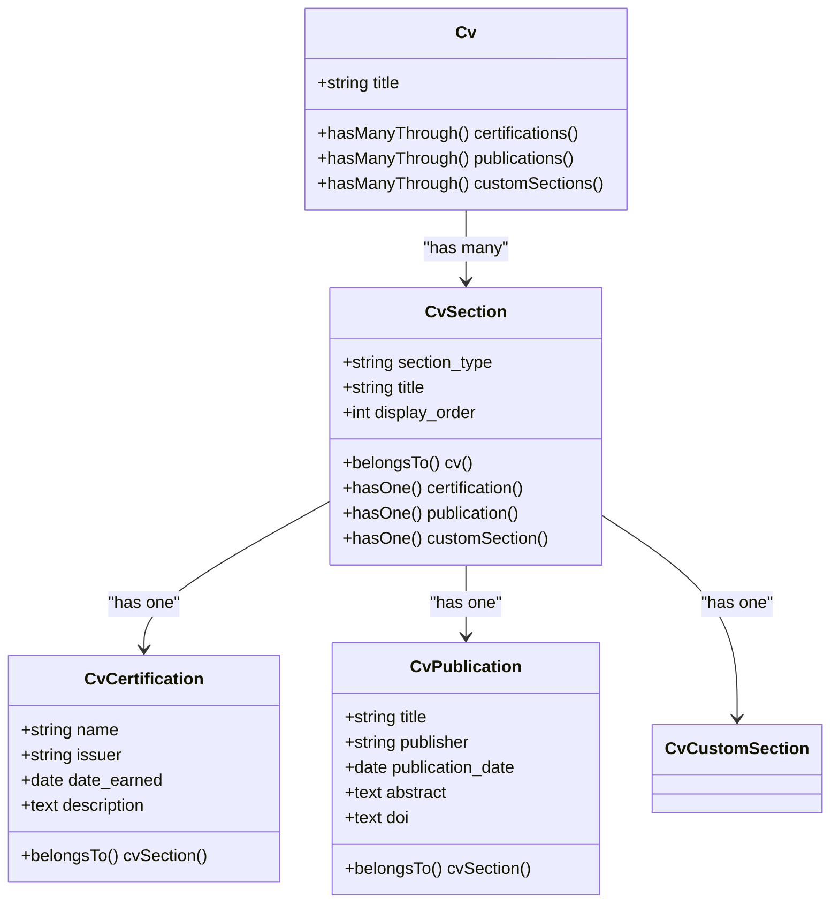

# Adding New CV Section Types

<cite>
**Referenced Files in This Document**   
- [Cv.php](file://app/Models/Cv.php)
- [CvCustomSection.php](file://app/Models/CvCustomSection.php)
- [CvResource.php](file://app/Filament/Resources/Cvs/CvResource.php)
- [CustomSectionsRelationManager.php](file://app/Filament/Resources/Cvs/RelationManagers/CustomSectionsRelationManager.php)
- [2025_10_03_225856_modify_cv_sections_table_for_custom_sections.php](file://database/migrations/2025_10_03_225856_modify_cv_sections_table_for_custom_sections.php)
- [2025_10_03_225951_create_cv_custom_sections_table.php](file://database/migrations/2025_10_03_225951_create_cv_custom_sections_table.php)
</cite>

## Table of Contents
1. [Introduction](#introduction)
2. [Database Schema Design](#database-schema-design)
3. [Creating Database Migrations](#creating-database-migrations)
4. [Defining Eloquent Relationships](#defining-eloquent-relationships)
5. [Registering Relation Managers](#registering-relation-managers)
6. [Implementing Models, Factories, and Seeders](#implementing-models-factories-and-seeders)
7. [Content Validation and Formatting](#content-validation-and-formatting)
8. [PDF Generation Integration](#pdf-generation-integration)
9. [Performance Considerations](#performance-considerations)
10. [Future Extensibility](#future-extensibility)

## Introduction
This document provides comprehensive guidance for extending the CV Builder application with new custom section types such as 'Certifications' or 'Publications'. The implementation approach follows the existing pattern established by the `CvCustomSection` model and `CustomSectionsRelationManager`, which serve as reference implementations for flexible content storage and management. The system is designed to support rich text content, proper ordering, and seamless integration with the PDF generation pipeline. By following the documented patterns, developers can add new section types while maintaining consistency with the application's architecture and ensuring optimal performance.

## Database Schema Design
The database schema is designed to support flexible content storage through a polymorphic relationship pattern. The core `cv_sections` table serves as the foundation, storing common attributes for all section types including `section_type`, `title`, `display_order`, and foreign key references. This table uses a string-based `section_type` field rather than an enum to allow for easy extension with new section types without requiring schema modifications. Each custom section type has its own dedicated table (e.g., `cv_certifications`, `cv_publications`) that stores type-specific content and relates back to the `cv_sections` table via a foreign key. This design enables rich text support through text fields while maintaining proper ordering through the `display_order` column. The schema also includes timestamps and indexes for performance optimization, with foreign key constraints ensuring data integrity.

**Section sources**
- [2025_10_03_225856_modify_cv_sections_table_for_custom_sections.php](file://database/migrations/2025_10_03_225856_modify_cv_sections_table_for_custom_sections.php)
- [2025_10_03_225951_create_cv_custom_sections_table.php](file://database/migrations/2025_10_03_225951_create_cv_custom_sections_table.php)

## Creating Database Migrations
To add a new section type, create two database migrations following the pattern established in the existing migrations. First, ensure the `cv_sections` table supports the new section type by verifying it includes the necessary columns (`section_type`, `title`, `display_order`). Then, create a dedicated migration for the new section's content table using Laravel's migration generator. For example, to create a 'Certifications' section, generate a migration that creates a `cv_certifications` table with fields for certification name, issuing organization, date earned, and any other relevant details. The migration should include a foreign key constraint to `cv_section_id` with cascade deletion, ensuring referential integrity. Include appropriate indexes on frequently queried columns and timestamps for audit purposes. The migration should be reversible, with a corresponding `down()` method that drops the table and constraints.

**Section sources**
- [2025_10_03_225856_modify_cv_sections_table_for_custom_sections.php](file://database/migrations/2025_10_03_225856_modify_cv_sections_table_for_custom_sections.php)
- [2025_10_03_225951_create_cv_custom_sections_table.php](file://database/migrations/2025_10_03_225951_create_cv_custom_sections_table.php)

## Defining Eloquent Relationships
Define Eloquent relationships in the `Cv` model to enable access to the new section type through intuitive method calls. Following the pattern in the existing `customSections()` relationship, implement a `hasManyThrough` relationship that traverses from the `Cv` model through the `CvSection` model to the specific section content model. The relationship should include a where clause filtering by the appropriate `section_type` value and order by `display_order` to maintain proper sequencing. For example, a 'Certifications' section would use `where('cv_sections.section_type', 'certifications')` in its query constraint. The relationship method name should be in plural form (e.g., `certifications()`) and return the properly configured `HasManyThrough` instance. This approach maintains consistency with the existing codebase and leverages Laravel's relationship features for efficient querying.

**Diagram sources**
- [Cv.php](file://app/Models/Cv.php#L1-L221)
- [CvCustomSection.php](file://app/Models/CvCustomSection.php#L7-L18)

**Section sources**
- [Cv.php](file://app/Models/Cv.php#L1-L221)

## Registering Relation Managers
Register the new section type in the Filament admin interface by creating a custom relation manager and adding it to the `CvResource` configuration. Create a new class extending `RelationManager` in the `app/Filament/Resources/Cvs/RelationManagers` directory, following the naming convention `CertificationsRelationManager` or `PublicationsRelationManager`. Configure the relationship property to point to the `sections` relationship on the `Cv` model, and set an appropriate title. Implement the `table()` method to define columns for display, including title, content fields, and display order, with proper sorting and filtering capabilities. Enable reordering through the `reorderable()` method using the `display_order` column. Finally, register the new relation manager in the `getRelations()` method of `CvResource`, ensuring it appears in the desired order within the admin interface.

**Section sources**
- [CvResource.php](file://app/Filament/Resources/Cvs/CvResource.php#L16-L53)
- [CustomSectionsRelationManager.php](file://app/Filament/Resources/Cvs/RelationManagers/CustomSectionsRelationManager.php#L18-L115)

## Implementing Models, Factories, and Seeders
Implement the model class for the new section type by extending Laravel's `Model` class and defining the fillable attributes that correspond to the database columns. Include any necessary casts for date fields or other special types. Create a factory class using Laravel's model factory system to enable easy creation of test data, defining default values for required fields and providing states for common variations. Update the main database seeder to include sample data for the new section type, ensuring it integrates properly with the existing CV structure. The seeder should create `CvSection` records with the appropriate `section_type` and then create corresponding records in the section-specific table, maintaining the foreign key relationship. This approach ensures consistent data creation across development, testing, and production environments.

**Section sources**
- [CvCustomSection.php](file://app/Models/CvCustomSection.php#L7-L18)

## Content Validation and Formatting
Implement content validation and formatting rules to ensure data integrity and consistency across all section types. Define validation rules in the relation manager's form configuration, specifying required fields, maximum lengths, and appropriate input types (e.g., date pickers for date fields). For rich text content, implement server-side sanitization to prevent XSS attacks while preserving necessary formatting. Consider implementing content formatting rules such as character limits, line break handling, and special character encoding to ensure proper display in both the admin interface and PDF output. Validation should be applied both in the Filament form configuration and in any API endpoints that might be added in the future, following the principle of defense in depth.

**Section sources**
- [CustomSectionsRelationManager.php](file://app/Filament/Resources/Cvs/RelationManagers/CustomSectionsRelationManager.php#L18-L115)

## PDF Generation Integration
Integrate the new section type with the PDF generation pipeline by updating the Blade template used for PDF rendering. The template should include conditional logic to detect and render the new section type when present in the CV data. Follow the existing styling patterns to ensure visual consistency with other sections, using the same typography, spacing, and layout principles. For rich text content, ensure proper HTML rendering in the PDF output by configuring the PDF generator to handle HTML content appropriately. Test the PDF output thoroughly to verify that all content displays correctly, including special characters, line breaks, and any embedded formatting. Consider implementing section-specific formatting rules, such as date formatting for certifications or citation styles for publications.

**Section sources**
- [Cv.php](file://app/Models/Cv.php#L1-L221)

## Performance Considerations
Address performance considerations when rendering multiple section types by implementing efficient querying and caching strategies. Use eager loading through Laravel's `with()` method to prevent N+1 query problems when retrieving CVs with multiple sections. Consider implementing query optimization techniques such as selective field loading when only specific section types are needed. For frequently accessed CVs, implement caching at the application level to reduce database load. When rendering PDFs, consider the impact of multiple section types on generation time and memory usage, potentially implementing streaming or chunked processing for large documents. Monitor query performance and use database indexing strategically on commonly filtered or sorted columns to maintain optimal response times as the number of sections and CVs grows.

**Section sources**
- [Cv.php](file://app/Models/Cv.php#L1-L221)

## Future Extensibility
Design for future extensibility by maintaining the established patterns and abstractions that make adding new section types straightforward. The current architecture supports easy addition of new sections through the combination of database migrations, model relationships, and relation managers. Consider implementing a registration system or service provider that automatically discovers and registers new section types, reducing the need for manual configuration. Document the extension process thoroughly to enable other developers to add new section types consistently. When designing new features, consider how they might impact the extensibility of the system, avoiding tight coupling between section types and maintaining clear separation of concerns. This approach ensures the CV Builder can evolve to meet changing requirements while maintaining code quality and developer productivity.

**Section sources**
- [Cv.php](file://app/Models/Cv.php#L1-L221)
- [CvResource.php](file://app/Filament/Resources/Cvs/CvResource.php#L16-L53)