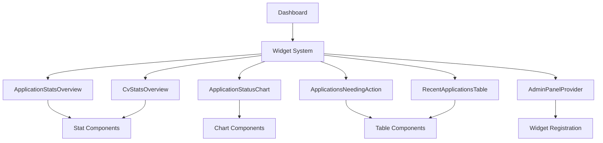
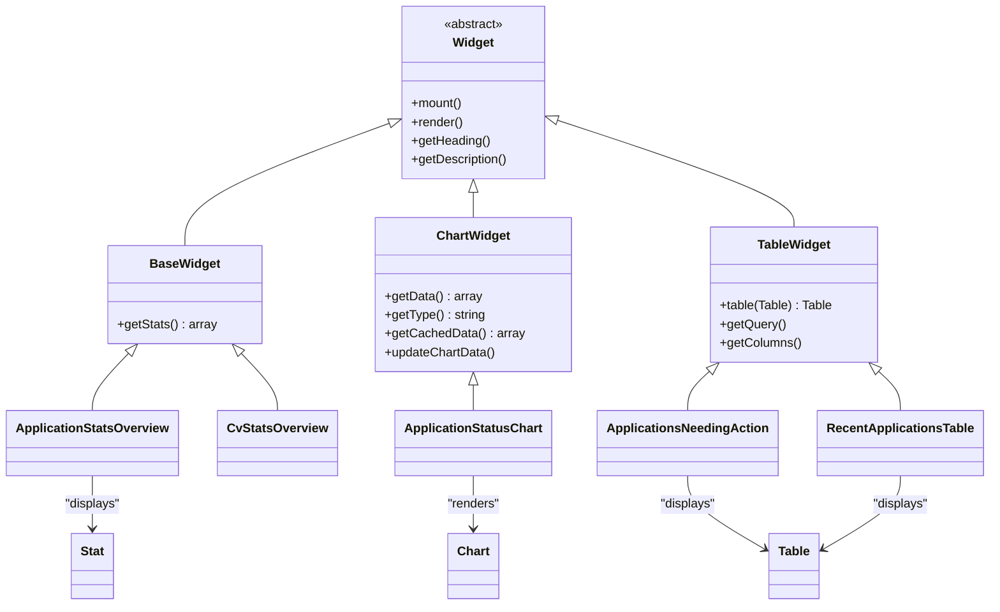
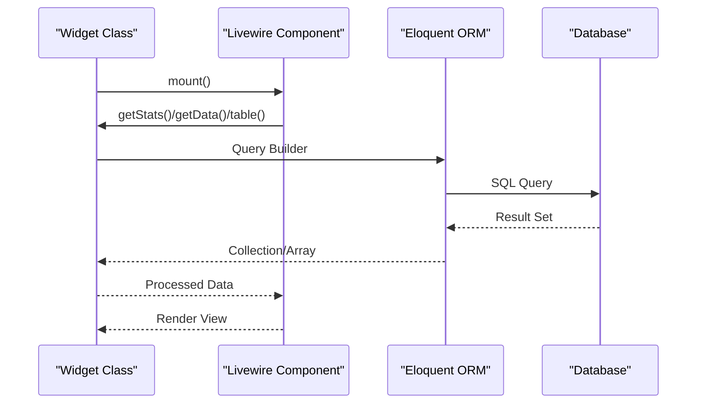
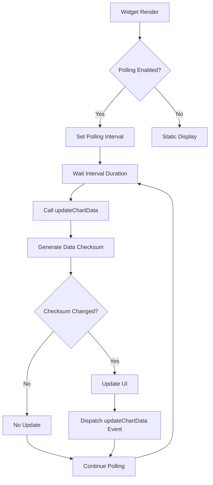
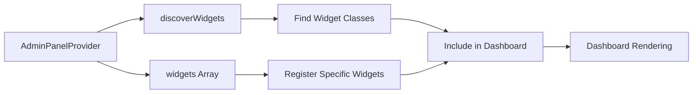

# Building Dashboard Widgets

<cite>
**Referenced Files in This Document**   
- [ApplicationStatsOverview.php](file://app/Filament/Widgets/ApplicationStatsOverview.php)
- [ApplicationStatusChart.php](file://app/Filament/Widgets/ApplicationStatusChart.php)
- [ApplicationsNeedingAction.php](file://app/Filament/Widgets/ApplicationsNeedingAction.php)
- [CvStatsOverview.php](file://app/Filament/Widgets/CvStatsOverview.php)
- [RecentApplicationsTable.php](file://app/Filament/Widgets/RecentApplicationsTable.php)
- [AdminPanelProvider.php](file://app/Providers/Filament/AdminPanelProvider.php)
- [ChartWidget.php](file://vendor/filament/widgets/src/ChartWidget.php)
- [TableWidget.php](file://vendor/filament/widgets/src/TableWidget.php)
- [KeywordCoverageService.php](file://app/Services/KeywordCoverageService.php)
</cite>

## Table of Contents
1. [Introduction](#introduction)
2. [Widget Architecture Overview](#widget-architecture-overview)
3. [Core Widget Types](#core-widget-types)
4. [Creating Custom Widgets](#creating-custom-widgets)
5. [Data Preparation and Retrieval](#data-preparation-and-retrieval)
6. [Real-time Updates and Polling](#real-time-updates-and-polling)
7. [Data Caching Strategies](#data-caching-strategies)
8. [Responsive Design and Layout](#responsive-design-and-layout)
9. [Styling with Tailwind CSS](#styling-with-tailwind-css)
10. [Accessibility Considerations](#accessibility-considerations)
11. [Widget Registration and Placement](#widget-registration-and-placement)
12. [Example: Keyword Coverage Trend Widget](#example-keyword-coverage-trend-widget)
13. [Example: Upcoming Interview Reminders Widget](#example-upcoming-interview-reminders-widget)
14. [Troubleshooting Common Issues](#troubleshooting-common-issues)
15. [Conclusion](#conclusion)

## Introduction
This document provides comprehensive guidance on building dashboard widgets for the CV Builder application using the Filament framework. It covers the creation of custom widgets by extending existing classes such as ApplicationStatsOverview and ApplicationStatusChart, detailing the structure of widget classes including view rendering, data preparation in the getData method, and integration with Livewire components. The document includes practical examples of creating widgets to display keyword coverage trends and upcoming interview reminders, addresses real-time updates using polling, data caching strategies for performance optimization, and responsive design considerations. It also provides guidance on styling widgets with Tailwind CSS, ensuring accessibility compliance, and registering widgets in the admin panel layout.

**Section sources**
- [ApplicationStatsOverview.php](file://app/Filament/Widgets/ApplicationStatsOverview.php#L8-L51)
- [ApplicationStatusChart.php](file://app/Filament/Widgets/ApplicationStatusChart.php#L8-L65)

## Widget Architecture Overview
The CV Builder application utilizes the Filament framework to implement a robust dashboard widget system. Widgets are organized within the `app/Filament/Widgets` directory and are registered through the AdminPanelProvider. The architecture follows a component-based approach where each widget extends a base class that provides common functionality for rendering, data retrieval, and user interaction. The system supports different widget types including stats overview, chart, and table widgets, each designed for specific data visualization purposes. Widgets are integrated with Livewire components to enable reactive updates and real-time data synchronization.

**Diagram sources**
- [AdminPanelProvider.php](file://app/Providers/Filament/AdminPanelProvider.php#L21-L56)
- [ApplicationStatsOverview.php](file://app/Filament/Widgets/ApplicationStatsOverview.php#L8-L51)

**Section sources**
- [AdminPanelProvider.php](file://app/Providers/Filament/AdminPanelProvider.php#L21-L56)

## Core Widget Types
The CV Builder application implements several core widget types, each serving a specific purpose in the dashboard interface. The ApplicationStatsOverview widget displays key metrics as statistical cards, showing counts and percentages with descriptive icons and colors. The ApplicationStatusChart widget visualizes application status distribution using a doughnut chart, providing a visual breakdown of application stages. The ApplicationsNeedingAction widget presents a table of job applications that require user attention, highlighting overdue actions and draft applications. The CvStatsOverview widget provides insights into CV usage patterns, showing which CVs are most frequently used for applications. The RecentApplicationsTable widget displays recently created job applications in a tabular format with sorting and filtering capabilities.

**Diagram sources**
- [ApplicationStatsOverview.php](file://app/Filament/Widgets/ApplicationStatsOverview.php#L8-L51)
- [ApplicationStatusChart.php](file://app/Filament/Widgets/ApplicationStatusChart.php#L8-L65)
- [ApplicationsNeedingAction.php](file://app/Filament/Widgets/ApplicationsNeedingAction.php#L10-L48)
- [CvStatsOverview.php](file://app/Filament/Widgets/CvStatsOverview.php#L8-L46)
- [RecentApplicationsTable.php](file://app/Filament/Widgets/RecentApplicationsTable.php#L9-L59)

**Section sources**
- [ApplicationStatsOverview.php](file://app/Filament/Widgets/ApplicationStatsOverview.php#L8-L51)
- [ApplicationStatusChart.php](file://app/Filament/Widgets/ApplicationStatusChart.php#L8-L65)
- [ApplicationsNeedingAction.php](file://app/Filament/Widgets/ApplicationsNeedingAction.php#L10-L48)
- [CvStatsOverview.php](file://app/Filament/Widgets/CvStatsOverview.php#L8-L46)
- [RecentApplicationsTable.php](file://app/Filament/Widgets/RecentApplicationsTable.php#L9-L59)

## Creating Custom Widgets
Creating custom widgets in the CV Builder application involves extending existing widget classes and implementing specific methods to define the widget's behavior and appearance. The process begins by identifying the appropriate base class to extend based on the desired functionality: BaseWidget for statistical overviews, ChartWidget for data visualizations, or TableWidget for tabular data display. Custom widgets are typically created using the Filament Artisan command `php artisan make:filament-widget`, which generates the necessary class structure and boilerplate code. The widget class must implement specific methods such as getStats for BaseWidget extensions, getData and getType for ChartWidget extensions, or table for TableWidget extensions. Widgets can be customized with specific headings, descriptions, colors, and layout configurations through protected properties.

**Section sources**
- [ChartWidget.php](file://vendor/filament/widgets/src/ChartWidget.php#L10-L133)
- [TableWidget.php](file://vendor/filament/widgets/src/TableWidget.php#L14-L52)

## Data Preparation and Retrieval
Data preparation and retrieval in dashboard widgets is handled through specific methods that query the application's data models and transform the results into a format suitable for display. For statistical widgets extending BaseWidget, the getStats method returns an array of Stat objects containing values, descriptions, icons, and colors. Chart widgets extending ChartWidget implement the getData method to return structured data in the format expected by the charting library, typically including datasets and labels. The data is retrieved using Eloquent queries that may include grouping, counting, and filtering operations. Table widgets implement the table method to define the query, columns, and other table configuration options. Data retrieval often involves relationships between models, such as joining JobApplication with CV or calculating derived values like keyword coverage percentages.

**Diagram sources**
- [ApplicationStatsOverview.php](file://app/Filament/Widgets/ApplicationStatsOverview.php#L8-L51)
- [ApplicationStatusChart.php](file://app/Filament/Widgets/ApplicationStatusChart.php#L8-L65)
- [ApplicationsNeedingAction.php](file://app/Filament/Widgets/ApplicationsNeedingAction.php#L10-L48)

**Section sources**
- [ApplicationStatsOverview.php](file://app/Filament/Widgets/ApplicationStatsOverview.php#L8-L51)
- [ApplicationStatusChart.php](file://app/Filament/Widgets/ApplicationStatusChart.php#L8-L65)
- [ApplicationsNeedingAction.php](file://app/Filament/Widgets/ApplicationsNeedingAction.php#L10-L48)

## Real-time Updates and Polling
Real-time updates in dashboard widgets are implemented using Livewire's polling mechanism, which automatically refreshes widget content at specified intervals. The CanPoll trait, included in the ChartWidget base class, provides the functionality for periodic data updates. Widgets can enable polling by setting a polling interval through the getPollingInterval method or by using the $pollingInterval property. When polling is enabled, the widget automatically calls the updateChartData method to check for data changes and update the UI if necessary. The data checksum mechanism compares the current data state with the previous state to determine if a visual update is required, minimizing unnecessary re-renders. This approach ensures that dashboard widgets display up-to-date information without requiring manual page refreshes.

**Diagram sources**
- [ChartWidget.php](file://vendor/filament/widgets/src/ChartWidget.php#L10-L133)
- [ApplicationStatusChart.php](file://app/Filament/Widgets/ApplicationStatusChart.php#L8-L65)

**Section sources**
- [ChartWidget.php](file://vendor/filament/widgets/src/ChartWidget.php#L10-L133)

## Data Caching Strategies
Data caching strategies in dashboard widgets are designed to improve performance by reducing database queries and computation overhead. The ChartWidget class implements a built-in caching mechanism through the getCachedData method, which stores the result of the getData method in the $cachedData property. This prevents redundant data processing during multiple render cycles within the same request. The data checksum, generated by the generateDataChecksum method, uses MD5 hashing of the JSON-encoded cached data to efficiently detect changes. For more persistent caching, developers can implement Laravel's cache system to store widget data for longer durations, especially for widgets displaying data that doesn't change frequently. The caching strategy balances the need for up-to-date information with performance optimization, ensuring a responsive user experience.

**Section sources**
- [ChartWidget.php](file://vendor/filament/widgets/src/ChartWidget.php#L10-L133)

## Responsive Design and Layout
Responsive design and layout in dashboard widgets are achieved through the columnSpan property and Filament's grid-based layout system. Widgets can control their width on the dashboard by setting the $columnSpan property to values such as 'full', 'half', or specific column counts. The layout adapts to different screen sizes, with widgets reflowing appropriately on mobile devices. Table widgets often use full column span to maximize horizontal space for data display, while statistical widgets may use half or quarter spans to display multiple metrics side by side. The responsive design ensures that dashboard content remains accessible and usable across various devices and screen resolutions, providing a consistent user experience.

**Section sources**
- [ApplicationsNeedingAction.php](file://app/Filament/Widgets/ApplicationsNeedingAction.php#L10-L48)
- [RecentApplicationsTable.php](file://app/Filament/Widgets/RecentApplicationsTable.php#L9-L59)

## Styling with Tailwind CSS
Styling of dashboard widgets is implemented using Tailwind CSS, which provides utility classes for rapid UI development. Widgets inherit the application's color scheme defined in the AdminPanelProvider, with primary color set to Amber. Individual widget components use Tailwind classes for spacing, typography, colors, and layout. Stat components use specific color classes (primary, success, info, warning, danger) to convey the status or importance of the displayed data. Chart widgets use RGB color values in the data configuration to define the appearance of chart elements. The styling approach follows consistent design principles across all widgets, ensuring visual harmony and brand consistency. Custom styling can be applied through additional CSS classes or by modifying the widget's view components.

**Section sources**
- [AdminPanelProvider.php](file://app/Providers/Filament/AdminPanelProvider.php#L21-L56)
- [ApplicationStatsOverview.php](file://app/Filament/Widgets/ApplicationStatsOverview.php#L8-L51)
- [ApplicationStatusChart.php](file://app/Filament/Widgets/ApplicationStatusChart.php#L8-L65)

## Accessibility Considerations
Accessibility considerations in dashboard widgets include proper semantic HTML structure, appropriate color contrast, and keyboard navigation support. The underlying Livewire and Filament framework provides accessible components with proper ARIA attributes and roles. Chart widgets include alternative text descriptions and ensure colorblind-friendly color palettes. Table widgets implement proper table headers and support keyboard navigation for accessibility. Interactive elements have visible focus states, and all functionality is available without requiring a mouse. The application follows WCAG guidelines to ensure that dashboard content is accessible to users with various disabilities, including visual, motor, and cognitive impairments.

**Section sources**
- [ApplicationStatusChart.php](file://app/Filament/Widgets/ApplicationStatusChart.php#L8-L65)
- [ApplicationsNeedingAction.php](file://app/Filament/Widgets/ApplicationsNeedingAction.php#L10-L48)

## Widget Registration and Placement
Widget registration and placement in the CV Builder application is managed through the AdminPanelProvider class. Widgets are registered in the panel method using the widgets array, which specifies the fully qualified class names of the widgets to be displayed on the dashboard. The order of widgets in this array determines their default placement on the dashboard. Developers can control the sort order of individual widgets by implementing the $sort static property in the widget class. The discoverWidgets method automatically discovers and registers all widgets in the specified directory, while the explicit widgets array allows for precise control over which widgets are displayed and their order. This registration system provides flexibility in managing dashboard content and layout.

**Diagram sources**
- [AdminPanelProvider.php](file://app/Providers/Filament/AdminPanelProvider.php#L21-L56)

**Section sources**
- [AdminPanelProvider.php](file://app/Providers/Filament/AdminPanelProvider.php#L21-L56)

## Example: Keyword Coverage Trend Widget
The Keyword Coverage Trend widget would extend the ChartWidget class to visualize the evolution of keyword coverage percentages over time. This widget would retrieve historical keyword coverage data from job applications, potentially using the KeywordCoverageService to calculate coverage metrics. The getData method would aggregate coverage percentages by date or application creation time, creating a time-series dataset suitable for line chart visualization. The widget would implement the getType method to return 'line' for a line chart display. It would include configuration options to filter data by CV or time period, and could implement caching to improve performance when displaying historical data. The widget would be registered in the AdminPanelProvider and placed on the dashboard to help users track improvements in their CV's keyword optimization over time.

**Section sources**
- [ChartWidget.php](file://vendor/filament/widgets/src/ChartWidget.php#L10-L133)
- [KeywordCoverageService.php](file://app/Services/KeywordCoverageService.php#L4-L56)

## Example: Upcoming Interview Reminders Widget
The Upcoming Interview Reminders widget would extend the TableWidget class to display job applications with scheduled interviews approaching within a configurable time window. This widget would query the JobApplication model for records with interview dates within the next few days, sorting them by date. The table method would define columns for company name, job title, interview date, and status, with appropriate formatting and styling. The widget would implement a custom query to filter applications based on the interview date field and could include visual indicators for imminent interviews. It would use full column span to maximize visibility and could implement real-time updates to reflect changes in interview schedules. This widget would help users stay organized and prepared for upcoming interviews by providing a dedicated view of their interview schedule.

**Section sources**
- [TableWidget.php](file://vendor/filament/widgets/src/TableWidget.php#L14-L52)
- [ApplicationsNeedingAction.php](file://app/Filament/Widgets/ApplicationsNeedingAction.php#L10-L48)

## Troubleshooting Common Issues
Common issues in dashboard widget development include data not updating in real-time, incorrect data display, layout problems, and performance bottlenecks. For real-time update issues, verify that the polling interval is properly configured and that the updateChartData method is being called. For incorrect data display, check the data transformation logic in getData or getStats methods and ensure proper model relationships are being loaded. Layout problems can often be resolved by adjusting the columnSpan property or checking for CSS conflicts. Performance issues may require implementing additional caching, optimizing database queries with proper indexing, or using Laravel's query caching features. Debugging tools such as Laravel Telescope can help identify and resolve these issues by providing insights into database queries, exceptions, and request timing.

**Section sources**
- [ChartWidget.php](file://vendor/filament/widgets/src/ChartWidget.php#L10-L133)
- [TableWidget.php](file://vendor/filament/widgets/src/TableWidget.php#L14-L52)

## Conclusion
Building dashboard widgets in the CV Builder application involves extending Filament's widget classes to create customized data visualizations and information displays. By understanding the architecture of different widget types, implementing proper data retrieval and preparation methods, and utilizing features like real-time updates and caching, developers can create effective and performant dashboard components. The examples of keyword coverage trend and upcoming interview reminders widgets demonstrate how to apply these concepts to create valuable user-facing features. Proper registration and placement ensure that widgets are integrated seamlessly into the dashboard layout, providing users with actionable insights and improving their overall experience with the application.