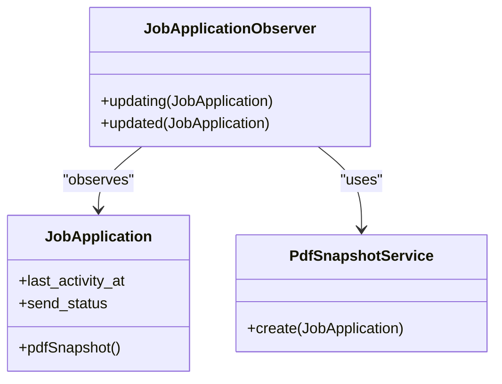
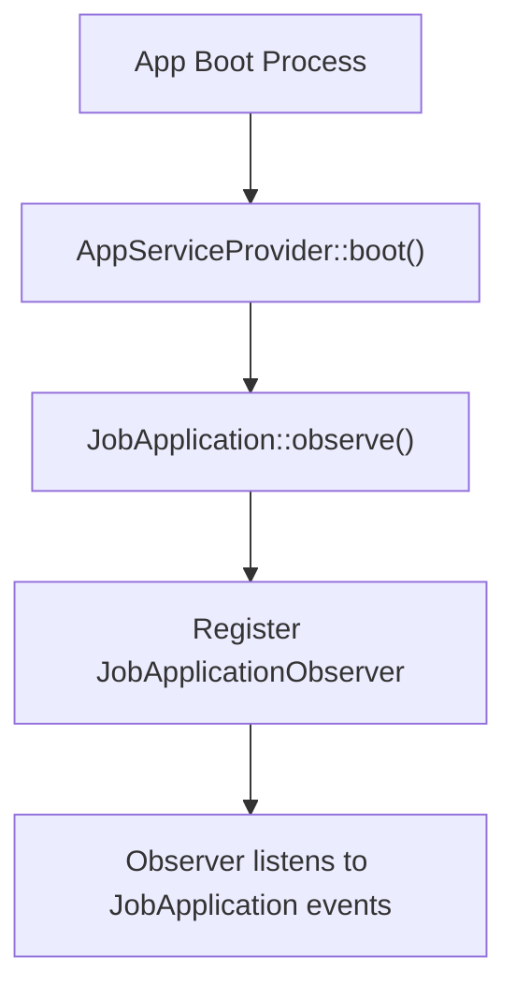
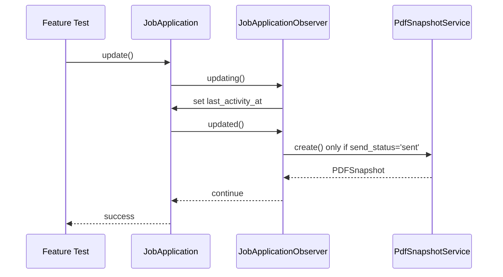

# Creating Custom Observers

<cite>
**Referenced Files in This Document**   
- [JobApplicationObserver.php](file://app/Observers/JobApplicationObserver.php)
- [AppServiceProvider.php](file://app/Providers/AppServiceProvider.php)
- [JobApplication.php](file://app/Models/JobApplication.php)
- [PdfSnapshotService.php](file://app/Services/PdfSnapshotService.php)
- [JobApplicationCrudTest.php](file://tests/Feature/JobApplicationCrudTest.php)
</cite>

## Table of Contents
1. [Introduction](#introduction)
2. [Laravel Observer Pattern Overview](#laravel-observer-pattern-overview)
3. [JobApplicationObserver Implementation](#jobapplicationobserver-implementation)
4. [Observer Registration and Model Scoping](#observer-registration-and-model-scoping)
5. [Custom Logic Examples](#custom-logic-examples)
6. [Common Pitfalls and Error Handling](#common-pitfalls-and-error-handling)
7. [Testing Observer Behavior](#testing-observer-behavior)
8. [Performance Considerations and Alternatives](#performance-considerations-and-alternatives)
9. [Conclusion](#conclusion)

## Introduction
This document provides comprehensive guidance on creating custom observers in the CV Builder application using Laravel's observer pattern. It details how the `JobApplicationObserver` listens to model events such as created, updated, and deleted, and explains the implementation of custom logic like auto-updating timestamps and triggering PDF snapshot creation. The documentation covers registration processes, testing strategies, error handling, and performance optimization techniques for observer implementations.

## Laravel Observer Pattern Overview
The Laravel observer pattern allows developers to encapsulate event handling logic for Eloquent models in dedicated classes. Observers can respond to various model lifecycle events including creating, created, updating, updated, saving, saved, deleting, deleted, restoring, and restored. This pattern promotes separation of concerns by moving event-driven logic out of models and into specialized observer classes, improving code organization and maintainability.

In the CV Builder application, observers are used to handle side effects of model state changes without cluttering the model classes with ancillary logic. The observer pattern leverages Laravel's event system, automatically dispatching events when model operations occur and notifying registered observers.

**Section sources**
- [JobApplication.php](file://app/Models/JobApplication.php#L1-L66)

## JobApplicationObserver Implementation
The `JobApplicationObserver` class implements event handlers for the `JobApplication` model, specifically targeting the updating and updated events. The observer contains two primary methods that execute custom logic when job application records are modified.

The `updating` method automatically updates the `last_activity_at` timestamp whenever a job application is being modified, providing a reliable audit trail of user interactions. The `updated` method checks if the `send_status` field has changed to 'sent' and, if so, triggers the creation of a PDF snapshot through the `PdfSnapshotService`, but only if no snapshot already exists for that application.

**Diagram sources**
- [JobApplicationObserver.php](file://app/Observers/JobApplicationObserver.php#L7-L41)
- [JobApplication.php](file://app/Models/JobApplication.php#L1-L66)
- [PdfSnapshotService.php](file://app/Services/PdfSnapshotService.php#L1-L65)

**Section sources**
- [JobApplicationObserver.php](file://app/Observers/JobApplicationObserver.php#L7-L41)

## Observer Registration and Model Scoping
Observers are registered in the `AppServiceProvider` during the application boot process. The `JobApplication` model is configured to observe the `JobApplicationObserver` class by calling the `observe` method within the `boot` method of the service provider. This registration ensures that the observer is attached to all instances of the `JobApplication` model throughout the application lifecycle.

Model scoping is inherently handled by the observer registration process, as each observer is specifically bound to a particular model class. This ensures that observer methods are only triggered by events related to their designated model, preventing unintended side effects on unrelated entities.

**Diagram sources**
- [AppServiceProvider.php](file://app/Providers/AppServiceProvider.php#L20-L25)

**Section sources**
- [AppServiceProvider.php](file://app/Providers/AppServiceProvider.php#L20-L25)

## Custom Logic Examples
The `JobApplicationObserver` demonstrates two key examples of custom logic implementation. First, the automatic updating of the `last_activity_at` timestamp provides real-time tracking of user interactions with job applications, which is valuable for analytics and user activity monitoring.

Second, the conditional PDF snapshot creation illustrates how observers can trigger complex workflows based on specific field changes. When a job application's `send_status` transitions to 'sent', the observer initiates the generation of a PDF snapshot of the associated CV, ensuring that a permanent record is created at the moment of application submission.

These examples show how observers can encapsulate business logic that should occur automatically in response to data changes, maintaining data consistency and triggering appropriate side effects without requiring explicit calls from controllers or other application layers.

**Section sources**
- [JobApplicationObserver.php](file://app/Observers/JobApplicationObserver.php#L7-L41)
- [PdfSnapshotService.php](file://app/Services/PdfSnapshotService.php#L1-L65)

## Common Pitfalls and Error Handling
A critical consideration when implementing observers is avoiding infinite loops caused by model saves within observer methods. In the CV Builder application, this is mitigated by careful design: the `updating` method modifies the model before it is saved, while the `updated` method performs external operations that don't trigger additional model events.

The observer implements robust error handling by wrapping the PDF snapshot creation in a try-catch block. If the snapshot creation fails, the error is logged with relevant context (including the job application ID and error message), but the original model update is allowed to complete successfully. This prevents transient issues with PDF generation from blocking essential application functionality.

Additional considerations include ensuring that observer methods are lightweight and avoiding complex business logic that might make debugging difficult. The separation of concerns between the observer (event handler) and the service class (business logic) helps maintain code clarity and testability.

**Section sources**
- [JobApplicationObserver.php](file://app/Observers/JobApplicationObserver.php#L7-L41)
- [PdfSnapshotService.php](file://app/Services/PdfSnapshotService.php#L1-L65)

## Testing Observer Behavior
Observer behavior is tested through feature tests that verify both the direct effects of model changes and the resulting side effects. The `JobApplicationCrudTest` includes specific tests that validate observer functionality, such as checking that the `last_activity_at` timestamp is automatically updated when a job application is modified.

Testing strategies include:
- Verifying that model attributes are properly modified by observer methods
- Confirming that conditional logic within observers works correctly
- Ensuring that external services are called under the appropriate conditions
- Validating that error handling mechanisms work as expected

While the current test suite demonstrates the observer's effects, more comprehensive testing could include mocking the `PdfSnapshotService` to verify that it is called with the correct parameters when a job application's send status changes to 'sent', without actually generating PDFs during tests.

**Diagram sources**
- [JobApplicationObserver.php](file://app/Observers/JobApplicationObserver.php#L7-L41)
- [JobApplicationCrudTest.php](file://tests/Feature/JobApplicationCrudTest.php#L1-L73)

**Section sources**
- [JobApplicationCrudTest.php](file://tests/Feature/JobApplicationCrudTest.php#L1-L73)

## Performance Considerations and Alternatives
The current implementation performs PDF generation synchronously within the observer, which could impact application responsiveness during job application updates. For operations that might be time-consuming, such as PDF generation, a better approach would be to dispatch a queued job from the observer instead.

Queued jobs would allow the HTTP request to complete quickly while the PDF generation occurs in the background, improving user experience and application scalability. This approach also provides better error recovery through Laravel's queue retry mechanisms and failed job handling.

Additional performance optimizations could include:
- Adding rate limiting for PDF generation
- Implementing queue prioritization
- Using job middleware for monitoring and logging
- Employing conditional queuing based on application load

The observer pattern remains appropriate for triggering these background processes, as it cleanly separates the event detection from the execution mechanism, allowing for flexible implementation of the actual work.

**Section sources**
- [JobApplicationObserver.php](file://app/Observers/JobApplicationObserver.php#L7-L41)
- [PdfSnapshotService.php](file://app/Services/PdfSnapshotService.php#L1-L65)

## Conclusion
The observer pattern in the CV Builder application provides an effective mechanism for handling model event-driven logic. The `JobApplicationObserver` demonstrates best practices in encapsulating side effects, maintaining data consistency, and responding to state changes. By registering observers in the `AppServiceProvider` and scoping them to specific models, the application ensures that event handling logic is properly organized and maintained.

While the current implementation effectively handles core functionality, opportunities exist to improve performance by moving time-consuming operations like PDF generation to queued jobs. The comprehensive error handling and separation of concerns between observers and service classes contribute to a robust and maintainable architecture. Testing strategies should continue to evolve to ensure reliable observer behavior as the application grows.