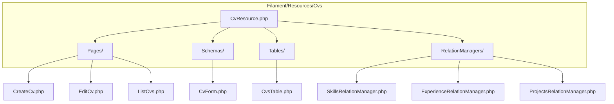
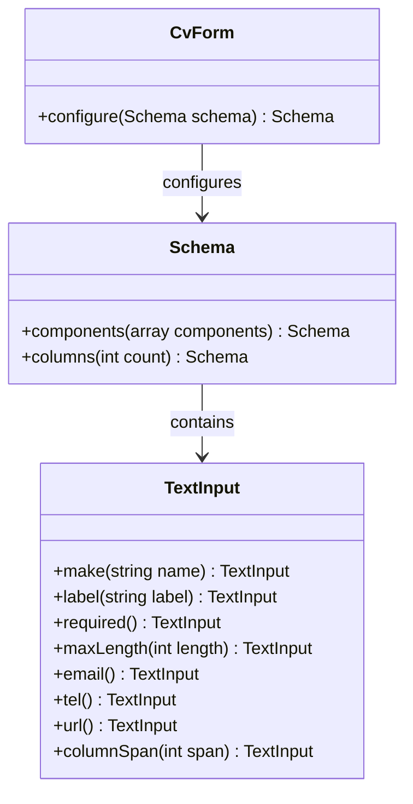
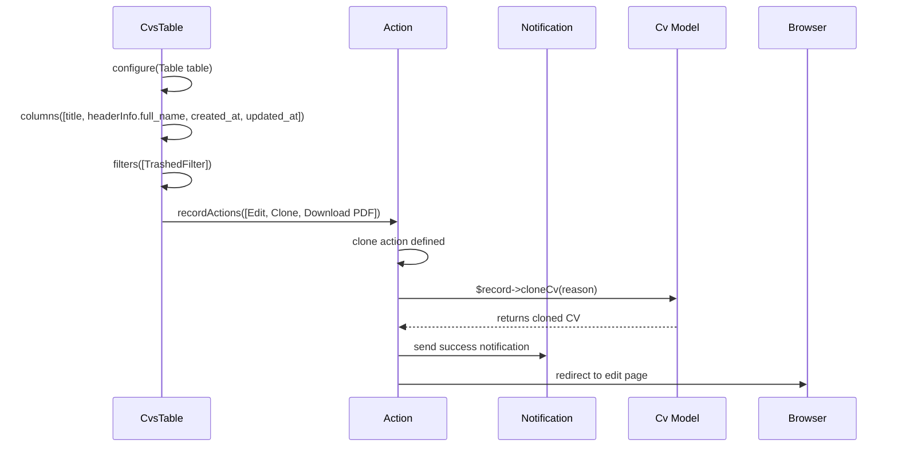
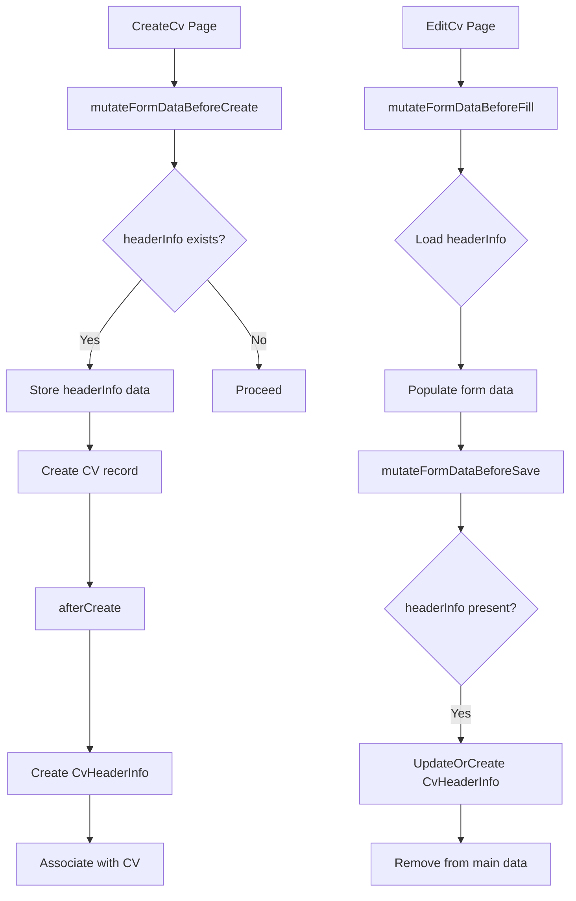
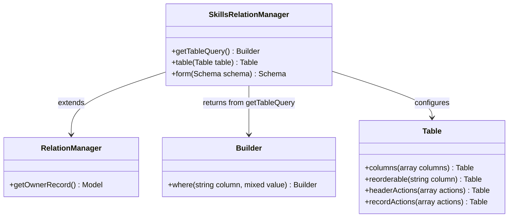
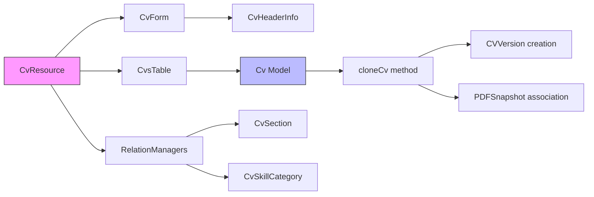

# Customizing Filament Resources

<cite>
**Referenced Files in This Document**   
- [CvResource.php](file://app/Filament/Resources/Cvs/CvResource.php)
- [CvForm.php](file://app/Filament/Resources/Cvs/Schemas/CvForm.php)
- [CvsTable.php](file://app/Filament/Resources/Cvs/Tables/CvsTable.php)
- [SkillsRelationManager.php](file://app/Filament/Resources/Cvs/RelationManagers/SkillsRelationManager.php)
- [CreateCv.php](file://app/Filament/Resources/Cvs/Pages/CreateCv.php)
- [EditCv.php](file://app/Filament/Resources/Cvs/Pages/EditCv.php)
- [Cv.php](file://app/Models/Cv.php)
- [CvHeaderInfo.php](file://app/Models/CvHeaderInfo.php)
</cite>

## Table of Contents
1. [Introduction](#introduction)
2. [Project Structure](#project-structure)
3. [Core Components](#core-components)
4. [Architecture Overview](#architecture-overview)
5. [Detailed Component Analysis](#detailed-component-analysis)
6. [Dependency Analysis](#dependency-analysis)
7. [Performance Considerations](#performance-considerations)
8. [Troubleshooting Guide](#troubleshooting-guide)
9. [Conclusion](#conclusion)

## Introduction
This document provides a comprehensive guide to customizing Filament resources within the CV Builder application. It details how to extend and modify forms, tables, pages, and relationship managers to meet specific business requirements while maintaining compatibility with the underlying Laravel models. The focus is on practical implementation patterns observed in the codebase, including schema configuration, table customization, action injection, and lifecycle hooks.

## Project Structure

The Filament resource structure in the CV Builder application follows a modular organization that separates concerns across forms, tables, pages, and relation managers. This design enables maintainable and scalable UI customization.



**Diagram sources**
- [CvResource.php](file://app/Filament/Resources/Cvs/CvResource.php)
- [CreateCv.php](file://app/Filament/Resources/Cvs/Pages/CreateCv.php)
- [CvForm.php](file://app/Filament/Resources/Cvs/Schemas/CvForm.php)
- [CvsTable.php](file://app/Filament/Resources/Cvs/Tables/CvsTable.php)

**Section sources**
- [CvResource.php](file://app/Filament/Resources/Cvs/CvResource.php)
- [CvForm.php](file://app/Filament/Resources/Cvs/Schemas/CvForm.php)
- [CvsTable.php](file://app/Filament/Resources/Cvs/Tables/CvsTable.php)

## Core Components

The core components of Filament customization in this application include resource classes that delegate form, table, and relationship configurations to dedicated schema and table classes. The `CvResource` acts as the central orchestrator, importing and configuring modular components for forms, tables, and relationships. This separation allows for clean overrides and targeted modifications without altering the main resource definition.

**Section sources**
- [CvResource.php](file://app/Filament/Resources/Cvs/CvResource.php)
- [CvForm.php](file://app/Filament/Resources/Cvs/Schemas/CvForm.php)
- [CvsTable.php](file://app/Filament/Resources/Cvs/Tables/CvsTable.php)

## Architecture Overview

The architecture follows a layered approach where each Filament resource delegates its UI configuration to specialized classes. This promotes reusability and makes it easier to customize individual aspects of the admin interface.

```mermaid
graph TD
A[CvResource] --> B[form()]
A --> C[table()]
A --> D[getRelations()]
A --> E[getPages()]
B --> F[CvForm::configure()]
C --> G[CvsTable::configure()]
D --> H[SkillsRelationManager]
D --> I[ExperienceRelationManager]
D --> J[ProjectsRelationManager]
F --> K[TextInput Components]
G --> L[TextColumn Definitions]
H --> M[Repeater & Nested Forms]
```

**Diagram sources**
- [CvResource.php](file://app/Filament/Resources/Cvs/CvResource.php)
- [CvForm.php](file://app/Filament/Resources/Cvs/Schemas/CvForm.php)
- [CvsTable.php](file://app/Filament/Resources/Cvs/Tables/CvsTable.php)
- [SkillsRelationManager.php](file://app/Filament/Resources/Cvs/RelationManagers/SkillsRelationManager.php)

## Detailed Component Analysis

### Form Customization with CvForm

The `CvForm` class defines the structure and validation rules for creating and editing CV records. It uses nested field notation (`headerInfo.full_name`) to manage related model data within a single form. This pattern allows editing of associated models (like `CvHeaderInfo`) without requiring separate forms or API calls.



**Diagram sources**
- [CvForm.php](file://app/Filament/Resources/Cvs/Schemas/CvForm.php)

**Section sources**
- [CvForm.php](file://app/Filament/Resources/Cvs/Schemas/CvForm.php)
- [CvHeaderInfo.php](file://app/Models/CvHeaderInfo.php)

### Table Customization with CvsTable

The `CvsTable` class configures the display, filtering, and actions available in the CV listing view. It includes both record-level actions (edit, clone, download PDF) and bulk operations (delete). The table leverages relationship attributes (e.g., `headerInfo.full_name`) for column rendering and supports toggleable columns for improved UX.



**Diagram sources**
- [CvsTable.php](file://app/Filament/Resources/Cvs/Tables/CvsTable.php)
- [Cv.php](file://app/Models/Cv.php)

**Section sources**
- [CvsTable.php](file://app/Filament/Resources/Cvs/Tables/CvsTable.php)

### Custom Actions and Lifecycle Hooks

Custom actions like "Clone CV" are implemented using Filament's Action system with confirmation modals and post-action redirects. These actions integrate with model methods and dispatch notifications for user feedback. Lifecycle hooks (`mutateFormDataBeforeCreate`, `mutateFormDataBeforeSave`) handle complex data transformations and related model persistence.



**Diagram sources**
- [CreateCv.php](file://app/Filament/Resources/Cvs/Pages/CreateCv.php)
- [EditCv.php](file://app/Filament/Resources/Cvs/Pages/EditCv.php)
- [CvHeaderInfo.php](file://app/Models/CvHeaderInfo.php)

**Section sources**
- [CreateCv.php](file://app/Filament/Resources/Cvs/Pages/CreateCv.php)
- [EditCv.php](file://app/Filament/Resources/Cvs/Pages/EditCv.php)

### Relationship Management

Relationship managers like `SkillsRelationManager` provide inline management of related data within the parent resource. They use custom queries to ensure proper scoping and support reorderable lists with drag-and-drop functionality. The `using()` method allows full control over record creation logic, enabling complex workflows like automatic section creation.



**Diagram sources**
- [SkillsRelationManager.php](file://app/Filament/Resources/Cvs/RelationManagers/SkillsRelationManager.php)

**Section sources**
- [SkillsRelationManager.php](file://app/Filament/Resources/Cvs/RelationManagers/SkillsRelationManager.php)

## Dependency Analysis

The Filament resource system relies on a clear dependency chain from the resource class down to models and services. Proper service injection ensures loose coupling while maintaining functionality.



**Diagram sources**
- [CvResource.php](file://app/Filament/Resources/Cvs/CvResource.php)
- [Cv.php](file://app/Models/Cv.php)
- [CvHeaderInfo.php](file://app/Models/CvHeaderInfo.php)

**Section sources**
- [CvResource.php](file://app/Filament/Resources/Cvs/CvResource.php)
- [Cv.php](file://app/Models/Cv.php)

## Performance Considerations

While not explicitly addressed in the code, performance implications arise from nested relationships and deep cloning operations. The `cloneCv` method uses database transactions and eager loading patterns to minimize round trips. However, for large CVs with many sections, consider implementing queue-based cloning to avoid timeout issues. Table filtering should leverage indexed columns, and relationship counts should be preloaded where possible.

## Troubleshooting Guide

Common issues in Filament resource customization include form validation failures due to mass assignment protection, table rendering errors from missing relationships, and action execution failures from incorrect model binding. Ensure all fillable attributes are properly defined in model `$fillable` arrays. When working with nested data, verify that lifecycle hooks correctly handle data extraction and reassociation. For relationship managers, confirm that custom queries return properly scoped builders.

**Section sources**
- [Cv.php](file://app/Models/Cv.php)
- [CvHeaderInfo.php](file://app/Models/CvHeaderInfo.php)
- [EditCv.php](file://app/Filament/Resources/Cvs/Pages/EditCv.php)

## Conclusion

Customizing Filament resources in the CV Builder application involves extending modular components for forms, tables, pages, and relationships. By following the existing patterns of delegation and separation of concerns, developers can implement complex UI behaviors while maintaining code clarity and upgrade compatibility. Key practices include using dedicated schema and table classes, leveraging lifecycle hooks for data transformation, and implementing custom actions with proper user feedback.