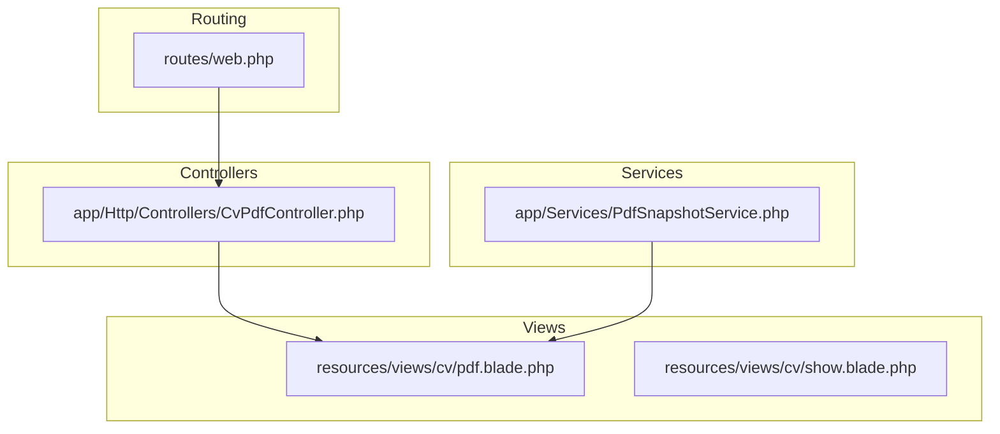
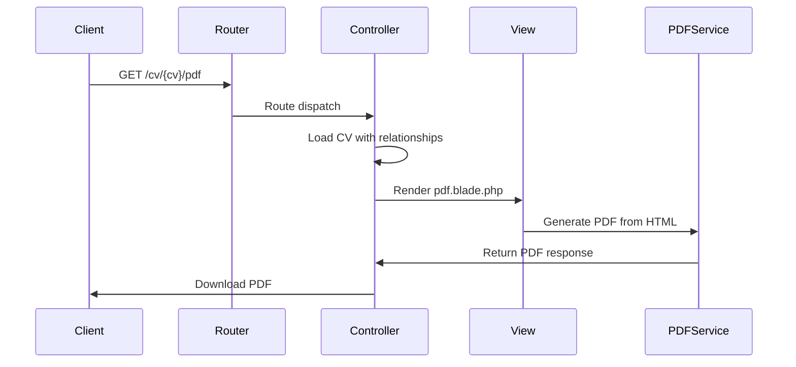
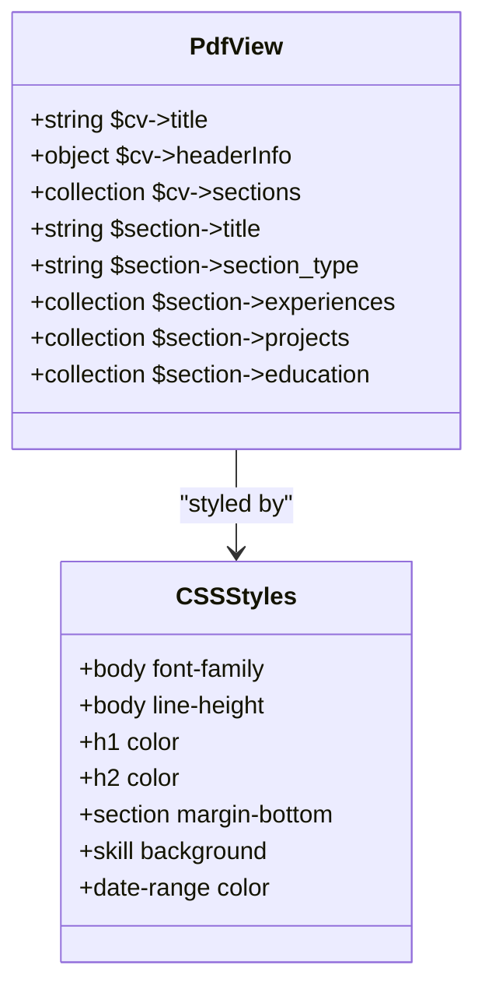
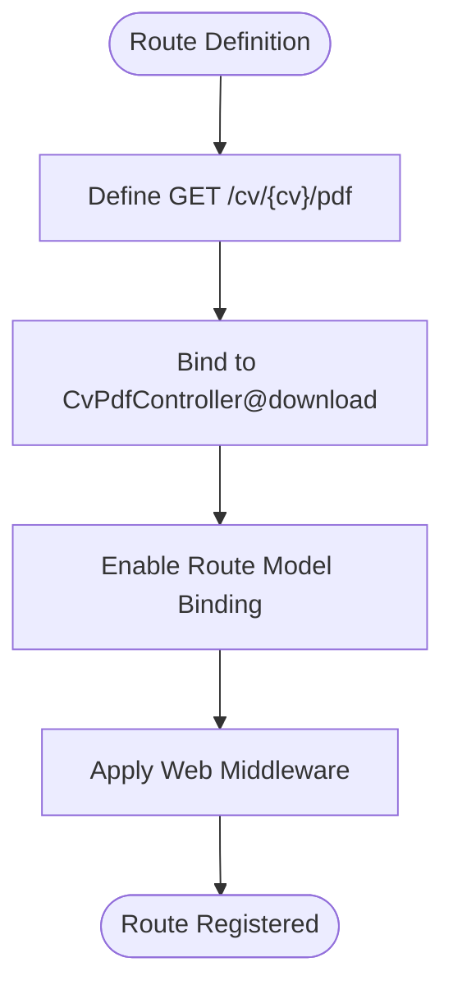
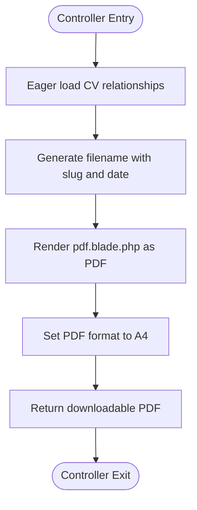
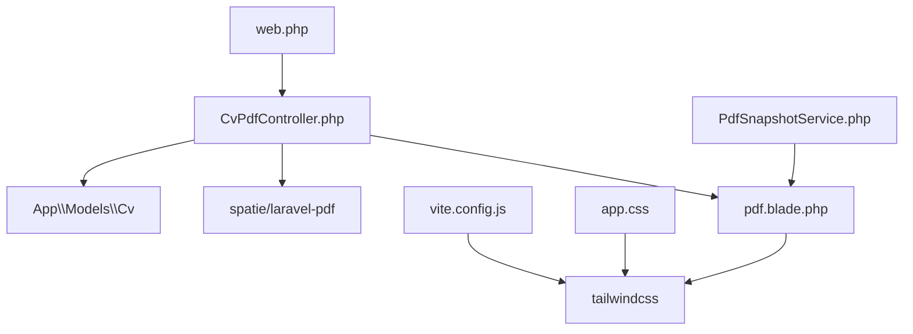

# Customizing Views and Routing

<cite>
**Referenced Files in This Document**   
- [pdf.blade.php](file://resources/views/cv/pdf.blade.php)
- [web.php](file://routes/web.php)
- [CvPdfController.php](file://app/Http/Controllers/CvPdfController.php)
- [app.css](file://resources/css/app.css)
- [vite.config.js](file://vite.config.js)
- [PdfSnapshotService.php](file://app/Services/PdfSnapshotService.php)
</cite>

## Table of Contents
1. [Introduction](#introduction)
2. [Project Structure](#project-structure)
3. [Core Components](#core-components)
4. [Architecture Overview](#architecture-overview)
5. [Detailed Component Analysis](#detailed-component-analysis)
6. [Dependency Analysis](#dependency-analysis)
7. [Performance Considerations](#performance-considerations)
8. [Troubleshooting Guide](#troubleshooting-guide)
9. [Conclusion](#conclusion)

## Introduction
This document provides comprehensive guidance on customizing Blade views and routing in the CV Builder application. It covers techniques for modifying PDF output styling, creating new routes, implementing security measures, and maintaining design consistency using Tailwind CSS. The document also addresses versioning strategies and technical debt management when extending core templates.

## Project Structure

The CV Builder application follows a standard Laravel directory structure with specific components for view rendering and routing. Key directories include `resources/views` for Blade templates, `routes` for web endpoints, and `app/Http/Controllers` for handling requests.

**Diagram sources**
- [web.php](file://routes/web.php)
- [CvPdfController.php](file://app/Http/Controllers/CvPdfController.php)
- [pdf.blade.php](file://resources/views/cv/pdf.blade.php)
- [PdfSnapshotService.php](file://app/Services/PdfSnapshotService.php)

**Section sources**
- [web.php](file://routes/web.php)
- [CvPdfController.php](file://app/Http/Controllers/CvPdfController.php)
- [pdf.blade.php](file://resources/views/cv/pdf.blade.php)

## Core Components

The core components for view customization and routing include the PDF Blade template, the web routing configuration, and the PDF controller. These components work together to render CVs as PDF documents and expose them through web endpoints. The system uses Spatie's Laravel PDF package to convert HTML views into PDF format.

**Section sources**
- [pdf.blade.php](file://resources/views/cv/pdf.blade.php)
- [web.php](file://routes/web.php)
- [CvPdfController.php](file://app/Http/Controllers/CvPdfController.php)

## Architecture Overview

The application architecture follows the MVC pattern with Blade templates for presentation, controllers for request handling, and models for data access. The PDF generation process involves routing a request to the CvPdfController, which loads the necessary data and renders the pdf.blade.php template through the Spatie PDF facade.

**Diagram sources**
- [web.php](file://routes/web.php#L7-L10)
- [CvPdfController.php](file://app/Http/Controllers/CvPdfController.php#L10-L33)
- [pdf.blade.php](file://resources/views/cv/pdf.blade.php)

## Detailed Component Analysis

### PDF View Customization

The pdf.blade.php template controls the visual appearance of generated PDF documents. It includes inline CSS for styling and uses Blade directives to conditionally render CV sections. To customize the PDF output, developers can modify the CSS styles or adjust the HTML structure while maintaining the data binding expressions.

**Diagram sources**
- [pdf.blade.php](file://resources/views/cv/pdf.blade.php)

**Section sources**
- [pdf.blade.php](file://resources/views/cv/pdf.blade.php)

### Routing Configuration

The web.php file defines the application's web routes, including the endpoint for PDF downloads. The route uses Laravel's route model binding to inject a Cv model instance into the controller method. This approach simplifies controller logic by automatically resolving the CV from the route parameter.

**Diagram sources**
- [web.php](file://routes/web.php)

**Section sources**
- [web.php](file://routes/web.php)

### Controller Implementation

The CvPdfController handles PDF generation requests by loading the CV with all related data and passing it to the PDF rendering service. The controller uses eager loading to minimize database queries and generates a filename based on the CV title and current date. The Spatie Laravel PDF package converts the Blade view into a downloadable PDF document.

**Diagram sources**
- [CvPdfController.php](file://app/Http/Controllers/CvPdfController.php)

**Section sources**
- [CvPdfController.php](file://app/Http/Controllers/CvPdfController.php)

## Dependency Analysis

The view and routing components depend on several key packages and configuration files. The Spatie Laravel PDF package is essential for PDF generation, while Tailwind CSS provides the styling framework. The Vite configuration ensures proper asset compilation, and the authentication configuration protects routes when needed.

**Diagram sources**
- [web.php](file://routes/web.php)
- [CvPdfController.php](file://app/Http/Controllers/CvPdfController.php)
- [pdf.blade.php](file://resources/views/cv/pdf.blade.php)
- [app.css](file://resources/css/app.css)
- [vite.config.js](file://vite.config.js)
- [PdfSnapshotService.php](file://app/Services/PdfSnapshotService.php)

**Section sources**
- [composer.json](file://composer.json#L20)
- [vite.config.js](file://vite.config.js)
- [app.css](file://resources/css/app.css)

## Performance Considerations

PDF generation can be resource-intensive, especially with complex CVs containing many sections and entries. The current implementation uses eager loading to minimize database queries, but very large CVs may still impact performance. Consider implementing caching mechanisms for frequently accessed CVs and optimizing the Blade template for faster rendering.

## Troubleshooting Guide

Common issues when customizing views and routing include broken route model binding, CSS not applying to PDF output, and missing relationship data in the generated document. Ensure that all necessary relationships are included in the controller's eager loading array and that CSS rules are compatible with the PDF rendering engine. Test changes incrementally and verify that the generated PDF maintains proper formatting.

**Section sources**
- [CvPdfController.php](file://app/Http/Controllers/CvPdfController.php#L15-L20)
- [pdf.blade.php](file://resources/views/cv/pdf.blade.php)

## Conclusion

Customizing views and routing in the CV Builder application requires understanding the interaction between Blade templates, controllers, and routing configuration. By following the patterns established in the existing codebase, developers can extend functionality while maintaining consistency and performance. Always consider security implications when exposing new endpoints and ensure that customizations align with the application's design system.