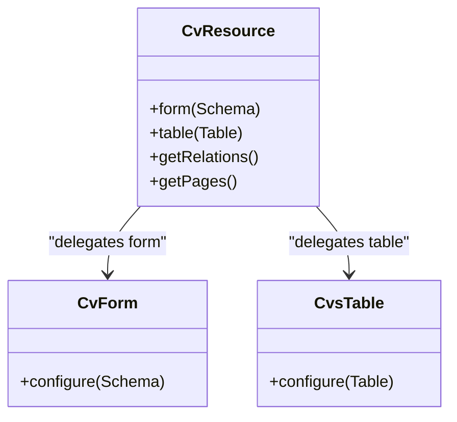
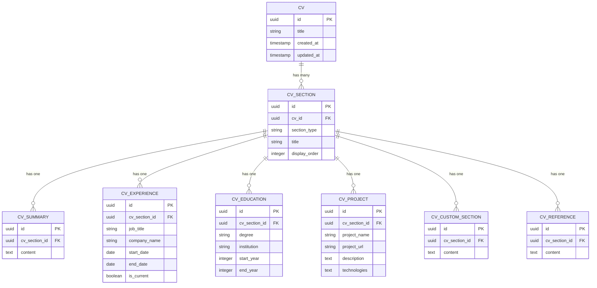
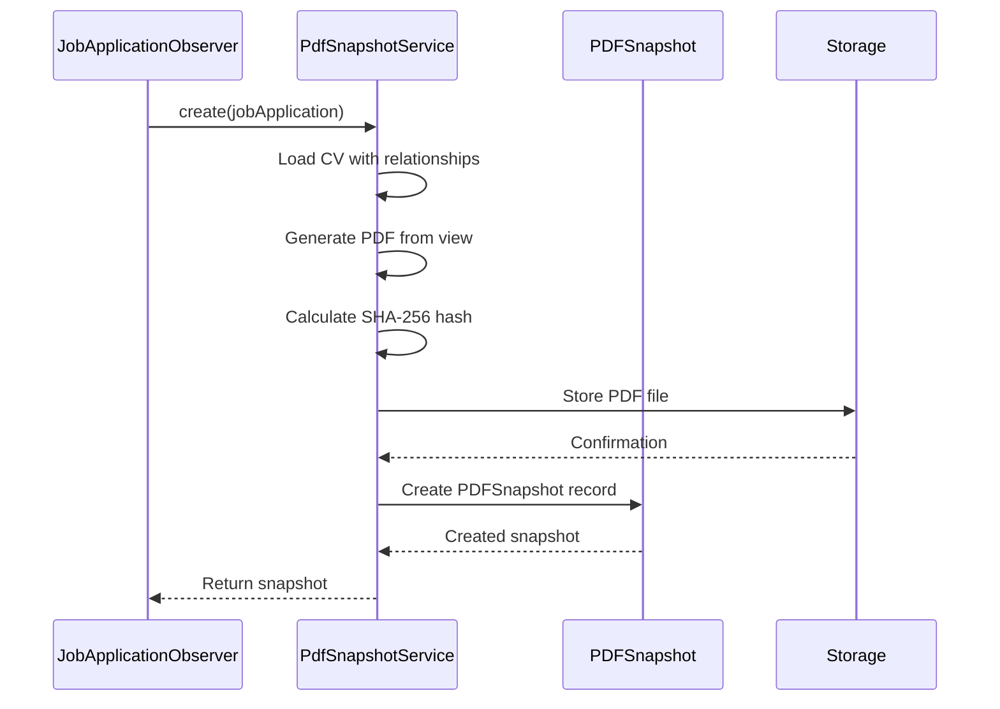

# Extending the Application

<cite>
**Referenced Files in This Document**   
- [CvResource.php](file://app/Filament/Resources/Cvs/CvResource.php)
- [CvForm.php](file://app/Filament/Resources/Cvs/Schemas/CvForm.php)
- [CvsTable.php](file://app/Filament/Resources/Cvs/Tables/CvsTable.php)
- [CustomSectionsRelationManager.php](file://app/Filament/Resources/Cvs/RelationManagers/CustomSectionsRelationManager.php)
- [EducationRelationManager.php](file://app/Filament/Resources/Cvs/RelationManagers/EducationRelationManager.php)
- [ExperienceRelationManager.php](file://app/Filament/Resources/Cvs/RelationManagers/ExperienceRelationManager.php)
- [ProjectsRelationManager.php](file://app/Filament/Resources/Cvs/RelationManagers/ProjectsRelationManager.php)
- [ReferencesRelationManager.php](file://app/Filament/Resources/Cvs/RelationManagers/ReferencesRelationManager.php)
- [SummaryRelationManager.php](file://app/Filament/Resources/Cvs/RelationManagers/SummaryRelationManager.php)
- [CVVersionResource.php](file://app/Filament/Resources/CVVersions/CVVersionResource.php)
- [JobApplicationResource.php](file://app/Filament/Resources/JobApplications/JobApplicationResource.php)
- [PDFSnapshotResource.php](file://app/Filament/Resources/PDFSnapshots/PDFSnapshotResource.php)
- [Cv.php](file://app/Models/Cv.php)
- [CVVersion.php](file://app/Models/CVVersion.php)
- [CvCustomSection.php](file://app/Models/CvCustomSection.php)
- [CvEducation.php](file://app/Models/CvEducation.php)
- [CvExperience.php](file://app/Models/CvExperience.php)
- [CvProject.php](file://app/Models/CvProject.php)
- [CvReference.php](file://app/Models/CvReference.php)
- [CvSection.php](file://app/Models/CvSection.php)
- [CvSummary.php](file://app/Models/CvSummary.php)
- [JobApplication.php](file://app/Models/JobApplication.php)
- [PDFSnapshot.php](file://app/Models/PDFSnapshot.php)
- [KeywordCoverageService.php](file://app/Services/KeywordCoverageService.php)
- [PdfSnapshotService.php](file://app/Services/PdfSnapshotService.php)
- [JobApplicationObserver.php](file://app/Observers/JobApplicationObserver.php)
- [ApplicationStatsOverview.php](file://app/Filament/Widgets/ApplicationStatsOverview.php)
- [CvStatsOverview.php](file://app/Filament/Widgets/CvStatsOverview.php)
- [CvPdfController.php](file://app/Http/Controllers/CvPdfController.php)
- [pdf.blade.php](file://resources/views/cv/pdf.blade.php)
- [create_cvs_table.php](file://database/migrations/2025_10_03_201646_create_cvs_table.php)
- [create_cv_sections_table.php](file://database/migrations/2025_10_03_201651_create_cv_sections_table.php)
- [create_cv_custom_sections_table.php](file://database/migrations/2025_10_03_225951_create_cv_custom_sections_table.php)
</cite>

## Table of Contents
1. [Introduction](#introduction)
2. [Customizing Filament Resources](#customizing-filament-resources)
3. [Adding New CV Section Types](#adding-new-cv-section-types)
4. [Extending the Service Layer](#extending-the-service-layer)
5. [Registering Custom Observers](#registering-custom-observers)
6. [Creating Dashboard Widgets](#creating-dashboard-widgets)
7. [Overriding Blade Views](#overriding-blade-views)
8. [Adding Routes and Controllers](#adding-routes-and-controllers)
9. [Best Practices for Extension](#best-practices-for-extension)
10. [Use Cases](#use-cases)

## Introduction
The CV Builder application is built with extensibility in mind, leveraging Laravel Filament for its admin interface and following clean architectural patterns. This document provides comprehensive guidance on extending the application's functionality through various mechanisms including customizing Filament resources, adding new data models, extending business logic, and modifying the user interface. The patterns demonstrated in the existing codebase provide clear examples for implementing new features while maintaining upgrade compatibility.

## Customizing Filament Resources
Filament resources in the CV Builder application are organized under the `app/Filament/Resources` directory and follow a consistent structure with dedicated directories for forms, tables, pages, and relation managers. Developers can customize existing resources by modifying their form schemas, table configurations, or page definitions.

The `CvResource` class demonstrates the standard resource structure, defining the associated model (`Cv::class`) and configuring form, table, relations, and pages. The form is delegated to `CvForm::configure()`, which defines a two-column layout with fields for the CV title and header information including full name, job title, contact details, and social links.

**Diagram sources**
- [CvResource.php](file://app/Filament/Resources/Cvs/CvResource.php#L16-L53)
- [CvForm.php](file://app/Filament/Resources/Cvs/Schemas/CvForm.php#L7-L64)
- [CvsTable.php](file://app/Filament/Resources/Cvs/Tables/CvsTable.php#L14-L75)

**Section sources**
- [CvResource.php](file://app/Filament/Resources/Cvs/CvResource.php#L16-L53)
- [CvForm.php](file://app/Filament/Resources/Cvs/Schemas/CvForm.php#L7-L64)

Table customization is handled through the `CvsTable` class, which configures columns for title, name, and dates, along with filters and actions. Notably, it includes a custom "Clone CV" action that triggers the `cloneCv` method on the CV model and redirects to the edit form of the newly created CV. The table also implements soft delete filtering through the `TrashedFilter` component, allowing users to toggle between active and archived CVs.

## Adding New CV Section Types
The application's CV section architecture is designed to be extensible through a polymorphic relationship pattern. Each CV contains multiple sections of different types (summary, experience, education, etc.), with each type having its own model and database table. This pattern allows for the addition of new section types without modifying existing code.

To add a new section type like "Certifications", developers should follow these steps:

1. Create a migration to add the `cv_certifications` table with fields for certification name, issuing organization, date earned, and expiration date
2. Create a `CvCertification` model that extends `Model` and defines the relationship to `CvSection`
3. Create a migration to add the section type to the `cv_sections` table
4. Implement a new relation manager (e.g., `CertificationsRelationManager`) that extends `RelationManager`
5. Register the new relation manager in the `CvResource::getRelations()` method

The existing `CustomSectionsRelationManager` provides a template for implementing relation managers. It modifies the query to filter sections by `section_type = 'custom'` and includes a custom `using` callback that creates both a `CvSection` and associated `CvCustomSection` record. This pattern ensures data integrity while maintaining separation between the section metadata and content.

**Diagram sources**
- [Cv.php](file://app/Models/Cv.php)
- [CvSection.php](file://app/Models/CvSection.php)
- [CvSummary.php](file://app/Models/CvSummary.php)
- [CvExperience.php](file://app/Models/CvExperience.php)
- [CvEducation.php](file://app/Models/CvEducation.php)
- [CvProject.php](file://app/Models/CvProject.php)
- [CvCustomSection.php](file://app/Models/CvCustomSection.php)
- [CvReference.php](file://app/Models/CvReference.php)

**Section sources**
- [CustomSectionsRelationManager.php](file://app/Filament/Resources/Cvs/RelationManagers/CustomSectionsRelationManager.php#L18-L115)
- [EducationRelationManager.php](file://app/Filament/Resources/Cvs/RelationManagers/EducationRelationManager.php#L18-L120)
- [ExperienceRelationManager.php](file://app/Filament/Resources/Cvs/RelationManagers/ExperienceRelationManager.php#L21-L144)

## Extending the Service Layer
The service layer in the CV Builder application contains business logic that is independent of the HTTP layer and Filament interface. Services are located in the `app/Services` directory and are designed to be reusable across different parts of the application.

The `KeywordCoverageService` demonstrates a pure business logic service that calculates the percentage of keywords from a job description that appear in a CV. It includes methods for tokenizing text (removing stopwords and short tokens) and calculating coverage metrics. This service is used in the `JobApplicationForm` to provide real-time feedback on keyword matching.

The `PdfSnapshotService` represents an integration service that handles the creation of PDF snapshots when job applications are sent. It coordinates multiple operations including loading the CV with all relationships, generating a PDF using the `cv.pdf` Blade view, calculating a SHA-256 hash, storing the file, and creating a database record. This service follows the single responsibility principle by encapsulating all PDF snapshot logic in one class.

**Diagram sources**
- [PdfSnapshotService.php](file://app/Services/PdfSnapshotService.php#L9-L64)
- [JobApplicationObserver.php](file://app/Observers/JobApplicationObserver.php#L7-L41)
- [PDFSnapshot.php](file://app/Models/PDFSnapshot.php)

**Section sources**
- [KeywordCoverageService.php](file://app/Services/KeywordCoverageService.php#L4-L56)
- [PdfSnapshotService.php](file://app/Services/PdfSnapshotService.php#L9-L64)

## Registering Custom Observers
Model observers in Laravel provide a way to hook into Eloquent model events such as creating, updating, and deleting. The CV Builder application uses observers to implement business logic that should be triggered by model state changes.

The `JobApplicationObserver` demonstrates two common observer patterns. The `updating` method automatically updates the `last_activity_at` timestamp whenever a job application is modified, ensuring this field is always current without requiring explicit updates in controllers or forms. The `updated` method implements a more complex business rule: when the `send_status` changes to 'sent' and no PDF snapshot exists, it triggers the creation of a PDF snapshot using the `PdfSnapshotService`.

Observers are registered in the `AppServiceProvider`'s `boot` method using the `observe` method on the model class. This ensures the observer is attached to all instances of the model throughout the application lifecycle.

**Section sources**
- [JobApplicationObserver.php](file://app/Observers/JobApplicationObserver.php#L7-L41)

## Creating Dashboard Widgets
Filament widgets are used to display information on the admin dashboard. The CV Builder application includes several widgets such as `ApplicationStatsOverview`, `ApplicationStatusChart`, and `CvStatsOverview` that provide insights into job applications and CVs.

To create a new dashboard widget, developers should create a class in the `app/Filament/Widgets` directory that extends `Filament\Widgets\Widget` or one of its specialized subclasses like `StatsOverviewWidget` or `ChartWidget`. The widget should implement the necessary methods to fetch data and define the view.

Widgets can be registered in the Filament panel provider to appear on the dashboard. They can include Livewire components for interactivity and can leverage Laravel's query builder or Eloquent to retrieve data from the database.

**Section sources**
- [ApplicationStatsOverview.php](file://app/Filament/Widgets/ApplicationStatsOverview.php)
- [CvStatsOverview.php](file://app/Filament/Widgets/CvStatsOverview.php)

## Overriding Blade Views
The application's PDF generation functionality relies on Blade views located in `resources/views/cv`. The `pdf.blade.php` view is used by the `PdfSnapshotService` to render CVs as PDF documents.

To customize the appearance of generated PDFs, developers can modify the `pdf.blade.php` view directly. The view uses Tailwind CSS for styling and includes all CV sections through partials. Changes to the view will affect both PDF snapshots and the public CV display.

For more extensive UI customizations, developers can override any Filament view by publishing the view files and modifying them. This approach should be used judiciously to minimize the impact of future Filament updates.

**Section sources**
- [pdf.blade.php](file://resources/views/cv/pdf.blade.php)
- [CvPdfController.php](file://app/Http/Controllers/CvPdfController.php)

## Adding Routes and Controllers
Custom routes and controllers can be added to extend the application's functionality beyond what is provided by Filament. The `CvPdfController` demonstrates a simple controller that handles public CV display.

New routes should be added to the `routes/web.php` file, following Laravel's routing conventions. Controllers should be placed in the `app/Http/Controllers` directory and can leverage middleware for authentication and authorization.

For API endpoints, developers can create routes in `routes/api.php` and use API resource classes to format responses. When integrating with external services like job boards, controllers can implement OAuth flows or API clients to exchange data.

**Section sources**
- [CvPdfController.php](file://app/Http/Controllers/CvPdfController.php)
- [web.php](file://routes/web.php)

## Best Practices for Extension
When extending the CV Builder application, developers should follow these best practices to ensure maintainability and upgrade compatibility:

1. **Follow existing patterns**: The application uses consistent patterns for relation managers, services, and observers. New code should follow these patterns for consistency.

2. **Use service classes for business logic**: Complex business logic should be encapsulated in service classes rather than controllers or models to promote reusability and testability.

3. **Leverage observers for model events**: Use observers to handle side effects of model state changes rather than embedding this logic in controllers.

4. **Maintain separation of concerns**: Keep UI logic in views and components, business logic in services, and data access in models and repositories.

5. **Use migrations for schema changes**: All database schema changes should be made through migrations to ensure they can be replicated across environments.

6. **Write tests for new functionality**: The application includes both feature and unit tests. New features should be accompanied by appropriate tests.

7. **Document customizations**: Maintain documentation for customizations to aid future maintenance and onboarding.

## Use Cases

### Adding a Certifications Section
To add a certifications section to CVs, follow these steps:

1. Create a migration to create the `cv_certifications` table with fields for name, issuer, date_earned, and expires_at
2. Create a `CvCertification` model with appropriate casts and relationships
3. Create a `CertificationsRelationManager` that extends `RelationManager` and implements the table and form methods
4. Add the relation manager to the `CvResource::getRelations()` method
5. Update the `cv.pdf` Blade view to include the certifications section
6. Create tests to verify the functionality

### Integrating with External Job Boards
To integrate with external job boards via API:

1. Create a `JobBoardService` class to handle API communication
2. Implement methods for authentication, retrieving job listings, and applying to positions
3. Create a controller to handle OAuth callbacks and API requests
4. Add routes for the integration endpoints
5. Create a Filament widget to display job board statistics
6. Use observers to trigger job board updates when job applications change status

These use cases demonstrate how the application's architecture supports extensibility while maintaining clean separation of concerns and adherence to Laravel best practices.