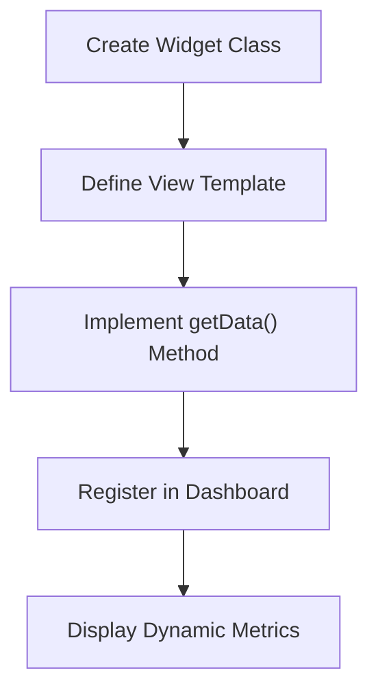
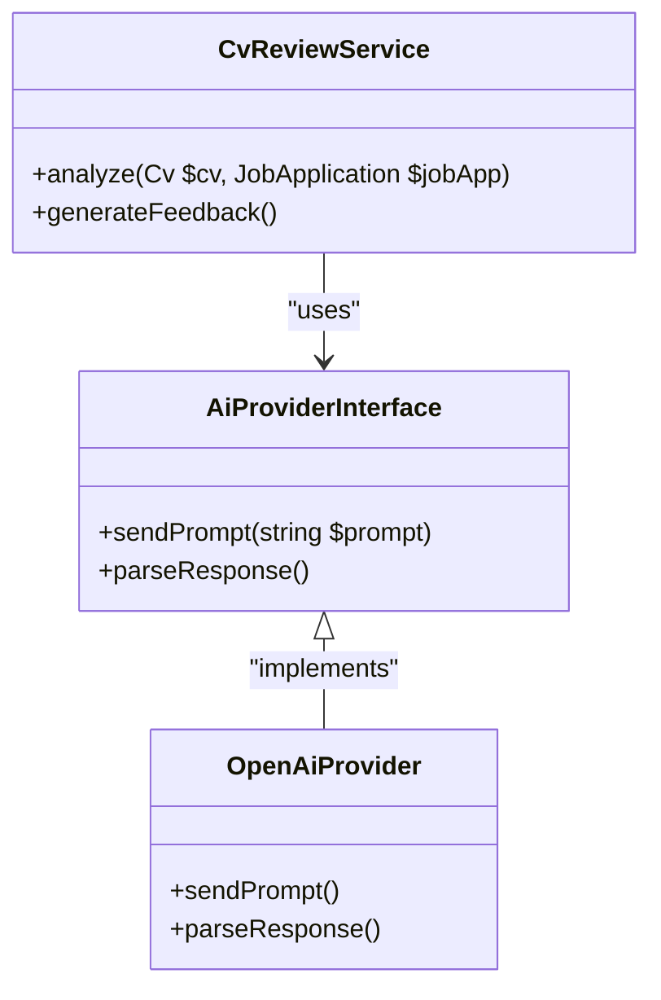

# Extending the Application

<cite>
**Referenced Files in This Document**   
- [CVVersionResource.php](file://app/Filament/Resources/CVVersions/CVVersionResource.php)
- [CvResource.php](file://app/Filament/Resources/Cvs/CvResource.php)
- [CoverLetterService.php](file://app/Services/CoverLetterService.php)
- [CvReviewService.php](file://app/Services/CvReviewService.php)
- [KeywordCoverageService.php](file://app/Services/KeywordCoverageService.php)
- [KeywordScoringService.php](file://app/Services/KeywordScoringService.php)
- [MetricsCalculationService.php](file://app/Services/MetricsCalculationService.php)
- [PdfSnapshotService.php](file://app/Services/PdfSnapshotService.php)
- [ApplicationEventObserver.php](file://app/Observers/ApplicationEventObserver.php)
- [JobApplicationObserver.php](file://app/Observers/JobApplicationObserver.php)
- [PdfTemplateObserver.php](file://app/Observers/PdfTemplateObserver.php)
- [ValidCvReviewSchema.php](file://app/Rules/ValidCvReviewSchema.php)
- [ApplicationStatsOverview.php](file://app/Filament/Widgets/ApplicationStatsOverview.php)
- [ApplicationStatusChart.php](file://app/Filament/Widgets/ApplicationStatusChart.php)
- [ApplicationsNeedingAction.php](file://app/Filament/Widgets/ApplicationsNeedingAction.php)
- [CvStatsOverview.php](file://app/Filament/Widgets/CvStatsOverview.php)
- [MetricsOverview.php](file://app/Filament/Widgets/MetricsOverview.php)
- [RecentApplicationsTable.php](file://app/Filament/Widgets/RecentApplicationsTable.php)
- [create_cvs_table.php](file://database/migrations/2025_10_03_201646_create_cvs_table.php)
- [create_cv_sections_table.php](file://database/migrations/2025_10_03_201651_create_cv_sections_table.php)
- [create_cv_custom_sections_table.php](file://database/migrations/2025_10_03_225951_create_cv_custom_sections_table.php)
- [Cv.php](file://app/Models/Cv.php)
- [CvSection.php](file://app/Models/CvSection.php)
- [CvCustomSection.php](file://app/Models/CvCustomSection.php)
- [services.php](file://config/services.php)
- [AppServiceProvider.php](file://app/Providers/AppServiceProvider.php)
- [ValidCvReviewSchemaTest.php](file://tests/Unit/ValidCvReviewSchemaTest.php)
- [classic.blade.php](file://resources/views/cv/templates/classic.blade.php)
- [default.blade.php](file://resources/views/cv/templates/default.blade.php)
- [modern.blade.php](file://resources/views/cv/templates/modern.blade.php)
- [CvPdfController.php](file://app/Http/Controllers/CvPdfController.php)
- [BaseCVSeeder.php](file://database/seeders/BaseCVSeeder.php)
</cite>

## Table of Contents
1. [Adding New Filament Resources](#adding-new-filament-resources)
2. [Customizing Existing Services](#customizing-existing-services)
3. [Creating New Observers](#creating-new-observers)
4. [Extending CV Sections and Review Schema](#extending-cv-sections-and-review-schema)
5. [Integrating AI Providers and PDF Libraries](#integrating-ai-providers-and-pdf-libraries)
6. [Developing Custom Dashboard Widgets and Metrics](#developing-custom-dashboard-widgets-and-metrics)
7. [Extending the Data Model](#extending-the-data-model)
8. [Best Practices for Code Organization and Dependency Injection](#best-practices-for-code-organization-and-dependency-injection)
9. [Maintaining Backward Compatibility](#maintaining-backward-compatibility)
10. [Contributing to the Roadmap via Specs](#contributing-to-the-roadmap-via-specs)

## Adding New Filament Resources

To extend the administrative interface, new Filament resources can be created by generating resource classes that extend `Filament\Resources\Resource`. These resources define CRUD operations, form schemas, table views, and relation managers. For example, the `CvResource.php` and `CVVersionResource.php` files demonstrate how models like `Cv` and `CVVersion` are exposed in the admin panel with custom pages and tables.

Each resource includes configuration for:
- Navigation labels and icons
- Model associations
- Form layout via schema definitions in `Schemas` directory
- Table columns and filters in `Tables` directory
- Page-level actions in `Pages` directory

New resources should follow the same structure and be registered in the `AdminPanelProvider`.

**Section sources**
- [CvResource.php](file://app/Filament/Resources/Cvs/CvResource.php#L1-L100)
- [CVVersionResource.php](file://app/Filament/Resources/CVVersions/CVVersionResource.php#L1-L100)

## Customizing Existing Services

Core application logic is encapsulated within service classes located in `app/Services`. These include `CvReviewService.php`, `CoverLetterService.php`, `KeywordScoringService.php`, and others. To customize behavior, developers can:
- Extend these classes to override specific methods
- Use Laravel's service container to bind custom implementations
- Inject dependencies through constructor or method injection

For instance, `CvReviewService` handles AI-powered CV analysis and can be extended to support alternative AI providers or modify scoring algorithms.

**Section sources**
- [CvReviewService.php](file://app/Services/CvReviewService.php#L1-L80)
- [KeywordScoringService.php](file://app/Services/KeywordScoringService.php#L1-L60)
- [CoverLetterService.php](file://app/Services/CoverLetterService.php#L1-L50)

## Creating New Observers

Model observers such as `JobApplicationObserver.php` and `PdfTemplateObserver.php` allow event-driven logic to be attached to Eloquent models. To create a new observer:
1. Define a class that hooks into model lifecycle events (`created`, `updated`, `deleted`, etc.)
2. Register the observer in `AppServiceProvider` using the `observe()` method on the target model

For example, `PdfTemplateObserver` could be extended to trigger notifications or analytics when templates are modified.

**Section sources**
- [JobApplicationObserver.php](file://app/Observers/JobApplicationObserver.php#L1-L30)
- [PdfTemplateObserver.php](file://app/Observers/PdfTemplateObserver.php#L1-L25)
- [AppServiceProvider.php](file://app/Providers/AppServiceProvider.php#L20-L35)

## Extending CV Sections and Review Schema

The CV structure supports both predefined and custom sections via the `CvSection` and `CvCustomSection` models. Custom sections can be added through the `CustomSectionsRelationManager.php`, which manages dynamic content blocks.

Additionally, the `ValidCvReviewSchema.php` rule validates the structure of AI-generated review data. This rule can be modified to accommodate new review categories or stricter validation criteria. The corresponding test file `ValidCvReviewSchemaTest.php` ensures schema integrity during changes.

**Section sources**
- [CvSection.php](file://app/Models/CvSection.php#L1-L40)
- [CvCustomSection.php](file://app/Models/CvCustomSection.php#L1-L35)
- [ValidCvReviewSchema.php](file://app/Rules/ValidCvReviewSchema.php#L1-L50)
- [ValidCvReviewSchemaTest.php](file://tests/Unit/ValidCvReviewSchemaTest.php#L1-L40)

## Integrating AI Providers and PDF Libraries

The application currently uses services defined in `config/services.php` for AI and PDF generation. To integrate alternative AI providers:
- Add new configuration entries in `services.php`
- Implement adapter classes that conform to existing service interfaces
- Update `CvReviewService` to route requests based on configuration

For PDF generation, the `CvPdfController.php` renders views using Blade templates (`classic.blade.php`, `modern.blade.php`). Alternative libraries like Dompdf or Snappy can be integrated by creating a new service wrapper and injecting it into the controller.

**Section sources**
- [services.php](file://config/services.php#L1-L20)
- [CvPdfController.php](file://app/Http/Controllers/CvPdfController.php#L1-L40)
- [classic.blade.php](file://resources/views/cv/templates/classic.blade.php#L1-L100)
- [modern.blade.php](file://resources/views/cv/templates/modern.blade.php#L1-L100)

## Developing Custom Dashboard Widgets and Metrics

The `app/Filament/Widgets` directory contains dashboard components such as `ApplicationStatsOverview.php` and `MetricsOverview.php`. These widgets display real-time data using Filament's widget system.

To create a new widget:
1. Extend `Filament\Widgets\Widget`
2. Define view and data preparation logic
3. Register in the dashboard layout

Metrics like those in `MetricsCalculationService.php` can be extended to compute new KPIs, which are then exposed via widgets.

**Diagram sources**
- [ApplicationStatsOverview.php](file://app/Filament/Widgets/ApplicationStatsOverview.php#L1-L30)
- [MetricsCalculationService.php](file://app/Services/MetricsCalculationService.php#L1-L50)

**Section sources**
- [ApplicationStatsOverview.php](file://app/Filament/Widgets/ApplicationStatsOverview.php#L1-L50)
- [MetricsCalculationService.php](file://app/Services/MetricsCalculationService.php#L1-L60)

## Extending the Data Model

To extend the data model:
1. Create a new migration using `php artisan make:migration`
2. Modify existing tables or create new ones while preserving backward compatibility
3. Update corresponding Eloquent models in `app/Models`

For example, adding a new field to `cvs` table should use nullable columns initially, and seeders like `BaseCVSeeder.php` should be updated to reflect default values.

When introducing new tables, ensure foreign key constraints and indexing are properly defined. Migrations like `create_cv_custom_sections_table.php` show how to maintain referential integrity.

**Section sources**
- [create_cvs_table.php](file://database/migrations/2025_10_03_201646_create_cvs_table.php#L1-L40)
- [create_cv_custom_sections_table.php](file://database/migrations/2025_10_03_225951_create_cv_custom_sections_table.php#L1-L35)
- [Cv.php](file://app/Models/Cv.php#L1-L50)
- [BaseCVSeeder.php](file://database/seeders/BaseCVSeeder.php#L1-L30)

## Best Practices for Code Organization and Dependency Injection

Follow Laravel conventions for code organization:
- Place business logic in service classes
- Use dependency injection for testability
- Leverage Laravel's service container for binding interfaces to implementations

In `AppServiceProvider`, register singleton or scoped bindings for services that require customization. This enables clean swapping of implementations without modifying core logic.

**Diagram sources**
- [CvReviewService.php](file://app/Services/CvReviewService.php#L1-L40)
- [AppServiceProvider.php](file://app/Providers/AppServiceProvider.php#L20-L35)

**Section sources**
- [CvReviewService.php](file://app/Services/CvReviewService.php#L1-L60)
- [AppServiceProvider.php](file://app/Providers/AppServiceProvider.php#L1-L40)

## Maintaining Backward Compatibility

When extending functionality:
- Avoid breaking changes to public APIs
- Use versioned migrations with descriptive names
- Preserve existing JSON schema structures (e.g., in `ValidCvReviewSchema`)
- Provide fallbacks for removed or deprecated fields

Use soft deletes and nullable columns when evolving the database schema. Update seeders and factories to ensure consistent test data across versions.

**Section sources**
- [ValidCvReviewSchema.php](file://app/Rules/ValidCvReviewSchema.php#L1-L50)
- [BaseCVSeeder.php](file://database/seeders/BaseCVSeeder.php#L1-L30)
- [create_cv_sections_table.php](file://database/migrations/2025_10_03_201651_create_cv_sections_table.php#L1-L30)

## Contributing to the Roadmap via Specs

While no formal `specs` directory is present in the current structure, future roadmap items can be contributed by:
- Proposing new features via detailed documentation
- Creating proof-of-concept implementations in feature branches
- Submitting RFCs that outline design decisions and backward compatibility plans

Developers are encouraged to align extensions with the project’s long-term vision, particularly around AI integration, user analytics, and template customization.

[No sources needed since this section provides general guidance]