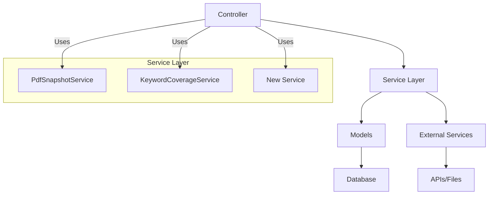
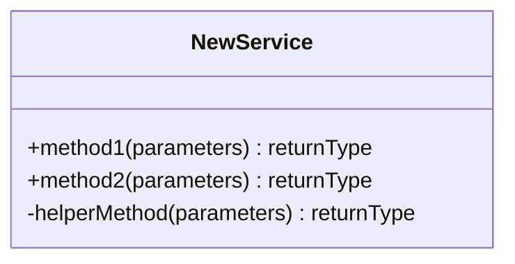
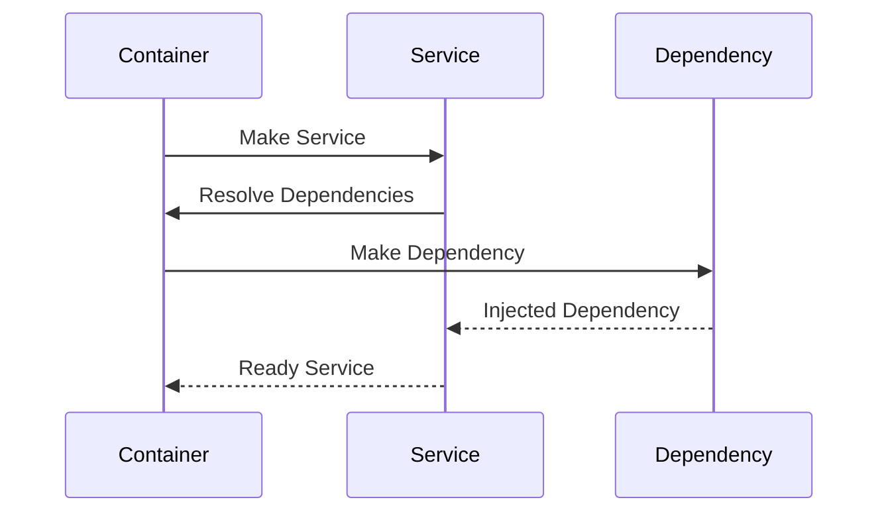
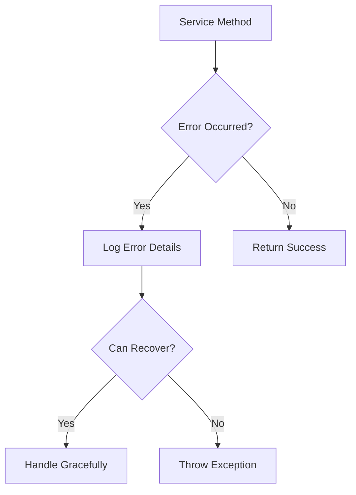
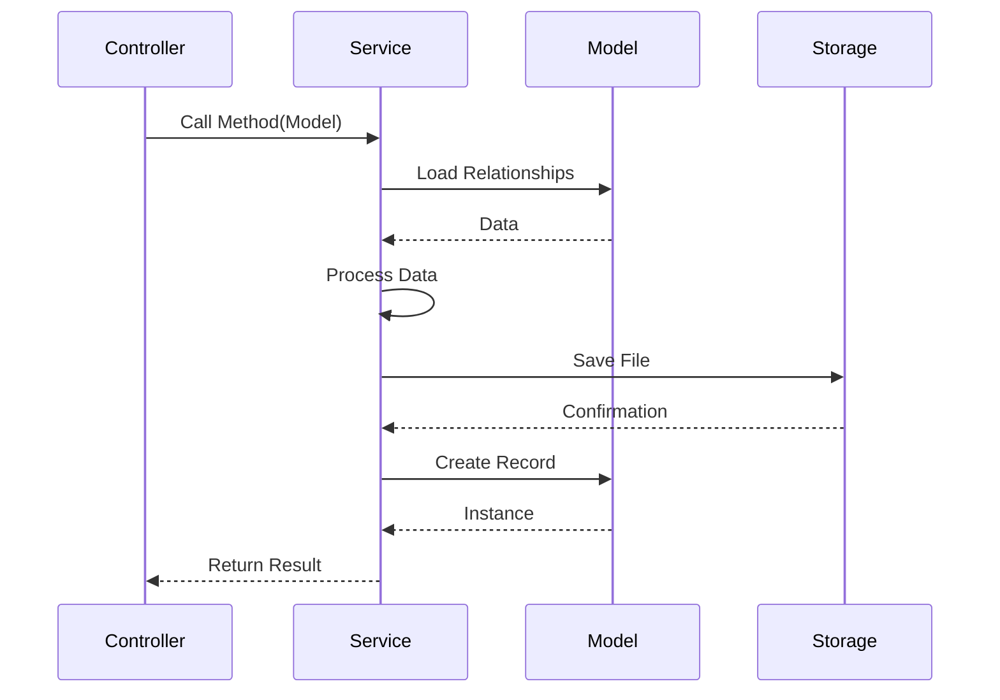
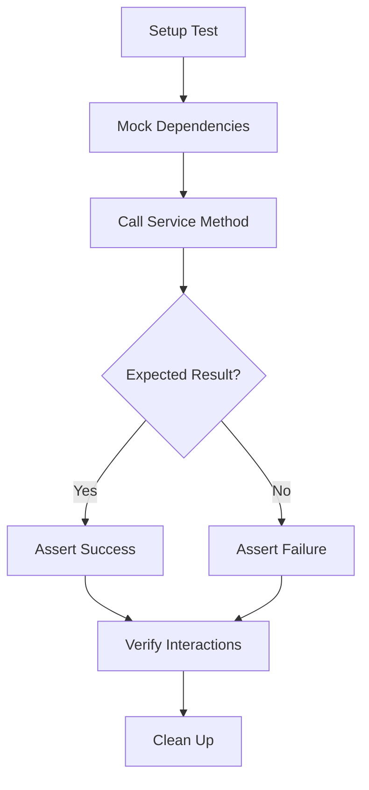
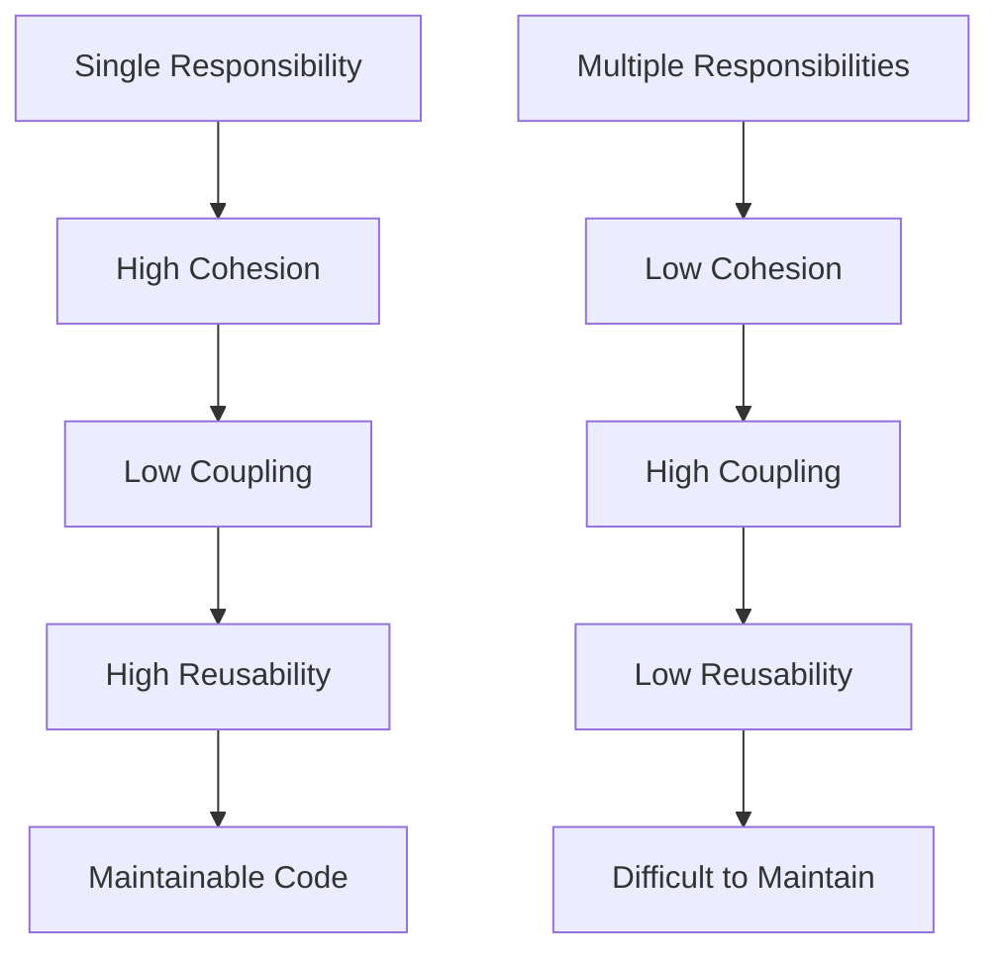
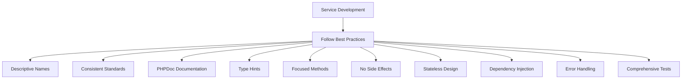
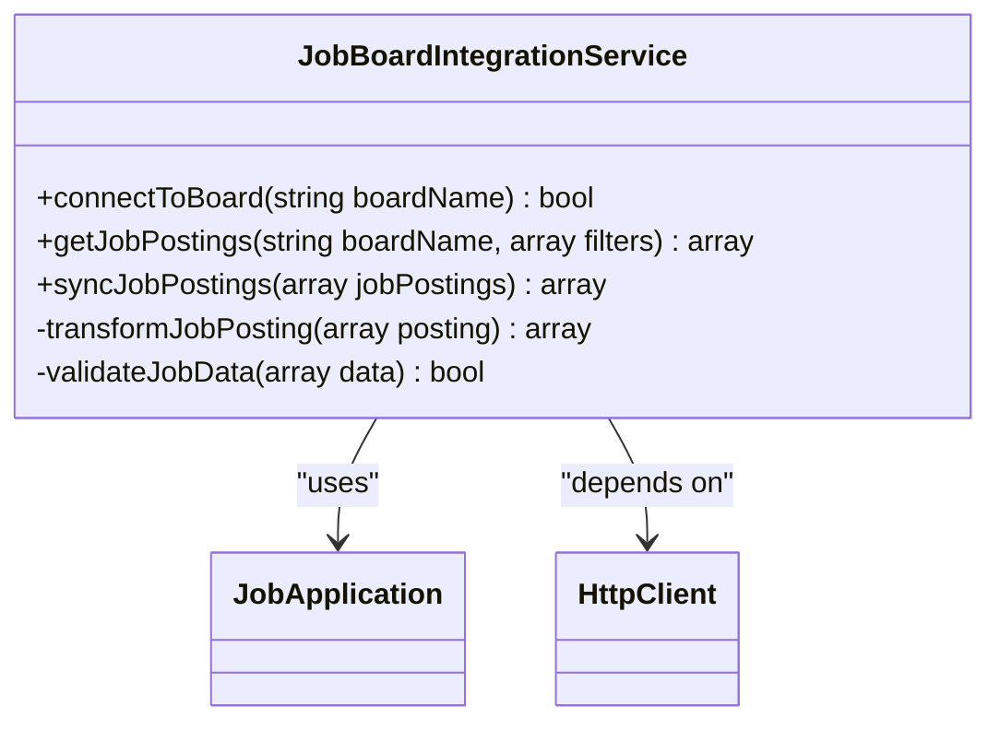
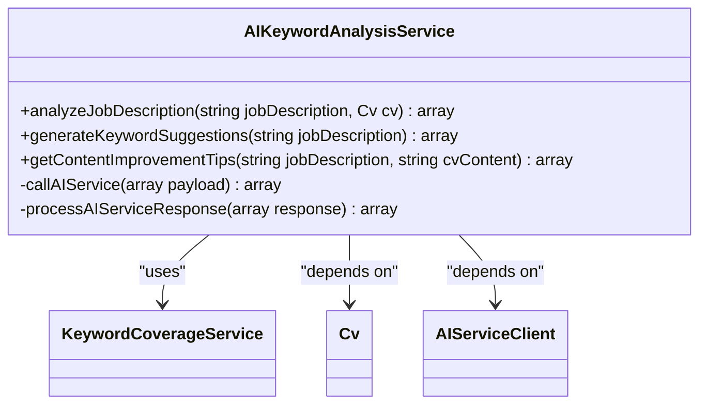

# Extending the Service Layer

<cite>
**Referenced Files in This Document**   
- [PdfSnapshotService.php](file://app/Services/PdfSnapshotService.php)
- [KeywordCoverageService.php](file://app/Services/KeywordCoverageService.php)
- [JobApplicationObserver.php](file://app/Observers/JobApplicationObserver.php)
- [JobApplication.php](file://app/Models/JobApplication.php)
- [PDFSnapshot.php](file://app/Models/PDFSnapshot.php)
- [Cv.php](file://app/Models/Cv.php)
- [KeywordCoverageServiceTest.php](file://tests/Unit/KeywordCoverageServiceTest.php)
- [PdfSnapshotServiceTest.php](file://tests/Unit/PdfSnapshotServiceTest.php)
</cite>

## Table of Contents
1. [Introduction](#introduction)
2. [Service Layer Architecture](#service-layer-architecture)
3. [Creating New Service Classes](#creating-new-service-classes)
4. [Dependency Injection and Service Container](#dependency-injection-and-service-container)
5. [Error Handling and Logging](#error-handling-and-logging)
6. [Service Integration with Controllers](#service-integration-with-controllers)
7. [Testing Service Methods](#testing-service-methods)
8. [Service Reusability and Separation of Concerns](#service-reusability-and-separation-of-concerns)
9. [Best Practices for Service Development](#best-practices-for-service-development)
10. [Example: External Job Board Integration Service](#example-external-job-board-integration-service)
11. [Example: AI-Powered Keyword Analysis Service](#example-ai-powered-keyword-analysis-service)

## Introduction

The service layer in the CV Builder application provides a crucial abstraction between the application's business logic and its presentation layer. This document outlines the patterns and best practices for extending this layer by creating new service classes that encapsulate complex business operations. The existing services, PdfSnapshotService and KeywordCoverageService, serve as excellent examples of how to structure service classes to maintain clean, testable, and reusable code. This guide will explain how to create new services following these established patterns, with particular attention to dependency injection, error handling, logging, testing, and integration with the rest of the application.

**Section sources**
- [PdfSnapshotService.php](file://app/Services/PdfSnapshotService.php#L9-L64)
- [KeywordCoverageService.php](file://app/Services/KeywordCoverageService.php#L4-L56)

## Service Layer Architecture

The service layer in the CV Builder application follows the service pattern commonly used in Laravel applications, where business logic is extracted from controllers and models into dedicated service classes. This separation of concerns allows for better code organization, improved testability, and enhanced reusability across different parts of the application.

The existing services demonstrate key architectural principles. PdfSnapshotService handles the complex process of generating PDF snapshots of CVs for job applications, while KeywordCoverageService performs text analysis to calculate keyword coverage between job descriptions and CV content. Both services encapsulate specific business domains and provide clean, focused APIs for their functionality.

The service layer interacts with the rest of the application through well-defined interfaces. Services typically receive domain models as parameters and return either model instances or structured data arrays. They leverage Laravel's service container for dependency injection, allowing for easy testing and dependency management.

**Diagram sources**
- [PdfSnapshotService.php](file://app/Services/PdfSnapshotService.php#L9-L64)
- [KeywordCoverageService.php](file://app/Services/KeywordCoverageService.php#L4-L56)

**Section sources**
- [PdfSnapshotService.php](file://app/Services/PdfSnapshotService.php#L9-L64)
- [KeywordCoverageService.php](file://app/Services/KeywordCoverageService.php#L4-L56)

## Creating New Service Classes

To create a new service class in the CV Builder application, follow the established pattern demonstrated by the existing services. Service classes should be placed in the `app/Services` directory and should have descriptive names that clearly indicate their purpose.

A new service class should be defined as a regular PHP class with methods that encapsulate specific business operations. The class should not extend any base class but may implement interfaces if appropriate. Each method should have a single responsibility and should be designed to be stateless, accepting all necessary data as parameters and returning results without modifying the service instance.

When creating a new service, consider the following structure:

The service should focus on business logic rather than data access, which should be handled by models or repositories. Input validation should be performed at the controller or form request level, allowing the service to assume valid input.

**Section sources**
- [PdfSnapshotService.php](file://app/Services/PdfSnapshotService.php#L9-L64)
- [KeywordCoverageService.php](file://app/Services/KeywordCoverageService.php#L4-L56)

## Dependency Injection and Service Container

The CV Builder application leverages Laravel's powerful service container for dependency injection, which is essential for creating testable and maintainable service classes. Dependencies should be injected through the constructor rather than being instantiated within the service methods.

The existing services demonstrate proper dependency injection. PdfSnapshotService relies on Laravel's Storage facade and the Spatie PDF facade, which are resolved by the service container when the service is instantiated. This approach allows for easy mocking during testing and promotes loose coupling between components.

When creating a new service, identify its dependencies and inject them through the constructor. For example, if a service needs to interact with the database, it should receive the relevant models as dependencies rather than using the models statically. This makes the service more flexible and easier to test.

**Diagram sources**
- [PdfSnapshotService.php](file://app/Services/PdfSnapshotService.php#L9-L64)
- [JobApplicationObserver.php](file://app/Observers/JobApplicationObserver.php#L7-L41)

**Section sources**
- [PdfSnapshotService.php](file://app/Services/PdfSnapshotService.php#L9-L64)
- [JobApplicationObserver.php](file://app/Observers/JobApplicationObserver.php#L7-L41)

## Error Handling and Logging

Proper error handling and logging are critical aspects of service design in the CV Builder application. Services should handle expected errors gracefully and provide meaningful feedback to the calling code, while unexpected errors should be allowed to propagate up the call stack.

The PdfSnapshotService demonstrates appropriate error handling by throwing an exception when a job application does not have an associated CV. This is a validation error that prevents the service from continuing with invalid data. The service does not attempt to catch this exception, as it represents a fundamental precondition failure that should be handled by the calling code.

For operational errors, such as file storage failures, the service should catch the exception, log the error, and either retry the operation or fail gracefully depending on the context. The JobApplicationObserver shows this pattern by catching exceptions that occur during PDF snapshot creation and logging them without failing the entire update operation.

**Diagram sources**
- [PdfSnapshotService.php](file://app/Services/PdfSnapshotService.php#L9-L64)
- [JobApplicationObserver.php](file://app/Observers/JobApplicationObserver.php#L7-L41)

**Section sources**
- [PdfSnapshotService.php](file://app/Services/PdfSnapshotService.php#L9-L64)
- [JobApplicationObserver.php](file://app/Observers/JobApplicationObserver.php#L7-L41)

## Service Integration with Controllers

Services in the CV Builder application are typically invoked from controllers or observers, which act as the bridge between the HTTP layer and the business logic. The integration pattern follows Laravel's standard approach, where services are resolved from the service container and their methods are called with appropriate parameters.

The JobApplicationObserver demonstrates this integration pattern by resolving the PdfSnapshotService from the container when a job application's send status changes to 'sent'. This observer pattern allows the service to be triggered automatically by model events without requiring explicit calls from controllers.

When integrating services with controllers, type hint the service in the controller method parameters to leverage Laravel's automatic dependency injection. This ensures that the service is properly instantiated with all its dependencies and makes the controller code more readable and testable.

**Diagram sources**
- [JobApplicationObserver.php](file://app/Observers/JobApplicationObserver.php#L7-L41)
- [PdfSnapshotService.php](file://app/Services/PdfSnapshotService.php#L9-L64)

**Section sources**
- [JobApplicationObserver.php](file://app/Observers/JobApplicationObserver.php#L7-L41)
- [PdfSnapshotService.php](file://app/Services/PdfSnapshotService.php#L9-L64)

## Testing Service Methods

Testing service methods is essential for ensuring the reliability and correctness of business logic in the CV Builder application. The existing test suite includes unit tests for both PdfSnapshotService and KeywordCoverageService, demonstrating the recommended approach for service testing.

Service tests should focus on the business logic encapsulated by the service, mocking any external dependencies such as databases, file systems, or external APIs. This allows for fast, isolated tests that can verify the service's behavior without relying on external systems.

The tests should cover both success and failure scenarios, including edge cases and error conditions. For example, the PdfSnapshotServiceTest should verify that a PDF is correctly generated and stored, that the hash is properly calculated, and that appropriate exceptions are thrown when preconditions are not met.

**Diagram sources**
- [KeywordCoverageServiceTest.php](file://tests/Unit/KeywordCoverageServiceTest.php)
- [PdfSnapshotServiceTest.php](file://tests/Unit/PdfSnapshotServiceTest.php)

**Section sources**
- [KeywordCoverageServiceTest.php](file://tests/Unit/KeywordCoverageServiceTest.php)
- [PdfSnapshotServiceTest.php](file://tests/Unit/PdfSnapshotServiceTest.php)

## Service Reusability and Separation of Concerns

One of the primary benefits of the service layer is improved code reusability and separation of concerns. Services in the CV Builder application should be designed to be reusable across different parts of the application, reducing code duplication and improving maintainability.

The existing services demonstrate good separation of concerns. PdfSnapshotService focuses exclusively on PDF generation and storage, while KeywordCoverageService handles text analysis and keyword matching. Neither service attempts to handle responsibilities outside its domain, making them focused and easier to understand.

When creating new services, ensure that each service has a single, well-defined responsibility. If a service begins to grow too large or complex, consider breaking it down into smaller, more focused services. This aligns with the Single Responsibility Principle and makes the codebase more maintainable.

**Diagram sources**
- [PdfSnapshotService.php](file://app/Services/PdfSnapshotService.php#L9-L64)
- [KeywordCoverageService.php](file://app/Services/KeywordCoverageService.php#L4-L56)

**Section sources**
- [PdfSnapshotService.php](file://app/Services/PdfSnapshotService.php#L9-L64)
- [KeywordCoverageService.php](file://app/Services/KeywordCoverageService.php#L4-L56)

## Best Practices for Service Development

When extending the service layer in the CV Builder application, follow these best practices to ensure high-quality, maintainable code:

1. **Use descriptive class and method names**: Names should clearly indicate the purpose and behavior of the service and its methods.

2. **Follow consistent coding standards**: Adhere to the existing code style and conventions used in the application.

3. **Document methods with PHPDoc**: Provide clear documentation for all public methods, including parameters, return types, and any exceptions thrown.

4. **Use type hints**: Leverage PHP's type system to provide better code completion and catch errors early.

5. **Keep methods focused**: Each method should have a single responsibility and should not be too long.

6. **Avoid side effects**: Services should not modify global state or have unexpected side effects.

7. **Make services stateless**: Services should not maintain state between method calls.

8. **Use dependency injection**: Inject dependencies through the constructor rather than creating them within the service.

9. **Handle errors appropriately**: Throw exceptions for exceptional conditions and handle expected errors gracefully.

10. **Write comprehensive tests**: Ensure all service methods are thoroughly tested with both success and failure cases.

**Section sources**
- [PdfSnapshotService.php](file://app/Services/PdfSnapshotService.php#L9-L64)
- [KeywordCoverageService.php](file://app/Services/KeywordCoverageService.php#L4-L56)

## Example: External Job Board Integration Service

To illustrate how to create a new service following the established patterns, consider an example service for integrating with external job boards. This service would handle the retrieval of job postings from external APIs and their synchronization with the application's job application records.

The service would be named `JobBoardIntegrationService` and would include methods for connecting to different job boards, retrieving job postings, and creating or updating job application records in the database. It would follow the same patterns as the existing services, with proper dependency injection, error handling, and logging.

The service would depend on HTTP clients for API communication, the JobApplication model for data persistence, and configuration settings for API credentials. These dependencies would be injected through the constructor, allowing for easy testing and configuration.

**Diagram sources**
- [JobApplication.php](file://app/Models/JobApplication.php)
- [PdfSnapshotService.php](file://app/Services/PdfSnapshotService.php#L9-L64)

**Section sources**
- [JobApplication.php](file://app/Models/JobApplication.php)
- [PdfSnapshotService.php](file://app/Services/PdfSnapshotService.php#L9-L64)

## Example: AI-Powered Keyword Analysis Service

Another example of a new service that could be added to the CV Builder application is an AI-powered keyword analysis service. This service would extend the functionality of the existing KeywordCoverageService by providing AI-generated suggestions for improving CV content based on job descriptions.

The service would be named `AIKeywordAnalysisService` and would include methods for analyzing job descriptions, generating keyword suggestions, and providing content improvement recommendations. It would build upon the tokenization and coverage calculation logic from the existing KeywordCoverageService while adding AI-powered insights.

The service would depend on an AI service provider API, the KeywordCoverageService for basic analysis, and the CV model for content access. These dependencies would be injected through the constructor, maintaining the established pattern of dependency injection.

**Diagram sources**
- [KeywordCoverageService.php](file://app/Services/KeywordCoverageService.php#L4-L56)
- [Cv.php](file://app/Models/Cv.php)
- [PdfSnapshotService.php](file://app/Services/PdfSnapshotService.php#L9-L64)

**Section sources**
- [KeywordCoverageService.php](file://app/Services/KeywordCoverageService.php#L4-L56)
- [Cv.php](file://app/Models/Cv.php)
- [PdfSnapshotService.php](file://app/Services/PdfSnapshotService.php#L9-L64)