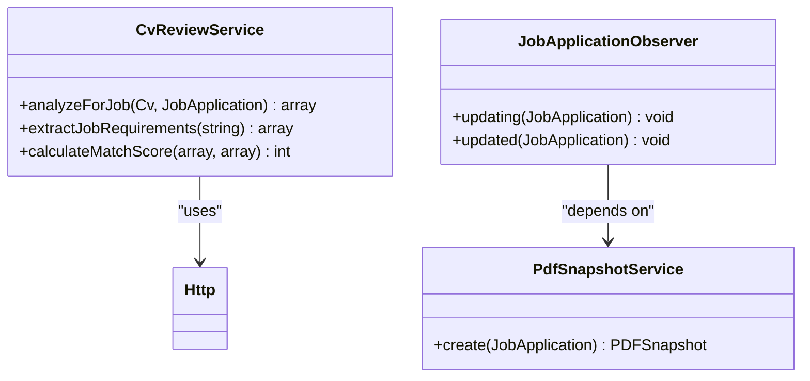
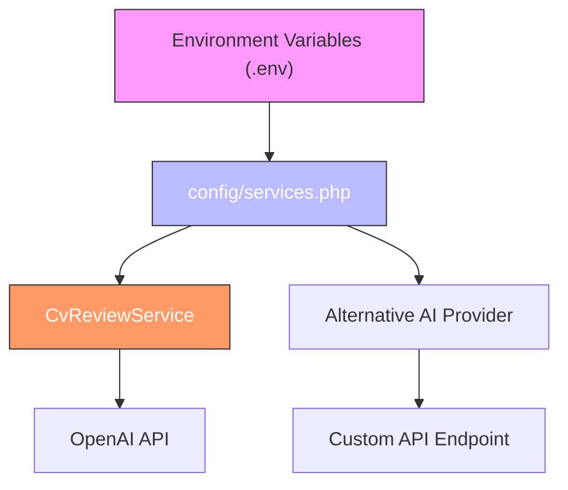
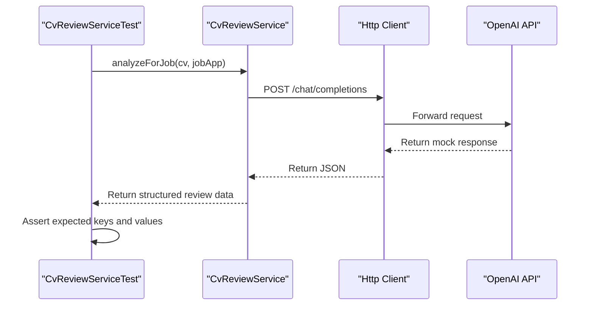
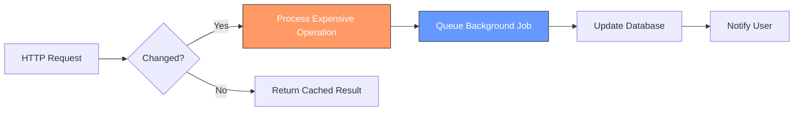

# Extension Best Practices

<cite>
**Referenced Files in This Document**   
- [CvReviewService.php](file://app/Services/CvReviewService.php)
- [ValidCvReviewSchema.php](file://app/Rules/ValidCvReviewSchema.php)
- [JobApplicationObserver.php](file://app/Observers/JobApplicationObserver.php)
- [AppServiceProvider.php](file://app/Providers/AppServiceProvider.php)
- [services.php](file://config/services.php)
- [CvReviewServiceTest.php](file://tests/Feature/CvReviewServiceTest.php)
- [ValidCvReviewSchemaTest.php](file://tests/Unit/ValidCvReviewSchemaTest.php)
- [ROADMAP.md](file://specs/ROADMAP.md)
</cite>

## Table of Contents
1. [Code Organization](#code-organization)
2. [Dependency Injection and Service Container](#dependency-injection-and-service-container)
3. [Configuration Management](#configuration-management)
4. [Backward Compatibility and Deprecation](#backward-compatibility-and-deprecation)
5. [Testing Extensions](#testing-extensions)
6. [Documentation and Roadmap Contribution](#documentation-and-roadmap-contribution)
7. [Security Considerations](#security-considerations)
8. [Performance Optimization](#performance-optimization)

## Code Organization

When extending the cv-builder application, maintain consistency with the existing codebase structure by placing new components in their designated directories. Services that encapsulate business logic should be placed in `app/Services/`, ensuring they follow the single responsibility principle and are easily testable. Custom validation rules must be created in `app/Rules/` to ensure they are discoverable and reusable across the application. Model observers, which respond to Eloquent model lifecycle events, should be stored in `app/Observers/` and registered in the `AppServiceProvider`.

This organization supports separation of concerns and makes the codebase more maintainable. For example, the `CvReviewService` class in `app/Services/` handles AI-powered CV analysis, while the `ValidCvReviewSchema` rule in `app/Rules/` ensures response integrity from external services.

**Section sources**
- [CvReviewService.php](file://app/Services/CvReviewService.php)
- [ValidCvReviewSchema.php](file://app/Rules/ValidCvReviewSchema.php)
- [JobApplicationObserver.php](file://app/Observers/JobApplicationObserver.php)

## Dependency Injection and Service Container

The cv-builder application leverages Laravel's service container for dependency injection, promoting loose coupling and testability. When creating new services or replacing core functionality, bind interfaces to implementations in the service container. This allows for easy swapping of implementations without modifying consumer code.

For example, the `CvReviewService` is resolved through the container and injected where needed, enabling mock substitution during testing. To extend or replace a service, create a new implementation and bind it in a service provider such as `AppServiceProvider`. This approach supports polymorphism and makes the system more flexible to change.

**Diagram sources**
- [CvReviewService.php](file://app/Services/CvReviewService.php)
- [JobApplicationObserver.php](file://app/Observers/JobApplicationObserver.php)

**Section sources**
- [AppServiceProvider.php](file://app/Providers/AppServiceProvider.php)
- [CvReviewService.php](file://app/Services/CvReviewService.php)

## Configuration Management

Third-party integrations such as OpenAI are configured through Laravel's configuration system, primarily using the `config/services.php` file. This file centralizes API keys, model specifications, and budget constraints, making them easily manageable across environments via environment variables.

To extend support for alternative AI providers, add a new configuration block in `services.php` with the necessary credentials and default settings. This allows the application to dynamically switch between providers based on configuration, supporting flexibility and vendor neutrality. Always reference configuration values using Laravel's `config()` helper to ensure consistency and testability.

**Diagram sources**
- [services.php](file://config/services.php)
- [CvReviewService.php](file://app/Services/CvReviewService.php)

**Section sources**
- [services.php](file://config/services.php)

## Backward Compatibility and Deprecation

When introducing breaking changes, maintain backward compatibility by implementing deprecation notices and providing clear migration paths. For example, if modifying the AI review response schema, increment the `schema_version` field and support both old and new formats during a transition period.

Use logging and user-facing notifications to inform developers and users of upcoming changes. The `ValidCvReviewSchema` rule enforces schema integrity, ensuring that any deviation from the expected structure is caught early. When deprecating functionality, mark methods with PHPDoc `@deprecated` tags and specify the version in which removal will occur.

**Section sources**
- [ValidCvReviewSchema.php](file://app/Rules/ValidCvReviewSchema.php)

## Testing Extensions

All extensions should be thoroughly tested using both feature and unit tests, following the existing structure in the `tests/` directory. Feature tests, located in `tests/Feature/`, verify high-level behavior and integration between components. Unit tests in `tests/Unit/` validate individual classes in isolation.

For example, `CvReviewServiceTest.php` uses Laravel's HTTP client mocking to simulate OpenAI API responses, ensuring the service handles various scenarios correctly. Similarly, `ValidCvReviewSchemaTest.php` validates that the AI response structure meets contractual expectations. When adding new features, create corresponding tests to ensure reliability and prevent regressions.

**Diagram sources**
- [CvReviewServiceTest.php](file://tests/Feature/CvReviewServiceTest.php)
- [CvReviewService.php](file://app/Services/CvReviewService.php)

**Section sources**
- [CvReviewServiceTest.php](file://tests/Feature/CvReviewServiceTest.php)
- [ValidCvReviewSchemaTest.php](file://tests/Unit/ValidCvReviewSchemaTest.php)

## Documentation and Roadmap Contribution

Document all custom features in a clear and consistent manner, preferably using PHPDoc comments and inline documentation where necessary. For significant extensions, contribute to the project roadmap by updating the `specs/ROADMAP.md` file with proposed features, timelines, and technical considerations.

This practice ensures alignment with the project's long-term vision and facilitates collaboration among contributors. The `specs/` directory already contains design documents such as `ai-cv-review-features.md` and `cv_builder_spec.md`, which serve as templates for new proposals.

**Section sources**
- [ROADMAP.md](file://specs/ROADMAP.md)

## Security Considerations

When exposing new endpoints or extending existing ones, prioritize security by implementing input validation, output escaping, and rate limiting. Use Laravel's built-in validation rules and the `ValidCvReviewSchema` custom rule to ensure data integrity. Never trust external API responses - always validate and sanitize before use.

For user-facing endpoints, apply rate limiting to prevent abuse. When handling sensitive data such as API keys, ensure they are stored in environment variables and never exposed in logs or client responses. The `CvReviewService` demonstrates secure practices by using configuration-based API keys and structured error handling.

**Section sources**
- [CvReviewService.php](file://app/Services/CvReviewService.php)
- [ValidCvReviewSchema.php](file://app/Rules/ValidCvReviewSchema.php)

## Performance Optimization

Optimize performance by caching expensive operations and deferring non-critical processing to queued jobs. For example, AI-powered CV reviews are resource-intensive; consider caching results when the CV and job description haven't changed.

Use Laravel's queue system to offload tasks like PDF snapshot generation, as seen in the `JobApplicationObserver`, which triggers `PdfSnapshotService` asynchronously. This prevents blocking the main request cycle and improves responsiveness. Additionally, monitor token usage and cost estimation via methods like `estimateTokenCount()` and `estimateCostCents()` to manage API budget constraints effectively.

**Diagram sources**
- [CvReviewService.php](file://app/Services/CvReviewService.php)
- [JobApplicationObserver.php](file://app/Observers/JobApplicationObserver.php)

**Section sources**
- [CvReviewService.php](file://app/Services/CvReviewService.php)
- [JobApplicationObserver.php](file://app/Observers/JobApplicationObserver.php)
