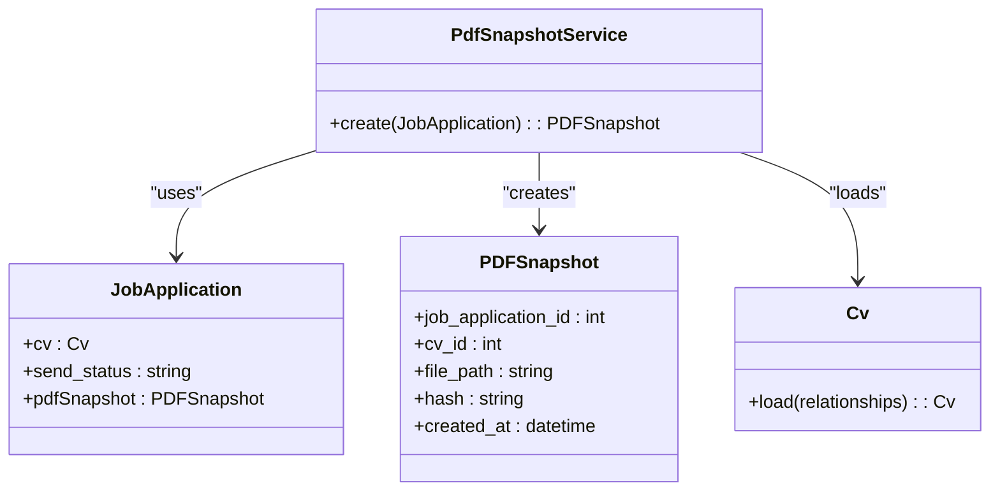
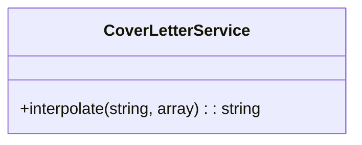
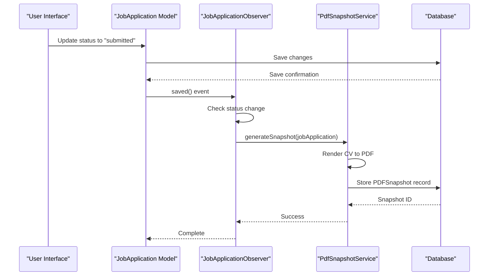

# Modifying Existing Functionality

<cite>
**Referenced Files in This Document**   
- [CvReviewService.php](file://app/Services/CvReviewService.php)
- [ValidCvReviewSchema.php](file://app/Rules/ValidCvReviewSchema.php)
- [PdfSnapshotService.php](file://app/Services/PdfSnapshotService.php)
- [CoverLetterService.php](file://app/Services/CoverLetterService.php)
- [JobApplicationObserver.php](file://app/Observers/JobApplicationObserver.php)
</cite>

## Table of Contents
1. [Introduction](#introduction)
2. [Customizing the AI-Powered CV Review Process](#customizing-the-ai-powered-cv-review-process)
3. [Extending the PDF Generation Workflow](#extending-the-pdf-generation-workflow)
4. [Enhancing Cover Letter Generation Logic](#enhancing-cover-letter-generation-logic)
5. [Modifying Application Behavior with Laravel Observers](#modifying-application-behavior-with-laravel-observers)
6. [Backward Compatibility and Testing Implications](#backward-compatibility-and-testing-implications)
7. [Performance Considerations](#performance-considerations)
8. [Conclusion](#conclusion)

## Introduction
This document provides a comprehensive guide to modifying core functionality in the cv-builder application. It details how to extend or customize key services such as `CvReviewService`, `PdfSnapshotService`, and `CoverLetterService`, and explains how to leverage Laravel observers like `JobApplicationObserver` to introduce custom side effects. The guide also addresses backward compatibility, testing, and performance implications when altering existing components.

## Customizing the AI-Powered CV Review Process

The `CvReviewService` is responsible for analyzing CVs against job descriptions using OpenAI's API. It generates structured feedback including match scores, skill gaps, section recommendations, and language suggestions. To extend this service, developers can override methods such as `analyzeForJob()`, `extractJobRequirements()`, or `calculateMatchScore()` to implement custom logic.

For example, to modify the weight distribution in the match score calculation, one could override the `calculateMatchScore()` method to adjust the contribution of skills, experience, keywords, and evidence quality. Additionally, the `buildAnalysisPrompt()` method can be customized to include new types of recommendations or change the format of the AI response.

Validation of the AI-generated review output is enforced by the `ValidCvReviewSchema` rule, which ensures that the returned data conforms to a predefined structure. This includes validating required fields like `schema_version`, `match_score`, and `analysis_metadata`, as well as enforcing constraints on array contents and enum values.

```mermaid
classDiagram
class CvReviewService {
+analyzeForJob(Cv, JobApplication) : array
+extractJobRequirements(string) : array
+calculateMatchScore(array, array) : int
+estimateTokenCount(Cv, JobApplication) : int
+estimateCostCents(int) : int
}
class CvReviewService : Uses OpenAI API
class CvReviewService : Throws MissingJobDescriptionException
class CvReviewService : Throws IncompleteCvException
```

**Diagram sources**
- [CvReviewService.php](file://app/Services/CvReviewService.php#L27-L225)

**Section sources**
- [CvReviewService.php](file://app/Services/CvReviewService.php#L27-L225)
- [ValidCvReviewSchema.php](file://app/Rules/ValidCvReviewSchema.php#L15-L122)

## Extending the PDF Generation Workflow

The `PdfSnapshotService` handles the creation of PDF snapshots for job applications. It renders the CV using a Blade template (`cv.pdf`), generates a SHA-256 hash, stores the file on disk, and records metadata in the `PDFSnapshot` model. This service can be extended to support alternative rendering engines or storage drivers.

To integrate a different PDF rendering engine, developers can replace the use of `Spatie\LaravelPdf\Facades\Pdf` with another library by modifying the `create()` method. Similarly, to support cloud storage, the `Storage::disk('local')` call can be updated to use a different disk configuration (e.g., S3) defined in `filesystems.php`.

The service also enforces a maximum file size of 10MB to prevent storage exhaustion, which can be adjusted based on application requirements.



**Diagram sources**
- [PdfSnapshotService.php](file://app/Services/PdfSnapshotService.php)
- [JobApplication.php](file://app/Models/JobApplication.php)
- [PDFSnapshot.php](file://app/Models/PDFSnapshot.php)
- [Cv.php](file://app/Models/Cv.php)

**Section sources**
- [PdfSnapshotService.php](file://app/Services/PdfSnapshotService.php#L9-L71)
- [JobApplicationObserver.php](file://app/Observers/JobApplicationObserver.php#L7-L43)

## Enhancing Cover Letter Generation Logic

The `CoverLetterService` performs template interpolation by replacing `{{variable}}` placeholders with actual values from job applications and user profiles. The `interpolate()` method uses simple string replacement to substitute variables, preserving undefined placeholders for debugging purposes.

To enhance this logic, developers can extend the service to support custom template variables, conditional blocks, or formatting rules. For example, adding support for date formatting, uppercase transformations, or conditional content inclusion based on application data.

Additionally, the interpolation logic could be upgraded to use a more robust templating engine like Twig or Blade, allowing for complex expressions and filters.



**Diagram sources**
- [CoverLetterService.php](file://app/Services/CoverLetterService.php#L15-L25)

**Section sources**
- [CoverLetterService.php](file://app/Services/CoverLetterService.php#L9-L25)

## Modifying Application Behavior with Laravel Observers

Laravel observers such as `JobApplicationObserver` allow developers to trigger custom side effects when model events occur. In this application, the observer listens for the `updated` event on `JobApplication` and automatically creates a PDF snapshot when the `send_status` changes to `sent`.

This pattern enables decoupling of core business logic from secondary actions. Developers can extend the observer to trigger additional behaviors, such as sending notifications, updating user metrics, or initiating AI reviews.

Observers are registered in the service container, typically within a service provider, ensuring they are automatically instantiated and attached to the relevant models.



**Diagram sources**
- [JobApplicationObserver.php](file://app/Observers/JobApplicationObserver.php)
- [PdfSnapshotService.php](file://app/Services/PdfSnapshotService.php)

**Section sources**
- [JobApplicationObserver.php](file://app/Observers/JobApplicationObserver.php)
- [PdfSnapshotService.php](file://app/Services/PdfSnapshotService.php)

## Backward Compatibility and Testing Implications

When modifying core services, backward compatibility must be carefully considered. Changes to method signatures or return types in `CvReviewService` or `CoverLetterService` may break existing consumers. To maintain compatibility, prefer adding optional parameters or new methods rather than altering existing ones.

Testing is critical when extending functionality. Unit tests such as `CvReviewServiceTest` and `PdfSnapshotServiceTest` validate contract compliance and edge cases. Any modifications should be accompanied by updated tests to ensure correctness and prevent regressions.

Versioning strategies should be applied to AI-generated outputs, particularly in `ValidCvReviewSchema`, where the `schema_version` field helps track changes in the response structure over time.

**Section sources**
- [CvReviewServiceTest.php](file://tests/Feature/CvReviewServiceTest.php)
- [PdfSnapshotServiceTest.php](file://tests/Unit/PdfSnapshotServiceTest.php)
- [ValidCvReviewSchemaTest.php](file://tests/Unit/ValidCvReviewSchemaTest.php)

## Performance Considerations

Introducing synchronous operations in observer methods or heavy processing in service classes can impact application performance. For example, generating a PDF snapshot during a model update may increase response time. To mitigate this, long-running tasks should be dispatched to queues using Laravel's job system.

Similarly, AI-powered CV reviews involve external API calls and can be time-consuming. These operations should be processed asynchronously via jobs like `ProcessCvReview` to avoid blocking the main request lifecycle.

Caching strategies can also be employed to reduce redundant computations, such as caching job requirement extractions or PDF generation results when content hasn't changed.

**Section sources**
- [ProcessCvReview.php](file://app/Jobs/ProcessCvReview.php)
- [PdfSnapshotService.php](file://app/Services/PdfSnapshotService.php#L45-L50)
- [CvReviewService.php](file://app/Services/CvReviewService.php#L60-L65)

## Conclusion
Modifying existing functionality in the cv-builder application requires careful consideration of service design, validation rules, observer patterns, and performance implications. By leveraging dependency injection, event-driven architecture, and asynchronous processing, developers can extend core features while maintaining system stability and scalability. Always ensure backward compatibility and comprehensive test coverage when introducing changes to critical services.