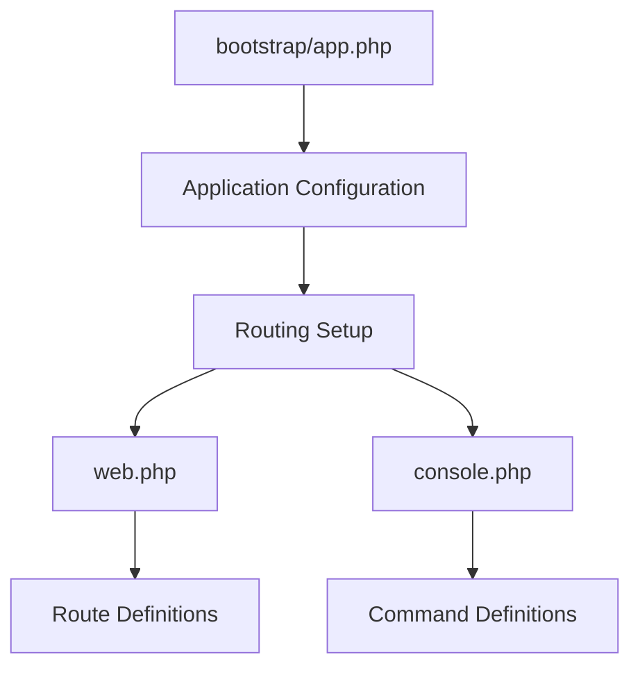
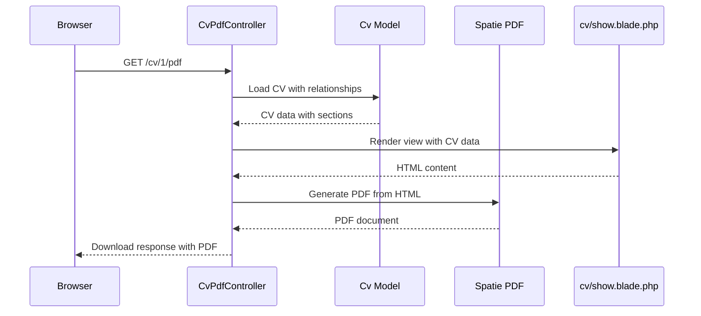

# Getting Started

<cite>
**Referenced Files in This Document**   
- [composer.json](file://composer.json)
- [package.json](file://package.json)
- [bootstrap/app.php](file://bootstrap/app.php)
- [routes/web.php](file://routes/web.php)
- [database/migrations/2025_10_03_201646_create_cvs_table.php](file://database/migrations/2025_10_03_201646_create_cvs_table.php)
- [database/seeders/BaseCVSeeder.php](file://database/seeders/BaseCVSeeder.php)
- [database/seeders/DatabaseSeeder.php](file://database/seeders/DatabaseSeeder.php)
- [app/Http/Controllers/CvPdfController.php](file://app/Http/Controllers/CvPdfController.php)
- [resources/views/cv/show.blade.php](file://resources/views/cv/show.blade.php)
- [resources/views/welcome.blade.php](file://resources/views/welcome.blade.php)
</cite>

## Table of Contents
1. [Prerequisites](#prerequisites)
2. [Installation Steps](#installation-steps)
3. [Environment Configuration](#environment-configuration)
4. [Database Setup](#database-setup)
5. [Asset Compilation](#asset-compilation)
6. [Running the Application](#running-the-application)
7. [Key Files and Entry Points](#key-files-and-entry-points)
8. [Troubleshooting Common Issues](#troubleshooting-common-issues)

## Prerequisites
Before setting up the CV Builder application, ensure your development environment meets the following requirements:
- **PHP 8.2 or higher**: Required for Laravel 12 framework compatibility
- **Node.js 18 or higher**: Required for Vite and frontend asset compilation
- **SQLite or MySQL**: Supported database systems for data persistence
- **Composer**: PHP dependency manager
- **npm or yarn**: Node.js package manager

The application uses Laravel 12 with Filament admin panel and Vite for asset bundling, as specified in the `composer.json` and `package.json` files.

**Section sources**
- [composer.json](file://composer.json#L10-L14)
- [package.json](file://package.json#L1-L5)

## Installation Steps
Follow these steps to install and set up the CV Builder application locally:

1. **Clone the repository** from your source control system to your local machine
2. **Navigate to the project directory** using your terminal
3. **Install PHP dependencies** by running:
   ```bash
   composer install
   ```
   This installs Laravel framework, Filament admin panel, and spatie/laravel-pdf package as defined in `composer.json`.

4. **Install Node.js dependencies** by running:
   ```bash
   npm install
   ```
   This installs Vite, Tailwind CSS, and other frontend dependencies required for asset compilation.

**Section sources**
- [composer.json](file://composer.json#L10-L14)
- [package.json](file://package.json#L1-L5)

## Environment Configuration
After installing dependencies, configure the application environment:

1. **Create the .env file** by copying the example:
   ```bash
   cp .env.example .env
   ```

2. **Configure database settings** in the `.env` file:
   - For **SQLite**: Set `DB_CONNECTION=sqlite` and ensure the `database/database.sqlite` file exists
   - For **MySQL**: Set `DB_CONNECTION=mysql` and update `DB_HOST`, `DB_PORT`, `DB_DATABASE`, `DB_USERNAME`, and `DB_PASSWORD`

3. **Configure mail settings** if email functionality is needed:
   - Set `MAIL_MAILER` to your preferred mail driver (smtp, mailgun, etc.)
   - Update corresponding mail credentials

The application will automatically create the SQLite database file during setup as shown in the `post-create-project-cmd` script in `composer.json`.

**Section sources**
- [composer.json](file://composer.json#L70-L73)

## Database Setup
Set up the application database by running the following Artisan commands:

1. **Generate application key**:
   ```bash
   php artisan key:generate
   ```

2. **Run database migrations** to create all required tables:
   ```bash
   php artisan migrate
   ```
   This creates tables for CVs, job applications, PDF snapshots, and related entities as defined in the migration files under `database/migrations/`.

3. **Seed the database** with sample data:
   ```bash
   php artisan db:seed
   ```
   This runs the `DatabaseSeeder` which calls `BaseCVSeeder` to populate the database with a complete CV, job applications, and related data for demonstration purposes.

The migration `2025_10_03_201646_create_cvs_table.php` creates the base CVs table with title and timestamps, while subsequent migrations add related tables for sections, experiences, education, and other CV components.

**Section sources**
- [database/migrations/2025_10_03_201646_create_cvs_table.php](file://database/migrations/2025_10_03_201646_create_cvs_table.php#L1-L30)
- [database/seeders/BaseCVSeeder.php](file://database/seeders/BaseCVSeeder.php#L1-L353)
- [database/seeders/DatabaseSeeder.php](file://database/seeders/DatabaseSeeder.php#L1-L27)

## Asset Compilation
Compile frontend assets using Vite, which is configured as the build tool:

1. **Compile assets for development**:
   ```bash
   npm run dev
   ```
   This starts Vite in development mode with hot module replacement.

2. **Alternatively, build for production**:
   ```bash
   npm run build
   ```
   This compiles and minifies assets for production deployment.

The Vite configuration is managed through `vite.config.js` and uses Tailwind CSS for styling, as specified in `package.json` dependencies.

**Section sources**
- [package.json](file://package.json#L1-L5)

## Running the Application
Start the development server and access the application:

1. **Launch the Laravel development server**:
   ```bash
   php artisan serve
   ```
   This starts the server at `http://localhost:8000`.

2. **Access key application entry points**:
   - **Homepage**: `http://localhost:8000` - Displays the welcome page with application overview
   - **Filament Admin Dashboard**: `http://localhost:8000/admin` - Administrative interface for managing CVs and job applications
   - **PDF Generation Endpoint**: `http://localhost:8000/cv/{id}/pdf` - Generates and downloads CV as PDF

3. **Alternative development script**:
   The `dev` script in `composer.json` can be used to start multiple services simultaneously:
   ```bash
   composer dev
   ```
   This concurrently runs the web server, queue listener, Pail debugger, and Vite development server.

**Section sources**
- [routes/web.php](file://routes/web.php#L1-L10)
- [app/Http/Controllers/CvPdfController.php](file://app/Http/Controllers/CvPdfController.php#L8-L33)
- [resources/views/welcome.blade.php](file://resources/views/welcome.blade.php#L1-L720)

## Key Files and Entry Points
Understand the core application files and their purposes:

### Bootstrap and Routing
The `bootstrap/app.php` file serves as the application bootstrap, configuring the Laravel application instance and defining routing. It specifies `routes/web.php` as the web routes file and `routes/console.php` for console commands.



**Diagram sources**
- [bootstrap/app.php](file://bootstrap/app.php#L1-L18)
- [routes/web.php](file://routes/web.php#L1-L10)

### Web Routes
The `routes/web.php` file defines the application's web endpoints:
- Root route (`/`) returns the welcome view
- CV PDF route (`/cv/{cv}/pdf`) handled by `CvPdfController@download`

The route uses Laravel's route model binding to automatically resolve the CV model instance from the URL parameter.

### PDF Generation
The `CvPdfController` handles PDF generation by:
1. Eager loading all CV relationships (header info, sections, experiences, etc.)
2. Generating a filename based on CV title and current date
3. Using Spatie Laravel PDF to render the `cv.show` Blade view as a downloadable PDF

The PDF template in `resources/views/cv/show.blade.php` uses Tailwind CSS and Poppins font to create a professional CV layout with proper section organization and styling.



**Diagram sources**
- [app/Http/Controllers/CvPdfController.php](file://app/Http/Controllers/CvPdfController.php#L8-L33)
- [resources/views/cv/show.blade.php](file://resources/views/cv/show.blade.php#L1-L263)

**Section sources**
- [bootstrap/app.php](file://bootstrap/app.php#L1-L18)
- [routes/web.php](file://routes/web.php#L1-L10)
- [app/Http/Controllers/CvPdfController.php](file://app/Http/Controllers/CvPdfController.php#L8-L33)
- [resources/views/cv/show.blade.php](file://resources/views/cv/show.blade.php#L1-L263)

## Troubleshooting Common Issues
Address common setup problems with these solutions:

### Missing PHP Extensions
If you encounter errors about missing PHP extensions:
- Ensure `php-dom`, `php-mbstring`, and `php-xml` extensions are installed
- For SQLite, ensure `php-sqlite3` is enabled
- Check PHP version with `php -v` to confirm it meets the 8.2+ requirement

### Asset Compilation Errors
For Vite/Tailwind CSS compilation issues:
- Verify Node.js version with `node -v`
- Clear npm cache with `npm cache clean --force`
- Delete `node_modules` and `package-lock.json`, then run `npm install` again
- Ensure sufficient memory is available for the build process

### Migration Failures
If database migrations fail:
- For SQLite: Ensure the `database/database.sqlite` file is writable
- For MySQL: Verify database credentials in `.env` and that the database exists
- Run `php artisan migrate:fresh --seed` to reset and re-seed the database
- Check file permissions on the database directory

### Filament Authentication
The Filament admin panel at `/admin` requires authentication:
- Default credentials may be configured in the seeder
- Use `php artisan make:filament-user` to create an admin user if needed
- Ensure the `AppServiceProvider` registers Filament properly

### PDF Generation Issues
If PDF generation fails:
- Verify `puppeteer` is properly installed (required by spatie/laravel-pdf)
- Check that the `cv/show.blade.php` view exists and is accessible
- Ensure sufficient memory is allocated for PDF generation
- Verify that external resources (fonts, images) are accessible

**Section sources**
- [composer.json](file://composer.json#L10-L14)
- [package.json](file://package.json#L1-L5)
- [database/seeders/BaseCVSeeder.php](file://database/seeders/BaseCVSeeder.php#L1-L353)
- [app/Http/Controllers/CvPdfController.php](file://app/Http/Controllers/CvPdfController.php#L8-L33)
