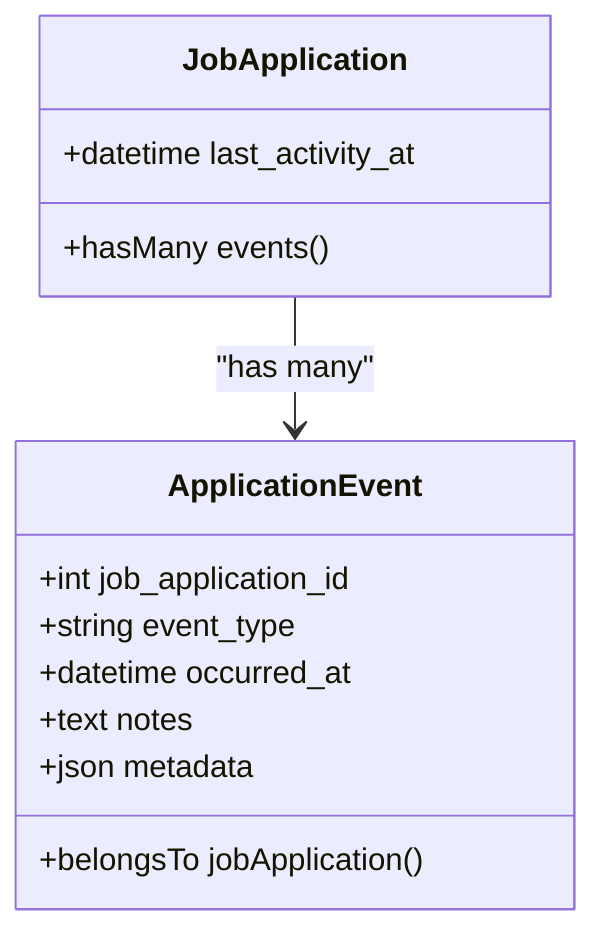
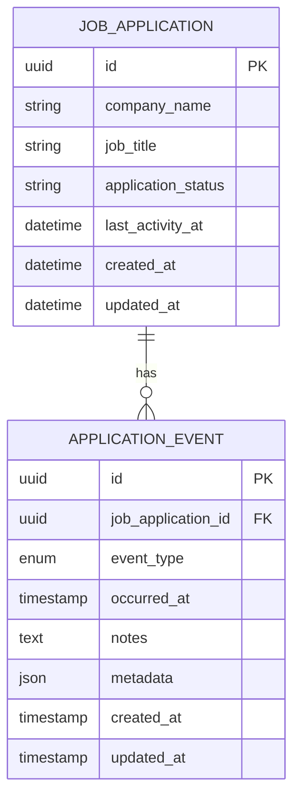
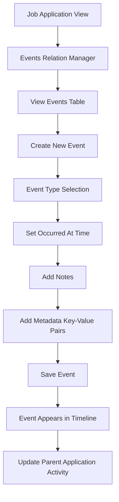
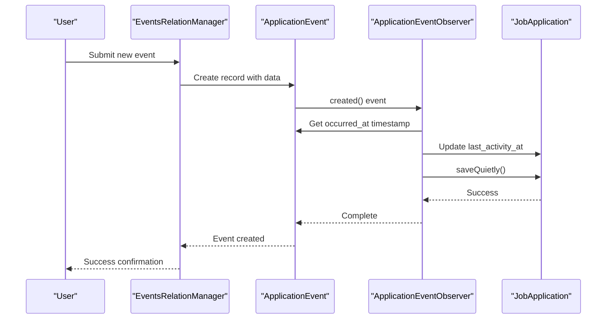

# Application Events

<cite>
**Referenced Files in This Document**   
- [ApplicationEvent.php](file://app/Models/ApplicationEvent.php)
- [JobApplication.php](file://app/Models/JobApplication.php)
- [EventsRelationManager.php](file://app/Filament/Resources/JobApplications/RelationManagers/EventsRelationManager.php)
- [create_application_events_table.php](file://database/migrations/2025_10_04_100002_create_application_events_table.php)
- [ApplicationEventObserver.php](file://app/Observers/ApplicationEventObserver.php)
</cite>

## Table of Contents
1. [Introduction](#introduction)
2. [Core Components](#core-components)
3. [Database Schema](#database-schema)
4. [Event Types and Significance](#event-types-and-significance)
5. [User Interface and Interaction](#user-interface-and-interaction)
6. [Data Flow and Automation](#data-flow-and-automation)
7. [Performance and Optimization](#performance-and-optimization)
8. [Troubleshooting Guide](#troubleshooting-guide)
9. [Conclusion](#conclusion)

## Introduction
The Application Events system provides a chronological timeline of interactions between job seekers and employers throughout the job application process. This feature enables users to track key milestones such as application submissions, interview scheduling, responses received, and final outcomes. By maintaining a detailed history of each job application, the system supports strategic reflection and optimization of job search techniques over time.

**Section sources**
- [ApplicationEvent.php](file://app/Models/ApplicationEvent.php#L1-L30)
- [JobApplication.php](file://app/Models/JobApplication.php#L1-L123)

## Core Components

The Application Events system consists of two primary models: `ApplicationEvent` and `JobApplication`, connected through a one-to-many relationship. Each `JobApplication` can have multiple `ApplicationEvent` records, which are automatically sorted in descending chronological order by their `occurred_at` timestamp.

The `ApplicationEvent` model captures essential details about each interaction, including the event type, timestamp, notes, and flexible metadata. The `JobApplication` model maintains a reverse relationship that allows retrieval of all associated events. The `EventsRelationManager` in the Filament admin panel provides the interface for managing these events within the context of a specific job application.

**Diagram sources**
- [ApplicationEvent.php](file://app/Models/ApplicationEvent.php#L8-L29)
- [JobApplication.php](file://app/Models/JobApplication.php#L60-L65)

**Section sources**
- [ApplicationEvent.php](file://app/Models/ApplicationEvent.php#L1-L30)
- [JobApplication.php](file://app/Models/JobApplication.php#L60-L65)
- [EventsRelationManager.php](file://app/Filament/Resources/JobApplications/RelationManagers/EventsRelationManager.php#L1-L106)

## Database Schema

The application events are stored in the `application_events` database table, which was created through a dedicated migration. The schema includes a foreign key reference to the `job_applications` table with cascading delete behavior, ensuring data integrity when applications are removed.

Key fields in the schema include:
- `job_application_id`: Foreign key establishing the relationship
- `event_type`: Enum field restricting values to predefined types
- `occurred_at`: Timestamp indicating when the event took place
- `notes`: Optional text field for additional context
- `metadata`: JSON field for flexible, structured data storage
- `created_at` and `updated_at`: Standard timestamp fields

Multiple database indexes are defined to optimize query performance, particularly for filtering by job application and event type combinations.

**Diagram sources**
- [create_application_events_table.php](file://database/migrations/2025_10_04_100002_create_application_events_table.php#L10-L30)

**Section sources**
- [create_application_events_table.php](file://database/migrations/2025_10_04_100002_create_application_events_table.php#L1-L45)

## Event Types and Significance

The system tracks seven distinct event types that represent critical stages in the job application lifecycle:

- **submitted**: Application materials were sent to the employer
- **reply_received**: Employer responded to the application
- **interview_scheduled**: Interview meeting was arranged
- **interview_completed**: Interview session concluded
- **offer_received**: Job offer was extended by the employer
- **rejected**: Application was declined
- **withdrawn**: Candidate withdrew from the process

Each event type serves as a milestone that helps users analyze their job search effectiveness. For example, tracking the frequency of interviews scheduled versus offers received can reveal conversion rates, while monitoring response times between submission and reply can indicate employer engagement levels.

The system enforces data integrity by defining these types as an ENUM in the database and validating them in the Filament form interface.

**Section sources**
- [EventsRelationManager.php](file://app/Filament/Resources/JobApplications/RelationManagers/EventsRelationManager.php#L15-L25)
- [create_application_events_table.php](file://database/migrations/2025_10_04_100002_create_application_events_table.php#L15-L21)

## User Interface and Interaction

Users interact with the Application Events system through the `EventsRelationManager` component in the Filament admin panel. This interface appears as a tabular section within each Job Application record, allowing users to view, create, edit, and delete events.

The interface provides a form with the following fields:
- **Event Type**: Dropdown selection with predefined options
- **Occurred At**: DateTime picker with default value set to current time
- **Notes**: Multi-line text area for detailed descriptions
- **Metadata**: Key-value pair editor for structured additional data

Events are displayed in a table sorted by timestamp in descending order, with visual indicators including colored badges for different event types and relative time descriptions (e.g., "2 days ago"). The interface supports bulk deletion of events and individual record actions.

**Diagram sources**
- [EventsRelationManager.php](file://app/Filament/Resources/JobApplications/RelationManagers/EventsRelationManager.php#L30-L100)

**Section sources**
- [EventsRelationManager.php](file://app/Filament/Resources/JobApplications/RelationManagers/EventsRelationManager.php#L1-L106)

## Data Flow and Automation

When a new ApplicationEvent is created, an observer pattern automatically updates the parent JobApplication's `last_activity_at` timestamp to match the event's `occurred_at` time. This ensures that the application record always reflects the most recent interaction, which is crucial for sorting and filtering applications in various views.

The `ApplicationEventObserver` implements this behavior using the `saveQuietly()` method to prevent infinite loops that could occur if updating the job application triggered additional observer events. This design pattern maintains data consistency while avoiding recursive execution.

**Diagram sources**
- [ApplicationEventObserver.php](file://app/Observers/ApplicationEventObserver.php#L6-L18)
- [ApplicationEvent.php](file://app/Models/ApplicationEvent.php#L8-L29)

**Section sources**
- [ApplicationEventObserver.php](file://app/Observers/ApplicationEventObserver.php#L6-L18)

## Performance and Optimization

The Application Events system includes several performance optimizations. Database indexes on `job_application_id`, `event_type`, and their composite ensure fast retrieval of events for specific applications and efficient filtering operations.

The `JobApplication` model defines the events relationship with automatic ordering by `occurred_at` in descending order, eliminating the need for explicit sorting in queries. This optimization ensures that recent events appear first in the interface without additional computational overhead.

The metadata field uses JSON storage, allowing flexible data capture without requiring schema changes for new data points. This design supports future expansion of event tracking capabilities while maintaining query performance for core fields.

**Section sources**
- [JobApplication.php](file://app/Models/JobApplication.php#L60-L65)
- [create_application_events_table.php](file://database/migrations/2025_10_04_100002_create_application_events_table.php#L28-L30)

## Troubleshooting Guide

Common issues with the Application Events system typically involve data validation and observer behavior:

1. **Event creation fails**: Verify that both `event_type` and `occurred_at` fields are provided, as both are required in the database schema.

2. **Parent application timestamp not updating**: Check that the `ApplicationEventObserver` is properly registered in the service provider and that the relationship between models is correctly defined.

3. **Metadata not persisting**: Ensure that the data being stored is valid JSON-serializable array format.

4. **Performance issues with large event sets**: Confirm that database indexes are properly created and consider implementing pagination for applications with extensive event histories.

The test suite includes comprehensive coverage of event creation, validation, and observer behavior, providing confidence in the system's reliability.

**Section sources**
- [ApplicationEventTest.php](file://tests/Feature/ApplicationEventTest.php#L1-L131)
- [ApplicationEventObserver.php](file://app/Observers/ApplicationEventObserver.php#L6-L18)

## Conclusion

The Application Events system provides a robust framework for tracking the complete lifecycle of job applications. By maintaining a detailed chronological history of interactions with employers, it enables users to gain valuable insights into their job search effectiveness. The combination of structured event types, flexible metadata storage, and automated timestamp management creates a comprehensive timeline that supports both immediate tracking needs and long-term strategic analysis. This system exemplifies how event-driven architecture can enhance user experience by providing automatic updates and rich historical context without requiring additional user effort.