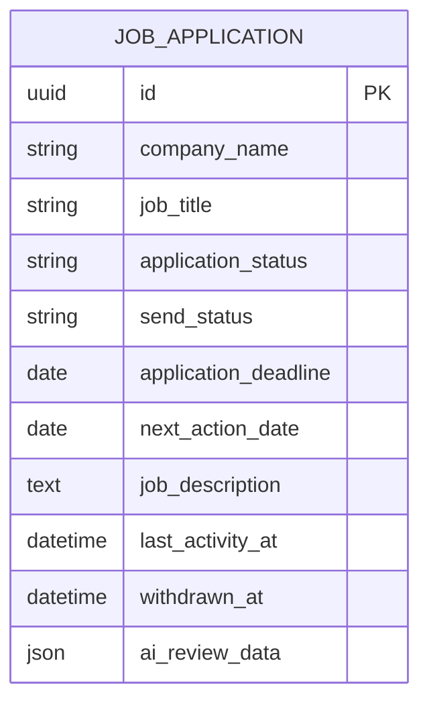
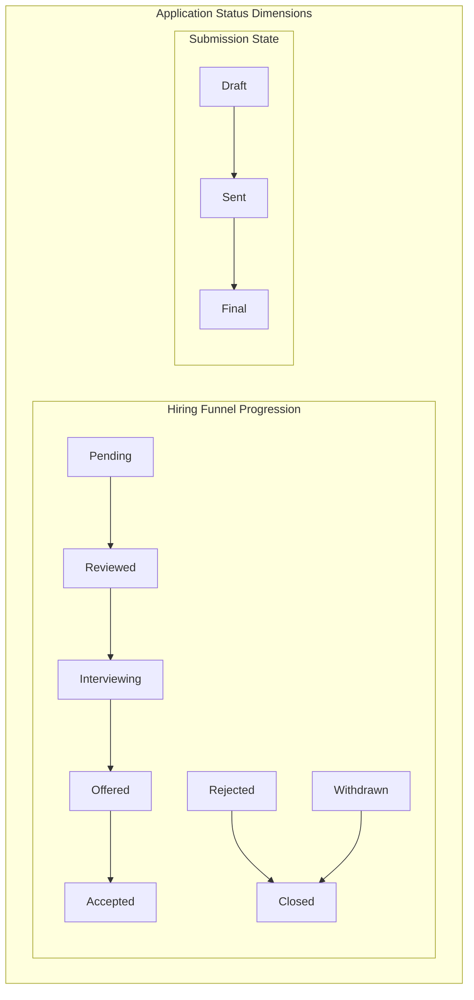
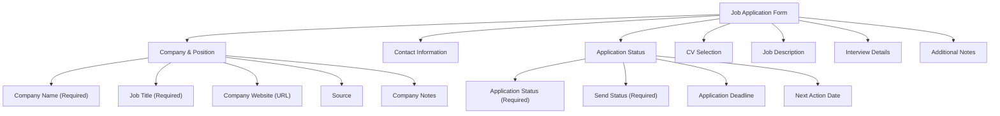
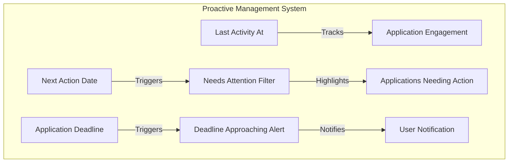
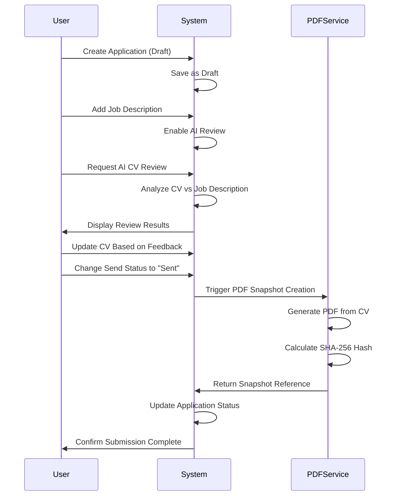
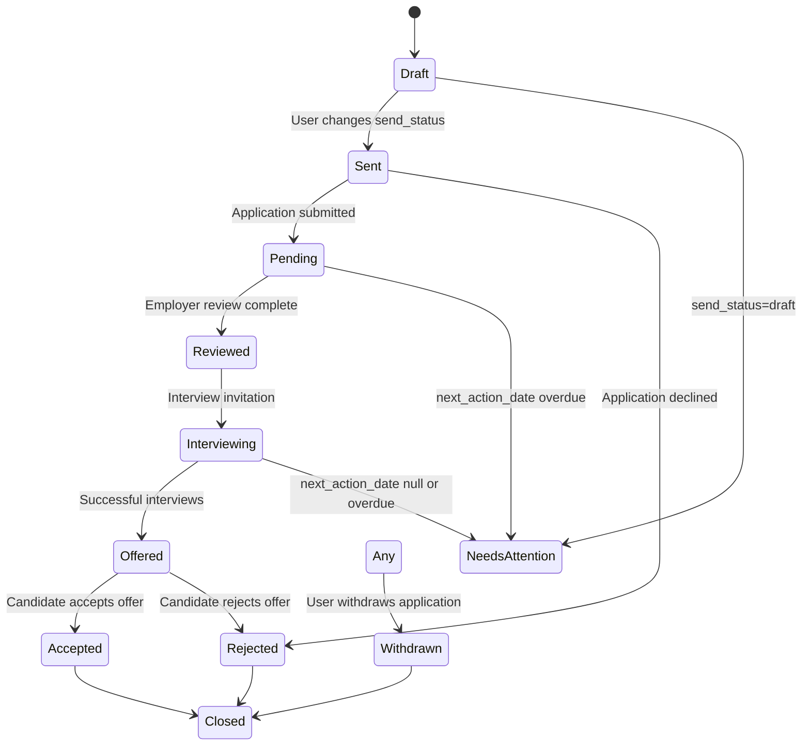
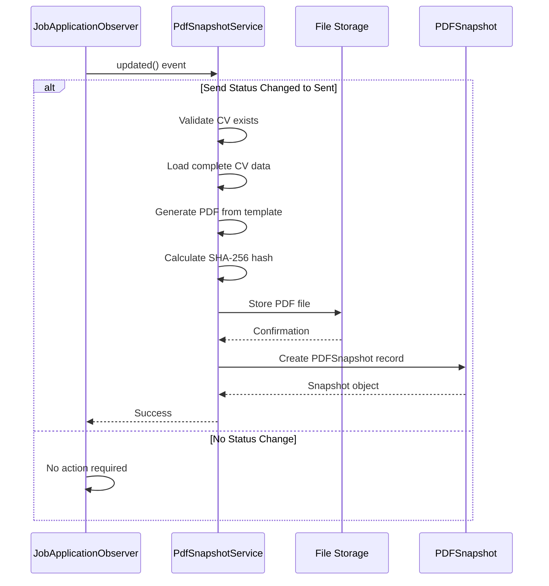
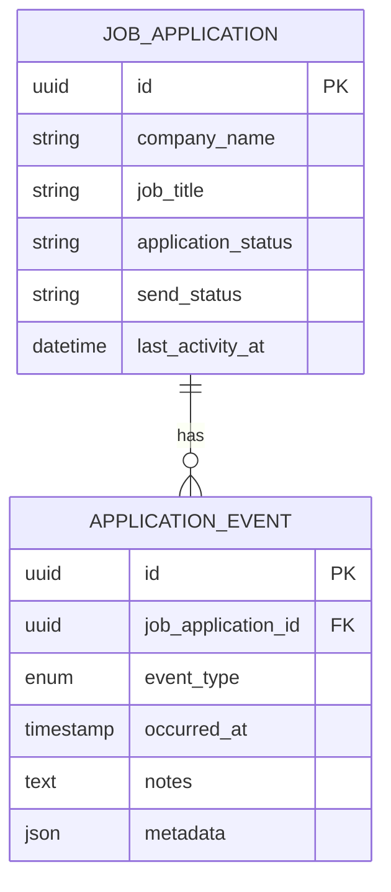

# Application Lifecycle Management

<cite>
**Referenced Files in This Document**   
- [JobApplication.php](file://app/Models/JobApplication.php)
- [JobApplicationForm.php](file://app/Filament/Resources/JobApplications/Schemas/JobApplicationForm.php)
- [JobApplicationObserver.php](file://app/Observers/JobApplicationObserver.php)
- [PdfSnapshotService.php](file://app/Services/PdfSnapshotService.php)
- [PDFSnapshot.php](file://app/Models/PDFSnapshot.php)
- [ApplicationEvent.php](file://app/Models/ApplicationEvent.php)
- [EventsRelationManager.php](file://app/Filament/Resources/JobApplications/RelationManagers/EventsRelationManager.php)
</cite>

## Table of Contents
1. [Introduction](#introduction)
2. [Job Application Model Overview](#job-application-model-overview)
3. [Core Attributes and Data Structure](#core-attributes-and-data-structure)
4. [Two-Dimensional Status System](#two-dimensional-status-system)
5. [Form Layout and Validation](#form-layout-and-validation)
6. [Proactive Job Search Management](#proactive-job-search-management)
7. [Application Lifecycle Workflows](#application-lifecycle-workflows)
8. [State Transition Logic](#state-transition-logic)
9. [PDF Snapshot Automation](#pdf-snapshot-automation)
10. [Application Events and Activity Tracking](#application-events-and-activity-tracking)
11. [Best Practices for Application Management](#best-practices-for-application-management)

## Introduction
This document provides comprehensive documentation for the job application lifecycle management system within the CV Builder application. It details the complete workflow from application creation through submission and tracking, focusing on the JobApplication model and its associated components. The system enables users to manage their job search process efficiently by providing structured data capture, status tracking, and automated document generation. The documentation covers the model structure, form implementation, state management, and integration points that support a professional job application process.

## Job Application Model Overview

The JobApplication model serves as the central entity for managing job applications within the system. It captures comprehensive information about each job opportunity and tracks the application's progression through the hiring funnel. The model is implemented as an Eloquent model with various relationships to supporting entities such as CVs, cover letters, and PDF snapshots.

The model includes timestamps for activity tracking and supports soft deletes through Laravel's trait implementation. It maintains references to the CV used for the application and can be associated with multiple cover letter versions. The model also stores AI review data when the CV has been analyzed against the job description.

**Section sources**
- [JobApplication.php](file://app/Models/JobApplication.php#L1-L20)

## Core Attributes and Data Structure

The JobApplication model contains several key attributes that capture essential information about each job application:

- **company_name**: Required text field storing the name of the company to which the application is submitted
- **job_title**: Required text field capturing the specific position being applied for
- **application_status**: Enum field tracking the application's progression through the hiring funnel
- **send_status**: Binary state indicating whether the application is in draft or has been sent
- **application_deadline**: Date field for tracking when the application is due
- **next_action_date**: Date field for scheduling follow-up actions or interviews
- **job_description**: Rich text field containing the full job posting for reference and analysis
- **last_activity_at**: Timestamp automatically updated when any changes occur to the application

These attributes are defined in the model's `$fillable` array, allowing mass assignment during creation and updates. The model also specifies casting rules for proper data type handling, particularly for date fields and JSON data.

**Diagram sources **
- [JobApplication.php](file://app/Models/JobApplication.php#L22-L50)

**Section sources**
- [JobApplication.php](file://app/Models/JobApplication.php#L22-L50)

## Two-Dimensional Status System

The application employs a two-dimensional status system that separates the application's progression through the hiring funnel from its submission state. This approach provides more granular tracking and enables better workflow management.

### Application Status (Hiring Funnel Progression)
The `application_status` field tracks the application's position in the hiring process with the following values:
- **Pending**: Application submitted, awaiting response
- **Reviewed**: Employer has reviewed the application
- **Interviewing**: Candidate has been invited for interviews
- **Offered**: Job offer has been extended
- **Rejected**: Application was declined
- **Accepted**: Candidate has accepted the offer
- **Withdrawn**: Candidate has withdrawn from consideration

### Send Status (Submission State)
The `send_status` field indicates the submission state of the application:
- **Draft**: Application is being prepared but not yet sent
- **Sent**: Application has been formally submitted

This separation allows users to work on applications in draft mode while continuing to update content, then formally mark them as sent when ready. The system uses the send status to trigger automated processes such as PDF snapshot creation.

**Diagram sources **
- [JobApplicationForm.php](file://app/Filament/Resources/JobApplications/Schemas/JobApplicationForm.php#L85-L104)
- [JobApplication.php](file://app/Models/JobApplication.php#L22-L50)

**Section sources**
- [JobApplicationForm.php](file://app/Filament/Resources/JobApplications/Schemas/JobApplicationForm.php#L85-L130)

## Form Layout and Validation

The JobApplicationForm.php file defines the structure and validation rules for the job application creation and editing interface. The form is organized into logical sections that guide users through the application process.

### Form Sections
The form is divided into the following sections:

**Company & Position**: Captures basic information about the job opportunity including company name, job title, website, source, and company notes.

**Contact Information**: Stores details about the hiring manager or recruiter, including name and email address.

**Application Status**: Tracks the current status and key dates with fields for application status, send status, application deadline, and next action date.

**CV Selection**: Allows users to select which CV version to submit for this application.

**Job Description**: Provides a rich editor for pasting the full job posting text, which enables keyword analysis and AI review.

**Interview Details**: Tracks interview schedules and preparation notes with a repeater field for multiple interviews.

**Additional Notes**: Captures any other relevant information about the application.

### Field Validations
The form implements several validation rules:
- Company name and job title are required fields
- Email field validates proper email format
- Website field validates URL format
- Application status and send status are required selections
- Date fields ensure proper date formatting

The form also includes contextual helper text to guide users in providing appropriate information for each field.

**Diagram sources **
- [JobApplicationForm.php](file://app/Filament/Resources/JobApplications/Schemas/JobApplicationForm.php#L1-L258)

**Section sources**
- [JobApplicationForm.php](file://app/Filament/Resources/JobApplications/Schemas/JobApplicationForm.php#L1-L258)

## Proactive Job Search Management

The system incorporates several features that enable proactive job search management through strategic use of date fields and automated tracking.

### Application Deadline Tracking
The `application_deadline` field allows users to set and track when applications are due. This date serves as a critical milestone in the application process and helps users prioritize their job search activities. The system displays this date prominently in the application interface, enabling users to quickly identify upcoming deadlines.

### Next Action Date Scheduling
The `next_action_date` field is a powerful tool for proactive follow-up and action planning. Users can schedule when they should take the next step in the application process, such as:
- Following up on a submitted application
- Preparing for an upcoming interview
- Responding to an offer
- Sending thank-you notes

This field integrates with the system's "Needs Attention" filtering functionality, which identifies applications requiring immediate action based on various criteria including overdue next action dates.

### Automated Activity Tracking
The `last_activity_at` timestamp is automatically updated whenever changes are made to the application, providing a clear audit trail of engagement. This field is updated by the JobApplicationObserver, which ensures the timestamp is set even if it's not explicitly modified during updates.

The system uses these date fields to power intelligent filtering and prioritization, helping users focus on the most time-sensitive applications.

**Diagram sources **
- [JobApplication.php](file://app/Models/JobApplication.php#L52-L58)
- [JobApplicationObserver.php](file://app/Observers/JobApplicationObserver.php#L10-L20)

**Section sources**
- [JobApplication.php](file://app/Models/JobApplication.php#L52-L58)
- [JobApplicationObserver.php](file://app/Observers/JobApplicationObserver.php#L10-L20)

## Application Lifecycle Workflows

The system supports several common workflows that reflect real-world job application processes.

### Creating a Draft Application
When creating a new application, users typically start by entering basic company and position information while keeping the send status as "Draft". This allows them to:
- Research the company and role
- Tailor their CV and cover letter
- Analyze keyword coverage between their CV and the job description
- Prepare interview talking points

During this phase, users can save the application multiple times without formally submitting it, enabling iterative refinement of application materials.

### Preparing Application Materials
Before finalizing submission, users can leverage several preparation features:
- Paste the full job description to enable AI review and keyword analysis
- Select the appropriate CV version for the specific role
- Generate AI-powered CV reviews to identify skill gaps and improvement opportunities
- Create and version control multiple cover letter drafts

The system provides immediate feedback on keyword coverage, helping users optimize their application materials before submission.

### Finalizing Submission
When ready to submit, users change the send status from "Draft" to "Sent". This action triggers several automated processes:
- A PDF snapshot of the CV is automatically generated and stored
- The application is marked as formally submitted
- The last activity timestamp is updated
- The application moves from draft status to active tracking

This transition represents the formal submission of the application and begins the waiting period for employer response.

**Diagram sources **
- [JobApplicationForm.php](file://app/Filament/Resources/JobApplications/Schemas/JobApplicationForm.php#L106-L130)
- [JobApplicationObserver.php](file://app/Observers/JobApplicationObserver.php#L25-L43)
- [PdfSnapshotService.php](file://app/Services/PdfSnapshotService.php#L1-L71)

**Section sources**
- [JobApplicationForm.php](file://app/Filament/Resources/JobApplications/Schemas/JobApplicationForm.php#L106-L130)
- [JobApplicationObserver.php](file://app/Observers/JobApplicationObserver.php#L25-L43)

## State Transition Logic

The application implements specific logic for handling state transitions, ensuring data consistency and triggering appropriate actions.

### Status Transition Rules
The system enforces business rules around status transitions:
- Applications cannot move backward in the hiring funnel (e.g., from "Interviewing" back to "Pending")
- Once an application is marked as "Rejected" or "Withdrawn", it is considered closed and no further actions are expected
- The "Accepted" status can only be reached after the "Offered" status
- Changing send status from "Draft" to "Sent" is irreversible for that application instance

### Automated State Updates
The JobApplicationObserver handles several automated state updates:
- When send status changes to "Sent", a PDF snapshot is created if one doesn't already exist
- The last_activity_at timestamp is automatically updated on any modification to the application
- The system prevents the creation of multiple PDF snapshots for the same application

### Needs Attention Filtering
The scopeNeedsAttention query scope identifies applications that require user attention based on the following criteria:
- Next action date is today or in the past
- Application is still in draft mode
- Application status is "Pending" or "Interviewing" with no next action date set
- Application is not in "Rejected" or "Withdrawn" status

This filtering helps users prioritize their job search activities by highlighting time-sensitive applications.

**Diagram sources **
- [JobApplication.php](file://app/Models/JobApplication.php#L87-L121)
- [JobApplicationObserver.php](file://app/Observers/JobApplicationObserver.php#L25-L43)

**Section sources**
- [JobApplication.php](file://app/Models/JobApplication.php#L87-L121)

## PDF Snapshot Automation

The system automatically generates PDF snapshots when applications are formally submitted, creating a permanent record of the application materials.

### Snapshot Creation Process
When the send status changes from "Draft" to "Sent", the JobApplicationObserver triggers the PdfSnapshotService to create a snapshot. The process involves:
1. Validating that a CV is associated with the application
2. Loading the complete CV with all related sections and content
3. Generating a PDF using the cv.pdf Blade template
4. Calculating a SHA-256 hash of the PDF content for integrity verification
5. Storing the PDF file with a path that includes the application ID and hash
6. Creating a PDFSnapshot record with metadata linking it to the application

### Snapshot Integrity and Immutability
Each snapshot includes a cryptographic hash of its content, ensuring document integrity. The system is designed to create only one snapshot per application, preventing multiple versions from being generated. Once created, snapshots are effectively immutable, preserving the exact state of the application materials at the time of submission.

### Storage and Retrieval
Snapshots are stored in the local filesystem with paths following the pattern "pdf-snapshots/{application_id}_{hash}.pdf". The PDFSnapshot model maintains references to the original job application, CV, and optionally a specific CV version, enabling comprehensive audit trails.

**Diagram sources **
- [JobApplicationObserver.php](file://app/Observers/JobApplicationObserver.php#L25-L43)
- [PdfSnapshotService.php](file://app/Services/PdfSnapshotService.php#L1-L71)
- [PDFSnapshot.php](file://app/Models/PDFSnapshot.php#L1-L43)

**Section sources**
- [JobApplicationObserver.php](file://app/Observers/JobApplicationObserver.php#L25-L43)
- [PdfSnapshotService.php](file://app/Services/PdfSnapshotService.php#L1-L71)

## Application Events and Activity Tracking

The system maintains a detailed history of application events through the ApplicationEvent model, providing comprehensive activity tracking.

### Event Types
The system supports several event types that represent key milestones in the application process:
- **Submitted**: Application was formally sent
- **Reply Received**: Employer responded to the application
- **Interview Scheduled**: Interview appointment was set
- **Interview Completed**: Interview was conducted
- **Offer Received**: Job offer was extended
- **Rejected**: Application was declined
- **Withdrawn**: Candidate withdrew from consideration

### Automatic Activity Updates
When an application event is created, the ApplicationEventObserver automatically updates the parent job application's last_activity_at timestamp to match the event's occurred_at time. This ensures that the application's activity timeline remains accurate and up-to-date without requiring manual updates.

### Event Management Interface
The EventsRelationManager provides a user interface for managing application events within the Filament admin panel. Users can create, view, and delete events, with the interface displaying events in chronological order. The system indexes events by type and application ID for efficient querying and reporting.

**Diagram sources **
- [ApplicationEvent.php](file://app/Models/ApplicationEvent.php#L1-L29)
- [EventsRelationManager.php](file://app/Filament/Resources/JobApplications/RelationManagers/EventsRelationManager.php#L1-L37)
- [ApplicationEventObserver.php](file://app/Observers/ApplicationEventObserver.php#L1-L18)

**Section sources**
- [ApplicationEvent.php](file://app/Models/ApplicationEvent.php#L1-L29)

## Best Practices for Application Management

To maximize the effectiveness of the job application system, users should follow these best practices:

### Maintain Accurate Status Information
Regularly update the application_status field to reflect the current stage in the hiring process. This enables accurate reporting and helps identify applications that may need follow-up. The two-dimensional status system should be used as intended, with send_status indicating submission state and application_status reflecting hiring funnel progression.

### Leverage Proactive Date Fields
Use the application_deadline and next_action_date fields strategically to manage the job search process. Set realistic next action dates for follow-ups and interview preparation, and update them as circumstances change. This creates a personalized task list that keeps the job search organized and proactive.

### Utilize AI Review Features
Before finalizing submission, use the AI review feature to analyze how well the CV matches the job description. Address any identified skill gaps or improvement opportunities to increase the chances of success. The keyword coverage analysis provides valuable insights into how to optimize application materials.

### Document Key Interactions
Record important interactions and events through the application events system. This creates a comprehensive history that can be valuable for interview preparation and decision-making when multiple offers are received. Include detailed notes about conversations with recruiters and interview feedback.

### Organize Application Materials
Maintain a clean and organized collection of CV versions and cover letters. Use descriptive titles and version numbers to easily identify the most appropriate materials for each application. The system's versioning capabilities support this organization by allowing multiple iterations of application documents.

**Section sources**
- [JobApplication.php](file://app/Models/JobApplication.php#L1-L123)
- [JobApplicationForm.php](file://app/Filament/Resources/JobApplications/Schemas/JobApplicationForm.php#L1-L258)