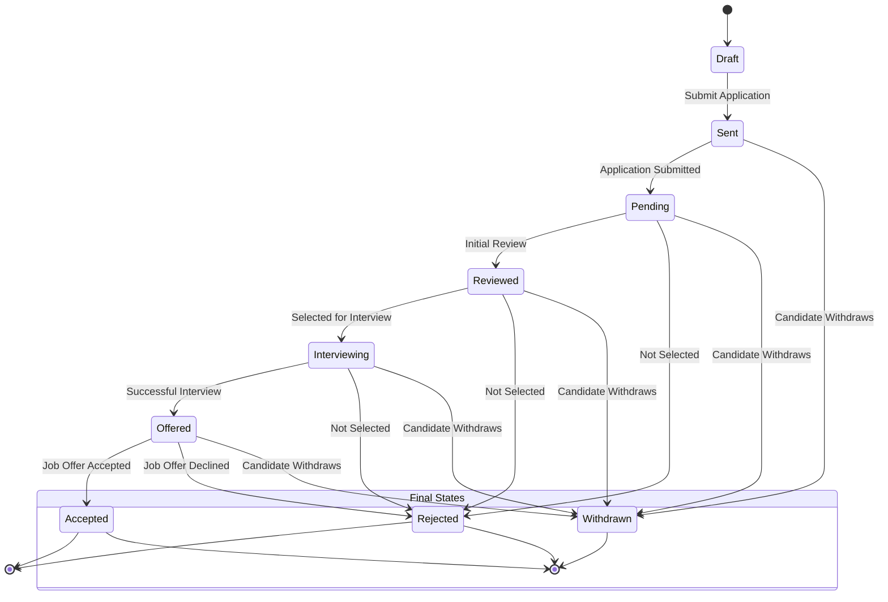
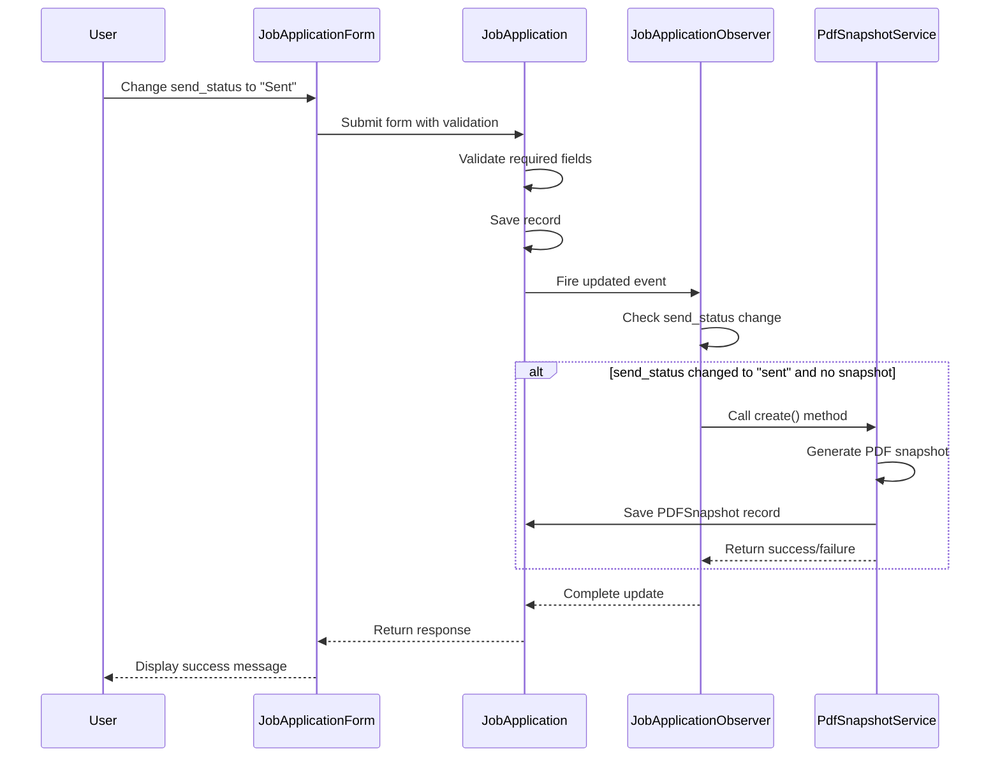
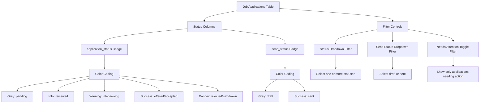

# Application Status Workflow

<cite>
**Referenced Files in This Document**   
- [JobApplicationResource.php](file://app/Filament/Resources/JobApplications/JobApplicationResource.php)
- [JobApplicationForm.php](file://app/Filament/Resources/JobApplications/Schemas/JobApplicationForm.php)
- [JobApplicationsTable.php](file://app/Filament/Resources/JobApplications/Tables/JobApplicationsTable.php)
- [JobApplication.php](file://app/Models/JobApplication.php)
- [JobApplicationObserver.php](file://app/Observers/JobApplicationObserver.php)
</cite>

## Table of Contents
1. [Introduction](#introduction)
2. [Job Application Status Lifecycle](#job-application-status-lifecycle)
3. [Status Field Implementation in JobApplication Model](#status-field-implementation-in-jobapplication-model)
4. [Form Validation and Status Enforcement](#form-validation-and-status-enforcement)
5. [Visual Representation in Filament Interface](#visual-representation-in-filament-interface)
6. [Business Logic Behind Status Progression](#business-logic-behind-status-progression)
7. [Bulk Status Updates and System Impact](#bulk-status-updates-and-system-impact)
8. [Reporting and Analytics Implications](#reporting-and-analytics-implications)

## Introduction
The job application lifecycle management system provides a structured workflow for tracking job applications from initial creation to final outcome. This document details the complete status workflow, implementation mechanics, and user interface components that support effective job application tracking within the CV Builder application.

## Job Application Status Lifecycle
The job application status workflow follows a defined progression from draft to final outcome. Two distinct status fields govern different aspects of the application lifecycle:

- **application_status**: Tracks the recruitment stage (e.g., pending, reviewing, interviewing, offered, accepted, rejected)
- **send_status**: Indicates submission state (draft or sent)

The workflow begins with a "Draft" status, allowing users to prepare application materials. When ready, users transition to "Sent" status, which triggers automated processes. The application then progresses through various recruitment stages until reaching a final disposition of accepted or rejected.

**Section sources**
- [JobApplication.php](file://app/Models/JobApplication.php#L22-L23)
- [JobApplicationForm.php](file://app/Filament/Resources/JobApplications/Schemas/JobApplicationForm.php#L59-L72)

## Status Field Implementation in JobApplication Model
The JobApplication model implements status tracking through two enum fields with defined options and business logic. The `application_status` field supports seven values: pending, reviewed, interviewing, offered, accepted, rejected, and withdrawn. The `send_status` field has two states: draft and sent.

The model includes a `scopeNeedsAttention` method that determines which applications require user action based on status conditions. Applications in draft send status or with past-due action dates are flagged for attention, except those with final statuses (rejected or withdrawn).

**Diagram sources**
- [JobApplication.php](file://app/Models/JobApplication.php#L22-L23)
- [JobApplicationForm.php](file://app/Filament/Resources/JobApplications/Schemas/JobApplicationForm.php#L59-L72)

**Section sources**
- [JobApplication.php](file://app/Models/JobApplication.php#L15-L66)

## Form Validation and Status Enforcement
Status transitions are enforced through form validation rules in the JobApplicationResource. The form configuration in JobApplicationForm.php implements required validation for both status fields, with default values set to "pending" for application_status and "draft" for send_status.

When send_status changes from "draft" to "sent", the system validates that a CV has been selected (cv_id is present). This prevents submission without an attached CV. The form also includes conditional logic that displays helper text reminding users that changing send_status to "Sent" triggers PDF snapshot creation.

The observer pattern enforces business rules during status transitions. The JobApplicationObserver listens for model updates and automatically triggers PDF snapshot creation when send_status changes to "sent" and no existing snapshot is present.

**Diagram sources**
- [JobApplicationForm.php](file://app/Filament/Resources/JobApplications/Schemas/JobApplicationForm.php#L59-L95)
- [JobApplicationObserver.php](file://app/Observers/JobApplicationObserver.php#L20-L35)

**Section sources**
- [JobApplicationForm.php](file://app/Filament/Resources/JobApplications/Schemas/JobApplicationForm.php#L59-L95)
- [JobApplicationObserver.php](file://app/Observers/JobApplicationObserver.php#L15-L42)

## Visual Representation in Filament Interface
The Filament admin panel provides visual status representation through badge components in both table views and forms. In the JobApplicationsTable, both application_status and send_status are rendered as colored badges with semantic color coding:

- **application_status**: Gray (pending), Info (reviewed), Warning (interviewing), Success (offered/accepted), Danger (rejected/withdrawn)
- **send_status**: Gray (draft), Success (sent)

The table includes filterable dropdowns for both status fields, allowing users to filter applications by specific status values. A special "Needs Attention" ternary filter highlights applications requiring action based on the scopeNeedsAttention query logic.

The form interface organizes status fields in the "Status & Dates" section, with clear labels and default values. Users can select from dropdown menus with all valid status options.

**Diagram sources**
- [JobApplicationsTable.php](file://app/Filament/Resources/JobApplications/Tables/JobApplicationsTable.php#L25-L45)
- [JobApplicationForm.php](file://app/Filament/Resources/JobApplications/Schemas/JobApplicationForm.php#L59-L72)

**Section sources**
- [JobApplicationsTable.php](file://app/Filament/Resources/JobApplications/Tables/JobApplicationsTable.php#L25-L85)

## Business Logic Behind Status Progression
The status progression system incorporates several business rules that govern application behavior. When send_status transitions to "sent", the system automatically creates a PDF snapshot of the application materials through the PdfSnapshotService. This ensures a permanent record of exactly what was submitted.

The "Needs Attention" filtering logic identifies applications requiring user action based on three criteria: past-due next_action_date, draft send_status, or active application_status (pending or interviewing) without a next_action_date. This logic excludes applications with final statuses (rejected or withdrawn) to prevent clutter in the attention queue.

The system automatically updates the last_activity_at timestamp whenever any application field is modified, providing an audit trail of user interactions. This timestamp is also updated when related events occur, maintaining accurate activity tracking.

**Section sources**
- [JobApplication.php](file://app/Models/JobApplication.php#L57-L62)
- [JobApplicationObserver.php](file://app/Observers/JobApplicationObserver.php#L15-L42)

## Bulk Status Updates and System Impact
Users can perform bulk operations on job applications, including deletion of selected records. While the current implementation focuses on bulk deletion, the architecture supports potential expansion to bulk status updates.

Bulk operations impact system behavior by triggering observers for each modified record. If bulk status updates were implemented, each transition to "sent" would trigger individual PDF snapshot creation processes. The observer pattern ensures consistent business rule enforcement regardless of whether changes occur individually or in bulk.

The filtering system enables targeted bulk operations by allowing users to first identify applications in specific status categories before applying actions. This precision prevents accidental modification of applications in sensitive states.

**Section sources**
- [JobApplicationsTable.php](file://app/Filament/Resources/JobApplications/Tables/JobApplicationsTable.php#L100-L104)
- [JobApplicationObserver.php](file://app/Observers/JobApplicationObserver.php#L20-L35)

## Reporting and Analytics Implications
Status values directly impact reporting and analytics throughout the system. Dashboard widgets aggregate data based on status fields to provide key performance metrics. The ApplicationStatsOverview widget displays counts of sent applications and applications in various stages (interviewing, offered, rejected).

The ApplicationStatusChart widget visualizes the distribution of applications across different application_status values, providing insight into the overall recruitment pipeline health. These reports exclude withdrawn applications from certain calculations to maintain accuracy in success rate metrics.

Status-based filtering enables users to generate targeted reports, such as analyzing response rates for sent applications or tracking time-to-interview for applications that progressed beyond the initial screening stage. The consistent status taxonomy ensures data integrity across all reporting functions.

**Section sources**
- [ApplicationStatsOverview.php](file://app/Filament/Widgets/ApplicationStatsOverview.php#L13-L17)
- [ApplicationStatusChart.php](file://app/Filament/Widgets/ApplicationStatusChart.php#L16-L18)
- [JobApplication.php](file://app/Models/JobApplication.php#L57-L62)