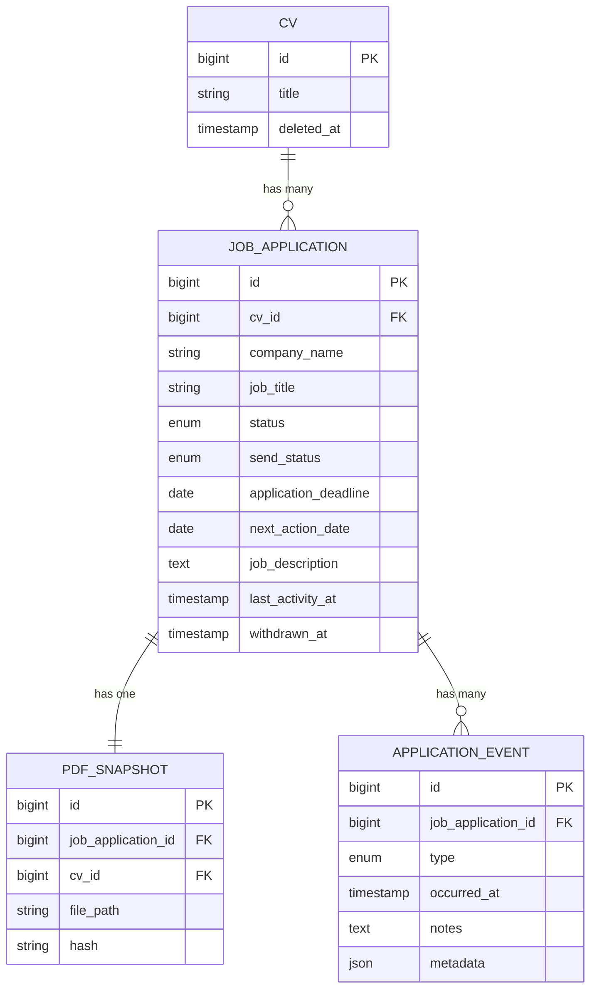
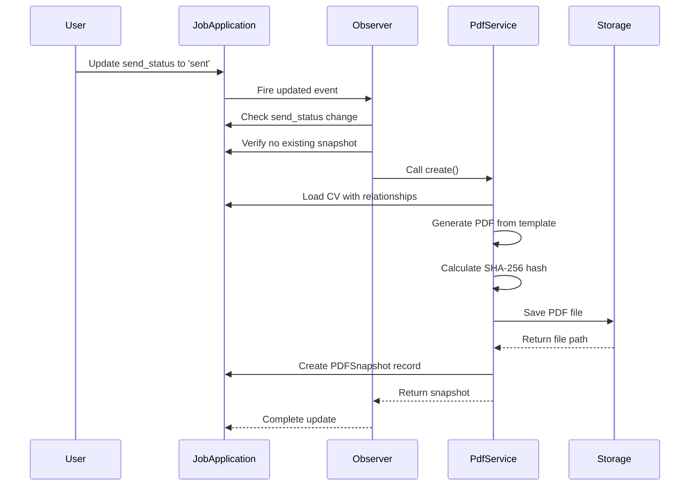

# Job Application Data Model

<cite>
**Referenced Files in This Document**   
- [JobApplication.php](file://app/Models/JobApplication.php) - *Updated with withdrawn_at and events relationship*
- [2025_10_04_090625_add_withdrawn_at_to_job_applications_table.php](file://database/migrations/2025_10_04_090625_add_withdrawn_at_to_job_applications_table.php) - *Added withdrawn_at field and index*
- [JobApplicationObserver.php](file://app/Observers/JobApplicationObserver.php)
- [PDFSnapshot.php](file://app/Models/PDFSnapshot.php)
- [Cv.php](file://app/Models/Cv.php)
- [JobApplicationForm.php](file://app/Filament/Resources/JobApplications/Schemas/JobApplicationForm.php)
- [ApplicationEvent.php](file://app/Models/ApplicationEvent.php) - *New file added for application events*
</cite>

## Update Summary
**Changes Made**   
- Added documentation for new `withdrawn_at` timestamp field
- Added documentation for `events` relationship with ApplicationEvent
- Updated status enum to include withdrawal tracking
- Added new section for Application Events relationship
- Updated business rules to reflect event-driven activity tracking
- Enhanced database schema section with new index information
- Updated source tracking annotations to reflect recent changes

## Table of Contents
1. [Introduction](#introduction)
2. [Core Fields](#core-fields)
3. [Status Enum Constraints](#status-enum-constraints)
4. [Send Status Enum Constraints](#send-status-enum-constraints)
5. [Database Schema and Indexes](#database-schema-and-indexes)
6. [Relationships](#relationships)
7. [Business Rules](#business-rules)
8. [Soft Delete Considerations](#soft-delete-considerations)

## Introduction
The JobApplication entity serves as the central model for tracking job opportunities within the CV Builder application. It captures comprehensive metadata about each application, including company details, job specifications, application status, deadlines, and activity tracking. This documentation provides a detailed overview of the data model, covering field definitions, validation rules, database schema, relationships, and business logic.

**Section sources**
- [JobApplication.php](file://app/Models/JobApplication.php#L1-L65)

## Core Fields
The JobApplication model contains several key fields that capture essential information about each job application:

- **company_name**: String field with a maximum length of 255 characters, required to identify the employer.
- **job_title**: String field with a maximum length of 255 characters, required to specify the role being applied for.
- **status**: Enum field representing the current stage in the application funnel, with defined values including draft, pending, interviewing, offered, accepted, rejected, and withdrawn.
- **send_status**: Enum field indicating whether the application has been submitted, with values draft or sent.
- **application_deadline**: Date field to track the submission deadline, nullable and validated to be after or equal to the current date for new records.
- **next_action_date**: Date field used for follow-up reminders or deadline tracking, nullable.
- **job_description**: Text field storing the full job specification, used for keyword analysis and coverage calculation, nullable.
- **last_activity_at**: Timestamp field that records the most recent modification or interaction with the application, auto-updated on any change.
- **withdrawn_at**: Timestamp field that records when an application was withdrawn by the candidate, nullable and indexed for performance.

All fields are subject to validation rules ensuring data integrity and consistency across the application.

**Section sources**
- [JobApplication.php](file://app/Models/JobApplication.php#L15-L30)
- [JobApplicationForm.php](file://app/Filament/Resources/JobApplications/Schemas/JobApplicationForm.php#L10-L40)

## Status Enum Constraints
The `status` field in the JobApplication model is constrained to a specific set of values that represent the various stages of the job application process:

- **draft**: Initial state when creating a new application.
- **pending**: Application submitted but awaiting response.
- **interviewing**: Candidate is in the interview process.
- **offered**: Job offer has been received.
- **accepted**: Candidate has accepted the offer.
- **rejected**: Application was declined by the employer.
- **withdrawn**: Candidate has withdrawn from the process.

These enum values are enforced at both the application and database levels to ensure consistent state management. The status field is required and defaults to 'draft' when a new record is created. When the status is set to 'withdrawn', the `withdrawn_at` timestamp is automatically recorded.

**Section sources**
- [JobApplication.php](file://app/Models/JobApplication.php#L15-L20)
- [2025_10_03_224900_create_job_applications_table.php](file://database/migrations/2025_10_03_224900_create_job_applications_table.php#L25-L33)

## Send Status Enum Constraints
The `send_status` field tracks the submission state of the job application and is constrained to two possible values:

- **draft**: The application has not yet been sent.
- **sent**: The application has been submitted to the employer.

This field is required and defaults to 'draft'. When the send_status transitions from 'draft' to 'sent', the system automatically triggers the creation of a PDF snapshot of the associated CV, providing an immutable record of what was submitted. The send_status field is also used in filtering logic to identify applications that require attention.

**Section sources**
- [JobApplication.php](file://app/Models/JobApplication.php#L15-L20)
- [2025_10_03_224900_create_job_applications_table.php](file://database/migrations/2025_10_03_224900_create_job_applications_table.php#L21-L23)

## Database Schema and Indexes
The JobApplication table is defined with a comprehensive schema that supports efficient querying and data integrity. The migration file `2025_10_04_002540_extend_job_applications_table.php` extends the base table with additional fields for enhanced tracking:

```php
Schema::table('job_applications', function (Blueprint $table) {
    $table->string('job_title')->nullable();
    $table->string('source', 100)->nullable();
    $table->date('application_deadline')->nullable();
    $table->date('next_action_date')->nullable();
    $table->text('job_description')->nullable();
    $table->timestamp('last_activity_at')->nullable();

    $table->index('status');
    $table->index('next_action_date');
});
```

Additionally, the migration `2025_10_04_090625_add_withdrawn_at_to_job_applications_table.php` adds a new timestamp field and index:

```php
Schema::table('job_applications', function (Blueprint $table) {
    $table->timestamp('withdrawn_at')->nullable()->after('last_activity_at');
    $table->index('withdrawn_at');
});
```

Three critical indexes are created on the table to optimize performance:
- **status index**: Enables fast filtering and querying based on application status, particularly for the "Needs Attention" filter.
- **next_action_date index**: Facilitates efficient sorting and retrieval of applications by their follow-up deadlines.
- **withdrawn_at index**: Supports quick identification of withdrawn applications for reporting and analytics.

These indexes are essential for maintaining responsive UI performance when dealing with large datasets in the admin interface.

**Section sources**
- [2025_10_04_002540_extend_job_applications_table.php](file://database/migrations/2025_10_04_002540_extend_job_applications_table.php#L10-L25)
- [2025_10_04_090625_add_withdrawn_at_to_job_applications_table.php](file://database/migrations/2025_10_04_090625_add_withdrawn_at_to_job_applications_table.php#L10-L15)

## Relationships
The JobApplication model establishes several important relationships with other entities in the system:

- **belongsTo(CV)**: Each job application is associated with a specific CV. This relationship allows tracking which version of a CV was used for a particular application. The foreign key `cv_id` is nullable to accommodate draft applications that haven't yet selected a CV.

- **hasOne(PDFSnapshot)**: Each job application can have one PDF snapshot, created when the application is sent. This relationship provides access to the immutable record of what was submitted, including the file path and integrity hash.

- **hasMany(ApplicationEvent)**: Each job application can have multiple events that track discrete occurrences in the application lifecycle (e.g., interview scheduled, offer received). These events are ordered by `occurred_at` in descending order to show the most recent events first.

The relationship with CV is particularly important in the context of soft deletes, as applications must remain accessible even if the associated CV is archived. The PDFSnapshot relationship ensures that proof of submission is preserved regardless of the lifecycle state of other entities. The ApplicationEvent relationship provides a flexible way to track the application timeline with structured metadata.



**Diagram sources**
- [JobApplication.php](file://app/Models/JobApplication.php#L40-L50)
- [PDFSnapshot.php](file://app/Models/PDFSnapshot.php#L20-L30)
- [ApplicationEvent.php](file://app/Models/ApplicationEvent.php#L15-L25)
- [Cv.php](file://app/Models/Cv.php#L100-L110)

**Section sources**
- [JobApplication.php](file://app/Models/JobApplication.php#L40-L50)
- [PDFSnapshot.php](file://app/Models/PDFSnapshot.php#L20-L30)
- [ApplicationEvent.php](file://app/Models/ApplicationEvent.php#L15-L25)

## Business Rules
The JobApplication model implements several critical business rules through Eloquent events and observers:

- **last_activity_at auto-update**: The `JobApplicationObserver` automatically updates the `last_activity_at` timestamp whenever any modification occurs to the record. This ensures accurate tracking of the most recent activity for each application.

- **PDF snapshot creation**: When the `send_status` changes from 'draft' to 'sent' and no existing PDF snapshot exists, the observer triggers the `PdfSnapshotService` to create an immutable record of the submitted CV. This process includes generating a SHA-256 hash for integrity verification.

- **Event-driven activity tracking**: When an `ApplicationEvent` is created, the `ApplicationEventObserver` automatically updates the parent `JobApplication`'s `last_activity_at` field to the event's `occurred_at` timestamp. This ensures that all interactions are reflected in the application's activity timeline.

- **Withdrawal timestamp**: When the application status is set to 'withdrawn', the system automatically records the current timestamp in the `withdrawn_at` field, providing an audit trail of when the candidate withdrew their application.

- **Needs Attention filtering**: The model includes a `scopeNeedsAttention` method that implements complex filtering logic to identify applications requiring follow-up. Applications are considered needing attention if they have an overdue `next_action_date`, are still in 'draft' `send_status`, or are in 'pending' or 'interviewing' status without a defined next action date, excluding those that have been rejected or withdrawn.

These business rules ensure consistent behavior across the application and support key features like the dashboard widget that highlights applications needing attention.



**Diagram sources**
- [JobApplicationObserver.php](file://app/Observers/JobApplicationObserver.php#L15-L40)
- [PdfSnapshotService.php](file://app/Services/PdfSnapshotService.php#L15-L50)
- [ApplicationEventObserver.php](file://app/Observers/ApplicationEventObserver.php#L6-L17)

**Section sources**
- [JobApplicationObserver.php](file://app/Observers/JobApplicationObserver.php#L15-L40)
- [JobApplication.php](file://app/Models/JobApplication.php#L55-L65)
- [ApplicationEventObserver.php](file://app/Observers/ApplicationEventObserver.php#L6-L17)

## Soft Delete Considerations
The system implements soft delete functionality for CVs through Laravel's SoftDeletes trait, which has important implications for the JobApplication model:

- **Preserved relationships**: When a CV is soft-deleted, all associated job applications remain fully accessible. The foreign key relationship is maintained, allowing users to view historical application data even after archiving a CV.

- **Data integrity**: The `cv_id` field in JobApplication remains intact after CV deletion, ensuring that the historical record of which CV was used for each application is preserved. This is critical for audit purposes and maintaining context.

- **PDF snapshot preservation**: PDF snapshots created from a CV are not affected by the CV's deletion status. These immutable records remain accessible and can still be downloaded, ensuring that proof of submission is never lost.

- **Query behavior**: By default, soft-deleted CVs are excluded from queries, but they can be accessed using the `withTrashed()` method when needed for historical reference.

This approach allows users to archive outdated CVs while maintaining the integrity of their application history and supporting features like cloning archived CVs for new applications.

**Section sources**
- [Cv.php](file://app/Models/Cv.php#L10-L15)
- [CvSoftDeleteTest.php](file://tests/Feature/CvSoftDeleteTest.php#L44-L71)