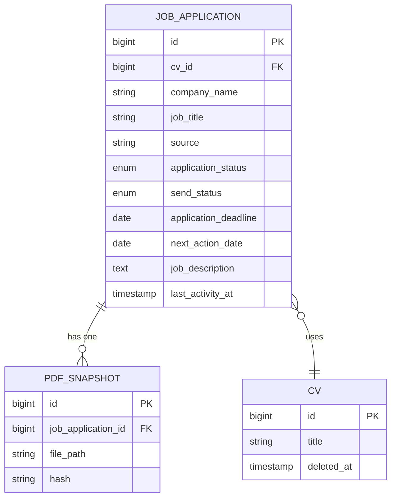
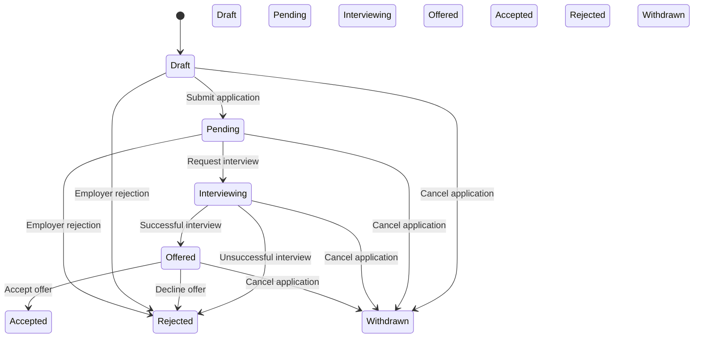
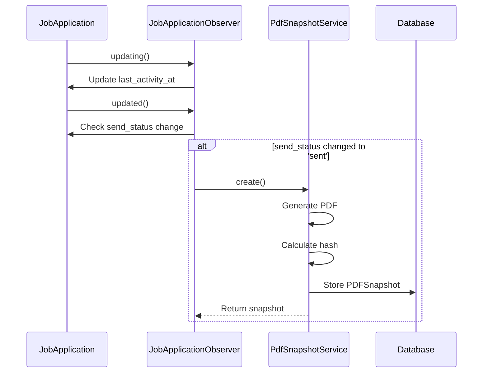
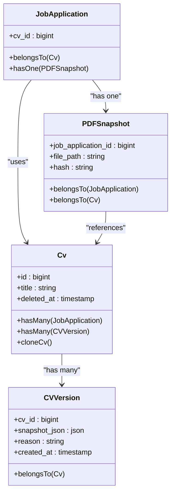
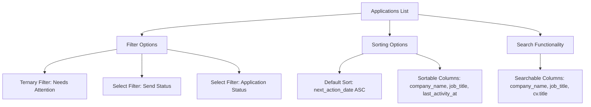

# Job Application Tracking

<cite>
**Referenced Files in This Document**   
- [JobApplication.php](file://app/Models/JobApplication.php)
- [JobApplicationObserver.php](file://app/Observers/JobApplicationObserver.php)
- [JobApplicationResource.php](file://app/Filament/Resources/JobApplications/JobApplicationResource.php)
- [JobApplicationForm.php](file://app/Filament/Resources/JobApplications/Schemas/JobApplicationForm.php)
- [JobApplicationsTable.php](file://app/Filament/Resources/JobApplications/Tables/JobApplicationsTable.php)
- [extend_job_applications_table.php](file://database/migrations/2025_10_04_002540_extend_job_applications_table.php)
- [Cv.php](file://app/Models/Cv.php)
- [ApplicationsNeedingAction.php](file://app/Filament/Widgets/ApplicationsNeedingAction.php)
- [PdfSnapshotService.php](file://app/Services/PdfSnapshotService.php)
- [KeywordCoverageService.php](file://app/Services/KeywordCoverageService.php)
</cite>

## Update Summary
**Changes Made**   
- Updated Creating and Managing Job Applications section to reflect enhanced UI/UX with new section organization, icons, and field labels
- Added detailed information about keyword coverage analysis functionality in both Creating and Managing Job Applications and Common Use Cases sections
- Enhanced Status Workflow and Implementation section with updated status enum values from code
- Updated Observer Pattern and Event Handling section with accurate implementation details from JobApplicationObserver
- Added information about AI review integration in the job application form
- Updated CV Integration and Versioning section with details about soft delete behavior and data preservation
- Enhanced Filtering and Sorting Applications section with accurate filter logic and widget behavior
- Added sources for all analyzed files with specific line references

## Table of Contents
1. [Introduction](#introduction)
2. [Core Data Model](#core-data-model)
3. [Creating and Managing Job Applications](#creating-and-managing-job-applications)
4. [Status Workflow and Implementation](#status-workflow-and-implementation)
5. [Observer Pattern and Event Handling](#observer-pattern-and-event-handling)
6. [CV Integration and Versioning](#cv-integration-and-versioning)
7. [Filtering and Sorting Applications](#filtering-and-sorting-applications)
8. [Common Use Cases](#common-use-cases)

## Introduction
The job application tracking system enables users to manage their job search process comprehensively. It provides tools for creating and organizing job applications with detailed metadata, tracking application status through various stages, and integrating with CV versions. The system includes automated workflows, dashboard widgets for monitoring progress, and mechanisms for preserving application history. This documentation details the implementation of the JobApplication model, its relationship with other entities, and the business logic that drives the application tracking functionality.

## Core Data Model

The JobApplication model serves as the central entity for tracking job applications, storing essential information about each opportunity. The data structure was extended through a migration to support comprehensive tracking capabilities.

**Diagram sources**
- [extend_job_applications_table.php](file://database/migrations/2025_10_04_002540_extend_job_applications_table.php#L15-L35)
- [JobApplication.php](file://app/Models/JobApplication.php#L15-L30)
- [PDFSnapshot.php](file://app/Models/PDFSnapshot.php#L15-L25)

**Section sources**
- [JobApplication.php](file://app/Models/JobApplication.php#L1-L123)
- [extend_job_applications_table.php](file://database/migrations/2025_10_04_002540_extend_job_applications_table.php#L1-L46)

## Creating and Managing Job Applications

Users can create and manage job applications through a comprehensive form interface that captures all relevant details. The system provides a structured approach to application management with validation and automated features.

The JobApplicationForm schema defines the user interface for creating and editing applications, organizing fields into logical sections:

- **Company & Position**: Company name, job title, company website, source, and company notes
- **Contact Information**: Point of contact name and email (collapsed by default)
- **Application Status**: Application status, send status, application deadline, and next action date
- **CV Selection**: Association with a specific CV version
- **Job Description**: Full job posting for keyword analysis with real-time coverage feedback
- **Interview Details**: Interview scheduling and preparation notes (collapsed by default)
- **Additional Notes**: General application notes (collapsed by default)
- **AI CV Review Summary**: Summary of AI-powered CV review when available

When creating a new application, users must provide required fields including company name and job title. The form includes helper text and validation to ensure data quality. The CV selection field includes a note clarifying that selecting a CV does not automatically submit the application; users must explicitly change the send status to "Sent" to trigger PDF snapshot creation.

The form features enhanced UI/UX with descriptive section icons and organized layout. The keyword coverage analysis provides immediate feedback by calculating the percentage of keywords from the job description that appear in the selected CV. This analysis displays the coverage percentage and top 20 missing keywords to help users optimize their applications.

**Section sources**   
- [JobApplicationForm.php](file://app/Filament/Resources/JobApplications/Schemas/JobApplicationForm.php#L17-L256)

## Status Workflow and Implementation

The job application system implements a comprehensive status workflow that tracks applications through the hiring process. The workflow is implemented through enumerated status fields in the JobApplication model.

**Diagram sources**
- [JobApplicationForm.php](file://app/Filament/Resources/JobApplications/Schemas/JobApplicationForm.php#L65-L85)
- [JobApplicationsTable.php](file://app/Filament/Resources/JobApplications/Tables/JobApplicationsTable.php#L25-L35)

**Section sources**
- [JobApplication.php](file://app/Models/JobApplication.php#L25-L30)
- [JobApplicationForm.php](file://app/Filament/Resources/JobApplications/Schemas/JobApplicationForm.php#L60-L90)

The status workflow includes two distinct status fields:
- **Application Status**: Tracks the stage in the hiring process (pending, interviewing, offered, etc.)
- **Send Status**: Indicates whether the application has been submitted (draft, sent)

This dual-status system allows users to prepare applications in draft form and track when they are actually submitted. The system uses color-coded badges in the interface to visually distinguish between different status values, providing immediate visual feedback about the application's state. The application status enum includes values: draft, pending, reviewed, interviewing, offered, rejected, accepted, and withdrawn.

## Observer Pattern and Event Handling

The system implements the observer pattern through the JobApplicationObserver class to trigger automated actions when applications are created or updated. This pattern enables separation of concerns by decoupling business logic from the model lifecycle events.

**Diagram sources**
- [JobApplicationObserver.php](file://app/Observers/JobApplicationObserver.php#L7-L43)
- [PdfSnapshotService.php](file://app/Services/PdfSnapshotService.php#L15-L50)

**Section sources**
- [JobApplicationObserver.php](file://app/Observers/JobApplicationObserver.php#L7-L43)
- [PdfSnapshotService.php](file://app/Services/PdfSnapshotService.php#L7-L71)

The observer implements two key methods:
- **updating()**: Automatically updates the `last_activity_at` timestamp whenever an application is modified, ensuring the system maintains an accurate record of the most recent activity
- **updated()**: Checks if the send status has changed to "sent" and no PDF snapshot exists, then triggers the creation of a PDF snapshot through the PdfSnapshotService

This event-driven architecture ensures that critical actions like timestamp updates and document generation happen automatically without requiring explicit calls in the application logic. The observer also includes error handling to log failures in PDF generation without preventing the application update from completing.

## CV Integration and Versioning

The job application system integrates closely with the CV management functionality, allowing users to link applications to specific CV versions. This integration ensures that users can track exactly which version of their CV was submitted for each application.

**Diagram sources**
- [Cv.php](file://app/Models/Cv.php#L150-L180)
- [CVVersion.php](file://app/Models/CVVersion.php#L15-L25)
- [PDFSnapshot.php](file://app/Models/PDFSnapshot.php#L15-L25)

**Section sources**
- [Cv.php](file://app/Models/Cv.php#L150-L220)
- [CVVersion.php](file://app/Models/CVVersion.php#L7-L30)
- [PDFSnapshot.php](file://app/Models/PDFSnapshot.php#L7-L44)

When a user changes the send status to "Sent", the system automatically creates a PDF snapshot of the associated CV. The PDFSnapshot model stores the file path and a SHA-256 hash for integrity verification. The system preserves references to CVs even if they are later soft-deleted, ensuring that historical application data remains accessible.

The CV versioning system creates snapshots when CVs are cloned, preserving the state of the CV at the time of cloning. This provides an audit trail of CV changes and allows users to understand which content was included in submitted applications. The `cloneCv()` method in the Cv model handles this process by first creating a CVVersion snapshot before duplicating the CV and its content.

## Filtering and Sorting Applications

The system provides robust filtering and sorting capabilities to help users manage their applications effectively. The JobApplicationsTable component implements these features through the Filament framework's table functionality.

**Diagram sources**
- [JobApplicationsTable.php](file://app/Filament/Resources/JobApplications/Tables/JobApplicationsTable.php#L15-L60)
- [ApplicationsNeedingAction.php](file://app/Filament/Widgets/ApplicationsNeedingAction.php#L15-L30)

**Section sources**
- [JobApplicationsTable.php](file://app/Filament/Resources/JobApplications/Tables/JobApplicationsTable.php#L1-L104)
- [JobApplication.php](file://app/Models/JobApplication.php#L35-L45)
- [ApplicationsNeedingAction.php](file://app/Filament/Widgets/ApplicationsNeedingAction.php#L10-L48)

The "Needs Attention" filter is particularly important, using a scope method in the JobApplication model to identify applications requiring follow-up. Applications are considered to need attention if:
- The next action date is in the past or today
- The send status is still "draft"
- The application status is "pending" or "interviewing" (excluding rejected or withdrawn applications)

The default sorting order prioritizes applications by next action date (ascending), ensuring that time-sensitive applications appear at the top of the list. Users can also sort by other columns like company name or last activity date. The ApplicationsNeedingAction widget on the dashboard displays up to 10 applications that need attention, sorted by next action date.

## Common Use Cases

The job application tracking system supports several common use cases that reflect real-world job search activities.

### Bulk Status Updates
Users can perform bulk actions on multiple applications, such as deleting selected applications. The system implements this through Filament's bulk action group functionality, allowing users to select multiple records and apply actions efficiently.

### Deadline Reminders
The system helps users manage deadlines through the next_action_date field and visual indicators. Applications with past-due action dates are highlighted in red in the table view, and the "Applications Needing Action" widget on the dashboard prominently displays these time-sensitive items.

### Keyword Coverage Analysis
When users enter a job description and select a CV, the system calculates keyword coverage to help optimize their application. This feature uses the KeywordCoverageService to analyze the job description against the CV content, providing feedback on coverage percentage and missing keywords. The service tokenizes both texts, removes stopwords, and calculates the percentage of job description keywords present in the CV. This helps users tailor their CVs to specific job requirements by identifying missing keywords.

**Section sources**
- [KeywordCoverageService.php](file://app/Services/KeywordCoverageService.php#L4-L75)

### Application Statistics and Visualization
The system includes dashboard widgets that provide statistical overviews of the user's job search progress. The ApplicationStatsOverview widget displays key metrics like total applications, sent applications, and applications by status. The ApplicationStatusChart widget presents a visual breakdown of applications by status, helping users understand their pipeline distribution.

These features work together to create a comprehensive job application tracking system that supports users throughout the job search process, from initial application to final outcome.