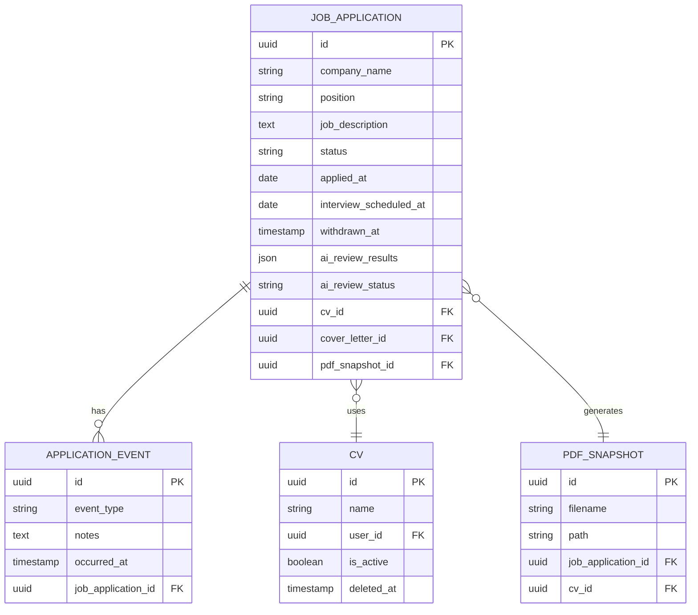
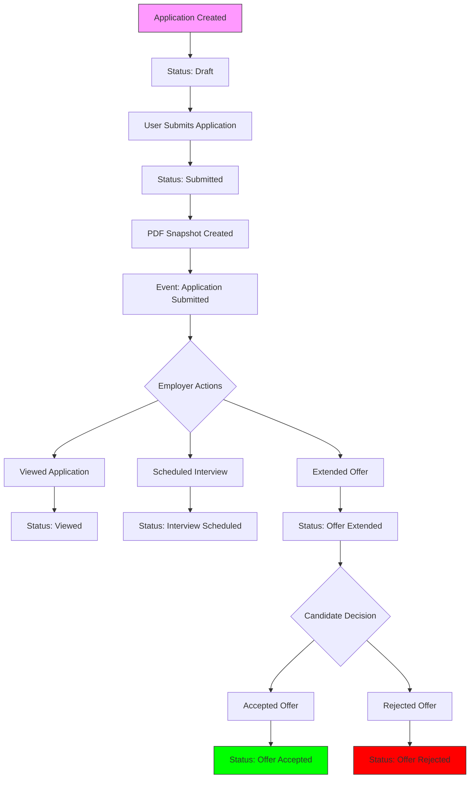
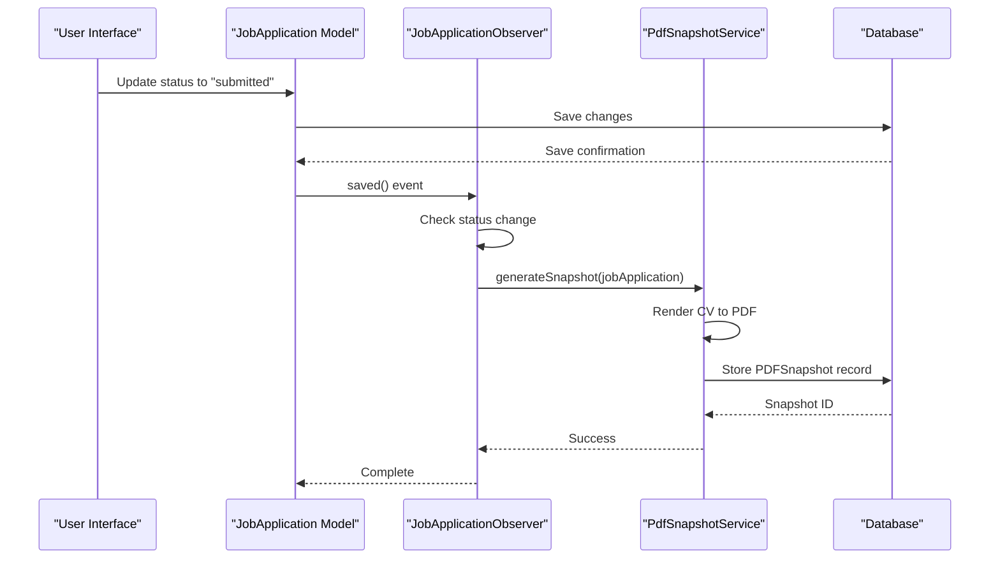

# Job Application Tracking

<cite>
**Referenced Files in This Document**   
- [JobApplication.php](file://app/Models/JobApplication.php)
- [ApplicationEvent.php](file://app/Models/ApplicationEvent.php)
- [Cv.php](file://app/Models/Cv.php)
- [PDFSnapshot.php](file://app/Models/PDFSnapshot.php)
- [JobApplicationObserver.php](file://app/Observers/JobApplicationObserver.php)
- [PdfSnapshotService.php](file://app/Services/PdfSnapshotService.php)
- [create_job_applications_table.php](file://database/migrations/2025_10_03_224900_create_job_applications_table.php)
- [extend_job_applications_table.php](file://database/migrations/2025_10_04_002540_extend_job_applications_table.php)
- [add_withdrawn_at_to_job_applications_table.php](file://database/migrations/2025_10_04_090625_add_withdrawn_at_to_job_applications_table.php)
- [add_ai_review_fields_to_job_applications.php](file://database/migrations/2025_10_04_152747_add_ai_review_fields_to_job_applications.php)
- [create_application_events_table.php](file://database/migrations/2025_10_04_100002_create_application_events_table.php)
- [create_cvs_table.php](file://database/migrations/2025_10_03_201646_create_cvs_table.php)
- [JobApplicationResource.php](file://app/Filament/Resources/JobApplications/JobApplicationResource.php)
- [JobApplicationForm.php](file://app/Filament/Resources/JobApplications/Schemas/JobApplicationForm.php)
- [JobApplicationsTable.php](file://app/Filament/Resources/JobApplications/Tables/JobApplicationsTable.php)
- [EventsRelationManager.php](file://app/Filament/Resources/JobApplications/RelationManagers/EventsRelationManager.php)
</cite>

## Table of Contents
1. [Job Application Lifecycle Management](#job-application-lifecycle-management)
2. [Job Application Data Model](#job-application-data-model)
3. [Application Status Workflow](#application-status-workflow)
4. [Application Events and Timeline Tracking](#application-events-and-timeline-tracking)
5. [Job Application Observer and Side Effects](#job-application-observer-and-side-effects)
6. [Needs Attention Filtering System](#needs-attention-filtering-system)
7. [CV Integration and AI Review Process](#cv-integration-and-ai-review-process)
8. [Application Withdrawal and Status Transitions](#application-withdrawal-and-status-transitions)

## Job Application Lifecycle Management

The job application lifecycle is managed through the `JobApplicationResource` interface, which provides a comprehensive UI for creating, editing, and tracking job applications. Users can input key details such as company name, position title, job description, application status, and relevant dates. The system supports full CRUD operations and integrates with CV versions, cover letters, and PDF snapshots. Each application is tracked through its entire lifecycle from initial submission to final outcome, with detailed event logging and status transitions.

**Section sources**
- [JobApplicationResource.php](file://app/Filament/Resources/JobApplications/JobApplicationResource.php)
- [JobApplicationForm.php](file://app/Filament/Resources/JobApplications/Schemas/JobApplicationForm.php)
- [JobApplicationsTable.php](file://app/Filament/Resources/JobApplications/Tables/JobApplicationsTable.php)

## Job Application Data Model

The `JobApplication` model represents the core entity for tracking job applications. It includes fields for company name, position, job description, status, salary expectations, and application dates. The model has a soft delete capability and supports relationships with CVs, cover letters, application events, and PDF snapshots. The database schema is defined across multiple migrations that progressively enhance the table structure with additional fields for AI review data, withdrawal tracking, and extended metadata.

**Diagram sources**
- [create_job_applications_table.php](file://database/migrations/2025_10_03_224900_create_job_applications_table.php)
- [extend_job_applications_table.php](file://database/migrations/2025_10_04_002540_extend_job_applications_table.php)
- [add_withdrawn_at_to_job_applications_table.php](file://database/migrations/2025_10_04_090625_add_withdrawn_at_to_job_applications_table.php)
- [add_ai_review_fields_to_job_applications.php](file://database/migrations/2025_10_04_152747_add_ai_review_fields_to_job_applications.php)
- [create_cvs_table.php](file://database/migrations/2025_10_03_201646_create_cvs_table.php)

**Section sources**
- [JobApplication.php](file://app/Models/JobApplication.php)
- [Cv.php](file://app/Models/Cv.php)
- [PDFSnapshot.php](file://app/Models/PDFSnapshot.php)

## Application Status Workflow

The application status workflow follows a defined progression through multiple stages: Draft, Submitted, Viewed, Interview Scheduled, Offer Extended, Offer Accepted, Offer Rejected, and Withdrawn. The status field in the `JobApplication` model tracks this progression, enabling users to filter and sort applications based on their current stage. The system enforces valid state transitions and updates related metrics accordingly. Status changes are recorded as application events, providing a complete audit trail of the application journey.

**Section sources**
- [JobApplication.php](file://app/Models/JobApplication.php)
- [JobApplicationForm.php](file://app/Filament/Resources/JobApplications/Schemas/JobApplicationForm.php)

## Application Events and Timeline Tracking

Application events provide a chronological timeline of all significant interactions with a job application. Each event is recorded in the `ApplicationEvent` model, which captures the event type (e.g., "submitted", "interview_scheduled", "offer_received"), timestamp, and optional notes. The `EventsRelationManager` displays these events in a timeline view within the job application detail page. This event-driven approach enables comprehensive tracking of application progress and facilitates retrospective analysis of application patterns and response times.

**Diagram sources**
- [ApplicationEvent.php](file://app/Models/ApplicationEvent.php)
- [EventsRelationManager.php](file://app/Filament/Resources/JobApplications/RelationManagers/EventsRelationManager.php)

**Section sources**
- [ApplicationEvent.php](file://app/Models/ApplicationEvent.php)
- [EventsRelationManager.php](file://app/Filament/Resources/JobApplications/RelationManagers/EventsRelationManager.php)

## Job Application Observer and Side Effects

The `JobApplicationObserver` class implements event-driven side effects that are triggered by changes to job application records. When an application is submitted (status changes to "submitted"), the observer automatically generates a PDF snapshot of the current CV using the `PdfSnapshotService`. This ensures a permanent record of the application materials as they existed at the time of submission. The observer also handles other side effects such as updating user metrics, triggering AI reviews, and sending notifications. This pattern decouples core application logic from secondary actions, maintaining clean separation of concerns.

**Diagram sources**
- [JobApplicationObserver.php](file://app/Observers/JobApplicationObserver.php)
- [PdfSnapshotService.php](file://app/Services/PdfSnapshotService.php)

**Section sources**
- [JobApplicationObserver.php](file://app/Observers/JobApplicationObserver.php)
- [PdfSnapshotService.php](file://app/Services/PdfSnapshotService.php)

## Needs Attention Filtering System

The system includes a "Needs Attention" filtering mechanism that helps users prioritize follow-up actions. Applications are flagged as needing attention based on configurable criteria such as: no response received within a threshold period, interview scheduled without preparation completed, offer received without decision made, or application submitted without PDF snapshot confirmation. This filtering is implemented through query scopes on the `JobApplication` model and displayed in dedicated widgets like `ApplicationsNeedingAction`. The system proactively surfaces time-sensitive items, helping users maintain momentum in their job search.

**Section sources**
- [JobApplication.php](file://app/Models/JobApplication.php)
- [ApplicationsNeedingAction.php](file://app/Filament/Widgets/ApplicationsNeedingAction.php)

## CV Integration and AI Review Process

Job applications are tightly integrated with CV management, allowing users to select from existing CV versions when applying to positions. When an application is submitted, the system can automatically initiate an AI review process that analyzes the CV against the job description. The AI review evaluates keyword coverage, skill alignment, and content effectiveness, storing results in the `ai_review_results` and `ai_review_status` fields of the `JobApplication` model. Users can view detailed feedback through the Filament interface, including improvement suggestions and gap analysis, enabling iterative refinement of application materials.

**Section sources**
- [JobApplication.php](file://app/Models/JobApplication.php)
- [Cv.php](file://app/Models/Cv.php)
- [JobApplicationObserver.php](file://app/Observers/JobApplicationObserver.php)

## Application Withdrawal and Status Transitions

Users can withdraw job applications at any stage, which triggers a status transition to "withdrawn" and records the withdrawal timestamp in the `withdrawn_at` field. This soft withdrawal approach preserves the application history while clearly indicating the user's decision to discontinue pursuit. The withdrawal process is reversible within a configurable grace period, allowing users to reconsider their decision. Status transitions are validated to prevent invalid state changes (e.g., withdrawing an already accepted offer), and all transitions are logged as application events for audit purposes.

**Section sources**
- [JobApplication.php](file://app/Models/JobApplication.php)
- [add_withdrawn_at_to_job_applications_table.php](file://database/migrations/2025_10_04_090625_add_withdrawn_at_to_job_applications_table.php)
- [JobApplicationObserver.php](file://app/Observers/JobApplicationObserver.php)