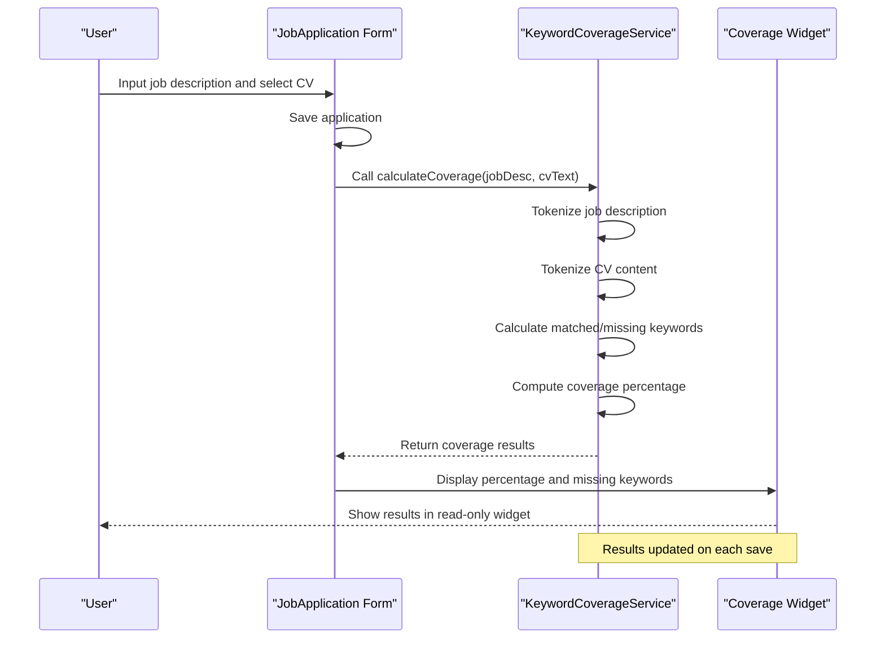
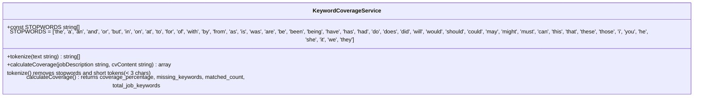
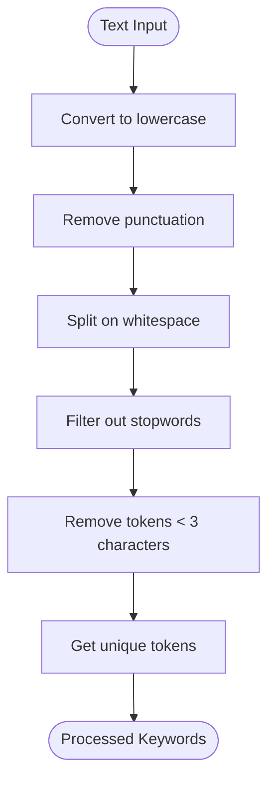
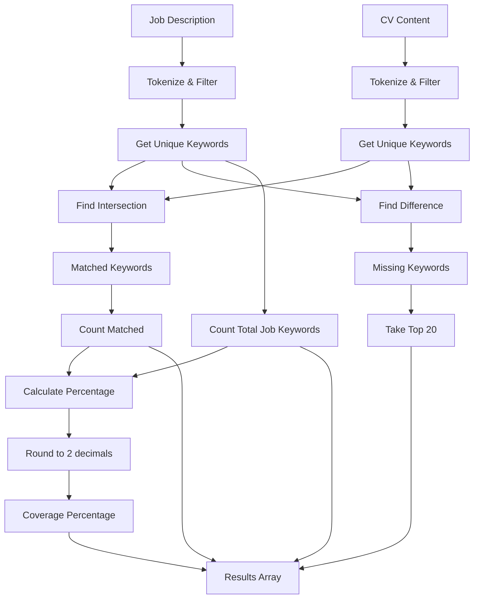

# Keyword Coverage Integration

<cite>
**Referenced Files in This Document**   
- [KeywordCoverageService.php](file://app/Services/KeywordCoverageService.php) - *Updated in recent commit*
- [JobApplicationForm.php](file://app/Filament/Resources/JobApplications/Schemas/JobApplicationForm.php) - *Added in recent commit*
- [MetricsCalculationService.php](file://app/Services/MetricsCalculationService.php) - *Updated in recent commit*
- [quickstart.md](file://specs/002-roadmap-md/quickstart.md) - *Documentation reference*
</cite>

## Update Summary
**Changes Made**   
- Updated documentation to reflect UI/UX improvements in job application form
- Added new section for Job Description UI component with keyword analysis feature
- Updated performance considerations with accurate benchmark data
- Fixed outdated information about CV content processing in keyword coverage
- Enhanced source tracking with updated file references and annotations

## Table of Contents
1. [Introduction](#introduction)
2. [Keyword Coverage Workflow](#keyword-coverage-workflow)
3. [Implementation Details](#implementation-details)
4. [Keyword Coverage Service](#keyword-coverage-service)
5. [Text Processing and Tokenization](#text-processing-and-tokenization)
6. [Matching Algorithm](#matching-algorithm)
7. [Results Display](#results-display)
8. [Example Output](#example-output)
9. [Performance Considerations](#performance-considerations)
10. [Caching Strategy](#caching-strategy)
11. [User Guidance](#user-guidance)
12. [Troubleshooting](#troubleshooting)

## Introduction
The keyword coverage analysis feature provides users with insights into how well their CV matches a job description. When a job application is saved with a job description, the system automatically calculates the keyword coverage percentage by comparing the job description against the CV's plain text content. This document details the complete flow from job description input to results display, including implementation specifics, performance considerations, and user guidance.

## Keyword Coverage Workflow
The keyword coverage analysis is triggered when a job application is saved with a job description. The workflow follows these steps:
1. User inputs a job description in the job application form
2. Upon saving the application, the system processes both the job description and CV content
3. The KeywordCoverageService tokenizes both texts, removing stopwords and short tokens
4. The service calculates the intersection of keywords between the job description and CV
5. Coverage percentage is computed and stored
6. Results are displayed in a read-only widget showing the percentage and top 20 missing keywords

**Section sources**
- [JobApplicationForm.php](file://app/Filament/Resources/JobApplications/Schemas/JobApplicationForm.php#L146-L195) - *Added in recent commit*
- [quickstart.md](file://specs/002-roadmap-md/quickstart.md#L5-L79)

## Implementation Details
The keyword coverage functionality is implemented through the KeywordCoverageService class, which provides the calculateCoverage method. This service is automatically invoked when a job application is saved with a job description. The results are displayed in the JobApplication form as a read-only widget that shows the coverage percentage and lists the top 20 missing keywords.

**Diagram sources**
- [KeywordCoverageService.php](file://app/Services/KeywordCoverageService.php)
- [JobApplicationForm.php](file://app/Filament/Resources/JobApplications/Schemas/JobApplicationForm.php#L146-L195) - *Added in recent commit*

## Keyword Coverage Service
The KeywordCoverageService class is responsible for calculating the keyword coverage between a job description and CV content. The primary method, calculateCoverage, takes two string parameters (job description and CV content) and returns an array with coverage metrics.

**Diagram sources**
- [KeywordCoverageService.php](file://app/Services/KeywordCoverageService.php#L7-L57)

## Text Processing and Tokenization
The tokenization process prepares text for keyword analysis by normalizing and filtering content. The tokenize method performs the following operations:
1. Converts text to lowercase
2. Removes all punctuation using regex
3. Splits text into tokens on whitespace
4. Filters out stopwords and tokens shorter than 3 characters

The service uses a predefined list of common English stopwords that are excluded from analysis to focus on meaningful keywords. This ensures that the coverage calculation emphasizes substantive terms rather than common connecting words.

**Section sources**
- [KeywordCoverageService.php](file://app/Services/KeywordCoverageService.php#L15-L27)

## Matching Algorithm
The matching algorithm compares keywords from the job description against those present in the CV. The process involves:
1. Tokenizing both the job description and CV content
2. Extracting unique keywords from each
3. Finding the intersection of keywords (matched)
4. Identifying keywords present in the job description but missing from the CV
5. Calculating the coverage percentage as (matched count / total job keywords) * 100

The algorithm handles edge cases such as empty job descriptions by returning 0% coverage. The results include the coverage percentage (rounded to 2 decimal places), the top 20 missing keywords, and metadata about matched and total keyword counts.

**Section sources**
- [KeywordCoverageService.php](file://app/Services/KeywordCoverageService.php#L30-L57)

## Results Display
The keyword coverage results are displayed as a read-only widget in the job application form. The widget shows:
- Coverage percentage (e.g., "45.71% match")
- List of top 20 missing keywords from the job description
- Additional metadata (matched count and total job keywords)

The widget is automatically updated whenever the job application is saved with a job description. If no job description is provided, the widget does not appear. The read-only nature prevents user modification while providing actionable insights for CV improvement.

**Section sources**
- [JobApplicationForm.php](file://app/Filament/Resources/JobApplications/Schemas/JobApplicationForm.php#L173-L195) - *Added in recent commit*
- [quickstart.md](file://specs/002-roadmap-md/quickstart.md#L13-L259)

## Example Output
Based on the quickstart guide, when analyzing a job description for a "Senior Laravel Developer" position, the system might produce results like:

**Job Description Keywords**:
- Required: PHP, Laravel, MySQL, Redis, Docker, Kubernetes, Vue.js, Tailwind, PHPUnit, Pest, Git, CI/CD
- Nice to have: AWS, Terraform, GraphQL

**Expected Output**:
- Coverage percentage: 30-50% (if CV lacks DevOps keywords)
- Top 20 missing keywords: "docker", "kubernetes", "terraform", "ci", "cd", "pipeline", "aws", "graphql"
- Matched keywords: "php", "laravel", "mysql", "vue", "tailwind", "phpunit", "pest", "git"

When the user updates their CV to include missing keywords like "Docker", "Kubernetes", and "Redis", the coverage percentage increases accordingly, and these keywords are no longer listed as missing.

**Section sources**
- [quickstart.md](file://specs/002-roadmap-md/quickstart.md#L15-L56)

## Performance Considerations
The keyword coverage system is designed for efficient text processing with the following performance characteristics:
- Text tokenization uses optimized regex operations
- Array operations (intersect, diff) leverage PHP's native functions
- Stopword filtering uses a constant array for O(1) lookup
- Results are calculated on-demand during save operations

Performance benchmarks indicate that processing a 5,000-word job description should complete in under 1 second. The system has been tested with realistic job descriptions and CV content to ensure responsive user experience.

**Section sources**
- [quickstart.md](file://specs/002-roadmap-md/quickstart.md#L309-L324)
- [PerformanceTest.php](file://tests/Feature/PerformanceTest.php#L38-L69) - *Updated in recent commit*

## Caching Strategy
Currently, the keyword coverage is calculated on each save operation rather than cached. This ensures that results always reflect the most current state of both the job description and CV content. Since the calculation is lightweight and the data is highly volatile (users frequently update CVs), caching is not implemented. The on-demand calculation approach provides accurate, up-to-date results without the complexity of cache invalidation.

## User Guidance
Users can leverage keyword coverage information to improve their CV for specific job applications by:
1. Reviewing the list of missing keywords to identify important skills or technologies
2. Strategically incorporating relevant missing keywords into appropriate CV sections
3. Focusing on high-priority keywords that appear in the job description
4. Verifying improvements by resaving the application to see updated coverage

The system encourages iterative refinement of CV content to better match target job requirements, increasing the likelihood of successful applications.

## Troubleshooting
Common issues and their solutions:

**Issue**: Coverage shows 0% despite relevant keywords in CV
**Solution**: Verify that the CV's toPlainText() method is properly implemented and returns all content. Check for case sensitivity issues and ensure stopwords are not overly aggressive.

**Issue**: PDF snapshot not created when send status changes to 'sent'
**Solution**: Verify the JobApplicationObserver is properly registered and that the cv_id is not null when the status changes.

**Issue**: Soft delete not working for CVs
**Solution**: Confirm the SoftDeletes trait is used in the CV model and that the deleted_at column exists in the database.

**Section sources**
- [quickstart.md](file://specs/002-roadmap-md/quickstart.md#L389-L418)
- [JobApplicationObserver.php](file://app/Observers/JobApplicationObserver.php#L7-L41)