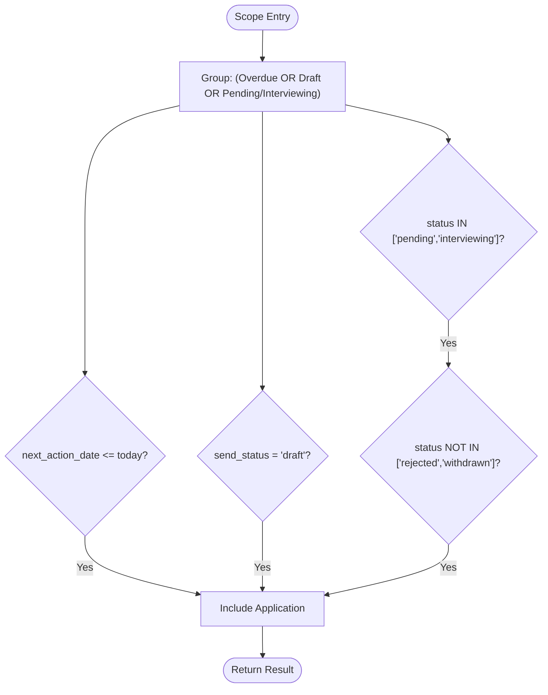
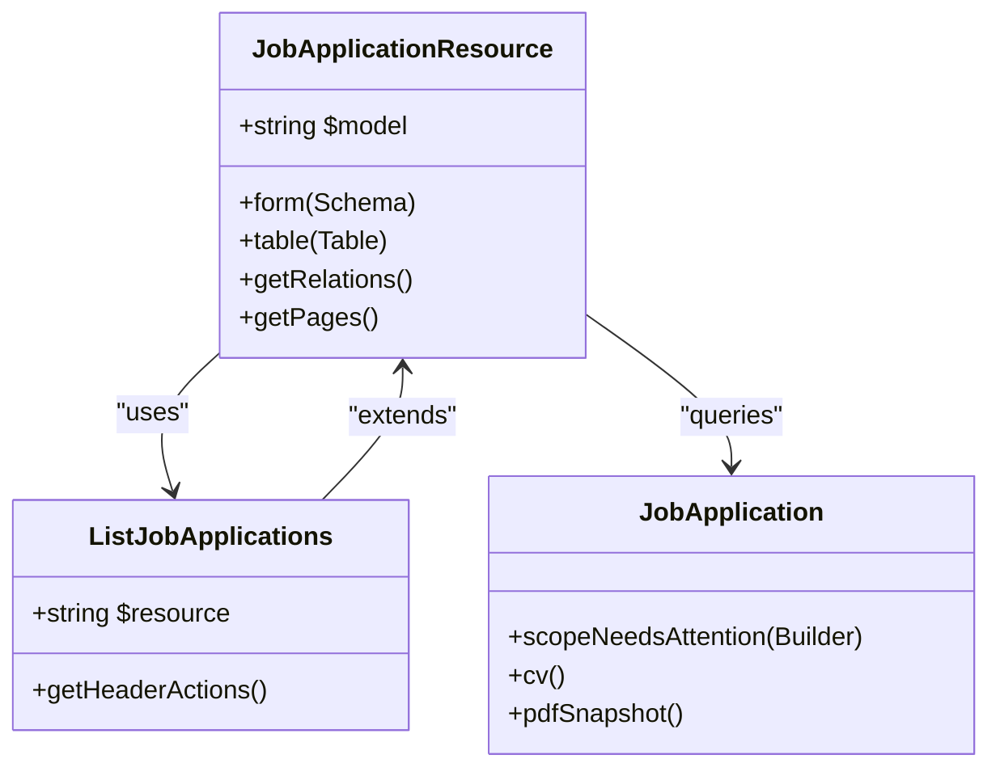
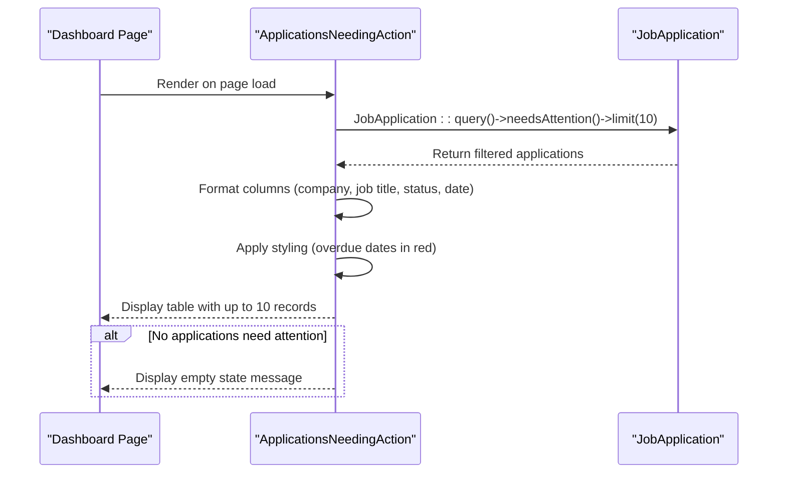
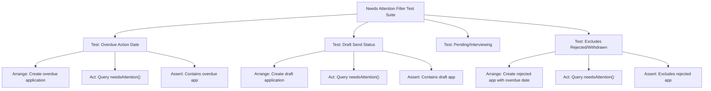

# Needs Attention Filtering Logic

<cite>
**Referenced Files in This Document**   
- [JobApplication.php](file://app/Models/JobApplication.php)
- [ApplicationsNeedingAction.php](file://app/Filament/Widgets/ApplicationsNeedingAction.php)
- [JobApplicationResource.php](file://app/Filament/Resources/JobApplications/JobApplicationResource.php)
- [ListJobApplications.php](file://app/Filament/Resources/JobApplications/Pages/ListJobApplications.php)
- [NeedsAttentionFilterTest.php](file://tests/Feature/NeedsAttentionFilterTest.php)
</cite>

## Table of Contents
1. [Introduction](#introduction)
2. [Business Logic Overview](#business-logic-overview)
3. [Core Implementation](#core-implementation)
4. [Query Scope Definition](#query-scope-definition)
5. [Filter Usage in Job Applications List](#filter-usage-in-job-applications-list)
6. [Dashboard Widget Implementation](#dashboard-widget-implementation)
7. [Testing and Validation](#testing-and-validation)
8. [Performance Considerations](#performance-considerations)
9. [Troubleshooting Guide](#troubleshooting-guide)

## Introduction

The "Needs Attention" filtering system is a critical feature in the CV Builder application that helps users identify job applications requiring immediate action. This document provides a comprehensive analysis of the business logic defined in FR-003, its implementation using Laravel query scopes, and its integration across the application's interface. The system is designed to surface applications that are overdue, in draft status, or in active stages of the application process while excluding those that have been rejected or withdrawn.

**Section sources**
- [JobApplication.php](file://app/Models/JobApplication.php#L1-L67)
- [ApplicationsNeedingAction.php](file://app/Filament/Widgets/ApplicationsNeedingAction.php#L1-L48)

## Business Logic Overview

The "Needs Attention" filter implements the business requirements specified in FR-003, which defines applications that require user attention based on three primary conditions:

1. **Overdue Action Date**: Applications where the `next_action_date` is in the past (≤ today)
2. **Draft Status**: Applications with `send_status` set to 'draft'
3. **Active Processing**: Applications with `application_status` in ['pending', 'interviewing'] that are not in ['rejected', 'withdrawn']

The filter combines these conditions using logical OR operations, ensuring that applications meeting any of these criteria are included. Crucially, the logic excludes applications that have been explicitly rejected or withdrawn, even if they meet other criteria like having an overdue action date.

This business logic is implemented through a query scope in the `JobApplication` model, which can be reused across different parts of the application including the job applications list view and the dashboard widget.

**Section sources**
- [JobApplication.php](file://app/Models/JobApplication.php#L1-L67)
- [specs/002-roadmap-md/contracts/filament-resources.md](file://specs/002-roadmap-md/contracts/filament-resources.md#L5-L79)

## Core Implementation

The "Needs Attention" filtering logic is implemented as a query scope within the `JobApplication` model. This approach follows Laravel's Eloquent ORM patterns, allowing the filter logic to be encapsulated in a reusable method that can be chained with other query operations.

The implementation uses nested where clauses to properly group the logical conditions and ensure correct precedence. The scope method returns a `Builder` instance, enabling method chaining with other Eloquent operations like sorting and limiting.



**Diagram sources**
- [JobApplication.php](file://app/Models/JobApplication.php#L45-L65)

**Section sources**
- [JobApplication.php](file://app/Models/JobApplication.php#L45-L65)

## Query Scope Definition

The query scope is defined as `scopeNeedsAttention` in the `JobApplication` model. This closure-based query construction uses Laravel's query builder to create a complex WHERE clause with proper grouping.

```php
public function scopeNeedsAttention(Builder $query): Builder
{
    return $query->where(function ($q) {
        $q->where(function ($q2) {
            $q2->where('next_action_date', '<=', now())
                ->orWhere('send_status', 'draft')
                ->orWhere(function ($q3) {
                    $q3->whereIn('application_status', ['pending', 'interviewing'])
                        ->whereNull('next_action_date');
                });
        })->whereNotIn('application_status', ['rejected', 'withdrawn']);
    });
}
```

The implementation has a subtle but important detail: for applications in 'pending' or 'interviewing' status, it additionally checks that `next_action_date` is null. This ensures that applications with a future action date in these statuses are not incorrectly flagged as needing attention.

**Section sources**
- [JobApplication.php](file://app/Models/JobApplication.php#L45-L65)

## Filter Usage in Job Applications List

The "Needs Attention" filter is integrated into the Filament resource system through the `JobApplicationResource` class. In the list view, the filter appears as a toggle option that users can apply to narrow down their applications.

When activated, the filter modifies the base query used by the table component to include only applications that match the "Needs Attention" criteria. The list view maintains standard functionality including sorting (default: `next_action_date ASC, created_at DESC`) and searching across key fields like company name and job title.

The filter is implemented as part of the Filament table configuration, leveraging the query scope defined in the model. This ensures consistency between different parts of the application that use the same filtering logic.



**Diagram sources**
- [JobApplicationResource.php](file://app/Filament/Resources/JobApplications/JobApplicationResource.php#L16-L47)
- [ListJobApplications.php](file://app/Filament/Resources/JobApplications/Pages/ListJobApplications.php#L8-L18)
- [JobApplication.php](file://app/Models/JobApplication.php#L1-L67)

**Section sources**
- [JobApplicationResource.php](file://app/Filament/Resources/JobApplications/JobApplicationResource.php#L16-L47)
- [ListJobApplications.php](file://app/Filament/Resources/JobApplications/Pages/ListJobApplications.php#L8-L18)

## Dashboard Widget Implementation

The "Needs Attention" filter is also prominently featured in the dashboard through the `ApplicationsNeedingAction` widget. This widget displays a table of up to 10 applications that require attention, providing users with immediate visibility into their most urgent tasks upon login.

The widget uses the same `needsAttention()` query scope as the list view, ensuring consistency in the filtering logic. It applies additional constraints including a limit of 10 records and sorting by `next_action_date`. The widget provides visual cues such as color-coding for overdue dates and includes an empty state message when no applications need attention.

Each row in the widget is clickable, directing users to the edit form for the corresponding job application. This creates a seamless workflow from identification to action.



**Diagram sources**
- [ApplicationsNeedingAction.php](file://app/Filament/Widgets/ApplicationsNeedingAction.php#L10-L48)

**Section sources**
- [ApplicationsNeedingAction.php](file://app/Filament/Widgets/ApplicationsNeedingAction.php#L10-L48)

## Testing and Validation

The "Needs Attention" filtering logic is thoroughly tested in the `NeedsAttentionFilterTest` feature test suite. The tests validate each component of the business logic independently and in combination.

The test suite includes four primary test cases:
1. **Overdue Action Date**: Verifies that applications with a past `next_action_date` are included
2. **Draft Send Status**: Confirms that applications with `send_status = 'draft'` are included
3. **Pending/Interviewing Status**: Ensures applications in active processing stages are included
4. **Exclusion Logic**: Validates that rejected and withdrawn applications are excluded even when other criteria are met

These tests use Laravel's testing framework with factory-created job applications to simulate various scenarios. The assertions verify both inclusion and exclusion of specific applications based on the filtering criteria.



**Diagram sources**
- [NeedsAttentionFilterTest.php](file://tests/Feature/NeedsAttentionFilterTest.php#L1-L80)

**Section sources**
- [NeedsAttentionFilterTest.php](file://tests/Feature/NeedsAttentionFilterTest.php#L1-L80)

## Performance Considerations

The "Needs Attention" filter has several performance implications that have been addressed through database indexing and query optimization.

Database migrations have created indexes on the key columns used in the filter:
- `application_status`: For the IN and NOT IN conditions
- `next_action_date`: For the date comparison
- `send_status`: For the equality check

These indexes ensure that the WHERE clauses can be executed efficiently even as the number of job applications grows. The query execution plan should show index usage rather than full table scans.

The use of a query scope rather than raw SQL provides additional benefits:
- **Reusability**: Same logic used in multiple places (list view, dashboard widget)
- **Maintainability**: Single source of truth for the filtering logic
- **Testability**: Easy to test in isolation with unit and feature tests

For very large datasets, the dashboard widget's limit of 10 records helps prevent performance issues on the homepage. The list view allows for pagination, which similarly prevents memory issues when dealing with large result sets.

**Section sources**
- [database/migrations/2025_10_04_002540_extend_job_applications_table.php](file://database/migrations/2025_10_04_002540_extend_job_applications_table.php)
- [data-model.md](file://specs/002-roadmap-md/data-model.md#L45-L95)

## Troubleshooting Guide

When applications do not appear as expected in the "Needs Attention" filter, consider the following common issues:

### Application Not Showing as Needing Attention

**Check the application status**: Applications with `application_status` of 'rejected' or 'withdrawn' are explicitly excluded from the filter, even if they have an overdue action date or are in draft status.

**Verify the next_action_date**: Ensure the date is correctly set and in the past. The filter uses `<= today`, so applications with future dates will not be included.

**Confirm send_status**: Only applications with `send_status = 'draft'` are included based on this criterion. Applications with `send_status = 'sent'` must meet other criteria to appear.

### Debugging Steps

1. **Check the raw query results**:
```php
$apps = JobApplication::needsAttention()->get();
// Inspect which applications are returned
```

2. **Verify individual conditions**:
```php
// Test each condition separately
$overdue = JobApplication::where('next_action_date', '<=', now())->get();
$draft = JobApplication::where('send_status', 'draft')->get();
$active = JobApplication::whereIn('application_status', ['pending', 'interviewing'])
    ->whereNotIn('application_status', ['rejected', 'withdrawn'])->get();
```

3. **Review database indexes**: Ensure the necessary indexes exist on `application_status`, `next_action_date`, and `send_status` columns.

4. **Check for null values**: The current implementation for pending/interviewing applications also checks for null `next_action_date`. Applications with a future action date in these statuses may not appear in the filter.

**Section sources**
- [JobApplication.php](file://app/Models/JobApplication.php#L45-L65)
- [NeedsAttentionFilterTest.php](file://tests/Feature/NeedsAttentionFilterTest.php#L1-L80)